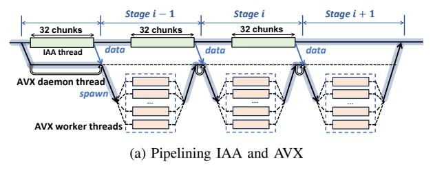
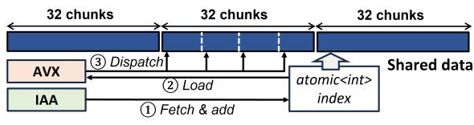
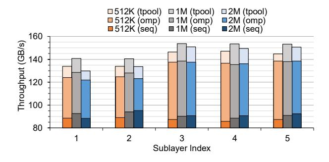
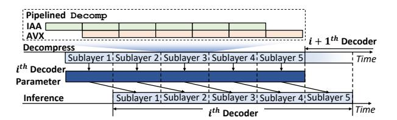
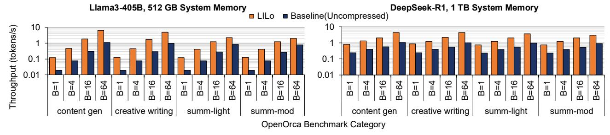
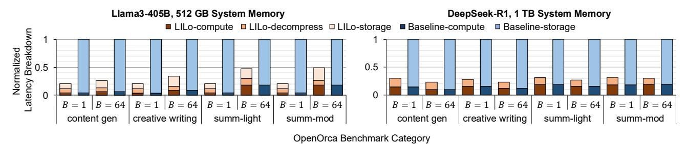
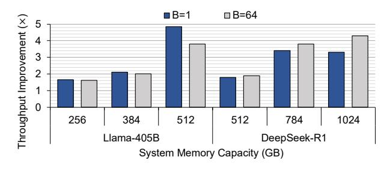
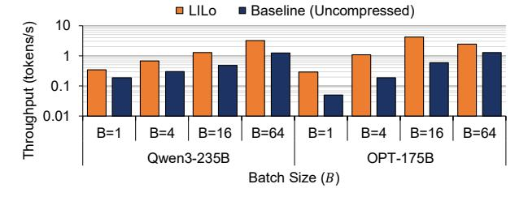
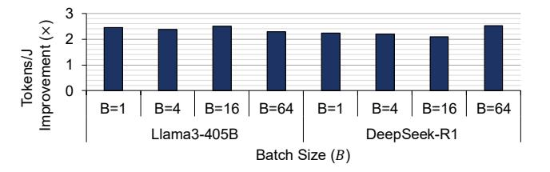

# C. Pipelined Decompression Module

**Pipeline stages.** A basic implementation of decompression executes IAA Inflate followed by the AVX BF16-reconstruction sequentially. However, it yields suboptimal performance due to two reasons: (1) the AVX BF16-reconstruction must wait for the entire UB-group to be decompressed, despite earlier decompressed data chunks becoming available sooner, and (2) IAA job submission and synchronization is handled using only one core, leaving most of the CPU cores idle during Inflate.

To address the underutilization of computation resources, we pipeline IAA Inflate and AVX BF16-reconstruction to maximize decompression throughput. Since IAA Inflate operates

(b) Data sharing method

Fig. 8. (a) Timing diagram of pipelining IAA decompression and AVX BF16-reconstruction. (b) Data sharing and inter-thread communication method.

at the granularity of data chunks, we define each pipeline stage by the number of chunks processed concurrently. As discussed in §IV-B, submitting 32 data chunks in parallel fully utilizes IAA's decompression engines. Therefore, each pipeline stage comprises 32 chunks, as illustrated in Figure 8a. At the  $i^{th}$  pipeline stage, multiple worker threads use AVX instructions to perform BF16-reconstruction on the 32 Inflated chunks produced by IAA from the previous  $(i-1)^{th}$  stage.

Lock-free inter-thread communication. To eliminate lock-induced contention between the IAA thread and the AVX worker threads, we develop a lock-free synchronization mechanism using an atomic integer, atomic\_idx. The design leverages the fact that AVX worker threads only need to know which portions of the shared data array have been inflated. As depicted in Figure 8b, IAA thread first atomically fetch & add the atomic\_idx, signaling that all data before that index is ready for BF16-reconstruction. A dedicated daemon thread continuously polls atomic\_idx for updates. Upon detecting an update of atomic\_idx, the daemon thread dispatches worker threads to process the newly available data in continuous chunks. This lock-free coordination removes synchronization overhead across pipeline stages, ensuring that Inflate the BF16-reconstruction proceeds without blocking.

Optimizing thread management. A straightforward way to implement pipelined decompression is to use OpenMP [13], which simplifies multi-threading programming (referred to as Decomp-omp). However, Decomp-omp suffers from the following drawbacks. First, while a daemon thread coordinates with the IAA thread and spawns AVX worker threads, it primarily spins on the atomic variable without performing useful work. Second, OpenMP spawns worker threads for AVX BF16-reconstruction from the daemon thread at runtime, introducing overhead from task division among worker threads and runtime scheduling across processors. Moreover, OpenMP's programming interface limits flexibility to tailor thread management overhead for our workload.

To overcome these limitations, we develop a specialized thread-pool design tailored to our pipeline (referred to as

Fig. 9. Decompression Throughput (GB/s) of different implementations, with varying IAA chunk sizes, on 5 different sublayers in Llama3-405B.

Decomp-tpool). The thread pool allocates one thread for IAA decompression and multiple worker threads for AVX BF16-reconstruction during initialization. These threads remain idle when not in use, waking up only when a task is initiated and enqueued, and returning to sleep upon completion. We use semaphores solely for task initiation and termination, while all runtime coordination is handled through lock-free atomic operations, as described earlier.

Figure 9 presents the decompression throughput of different decompression implementations with varying chunk sizes, evaluated on the model parameters from distinct sublayers of Llama3-405B. Our thread-pool-based implementation, Decomp-tpool, achieves up to 1.1–1.2× and 1.4–1.7× higher throughput compared to Decomp-omp and Decomp-seq, respectively. Among the different chunk sizes, 1 MB case yields the highest throughput by effectively balancing decompression engine utilization and CPU-IAA communication overhead.

#### D. Compute/Decompression Overlap

We integrate our decompression implementation to Intel Extensions for PyTorch (IPEX) library, which leverages the latest AMX technology to accelerate LLM inference on Intel CPUs. During inference, decompression can be performed just-in-time before the parameters are used for computation. However, such sequentially interleaved execution can disrupt cache locality, preventing subsequent sublayers from reusing the outputs of earlier sublayers that reside in cache. This results in increased memory traffic, leading to inference slowdown. To mitigate this, LILO assigns decompression and decoder computation to separate sets of physical CPU cores: one set dedicated to decompression, and the other to computation. Then, LILO overlaps the decompression of the  $(i+1)^{th}$ sublayer with the computation of  $i^{th}$  sublayer, as illustrated in Figure 10. This approach ensures sublayer outputs to remain in core-local caches for immediate reuse. While Hyper-Threading can be considered another option to implement overlapping, the microarchitectural contention between AMX and AVX units often leads to performance degradation [3]. We adopt sublayer-level overlapping instead of Decoder-layer granularity for two reasons. First, only the uncompressed weights of the sublayers within the Decoder layer must be buffered, compared to buffering two decoder layers, resulting

Fig. 10. Timing diagram of overlapped decompression and inference computation in sublayer granularity.

in a  $2\times$  reduction in buffer size. Second, we observe that decompressing all the Decoder-layer weights at once increases contention in the shared last-level cache between the compute and decompression streams, achieving smaller improvement compared to sublayer-granularity overlapping.

#### E. Selective Compression: Optimization to MoE Models

MoE architecture has been increasingly adopted in state-of-the-art LLMs, including DeepSeek-R1 [26], Llama 4 [15], Mixtral [36], and GPT-4 [44]. MoE architecture differs from conventional dense models in a way that only a subset of parameters is accessed frequently, despite representing a minor fraction of the total model parameters. Exploiting such a characteristic, we propose selective compression to minimize the decompression overhead during inference.

Selective compression. MoE model parameters can be grouped into two types: shared parameters, which are used by all inputs (such as those in dense decoder layers, shared experts, and attention modules), and routed parameters, which are conditionally activated depending on the input token (such as routed experts). Table III shows the breakdown of activated and total parameters in DeepSeek-R1 during the decoding stage, categorized into shared and routed parameters. The average number of unique experts is estimated by modeling the expert selection as a union of random subsets under a uniform distribution [20]. Although routed parameters make up more than 97% of the model's total parameters, they only contribute as low as 54% of the activated parameters during decoding when the batch size is 1. To take advantage of this imbalance, LILO selectively compresses only the routed parameters, leaving shared parameters uncompressed. This strategy reduces the

TABLE III

BREAKDOWN OF ACTIVATED PARAMETER DURING THE DECODING STAGE
AND THE TOTAL PARAMETER OF DEEPSEEK-R1 INTO SHARED AND
ROUTED PARAMETERS ACROSS VARYING BATCH SIZES.

|               | Parameter Size (Percentage) |              |          |                 |  |
|---------------|-----------------------------|--------------|----------|-----------------|--|
| Batch Size | Activated Parameters        |              | Total Pa | rameters        |  |
|               | Shared                      | Routed       | Shared   | Routed          |  |
| 1             | 32 GB (46%)                 | 38 GB (54%)  |          | 1.2 TB (97%) |  |
| 4             | 32 GB (18%)                 | 143 GB (82%) | 32 GB    |                 |  |
| 16            | 32 GB (6%)                  | 485 GB (94%) | (3%)     |                 |  |
| 64            | 32 GB (3%)                  | 1.1 TB (97%) | -        |                 |  |

decompression workload by up to 1.9× since only the routed parameters need to be decompressed during inference while incurring a slight increase in compression ratio, from 67.5% to 68.3%, compared to compressing all parameters.

While we choose to selectively compress all the routed experts in this work, it can be further extended to dynamic selective compression, which profiles frequently routed ("hot") experts at runtime and leaves them uncompressed as well. Since expert activation patterns are often skewed and inputdependent—*e.g.,* fewer than 6% of experts account for over 64% of activations in Mixtral and Llama 4 [31], [45]—such a dynamic strategy can further reduce the decompression overhead under non-stationary workloads.

#### V. EVALUATION

#### *A. Experimental Setup*

System setup and methodology. We evaluate LILO on a server equipped with a 128-core Intel 6th-Generation Xeon Scalable Processor (Granite Rapids, GNR), as summarized in Table IV. The inference throughput of LILO is compared against an uncompressed baseline for Llama3-405B and DeepSeek-R1 across varying memory capacity constraints. LILO is implemented on top of Intel Extension for PyTorch (IPEX) [5], which provides AMX-optimized inference kernels for LLM inference on Intel CPUs. The execution path can be configured via a runtime flag to select either LILO or fall back to the default IPEX inference, depending on the available host DDR memory capacity. However, existing storage-offloading implementations, such as HuggingFace Accelerate [33] and DeepSpeed Zero-Inference [19], are currently incompatible with IPEX's optimized inference. To circumvent this incompatibility, we model the storage-offloading overhead separately to project the inference latency under various memory constraints. First, we construct reduced 1/3-scale variants of Llama3-405B and DeepSeek-R1 that fit entirely within our evaluation system DDR memory during inference. The reduced Llama3-405B comprises the first 42 decoder layers of the original model, while the reduced DeepSeek-R1 includes one dense decoder layer followed by 19 MoE decoder layers. For both LILO and the baseline, we measure inference latency using the reduced models without storage offloading, then scale the results by 3×. To this scaled base latency, we add a separately modeled storage-offloading overhead. The required storage-offload data size is calculated based on the total memory footprint (parameters, KV cache, and activations)

TABLE IV EVALUATION SYSTEM.

| GNR system  | Description                                                        |
|-------------|--------------------------------------------------------------------|
| CPU         | Intel® Xeon® 6980P CPU@2.0GHz, 128 cores and 504 MB LLC per CPU |
| Memory      | 12 × DDR5-6400 channels, 768 GB                                    |
| Storage     | Micron 7450 NVMe M.2 SSD, PCIe 4.0 ×4, 480 GB                      |
| On-chip IAA | 4 on-chip IAAs per CPU, QPL v1.7.0                                 |
| OS (kernel) | Ubuntu 22.04.5 LTS (Linux kernel 6.8.0-49-generic)                 |

and the system's assumed memory capacity. We then derive the corresponding storage-offloading overhead from a performance curve we characterized using HuggingFace Accelerate, which maps the volume of offloaded data to its resulting latency overhead. We leave direct integration of offloading support into IPEX as future engineering work. For the core allocation ratio and chunk size configuration in LILO, we allocate 64, 63, and 1 cores to AMX compute, AVX BF16 reconstruction, and the IAA daemon thread, respectively, and set the IAA chunk size to 1 MB, which we verify in §V-D to deliver the best performance.

Evaluation points. We evaluate inference throughput using representative input and output token length pairs derived from the OpenOrca dataset [40]. The benchmark includes four task categories: content generation, creative writing, summarization-light, and summarization-moderate with average input/output token lengths of 128/256, 512/512, 1024/128, and 1566/256, respectively. For each category, we construct an input that matches the average input length and set the generation parameters to produce the corresponding average number of output tokens. To prevent our input example from inducing a fixed or biased expert routing pattern in DeepSeek-R1, we override the model's routing decisions with uniformly random expert selection for each token during inference. We evaluate performance across the batch sizes from 1 to 64.

#### *B. Performance Evaluation*

Throughput improvement. Figure 11a presents the inference throughput of Llama3-405B and DeepSeek-R1, comparing LILO with the uncompressed baseline under 512 GB and 1 TB memory capacity constraints, respectively, across benchmark categories and batch sizes. For Llama3-405B, LILO consistently achieves 2.0–4.9× higher throughput than the baseline. The improvement declines with larger batch sizes and longer total sequence length (input+output) as the KV cache size scales with both, forcing LILO to offload more parameters to storage. For example, in summarization–moderate task, the storage-offloaded parameters with LILO increase from 23 GB to 81 GB as batch size increases from 1 to 64, while the baseline increases from 243 GB to 301 GB. Therefore, the relative benefit of reduced storage access decreases, resulting in an overall improvement drop from 4.8× to 2.0×. In contrast, for content generation task, KV cache grows more slowly due to shorter sequence, and LILO's storage-offload only increases from 23 GB to 34 GB as batch size increases from 1 to 64, decreasing the improvement modestly from 4.9× to 3.8×.

For DeepSeek-R1, LILO consistently achieves 3.1–4.3× higher throughput compared to baseline across the benchmark categories and batch sizes. Across all cases, LILO completely avoids storage-offloading by compressing the model size from 1.25 TB to 854 GB and benefiting from the small KV cache sizes with DeepSeek-R1's Multi-head Latent Attention (MLA). As a result, the improvement with LILO maintains consistently high even for benchmark categories with long sequence lengths and large batch sizes, as it continues to operate within DDR capacity without offloading.

(a) Inference throughput comparison between LILO and baseline (uncompressed)

1 11 (111 - 11 1)

(b) Latency breakdown of LILO and baseline

Fig. 11. Inference throughput and latency breakdown comparison between LILO and the uncompressed baseline for Llama3-405B and DeepSeek-R1, under memory capacity constraints of 512 GB and 1 TB, respectively. Measurements are taken using representative input/output lengths from the OpenOrca dataset, with batch size (B) swept from 1 to 64. For the latency breakdown, LILo's latency is normalized to the uncompressed baseline.

Fig. 12. Llama3-405B and DeepSeek-R1 inference throughput improvement with LILo compared to the uncompressed baseline under varying memory capacity for content generation category and batch sizes (*B*) of 1 and 64.

Fig. 13. Inference throughput of LILO and the uncompressed baseline for Qwen3-235B and OPT-175B, under 256 GB system memory capacity for content generation and batch size (*B*) swept from 1 to 64.

Latency breakdown. Figure 11b illustrates the inference latency breakdown of LILO and the baseline. For Llama3-405B, storage-offloading accounts for 37–53% of the total latency in LILO, while 82–96% for the baseline. Within the remaining 47–64% of LILO's latency, decompression contributes an overhead of 0.5–1.9× relative to compute latency. These results demonstrate that LILO effectively mitigates the storage bottleneck, while maintaining a relatively low decompression overhead through its high 153.7 GB/s decompression throughput. The decompression overhead decreases with larger batch sizes and benchmarks featuring longer input sequences with shorter output sequences (summarization-light and moderate), as decompression latency scales only with the output length, while compute latency scales with total length and batch size.

For DeepSeek-R1, LILO completely avoids storage-offloading, whereas storage-offloading accounts for 80–90% of the baseline's total latency. The decompression overhead of LILO ranges from 69–141% relative to compute latency at

batch size 1, lower than the 158–195% overhead for Llama3-405B. This is due to LILo's selective decompression, which only decompresses the routed experts during inference.

Under different memory capacity constraints. Figure 12 demonstrates the throughput improvement of Llama3-405B and DeepSeek-R1 with LILO compared to the baseline across varying system memory capacity for the content generation task. For Llama3-405B, the improvement peaks at 512 GB, reaching  $4.9\times$  and  $3.9\times$  for batch sizes 1 and 64, respectively. As memory capacity decreases to 256 GB, the improvement drops to  $1.7\times$  and  $1.6\times$ , respectively, due to a diminishing gap in the amount of model parameters offloaded by LILO and the baseline. Specifically, the offloading ratio between baseline and LILO shrinks from  $11.0\times$  to  $1.8\times$  at batch size 1, and from  $7.5\times$  to  $1.7\times$  at batch size 64.

For DeepSeek-R1, LILO achieves peak throughput improvements of  $3.3 \times$  and  $4.3 \times$  at 1 TB system memory for batch sizes 1 and 64, respectively, with decompression

TABLE V
ABLATION STUDY OF LILO'S COMPONENTS. INFERENCE THROUGHPUT (TOKENS/S) OF LLAMA3-405B AND DEEPSEEK-R1 MEASURED FOR CONTENT GENERATION AND BATCH SIZE OF 1.

| Ablatian Catting         | Throughput (tokens/s) |             |  |
|--------------------------|-----------------------|-------------|--|
| Ablation Setting         | Llama3-405B           | DeepSeek-R1 |  |
| All optimizations        | 0.13                  | 0.81        |  |
| No overlapping           | 0.12                  | 0.43        |  |
| No pipelining            | 0.10                  | 0.49        |  |
| No selective compression | _                     | 0.67        |  |
| No IAA/AVX accelerators  | 0.02                  | 0.13        |  |

throughput reaching 95–135 GB/s. As memory capacity decreases to 768 GB, LILo begins to offload a small portion of parameters (86–94 GB), incurring a moderate increase in latency. However, the uncompressed baseline experiences a larger rise in storage-offload latency as its offloaded data grows more substantially (by 256 GB), resulting in a similar proportional slowdown. Consequently, the relative throughput gain of LILO remains similar. When capacity drops to 512 GB, LILO offloads more data (334–342 GB), and storage offloading becomes a major contributor to total latency. Meanwhile, the uncompressed baseline–already bottlenecked by storage bandwidth–shows smaller performance degradation, narrowing LILo's throughput gain to 1.8–1.9×.

Evaluation on additional models. Figure 13 presents the inference throughput of LILO and the uncompressed baseline for additional models, Qwen3-235B and OPT-175B, under a 256 GB system memory. For Qwen3-235B, LILO achieves  $1.8-2.6\times$  higher throughput, with consistent improvements across batch sizes. For OPT-175B, LILO achieves  $1.9-7.0\times$  higher throughput than the baseline, with gains more pronounced at smaller batch sizes and diminishing at B=64. This is because, OPT's standard multi-head attention leads to much more rapid growth in KV cache size with batch size than other models which employ grouped query attention or multi-head latent attention, reducing LILO's benefit.

#### C. Ablation Study

Table V presents the throughput (tokens/s) of both Llama3-405B and DeepSeek-R1 inference without storage-offloading under four configurations for ablation study: (1) All optimizations; (2) No overlapping between computation and compression; (3) No pipelining between IAA and AVX during decompression; (4) No selective compression in DeepSeek-R1; and (5) No IAA/AVX acceleration, where decompression is performed entirely on CPU cores. Experiments are conducted for content generation category and batch size of 1.

Overlapping decompression and computation achieves a  $1.9\times$  throughput gain for DeepSeek-R1, while  $1.1\times$  for Llama3-405B. The larger gain in DeepSeek-R1 is attributed to

#### TABLE VI

Sensitivity study of LILo's inference throughput for Llama3-405B across different core allocations and chunk sizes for content generation and batch sizes (B) of 1 and 64.

| Chunk Size  | Core Allocation | Throughput (tokens/s) |             |  |
|-------------|-----------------|-----------------------|-------------|--|
| Chulik Size | (AMX, AVX, IAA) | B=1                   | B=64        |  |
| 1 MB        | (32, 95, 1)     | 0.107                 | 4.30        |  |
|             | (64, 63, 1)     | <b>0.133</b>          | <b>6.73</b> |  |
|             | (96, 31, 1)     | 0.107                 | 5.88        |  |
| 512 KB      | (64, 63, 1)     | 0.125                 | 6.49        |  |
| 1 MB        |                 | <b>0.133</b>          | <b>6.73</b> |  |
| 2 MB        |                 | 0.128                 | 6.11        |  |

Fig. 14. Tokens/J improvement with LILO over the uncompressed baseline for Llama3-405B and DeepSeek-R1, under 512 GB and 1 TB memory, respectively, for content generation and batch size (B) swept from 1 to 64.

its model architecture, which consists of many small sublayers that benefit more from preserved temporal locality enabled by overlapping (§IV-D). IAA and AVX pipelining result in a throughput gain of 1.3× and 1.6× for Llama3-405B and DeepSeek-R1, respectively, which the improvements align closely with the throughput gains illustrated in Figure 9. Selective compression delivers 1.2× throughput increase for DeepSeek-R1, as its dense part significantly contributes to inference latency, while remaining uncompressed. Finally, no IAA and AVX acceleration results in 6.2× and 6.4× longer latency for Llama3-405B and DeepSeek-R1, respectively.

#### D. Sensitivity Study

Table VI shows the sensitivity of LILo's inference throughput to the ratio of CPU cores allocated to AMX compute threads, AVX BF16 reconstruction threads, and the IAA daemon thread and the IAA chunk size, measured on Llama3-405B with 128/256 input/output lengths (content generation) and batch sizes of 1 and 64. This shows that LILo achieves the highest throughput when using a chunk size of 1 MB and a core allocation of (64, 63, 1) for AMX, AVX, and IAA threads, respectively. Assigning more cores to either compute or reconstruction creates pipeline imbalance between decompression and computation, reducing throughput by 14–37%. Varying the IAA chunk size also impacts decompression throughput, as analyzed in Figure 9, leading to a 4–10% reduction in overall inference throughput.

