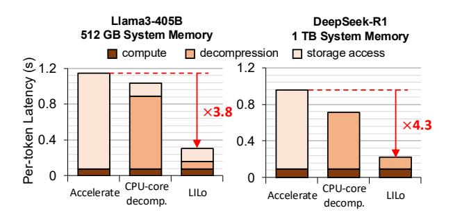
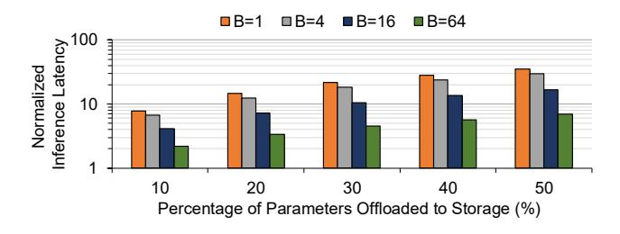
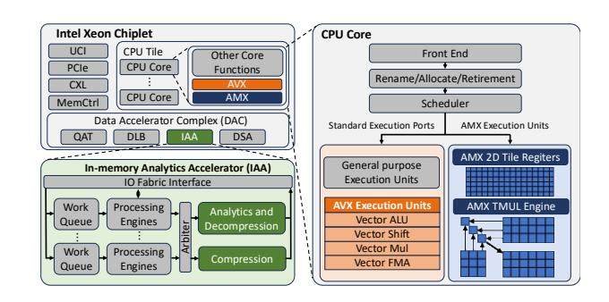

# I. INTRODUCTION

The remarkable success of large language models (LLMs) in recent years has been largely driven by scaling model size, a trend captured by the empirical scaling law [37]. Frontier models like GPT-4 [44], Llama3-405B [32], and DeepSeek-R1 [26] scale to hundreds of billions of parameters to deliver exceptional accuracy across a wide range of tasks. As a result, deploying these models requires multiple GPUs, since even expensive GPUs are designed with a limited memory capacity to provide higher memory bandwidth, exemplifying a fundamental trade-off in memory technology. For example, Llama3-405B model [32] requires 2 DGX-H100 instances, each with 8 GPUs, to simply provide enough memory capacity to store the 405B parameters in BF16 format (*i.e.,* 754 GB), costing roughly \$800K [12]. Such prohibitively expensive infrastructure restricts access to state-of-the-art LLMs and motivates more affordable deployment alternatives.

In this context, CPU-based inference has emerged as a practical, low-cost alternative—appealing not only to users or organizations lacking access to multi-GPU systems but also to hyperscalers seeking to exploit underutilized CPU servers for temporarily surging inference demand [21], [46]. The memory capacity requirement for serving recent large models, nonetheless, can be challenging to meet even with CPUs due to limited DRAM slots, platform constraints, power or thermal limits, or budget constraints. To enable the deployment of large models that exceed the CPU's memory capacity, recent frameworks, including HuggingFace Accelerate [33] and DeepSpeed Zero-Inference [19], support offloading model parameters to storage devices (SSD/HDD). However, the low bandwidth and high latency of storage access significantly degrade inference performance.

Quantization has been the mainstream approach for reducing model size. Yet, it introduces several critical drawbacks, including potential degradation in model accuracy [43], increased vulnerability to adversarial attacks [29], unintended bias and toxicity in generation [53], the re-emergence of previously unlearned problematic behaviors [55], and overall reductions in model trustworthiness [34]. An alternative direction is to adopt lossless compression to reduce memory footprint without altering model accuracy or behavior.

Prior work has leveraged the sparsity patterns in model parameters to apply lossless compression algorithms for Convolutional Neural Networks (CNNs) [39], [24], [25]. For instance, Eyeriss [24], [25] incorporates run-length coding, while Lane-Compression [39] applies algorithms such as LZW [51] and Deflate [28] to grouped bits to compress CNN parameters. However, the efficacy of these proposals has been demonstrated using dedicated reconfigurable hardware, and therefore they can be impractical for typical CPUs, which are inefficient at fast bit-level operations and decompression.

∗Hyungyo Kim and Qirong Xia contributed equally to this work

To tackle the challenge in providing effective and efficient lossless compression of model parameters for CPU-based inference, this work exploits the latest on-chip accelerators in commodity CPUs and proposes LILO: an LLM Inference framework supporting Lossless compression. Specifically, LILO accelerates inference under memory capacity constraints by storing model parameters in a compressed form, significantly reducing the amount of data offloaded to the storage device. It then decompresses them on-the-fly at high throughput using CPU on-chip accelerators. This work makes the following three contributions.

### Demonstrating the potential of compressed LLM inference and the limits of relying on CPU cores for decompression.

We first analyze the effectiveness of various compression algorithms on BF16 model parameters from Llama3-405B [32] and DeepSeek-R1 [26], both exceeding typical CPU memory capacity. By combining carefully selected compression algorithms with data preprocessing (i.e., byte-grouping), the size of the model parameters of these models can be reduced as low as 67% of their original size. At such compression ratio, storing model parameters in a compressed format and decompressing them on demand can significantly reduce storage access, which, for example, can reduce inference latency by  $5.0 \times$ in theory for a system running Llama3-405B with 512GB of memory capacity assuming negligible decompression overhead. However, when decompression is performed on CPU cores, end-to-end latency is reduced only up to 1.2× compared to the uncompressed baseline. This is because the benefits from reduced storage-offloading are offset by the decompression overhead as general-purpose CPU cores struggle to perform high-speed decompression and fine-grained byte-level data manipulation required by the algorithms.

Development of a high-throughput decompression solution leveraging emerging CPU on-chip accelerators. From the set of evaluated algorithms, LILO adopts byte-grouped Deflate for its strong compression ratio and high compatibility with Intel Advanced Vector Extensions (AVX) and In-memory Analytics Accelerator (IAA) accelerators. LILo leverages IAA to accelerate the decompression of the Deflate algorithm while exploiting AVX to efficiently perform the byte-level data reconstruction that reverses the byte-grouping applied during compression preprocessing. To maximize throughput across both accelerators, LILO implements a tightly integrated pipeline with lock-free inter-thread communication, a custom thread pool, and an optimally chosen IAA tuning parameter, i.e., chunk size. With this optimized decompression solution, LILO achieves up to 154 GB/s of decompression throughput, 9.3× higher than the CPU-core-based decompression.

Compressed LLM inference acceleration. With the high-throughput decompression solution integrated with Intel's LLM inference framework, LILO overlaps the inference compute running on Advanced Matrix Extensions (AMX) with decompression running on AVX and IAA by allocating dedicated CPU cores to each task. This enables LILO to minimize resource contention and execution thrashing between compute and decompression, further reducing the inference la-

Fig. 1. Per-token latency (normalized by batch size) and its breakdown for HuggingFace Accelerate, compressed LLM inference using CPU cores for decompression, and LILO on input/output token length of 128/256 for a batch size of 64.

tency. Furthermore, LILO introduces selective compression, a Mixture-of-Experts (MoE)-aware optimization that minimizes decompression overhead by exploiting the structural asymmetry in MoE models between frequently accessed components (e.g., attention layers and shared experts) and infrequently accessed ones (e.g., routed experts). Rather than compressing the entire model, LILO applies compression only to the infrequently accessed components, which, for example, constitute 97% of the model's total parameter size but can account for as little as 54% of the active parameters during the inference of DeepSeek-R1. Such selective compression reduces the decompression overhead by up to  $1.9\times$ , while maintaining a compression ratio nearly identical to that of full-model compression. Combined, LILO achieves up to  $4.9 \times$  and  $4.3 \times$ reductions in per-token inference latency for Llama3-405B and DeepSeek-R1, respectively, compared to Accelerate, the uncompressed baseline solely relying on storage-offloading. Figure 1 illustrates the significantly reduced storage-offloading overhead achieved by LILO, while minimizing decompression overhead by leveraging on-chip accelerators.

#### II. BACKGROUND

#### A. CPU-based Inference

CPU-based inference has gained traction as a complementary and cost-efficient alternative to GPU-centric LLM deployment. Beyond enabling LLM serving for users with limited access to multi-GPU systems, hyperscalers can also leverage underutilized CPU servers to meet a temporarily surging demand for LLM inference services [21], [46], although it is not designed to replace GPU-based inference targeting stringent service level objectives (SLOs). CPU-based inference has become more compelling, especially with servers equipped with the latest Intel CPUs that feature AMX. It significantly enhances matrix-multiplication throughput and, combined with the CPUs' much larger memory capacity than that of GPUs, has demonstrated up to 20 tokens/s for models as large as OPT-175B [38]. Such performance is notable given the community's strong interest in low-cost solutions (e.g., single-GPU inference with data-offloading [49], [50]) with much lower token generation rates (1–2 token/s for OPT-175B).

Nonetheless, even CPUs face memory capacity challenges as typical servers deployed by hyperscalers can be equipped with the most cost-effective, mid-capacity DIMMs (e.g., 32 GB or 64 GB), totaling 512 GB-1 TB of memory when all the memory channels are fully populated with such DIMMs. This still falls short of accommodating extremely large models such as Llama3-405B or DeepSeek-R1, which require 768 GB and 1.3 TB of memory, respectively—models of broad interest for their state-of-the-art capability. Note that a high-capacity DIMM (e.g., 256 GB) incurs a superlinearly higher per-GB cost than a mid-capacity DIMM (e.g., 32 GB or 64 GB) [9]. Besides, it requires servers with more expensive power-supply and cooling solutions due to significantly higher power and heat dissipation [47]. Alternatively, CXL memory can be used to increase the memory capacity of servers, but provides only limited memory bandwidth, hurting the memory-bandwidthsensitive performance of LLM inference. In such scenarios, enabling efficient LLM inference under limited memory capacity becomes crucial, which our work primarily focuses on.

#### B. Data-offloading during Inference

DeepSpeed Zero-Inference [19] and HuggingFace Accelerate [33] are two prominent frameworks that enable CPUbased inference for LLMs that exceed the CPU memory capacity by offloading the model parameters to storage devices. DeepSpeed Zero-Inference implements a full-modeloffloading strategy, whereas HuggingFace Accelerate supports both full- and partial-model-offloading to optimize the performance. However, storage-offloading introduces significant performance overhead due to the limited bandwidth of storage devices. Figure 2 illustrates the end-to-end inference latency of Llama3-405B under varying percentages of the parameters offloaded to NVMe SSD storage, characterized using HuggingFace Accelerate. The performance analysis was conducted on a 6th-generation Intel Xeon Scalable Processor (codenamed Granite Rapids, or GNR) with 128 cores for input/output token lengths of 256/32. For a batch size of 1, latency increases by  $8\times$  even when just 10% of the parameters are offloaded to storage, and reaches 35× when 50% of parameters are offloaded. While increasing the batch size can amortize this overhead by performing more compute once the parameters are fetched from the storage, the penalty remains substantial. For instance, even at a large batch size of 64 with 50% of

Fig. 2. Inference latency of Llama3-405B with varying proportions of model parameters offloaded to SSD, normalized to the case without offloading. Measured on Intel GNR CPUs with NVMe SSDs, using HuggingFace Accelerate for storage offloading across different batch sizes (*B*).

the parameters offloaded, the latency is still  $7 \times$  higher than the baseline, underscoring the critical performance bottleneck introduced by storage offloading.

#### C. Lossless Compression Algorithms

Popular lossless compression algorithms roughly fall into three categories: entropy coding, dictionary-based compression, and run-length encoding. Entropy coding, such as Huffman coding [35] and arithmetic coding [1], assigns shorter codes to more frequent symbols. Dictionary-based methods, including LZ77 [56], LZ78 [57], and LZ4 [42] replace recurring substrings with references to earlier occurrences, reducing redundancy. Lastly, run-length encoding [48] compresses sequences of repeated values by storing the value once alongside its repetition count, making it particularly effective for data with long runs of identical symbols. Deflate [28] is one of the most widely used lossless compression algorithms, which combines dictionary-based method (LZ77) and entropy coding (Huffman coding) to effectively balance compression ratio and speed. Numerous hardware accelerators for lossless compression implement Deflate, including Intel IAA [6], IBM Power9 on-chip accelerator [18], and NVIDIA BlueField DPUs [22].

#### D. Intel CPU On-chip Accelerators

Figure 3 illustrates the overall architecture of Intel Xeon Scalable Processors from the 4th generation onward and the details of three accelerators, IAA, AMX, and AVX.

**IAA** is an on-chip accelerator dedicated for computationally intensive tasks, including compression/decompression specifically focusing on the Deflate algorithm, encryption, and analytics. The bottom left box in Figure 3 illustrates the architecture of IAA. An IAA instance consists of eight work queues and eight processing engines. IAA transfers and processes data in the granularity of a data chunk, referred to as a job, the size of which can range from 1 KB to 2 MB. Each job is represented by a job descriptor, which specifies the operation, Huffman coding type, pointers to the source and destination data chunks, and their corresponding sizes. Processing engines then fetch descriptors from the work queue, and through arbiter-managed scheduling, forward them to processing pipes for analytics, compression, or decompression. Latly, Query Processing Library (QPL) [7] provides an interface between user applications and accelerator hardware.

Fig. 3. Intel Xeon Scalable Processors from the 4th generation onward, with detailed illustrations on AMX, AVX, and IAA.

AMX is a matrix-multiplication accelerator, along with ISA support, starting from the 4th-generation Xeon CPUs (SPR). The scheduler dispatches AMX instructions, such as tile load/store and accelerator commands, to dedicated AMX execution unit (Figure 3). AMX execution unit consists of two components: (1) a 2D array of register tiles and (2) Tile matrix multiply unit (TMUL) [4], which are designed to support INT8 and BF16 formats. The tiles store sub-arrays of matrices; the TMUL, a 2D array of multiply-add units, operates on these tiles. TMUL's 2D tile-based matrix execution enables higher ops/cycle by exploiting greater parallelism than 1D compute engines such as AVX engines.

AVX is a SIMD instruction set to accelerate data-parallel computations by enabling the processing of multiple data elements in parallel. AVX operates on 256-bit (AVX, AVX2) and 512-bit (AVX-512) wide YMM and ZMM registers, allowing simultaneous computation on multiple integers or floating-point numbers. In modern CPU architectures, AVX instructions are executed by vector execution units that share the standard execution ports with general-purpose scalar and floating-point units. These shared ports enable parallel execution of AVX instructions alongside scalar operations.

