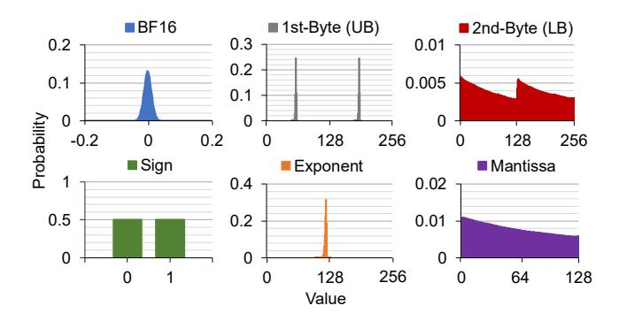

# III. COMPRESSED LLM INFERENCE: THE POTENTIAL AND LIMITATIONS

To mitigate the performance overhead of storage-offloading discussed in §II-B, we propose *compressed LLM inference*. During compressed LLM inference, model parameters are stored in a losslessly compressed format and decompressed on-the-fly during inference. By reducing the volume of model parameters, compressed LLM inference can significantly reduce the amount of data offloaded to storage when the model size exceeds the CPU memory capacity, resulting in accelerated inference. We first analyze the compressibility of LLM parameters of Llama3-405B and DeepSeek-R1 across different compression algorithms. We then evaluate the decompression throughput of these algorithms on CPU cores. Finally, we discuss the impact of decompression throughput on the latency reduction achievable via compressed LLM inference.

#### A. Compressibility of BF16 Model Parameters

**BF16 data format.** We focus on model parameters stored in BF16 format. BF16 encodes values using 1 sign bit, 8 exponent bits, and 7 mantissa bits, offering the same dynamic range as FP32 but at half the bit-width. Due to this balance between precision and efficiency, BF16 has become the default parameter format in many state-of-the-art models, as reflected in the HuggingFace text generation model catalog [2]. Although FP8 models like DeepSeek-R1 have emerged recently, even their parameters are losslessly converted to BF16 offline for CPU deployment, as FP8 is not supported on CPUs.1

**Probability distribution of parameters.** The upper left plot in Figure 4 illustrates the distribution of the parameters of Llama-3-405B in the BF16 data type. As the parameter values cluster

1The conversion process using DeepSeek's official code [27] takes 30–40 minutes, making on-the-fly conversion during inference infeasible.

Fig. 4. The probability distribution of BF16 parameter values, 1st/2nd byte of the parameters (Upper Byte (UB)/Lower Byte (LB)), and sign, exponent, and mantissa of the parameters of BF16 Llama3-405B model.

tightly around a narrow range, exponent value of the parameters result in extremely concentrated distribution, opposed to the relatively evenly distributed sign and mantissa values of the parameters as illustrated in Figure 4. The entropy of each part is calculated at 1 bit, 1.83 bits, and 6.97 bits, respectively, hinting that the exponent part can benefit significantly from compression algorithms. Similarly, the distribution of the 1st-byte, consisting of 1 sign bit and 7 most significant bits of the exponent, also shows a similar concentrated pattern with 2.83 bits in entropy. The 2nd-byte draws a distribution close to the uniform distribution with 7.97 bits in entropy. In the rest of the paper, we refer to the 1st-byte and 2nd-byte of BF16 as the Upper Byte (UB) and Lower Byte (LB).

Compression ratio. Table I reports the compression ratio, defined as (compressed size)/(original size), of Llama3-405B and DeepSeek-R1. We evaluate two compression algorithms: LZ4 [42], a lightweight run-length-based algorithm similar to that used in Eyeriss [24], [25], and Deflate [28], which offers more compression at the expense of slower decompression. To exploit the entropy difference between byte positions of LLM parameters, we adopt byte-grouping, a variant of lanegrouping [39], where UB and LB of parameters are grouped separately and compressed independently. This isolates the low-entropy exponent/sign bytes from the high-entropy mantissa bytes, avoiding entropy interleaving that would otherwise hinder match lengths and flatten symbol distributions. While LZ4 without byte-grouping fails to compress the model, bytegrouping reduces its compression ratio to 87%. Deflate, in contrast, achieves 79% and 72% even without byte-grouping, and improves further to 71% and 67% with byte-grouping for Llama3-405B and DeepSeek-R1, respectively. We also find that the LB group is incompressible with either LZ4 or Deflate.

**Insight-1:** Lossless compression algorithms can reduce the model parameter size by up to 33% without compromising the model accuracy and behavior.

