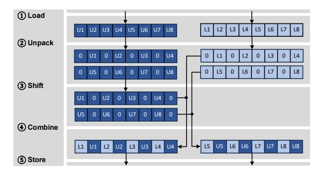

# IV. LILO: ACCELERATING COMPRESSED LLM INFERENCE WITH CPU ON-CHIP ACCELERATORS

To realize the potential of compressed LLM inference, we present LILO, a framework that achieves high-throughput decompression by leveraging Intel's on-chip accelerators. LILO efficiently orchestrates pipelining and overlapping across IAA, AVX, and AMX—the latter used for accelerating LLM computation. LILO implements a compression method that combines the Deflate algorithm with byte-grouping, selected for its superior compression ratio and its high compatibility with hardware accelerators' capabilities. In the following subsections, we first present the overview of LILO. We then describe the implementation of its high-throughput decompression solution, which leverages IAA and AVX. Finally, we describe compressed LLM inference acceleration optimizations including compute/decompression overlap and selective compression.

#### *A.* LILO *Overview*

LILO consists of two stages: (1) offline model parameter compression, and (2) compressed LLM inference with on-thefly decompression, as illustrated in Figure 6. In the offline stage, LILO iterates through the Decoder layers and applies byte-grouping to each sublayer's parameters, separating each BF16 parameter into UB-group and LB-group. As discussed in §III-A, UB-group carries most of the compressibility, while LB-group remains incompressible. Therefore, only UB-group is compressed, and LB-group is stored uncompressed. During inference, the compressed model parameters are decompressed by reversing the offline compression. Specifically, UB-group undergoes Inflate, the decompression process of the Deflate algorithm, and is then combined with the uncompressed LB-group for BF16-reconstruction. We leverage IAA and AVX to accelerate Inflate and BF16 reconstruction, respectively, and implement a decompression pipeline to maximize throughput. Table II summarizes LILO's decompression throughput, which is 9.3–14.8× higher than that of CPU cores.2 During the pipelined Inflate and BF16-

2We further validated that parameters decompressed from UB-only and UB+LB compression exactly match the originals bit-for-bit, and confirmed the identical perplexity on the OpenOrca validation set between LILO and the uncompressed baseline. As LILO applies *lossless* compression solely to model parameters, such validation ensures complete preservation of inference accuracy.

TABLE II INFLATE, BF16-RECONSTRUCTION, AND THE COMBINED DECOMPRESSION THROUGHPUT (GB/S) OF CPU CORE BASELINE AND LILO FOR LLAMA3-405B AND DEEPSEEK-R1 PARAMETERS.

|                                                  | Llama3-405B |        | DeepSeek-R1 |        |
|--------------------------------------------------|-------------|--------|-------------|--------|
| Function                                         | CPU core    | LILO   | CPU core    | LILO   |
| Inflate                                          | 11.27       | 82.54  | 5.11        | 72.79  |
| BF16-reconstruction                              | 111.36      | 194.04 | 103.68      | 191.34 |
| Decompression (Inflate + BF16-reconstruction) | 16.49       | 153.72 | 9.31        | 136.82 |

reconstruction for Llama3-405B parameters, the IAA decompression engines sustain an occupancy of 85% with a queue depth of 13 on average. Furthermore, decompression is overlapped with inference computation at the sublayer granularity by dedicating separate sets of cores to each task, thereby minimizing resource contention and execution thrashing between decompression and compute.

#### *B. Hardware Acceleration*

IAA-accelerated Inflate. Inflate is executed on IAA in three stages: 1 allocation and initialization of job descriptors, 2 descriptor submission to initiate Inflate, and 3 deallocation and clean up of descriptors and associated metadata. As stages 1 and 3 incur overhead for different runs, we separate these two stages into a separate module and run once at start-up of the inference, as the descriptors can be reused and dynamically adjusted across runs. Only stage 2 , the actual Inflate step, is called by the IAA Inflate module during the inference. Descriptors are released upon completion of inference.

IAA Inflate performance depends primarily on the chunk size that IAA operates on. For the GNR CPU used in our setup (detailed in §V), a socket contains 4 IAA accelerators with 8 decompression engines each, totaling 32 engines. To maximize the utilization of the 32 engines for parallel execution, it is beneficial to submit 32 job descriptors simultaneously. To fully utilize the hardware, chunk sizes should be small enough such that each parameter set is divided into at least 32 chunks, fully exploiting the parallelism of the 32 engines. However, small chunk sizes incur high CPU-IAA communication overhead,

Fig. 7. AVX512-accelerated BF16-reconstruction process.

decreasing the throughput. By increasing the chunk size, the communication overhead can be amortized more effectively, but may result in engine under-utilization. Therefore, chunk size must be carefully tuned to balance engine utilization and communication efficiency.

AVX512-accelerated BF16-reconstruction. We leverage AVX512 intrinsics to accelerate BF16-reconstruction, focusing on their ability to load and store wide vectors and perform byte-level data operations efficiently within and between AVX512 registers. Figure 7 illustrates the AVX512-accelerated BF16 reconstruction process, consisting of five stages. (1) Load: first, two  $64 \times 8$ -bit elements from each of UB-group and LB-group are loaded into 512-bit registers using the \_mm512\_loadu\_si512 instruction. 2 Unpack: the lower and upper 256-bit halves are extracted via \_mm512\_castsi512\_si256 and \_mm512\_extracti64x4\_epi64, then zero-extended to 16bit integers using \_mm512\_cvtepu8\_epi16. ③ Shift: the 8bit UBs are left-shifted with \_mm512\_slli\_epi16 to prepare for bitwise merging. (4) Combine: the shifted UBs are combined with the LBs using \_mm512\_or\_si512, a bitwise OR operation to produce the final 16-bit BF16 values. (5) Store: finally, the reconstructed BF16 data is written back to memory in two 512-bit chunks using \_mm512\_storeu\_si512. To exploit both data- and core-level parallelism, we invoke AVX512 instructions across multiple threads pinned to separate CPU cores. Thread binding via CPU affinity minimizes preemption and context switches while preserving cache locality, further improving throughput.

