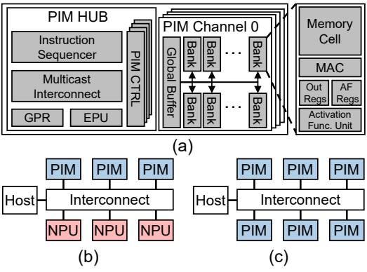

# A. Long-Context LLM Inference/Decoding

Long-context LLMs are built on the Transformer decoder architecture [68], which, as shown in Fig. 1, consists of  $n_l$  layers, each containing a Multi-Head Attention (MHA) module and a Feed-Forward Network (FFN). Within each of the  $n_h$  attention heads, per-head feature dimension  $(d_h)$ , matrix dimension  $(d_{in}, d_{out})$  for weight parameters, Query/Key/Value vectors  $(Q, K, V \in \mathbb{R}^{d_h})$  are generated, and the K/V vectors are appended to a KV cache for all T tokens. To improve efficiency, some models employ architectural variants like Grouped-Query Attention (GQA) [4], where multiple query heads share a single set of Key and Value vectors per group. The subsequent Attention operations,  $QK^T$  and SV, access this cache. Representative LLM configurations, including GQA variants, are detailed in Table I, and benchmark characteristics are outlined in Table II.

Our analysis of long-context LLM workloads reveals memory bandwidth and capacity bottlenecks from Attention during decoding. As context length grows, compute intensity (OPs/Byte) drops sharply (Fig. 2(a)) as computation shifts from compute-intensive matrix-matrix (GEMM) to memory-bound matrix-vector (GEMV) operations for Attention—making performance heavily dependent on raw memory

Fig. 3: Overview of PIM module/node configuration. (a): PIM module architecture. (b) and (c): PIM node configuration - heterogeneous xPU+PIM and PIM-only.

bandwidth. This bandwidth pressure is compounded by capacity demand of the KV cache. Because the KV cache increases proportionally with context length and batch size, it dominates the growth of overall memory requirements and thus imposes significant capacity pressure in long-context LLM inference (Fig. 2(b)). In this work, we exploit a multi-node PIM system to provide both the required memory capacity and high internal memory bandwidth.

#### B. PIM Architecture and Instruction Execution

DRAM-based Processing-in-Memory (PIM) systems [33], [40] accelerate memory-bound GEMV operations by integrating computation directly into memory. As detailed in Fig. 3(a), a PIM module integrates vector MAC units within each DRAM bank, a shared Global Buffer (GBuf) for inputs, and Output Registers (OutRegs) for results, all orchestrated by a PIM Controller. An Activation Function Unit, with an associated Activation Function Registers, is also included to support non-linear activation functions via Look-Up Table (LUT) approximations. An Extra Processing Unit (EPU) performs auxiliary operations (e.g., Softmax), while a General-Purpose Register file (GPR) stores inputs/outputs (or intermediate results) of the computation. In operation, the PIM HUB receives compiler-generated PIM instructions. The Instruction Sequencer expands each instruction by unrolling its specified repetitions and forwards the resulting instruction stream to the Multicast Interconnect. The Multicast Interconnect then decodes these instructions into channel-specific PIM commands, multicasts them to the target channels, and routes the associated data to the corresponding PIM Controllers.

Each PIM instruction carries a set of arguments that determine how it is expanded and dispatched as PIM commands (Table III). Specifically, *Ch-mask* specifies the target PIM channels, *Op-size* determines repetition count, and *GPR-addr* provides the base access address when the instruction involves data movement between the GPR and the PIM (e.g., WR-INP or RD-OUT). The Instruction Sequencer uses *Op-size* to unroll a single instruction into a sequence of repeated instructions, which are subsequently decoded by the Multicast Interconnect

TABLE III: PIM instructions for LLM inference. *Ch-mask, Op-size, GPR-addr* guide the decoding of each instruction into channel-specific PIM commands, while *GBuf-Idx, Out-Idx, Row/Col* are used during PIM channel operation.

| Instruction | Description                    | Arguments                                   |  |
|-------------|--------------------------------|---------------------------------------------|--|
| WR-INP      | Copy Input from GPR to GBuf    | Ch-mask Op-size GPR-addr GBuf-Idx        |  |
| MAC         | Dot-Product on a DRAM row      | Ch-mask Op-size GBuf-Idx Row/Col Out-Idx |  |
| RD-OUT      | Copy Output from OutReg to GPR | Ch-mask Op-size GPR-addr Out-Idx         |  |

into channel-specific PIM commands accessing consecutive addresses (e.g., GPR-addr, GBuf-Idx, or column addresses).

