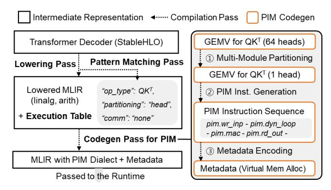

# *A. Multi-PIM Compiler and Runtime*

We implement PIMphony on top of MLIR [64], a flexible compiler framework designed for modular optimization across software and hardware layers (Fig. 12). By extending MLIR's dialects, we generate PIM-specific code for Attention and feed-forward subgraphs in Transformer decoding workloads. PIMphony's custom pattern-matching and code generation passes target PIM-amenable kernels (e.g., QKT , SV , F F N),

Fig. 12: Overall compilation flow of PIMphony.

embedding dynamic partitioning and memory allocation metadata. Compilation is performed offline and does not affect inference latency.

For runtime support, we enhance the IREE [67] runtime stack and its hardware abstraction layer (HAL) to interface with PIM SDKs provided by commercial platforms [62]. This enables the deployment of PIMphony's instruction sequences in realistic multi-node settings, where token-centric partitioning and dynamic memory management adaptively respond to variations of context length. These runtime extensions are implemented without assuming new hardware primitives, ensuring compatibility with NeuPIMs and CENT simulators.

#### B. PIM System Integration

To evaluate PIMphony in multi-node inference settings, we incorporate the compiler-generated PIM instruction sequences into simulators for both NeuPIMs and CENT. In NeuPIMs, PIMphony offloads bandwidth-bound Attention operations to PIM modules, while in CENT, all computations are handled with PIM. We apply PIMphony's hardware-aware optimizations—including on-module dispatch logic and I/O buffering—within the simulation backends of both platforms, with DRAM command timing and resource contention calibrated with AiMX [62] PIM specifications.

#### C. Hardware Overhead

PIMphony's hardware modifications proposed lightweight, as the I/O-aware buffering incurs a minimal area overhead, occupying just 0.47% of the MAC unit area [40] per PIM bank, estimated by synthesizing the output buffer logic using CACTI [8]. In addition, enabling DCS within PIM controllers in PIM HUB [30], [35], [37] adds only a negligible controller cost: across all HUB control blocks [62], the area increases by 0.5% and the power by 1.3%. This overhead accounts for the additional dependency-tracking structures and logic required by DCS, including a per-controller 576B metadata table (D-Table and S-Table) and the associated dependency-check unit used to validate per-entry hazards. The on-module dispatcher supporting DPA incurs a 4% area overhead. This dispatcher requires less than 200KB for all its internal buffers (VA2PA, command, configuration), which is much smaller than the 512KB GPR capacity in a typical PIM

TABLE IV: PIMphony module configurations.

|              | Compute     | 8 Matrix Units(256 TFLOPS), 32 PIM channels |  |  |
|--------------|-------------|---------------------------------------------|--|--|
| NeuPIMs [21] | Memory      | 32GB                                        |  |  |
|              | Internal BW | 32TB/s                                      |  |  |
|              | Compute     | PNM (3 TFLOPS), 32 PIM channels             |  |  |
| CENT [16]    | Memory      | 16GB                                        |  |  |
|              | Internal BW | 16TB/s                                      |  |  |

HUB, ensuring efficient integration without significant area pressure.

