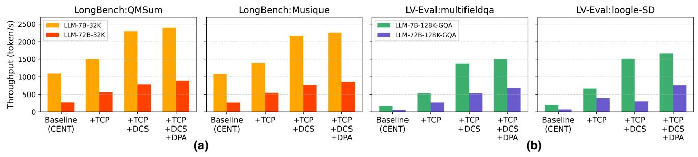
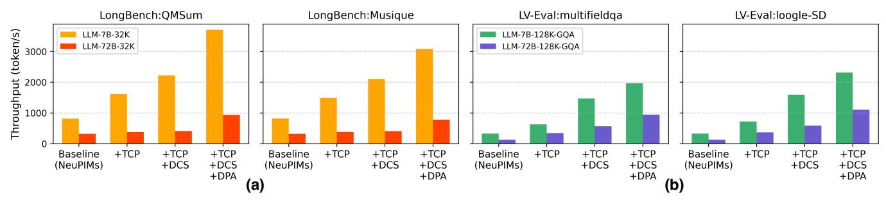
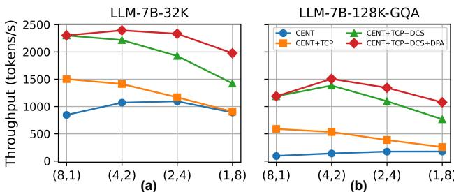

# B. Performance Evaluation.

We evaluate the end-to-end throughput improvements of our proposed techniques across both PIM-only (CENT [16]) and heterogeneous xPU+PIM systems (NeuPIMs [21]). As shown in Fig. 13 and 14, we incrementally apply three optimizations of PIMphony: token-centric PIM partitioning (TCP), dynamic PIM command scheduling (DCS), and dynamic PIM access (DPA).

**Overall Throughput Gains.** Performance consistently improves with the progressive application of the proposed methods. In Fig. 13(a) and 14(a), we observe a 2.1-4.5x speedup for GQA-disabled models (LLM-7B-32K, LLM-72B-32K) evaluated on LongBench. For GQA-enabled models (LLM-7B-128K, LLM-72B-128K) evaluated on LV-Eval (up to 128K tokens), our methods achieve up to 11.3× speedup, demonstrating their strong effectiveness in large-context scenarios. Notably, PIMphony's relative throughput gain is often higher for the 72B models because larger models suffer more from baseline inefficiencies (e.g., PIM underutilization in the CENT system), creating greater room for improvement. While this trend is evident in PIM-only systems, the advantage in xPU+PIM systems becomes more pronounced under very long-context workloads (e.g., 128K), where PIM-side execution increasingly dominates.

Effectiveness of TCP, DCS, and DPA. TCP directly addresses the poor channel utilization in PIM-only and xPU+PIM systems, which is caused by the small batch sizes and context imbalances inherent to long-context workloads, more pronounced in longer context (LV-Eval). While TCP effectively

Fig. 13: Throughput of PIM-only systems — 7B: 8 modules (128GB), 70B: 32 modules (512GB). (a) Non-GQA LLMs on LongBench. (b) GQA-enabled LLMs on LV-Eval. Each bar shows improvements from TCP, DCS, and DPA, using optimal TP/PP settings.

Fig. 14: Throughput of xPU-PIM systems — 7B: 4 modules (128GB), 70B: 16 modules (512GB). (a) Non-GQA LLMs on LongBench. (b) GQA-enabled LLMs on LV-Eval. Each bar shows improvements from TCP, DCS, and DPA, using optimal TP/PP settings.

Fig. 15: Throughput of various (TP,PP) on (a) LLM-7B-32K with LongBench QMSum (b) LLM-7B-128K-GQA with multifieldqa.

boosts PIM utilization, the system can become I/O-bound, a problem that DCS resolves by overlapping computation and data movement. This synergy is especially impactful for GQA-enabled models, where DCS unlocks the gains of *rowreuse mapping* by overlapping the additional I/O transfers (especially WR-INP) with MAC execution, thereby amplifying ACT/PRE savings over TCP-only configurations. Finally, in heterogeneous xPU+PIM systems, DPA plays a critical role in maintaining system-level balance. As TCP and DCS accelerate the PIM-bound Attention stage, the xPU-bound FC stage increasingly becomes the dominant performance bottleneck. DPA alleviates this imbalance by enabling larger batch sizes, which in turn improves NPU utilization and maximizes endto-end throughput.

