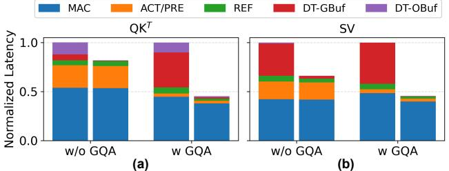
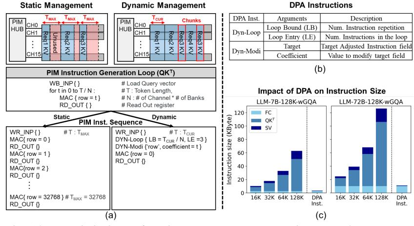

# *C. Dynamic PIM Command Scheduling*

I/O-aware Buffering. To mitigate the bottleneck from frequent I/O transfer, we introduce I/O-aware buffering that decouples I/O transfers from computation, allowing the controller to issue independent PIM commands more aggressively and keep the pipeline busy. For this, we repurpose the existing multi-entry GBuf as a dedicated input buffer and expand the Output Registers into larger Output Buffers (OBuf) for output staging. Both of these buffers are implemented as dual-port memory, enabling concurrent accesses: while MAC consumes the current inputs and accumulates partial sums, the controller can prefetch the next inputs into GBuf or drain completed outputs from OBuf, increasing I/O–compute overlap.

Dynamic Command Scheduling. We extend the PIM controller with a dynamic scheduling mechanism that enforces inter-command timing constraints only when true data dependencies exist between I/O transfer and MAC operations. To support this, we introduce two hardware structures—the Dependency Table (D-Table) and the Status Table (S-Table)—as illustrated in Fig. 7(c).

Each command is assigned a unique identifier (ID) and maintains a Dependency ID (DID), which specifies the ID of the command that must complete before the current command can be safely executed. The D-Table enables this dependency assignment by recording, for each GBuf and OBuf entry, the most recent command that accessed it. When a new command arrives, the controller consults the corresponding D-Table entry, assigns the recorded command ID as the new command's DID, and updates the D-Table with the new command ID.

The S-Table maintains the execution status to determine whether a dependency has been resolved. For each GBuf and OBuf entry, it records the ID of the most recent accessing command along with the cycle at which that access completes (i.e., an expiration timestamp). In addition, the S-Table maintains an *is-MAC* flag for OBuf entries to identify consecutive MAC operations targeting the same buffer location, enabling pipelined execution without unnecessary stalls.

Fig. 9: Latency breakdown of PIM command execution for LLM-72B Attention. (a) QKT , (b) SV . Each bar compares execution without (left) and with DCS (right). Both employ the *row-reuse mapping*

Together, these structures govern command scheduling and dispatch. After dependency assignment via the D-Table, the controller classifies each command and enqueues it into either the I/O transfer queue or the compute queue, allowing out-of-order execution between I/O transfer commands and MAC commands while preserving in-order execution within each queue. For each command considered for execution, the controller consults the S-Table to determine its execution readiness. A command is dispatched only (i) if the S-Table entry corresponding to its accessed buffer reports a matching command ID to the command's DID and (ii) the current cycle tcur exceeds the recorded expiration time, ensuring that the predecessor command has completed. When these conditions are satisfied, the controller issues the command and updates the S-Table to reflect the new access and its completion time. For consecutive MAC operations accessing the same OBuf entry, the *is-MAC* flag allows the controller to bypass the tMAC gap and issue them at the minimum tCCDS interval.

PIM Controller Example. Fig. 7(c) illustrates an example of the PIM controller operation. When command M3 arrives, the controller consults the D-Table and identifies that command W0 was the most recent command to access GBuf entry 0, which M3 targets. Accordingly, M3 is assigned a GBuf Dependency ID of 0. This dependency association indicates that M3 must wait for W0 to complete before accessing the GBuf entry. To determine whether this dependency has been resolved, the controller examines the S-Table entry corresponding to GBuf index 0. Issuance of M3 is permitted only if the command ID recorded in the S-Table matches M3's GBuf-DID and the current cycle tcur exceeds the recorded expiration timestamp. This check ensures that M3 is issued only after W0 has completed its access.

DCS's Latency Saving. DCS reduces latency by dynamically relaxing inter-command timing as dependencies permit, thereby increasing pipeline efficiency and enabling out-oforder issue of independent commands. Fig. 7(d) provides an example where W0 completes, the scheduler immediately issues M3 because it is independent of W2, even though W2 has not yet finished (relaxing inter-command timing). This allows computation to proceed without waiting unnecessarily. Similarly, M7 is issued before R6 because they have no data dependency, which permits M7 to directly follow M5 with only a minimal tCCDS interval (out-of-order execution). By bypassing such stalls, the DCS scheduler improves MAC

Fig. 10: (a) Limitations of static memory management in PIM where memory is allocated based on max token size, (b) new DPA Instructions introduced with PIMphony, and (c) impact of DPA on instruction size.

Fig. 11: To enable dynamic memory management with DPA, high-level overview of (a) on-module dispatcher and (b) lazy memory allocation.

pipeline throughput and significantly reduces total execution time. In the example shown in Fig. 7(d), DCS reduces the execution from 34 cycles to just 22 cycles.

Enabling KV Cache Reuse in GQA. When operating across multiple DRAM rows, completing all computations on the currently opened row before moving to the next reduces ACT/PRE overhead; we refer to this as a *row-reuse mapping*. When applied to GQA [4], this means processing all inputs (queries/scores) that share the row-resident KV cache before switching DRAM rows. However, this mapping increases I/O transfer because queries/scores are frequently swapped into the GBuf, exacerbating pipeline stalls under *static scheduling*. As shown in Fig. 9, this raises DT-GBuf overhead even with weight reuse. DCS mitigates the issue by overlapping I/O transfers with MAC execution, reducing pipeline stalls and allowing *row-reuse mapping* to yield performance gains.

