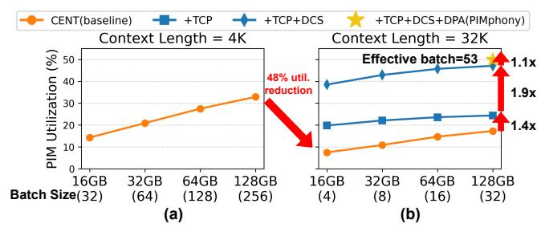
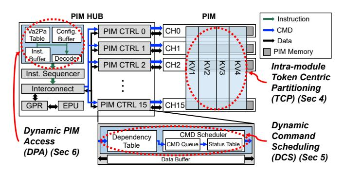
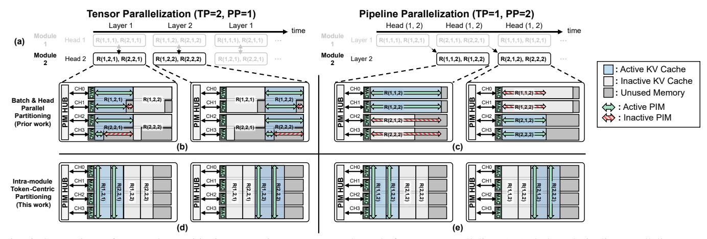
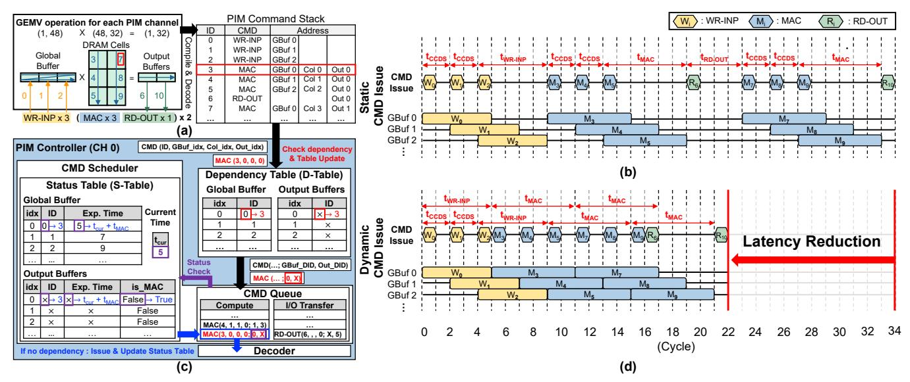
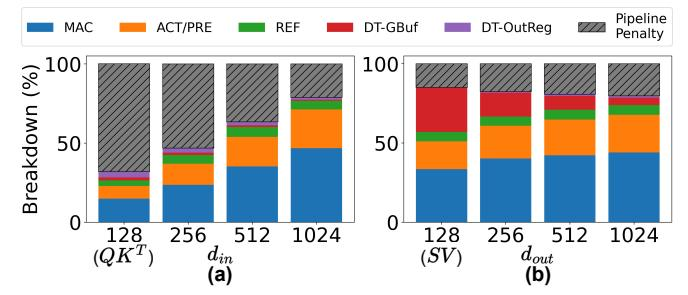

# C. Multi-Node DRAM-PIM System

To accommodate large models, multiple nodes can be deployed in heterogeneous (xPU+PIM) or PIM-only configurations (Fig. 3(b,c)), leveraging model parallelism techniques such as Tensor Parallelism (TP) [60] and Pipeline Parallelism (PP) [23]. In TP, model parameters are partitioned across PIM modules, and parallel computation is performed on different tensor shards, with synchronization required to aggregate partial results. In contrast, PP partitions the model into transformer layers that are executed across PIM modules, allowing different micro-batches to be processed concurrently in a pipelined manner. Both approaches enable large transformer models to be mapped across multiple PIM modules by exposing parallelism at different granularities.

#### D. Challenges

Although PIM systems offload memory-bound Attention operations, their efficiency drops sharply in long-context scenarios. We identify three fundamental limitations that create a critical performance bottleneck:

- 1) Channel Underutilization. Prior PIM systems partition the KV cache by the head and batch dimensions to parallelize Attention across PIM channels [16], [21], [54]. However, this strategy is highly inefficient for long contexts. It leads to severe channel underutilization, either from workload imbalance when requests have different context lengths or from insufficient sub-batch sizes to keep all pipeline stages full.
- 2) I/O Bottleneck. Each dot-product in PIM follows a fixed command pipeline of WR-INP → MAC → RD-OUT (Table III), but limited I/O buffers—2KB input per channel and 4-byte output per bank [40]—frequently stall the MAC units. This issue is amplified in Attention layers, where the KV cache has a small feature dimension (dh; Fig. 1), limiting input/output reuse and increasing buffer turnover. Critically, static command scheduling fails to overlap data movement with computation, resulting in low MAC utilization even under optimal partitioning.
- 3) **Static Memory Management.** To handle variable context lengths, existing PIM systems pre-allocate a KV cache sized for the maximum context  $T_{max}$ , bounding the batch size to a worst-case capacity. Given that realworld workloads have diverse token lengths (Table II),

Fig. 4: PIM utilization under (a) short(4K) and (b) long(32K) contexts using CENT [16] and PIMphony on LLM-7B-32K-GQA. Batch size scales inversely with context length due to the capacity constraint.

this static approach leads to severe memory inefficiency, with an observed average capacity utilization of only 36.2% (See Sec. VIII-C). The root cause is that PIM commands embed fixed physical addresses, making it impossible to repurpose these large, unused memory regions at runtime.

Taken together, the challenges of channel underutilization, I/O bottlenecks, and static memory waste show that conventional PIM systems are fundamentally underutilized for long-context LLM inference. This inefficiency is substantial; our analysis reveals that MAC unit utilization drops by 48% at a 32K context length (Fig. 4). Such systemic limitations cannot be solved with incremental optimizations, necessitating a holistic redesign of the PIM software and hardware stack—motivating the novel orchestrator we propose.

#### III. PIMPHONY OVERVIEW

We propose PIMphony, a PIM *orchestrator* that systematically resolves these inefficiencies to enable high performance for long-context LLM inference. PIMphony improves PIM utilization—a critical yet previously underexplored bottleneck—through three co-designed techniques (Fig. 5).

**Token-Centric PIM Partitioning (TCP).** To combat channel underutilization, PIMphony introduces TCP. Unlike conventional methods that rely on the volatile batch dimension, TCP reorients parallelism along the plentiful *token* axis. By distributing token-level work across all channels, TCP decouples performance from batch size, mitigating imbalance and ensuring consistently high channel utilization.

**Dynamic PIM Command Scheduling (DCS).** To eliminate the I/O bottleneck, PIMphony employs DCS, which enhances the PIM controller with the ability to issue commands out-of-order based on real-time data dependencies. This dynamic approach, impossible for rigid static schedulers, effectively hides I/O latency by overlapping data movement and computation, thus maximizing MAC pipeline throughput.

**Dynamic Memory Management with Dynamic PIM Access (DPA).** To address wasteful static memory allocation, PIMphony features DPA, which includes a novel on-module dispatcher, which effectively acts as a lightweight, pseudo-Memory Management Unit (MMU) for the PIM. This dispatcher enables runtime virtual-to-physical address translation, allowing for dynamic, on-demand memory allocation for the KV cache. This breaks free from the static pre-allocation

Fig. 5: High-level overview of PIMphony with the three main components highlighted.

model based on maximum context length and improves effective memory capacity utilization.

Together, TCP, DCS, and DPA form a cohesive orchestration framework that addresses PIM inefficiencies across parallelism, command scheduling, and memory management. Fig. 4(b) provides a preview of their cumulative impact on PIM utilization. Building on this architectural overview, the following sections describe each technique in detail, explaining how they jointly enable efficient long-context LLM inference.

#### IV. TOKEN-CENTRIC PIM PARTITIONING

To understand the limitations of existing PIM workload partitioning strategies for long-context LLM inference, we first examine a simplified example that illustrates their impact on channel utilization. Fig. 6(a) visualizes a Transformer example workload with two attention heads, two layers, and a batch size of two, distributed across two PIM modules, each containing four independently operating channels. Computation tasks are labeled with the notation R(r, h, l), where r denotes the request ID, h the head index, and l the layer index, while active and inactive KV cache regions are shown in blue and shade, respectively. This example reflects long-context conditions, where a request typically consumes nearly the entire memory capacity of a single PIM channel, limiting each channel to serve only one request at a time. This example allows us to compare the effects of tensor parallelism (TP) and pipeline parallelism (PP) on channel activity, contrasting conventional PIM partitioning with our proposed token-centric PIM partitioning (TCP) approach.

#### A. Channel Underutilization Issue

Modern PIM-based LLM accelerators [16], [21], [54] suffer severe channel underutilization in long-context inference because existing KV cache partitioning schemes do not scale with growing context length. To distribute workload across channels within a PIM module, prior systems commonly adopt Head-First Partitioning (HFP), which assigns head-batch pairs to individual PIM channels for concurrent execution. HFP implicitly assumes the availability of sufficient head-batch parallelism to populate all channels. However, as context length increases, each request's KV cache footprint expands while the number of simultaneous requests (i.e., batch size) shrinks. In the extreme, a single long-context request can

Fig. 6: Comparison of KV cache partitioning strategies across PIM channels for tensor parallelism (TP) (b,d) and pipeline parallelism (PP) (c,e). Prior approach [16], [21], [54] (Head/Batch-First Partitioning (HFP)) is shown in (b,c) while the proposed Token-Centric Partitioning (TCP) is shown in (d,e). The example highlights the inefficient utilization of HFP across the PIM channels, as not all channels can be utilized simultaneously. For clarity, only one PIM module with four channels is shown. R(r, h, l) indicates Request r, Head h, and Layer l.

occupy an entire channel, drastically reducing the number of available head-batch tiles. As a result, HFP fails to sustain high channel utilization in long-context settings, leaving many channel-level MAC units idle despite abundant token-level parallelism. In the following, we analyze how this limitation of HFP manifests under tensor and pipeline parallelism.

#### B. Analysis of HFP under Tensor and Pipeline Parallelism

Tensor parallelism (TP) and pipeline parallelism (PP) organize LLM execution across PIM modules at different granularities—TP partitions attention heads across modules, while PP distributes consecutive layers. Under both schemes, however, the intra-module channel allocation remains governed by head-first partitioning (HFP), which ultimately determines how workloads are mapped to individual PIM channels.

Load Imbalance from HFP under TP. Under TP, HFP leads to load imbalance when requests have different token lengths, leading to varied execution times across channels. Channels assigned to shorter sequences finish their computations earlier and must wait for those processing longer sequences, limiting the overall throughput to that of the slowest channel and reducing effective parallelism. For example, in Fig. 6(b), Channel 2 and 3 are assigned to Request 2 with a shorter token length and thus performs less computation, becoming idle while other channels continue execution. Although short-context systems can mitigate such imbalance by assigning multiple requests per channel for load balancing (e.g., NeuPIMs [21]), this approach becomes infeasible in long-context inference, where a single request can fully occupy a channel's memory capacity.

Sparse Channel Activation from HFP under PP. Under PP, HFP activates only the subset of channels associated with the request assigned to each pipeline stage. In long-context scenarios, where a single request can occupy an entire channel, this results in sparsely populated stages with many idle channels. As illustrated in Fig. 6(c), only a fraction of the available channels are active at any given time. This stage-

level idling, compounded by pipeline bubbles that form when subsequent stages are empty, results in persistent underutilization—a problem especially pronounced with the limited batch sizes of long-context workloads.

#### C. Intra-Module Token-Centric Partitioning

To overcome the channel underutilization inherent in HFP, we introduce Token-Centric PIM Partitioning (TCP). TCP partitions the token dimension of a single head across all available PIM channels, enabling token-level parallelism within each PIM module. In  $QK^T$  operations, each channel processes a distinct segment of tokens concurrently, enabling parallel computation across the module. In SV operations, each channel performs token-wise partial reduction over its assigned tokens, and the partial results are reduced through the shared PIM HUB and GPR to produce the final output. For example, in Fig. 6, assume each channel contains 16 banks, with a total token length of 16K and a head dimension of 32. Under this configuration,  $QK^T$  assigns 4K tokens to each channel for parallel computation, while SV assigns 2K tokens per channel and performs a single global reduction across channels through the PIM HUB to generate the final result.

TCP enables full channel activation in long-context inference, where the token sequence length is sufficiently large to keep all processing units active. As illustrated in Fig. 6(d) and (e), TCP distributes token computations across channels, ensuring full channel activation. Under TP, TCP mitigates token-length imbalance across requests that previously caused idle channels, while under PP, TCP allows all channels to participate concurrently regardless of the active pipeline stage. Under a commercial PIM module [62] configuration with 16 channels and 16 banks per channel, full channel activation is achieved once the token length exceeds 256 for QKT and 32 for SV.

Under TCP, each PIM channel produces partial outputs that must be combined within the module to form a complete result. This aggregation step operates at the inter-channel level,

Fig. 7: Dynamic PIM Command Scheduling. (a) A GEMV operation example and its command stack, (b) timing diagram for baseline PIM command schedule, (c) detailed Dynamic PIM Command Scheduling (DCS) example within the PIM controller, and (d) resulting timing diagram after DCS where MAC instructions can be executed in advance. In (b)&(d), Each GB 0/1/2 denotes an entry of a Global Buffer.

where outputs from different channels are gathered through the general-purpose registers (GPR) at the PIM HUB and finalized by the Extra Processing Unit (EPU) (Fig. 3(a)). For  $QK^T$ , the aggregation after matrix multiplication involves only concatenation during the subsequent Softmax in the EPU, incurring no measurable latency. Meanwhile, SV performs a single interchannel reduction per module, whose cost is minimal—below 0.2% of total attention latency for an LLM-7B with 16K tokens. Because TCP partitions tokens only within a module, it avoids inter-module synchronization, keeping aggregation and synchronization overhead negligible.

#### V. DYNAMIC PIM COMMAND SCHEDULING

#### A. PIM Command Execution Overview

Modern PIM architectures follow a command-driven execution model where primitive operations—WR-INP, MAC, and RD-OUT-are issued sequentially to hardware units (see Table III). WR-INP writes a 32B tile to a Global Buffer (GBuf) entry, MAC reads that entry for multiplication and accumulates results into per-bank OutRegs and RD-OUT drains a 2B result from all 16 banks concurrently (32B in total). These primitives are composed into a command stack to perform computation. For example, the FP16 GEMV in Fig. 7(a) is executed by streaming the input tiles via WR-INP, accumulating partial dot products with MAC, and retrieving the output tiles with RD-OUT. Due to the pipelined operation of the data bus, transferring 32B tiles has a minimum commandto-command interval  $(t_{CCDS})$ . As illustrated in Fig. 7(b), successive WR-INPs  $(W_0, W_1, W_2)$  are issued  $t_{CCDS}$  cycles apart, pipelining the streaming of input tiles.

Conventional PIM controllers [37], [62] execute commands using *static scheduling*: the controller issues commands strictly in-order in a fixed WR-INP  $\rightarrow$  MAC  $\rightarrow$  RD-OUT pattern (as generated from the instruction stream). To avoid data hazards,

it decides issue by enforcing time gaps derived from fixed command execution times ( $t_{\mathrm{WR-INP}}$ ,  $t_{\mathrm{MAC}}$ ,  $t_{\mathrm{RD-OUT}}$ ) between commands. For example, a MAC must wait at least  $t_{\mathrm{WR-INP}}$  after the preceding WR-INP to ensure the input tile is fully written into the GBuf. As shown in Fig. 7(b), this approach needlessly serializes operations, causing pipeline stalls even when no true data dependency exists between commands (e.g., the input write  $W_2$  and the computation  $M_3$ , or the output read  $R_6$  and computation  $M_7$ ).

#### B. I/O Bottleneck Analysis

Attention layers inherently incur frequent I/O transfers (WR-INP, RD-OUT) due to their significantly lower data reuse compared to fully-connected (FC) layers. This effect is particularly pronounced in Attention's core operations: in  $QK^T$ , a small input dimension  $(d_{in})$  reduces output reuse, while in SV, a small output dimension  $(d_{out})$  limits input reuse. In both cases, the reduced data reuse necessitates more frequent I/O transfers. Moreover, under conventional PIM controllers, these frequent transfers are executed with  $static\ scheduling$ , which can further amplify the resulting performance bottleneck.

Static scheduling enforces a fixed command ordering and timing without tracking per-entry data dependencies across GBuf and OutRegs. Consequently, it fails to overlap data transfer and computation, serializing them even when data hazards are cleared. This conservative scheduling blocks MAC execution even when resources are available, leading to substantial pipeline penalties and idle cycles. Fig. 8 quantifies the impact of this inefficiency, showing that as matrix dimensions ( $d_{in}$ ,  $d_{out}$ ) decrease, pipeline stall and I/O transfer time become dominant. In particular, for small dimensions typical of Attention (128, corresponding to a head dimension), MAC utilization drops sharply to 14.7%. This trend indicates that frequent I/O further exacerbates the limitations of static scheduling.

Fig. 8: Latency breakdown across matrix dimensions. MAC is computation time; ACT/PRE and REF are DRAM activation/precharge and refresh time; DT-GBuf and DT-OutReg represent I/O transfers time; Pipeline Penalty captures cumulative stalls across PIM commands.

Since frequent I/O is unavoidable in Attention workloads, this fundamental limitation of *static scheduling* motivates the need for a more flexible, command-level, dependency-aware Dynamic Command Scheduling (DCS).

