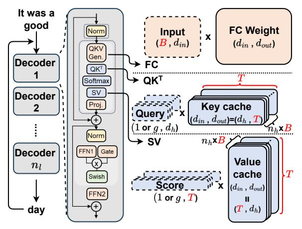
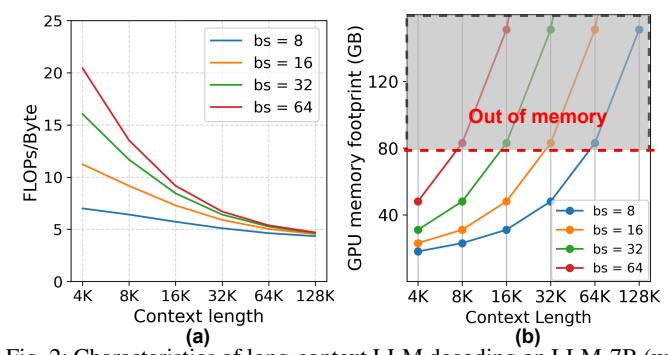

# I. INTRODUCTION

The rapid advancement of Large Language Models (LLMs) has transformed fields ranging from natural language processing to intelligent agents by enabling the generation of contextually relevant responses across diverse applications [9], [10], [15], [26], [53]. In particular, long-context LLMs, capable of maintaining coherence across hundreds of thousands of tokens, have significantly enhanced contextual relevance in various tasks. For instance, long document summarization [74] generates cohesive summaries from dispersed information across different sections of extensive text, while repository-level code analysis [47] extends programming assistants' capabilities to analyze entire codebases comprising thousands of lines. Furthermore, chain-of-thought (CoT) reasoning has recently

\*Equal contribution. ‡Corresponding author.

improved answer quality by leveraging multi-step contextual reasoning [9], [50], [52], [70].

As these LLMs continue to expand — some models exceeding 1T parameters and context windows of 1M tokens [48], [65], [66] — the memory bandwidth and capacity are known to be the bottlenecks of overall system performance [16], [57]. Conventional accelerators such as multi-GPUs suffer from poor compute utilization since large matrix-vector (GEMV) operations with low compute intensity dominate these autoregressive decoding phases [22]. Recent work such as FlashInfer [71] and others [1]–[3] propose different frameworks to accelerate LLM on GPU-based systems through token-level parallel processing or dynamic batch-size optimization; however, their performance benefits are still bounded by GPU's limited memory bandwidth and capacity.

Recently, Processing-in-Memory (PIM) [5], [19], [36], [51] has been proposed to accelerate LLM by exploiting high internal memory bandwidth [16], [21], [54]. NeuPIMs [21] proposes an NPU+PIM heterogeneous system where NPU is leveraged for compute-intensive kernels (i.e., GEMM) while PIM is leveraged for memory-bound kernels (i.e., GEMV) to accelerate LLM inference. PIM-only systems (e.g., CENT [16]) have also been proposed as a multi-PIM node system to handle large LLMs via CXL-based memory expansion. While these prior works accelerate LLM inference with PIM, they primarily focus on relatively small input context lengths (e.g., 4K1 ). In this work, we revisit PIM for LLM inference but focus on long-context LLM (up to 1M tokens) and identify how PIM inefficiency becomes problematic as the Attention layers in decoding become a greater bottleneck with longer

1CENT does provide ablation study where they scale to 32K but the benefits of PIM decrease as sequence length increases. More importantly, this work identifies PIM inefficiency as the context length increases and maximizes overall performance from PIM.

Fig. 1: Decoding Computation for Long-Context LLM (*g*: group size of GQA [4])

TABLE I: LLM specification and the context window (CW).

|   | Model   | $n_l$ | $n_h$ | $d_h$ | $d_{in/out}$ | GQA               | Reference         | CW   |
|---|---------|-------|-------|-------|--------------|-------------------|-------------------|------|
| _ | LLM-7B  | 32    | 32    | 128   | 4K-12K       | ×                 | QWEN1.5-7B [6]    | 32K  |
|   |         |       |       |       | 4K-12K       | $\checkmark(g=4)$ | Llama3.1-8B [13]  | 128K |
| I | LLM-72B | 80    | 64    | 128   | 8K-24K       | ×                 | Qwen1.5-72B [6]   | 32K  |
|   |         |       |       |       | 8K-24K       | $\sqrt{(g=8)}$    | Llama3.1-70B [13] | 128K |

context. In long-context scenarios, PIM inefficiency arises from workload imbalance that leaves channels underutilized and from a fixed write–compute–read pipeline that creates I/O bottlenecks and stalls processing units. KV cache remains problematic in terms of PIM memory capacity but *static* memory allocation based on maximum context length becomes problematic when context length can vary significantly across workloads [7], [45], [73].

To address these limitations, we propose PIMphony, a PIM orchestrator that enables efficient data mapping and movement to improve PIM utilization through three co-designed techniques. First, unlike the conventional head-first or batchdimension partitioning approach, Token-Centric PIM Partitioning (TCP) distributes tokens across all channels within a single PIM module to ensure high utilization and loadbalancing regardless of batch size. Second, to mitigate the PIM I/O bottleneck, Dynamic PIM Command Scheduling (DCS) issues commands based on real-time data dependencies to maximally overlap computation and data movement—a capability absent in static PIM schedulers. Finally, Dynamic PIM Access (DPA) overcomes the limitations of static memory management; by embedding loop bounds and operand modifications into the command stream, it enables dynamic KV cache allocation to improve memory utilization. As a result, PIMphony achieves higher efficiency by better exploiting the high internal bandwidth of each PIM channel by balancing workloads, continuously feeding data to its MAC units, and allocating memory on-demand.

We implement PIMphony by extending an MLIR-based compiler and runtime to generate the PIM commands for both token-level partitioning and dynamic KV cache allocation. We developed custom compiler passes that detect transformer decoder patterns, generate PIM commands with

Fig. 2: Characteristics of long-context LLM decoding on LLM-7B (w/ GQA). (a) Compute intensity (FLOPs/Byte) decreases with context length. (b) GPU memory footprint grows with both context length and batch size; the dashed line marks the A100-80GB capacity.

TABLE II: Statistics of input context length.

| Statistic | LongBe | ench [7] | LV-Eval [73] |           |  |
|-----------|--------|----------|--------------|-----------|--|
|           | QMSum  | Musique  | multifieldqa | Loogle-SD |  |
| mean      | 13,966 | 16,362   | 60,780       | 50,693    |  |
| std       | 6,182  | 1,651    | 31,025       | 26,506    |  |
| max       | 30,456 | 17,917   | 119,480      | 109,221   |  |
| min       | 2,651  | 6,820    | 20,333       | 13,347    |  |

dynamic row/column indices, and handle the token-parallel mapping within each module. We also modified a cycle-accurate DRAM simulator to model PIM I/O output buffering and apply PIMphony to both a heterogeneous architecture (i.e., NeuPIMs [21]) and a PIM-only architecture (i.e., CENT [16]). Across representative long-context LLM workloads, our evaluations show up to 11.3× improvement in performance compared to state-of-the-art PIM accelerators for LLM inference.

#### II. BACKGROUND/MOTIVATION

