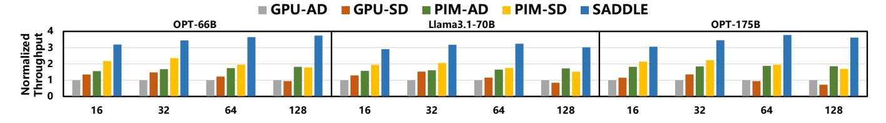
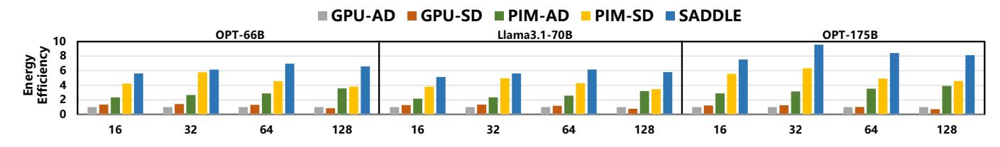

# *A. Experimental Setup*

Benchmarks. We evaluate three transformer-based LLMs as TLMs: Llama-3.1-70B-Instruct [47], OPT-66B [61], and OPT-175B [61], each paired with a corresponding DLM from the same model family: Llama-3.2-1B-Instruct, OPT-1.3B [61], and OPT-6.7B [61], respectively. The model configurations are summarized in Table I. All models use the FP16 data type, which is standard for inference tasks.

We use the Dolly dataset [7], an open-source, instructionfollowing dataset created by thousands of employees, spanning several behavior categories defined in InstructGPT [37]. To characterize system load, we vary batch sizes from 16 to 128 and set the maximum sequence length to 1024 tokens in most experiments. Due to memory constraints, the maximum sequence length for OPT-175B is limited to 512 tokens.

Baselines. We compare SADDLE against four state-ofthe-art baselines: (1) GPU-AD [2]: Autoregressive decoding using the TLM on GPUs. (2) GPU-SD [2]: Speculative decoding on GPUs. (3) PIM-AD [38]: Autoregressive decoding on a heterogeneous PIM–GPU system, using the TLM. (4) PIM-SD [22]: Speculative decoding on a heterogeneous PIM–GPU system.

The two GPU baselines are evaluated on the A100 DGX system [32], which consists of eight A100 GPUs, each with 80 GB of memory, totaling 640 GB. The system delivers an aggregate memory bandwidth of 16 TB/s. All GPU baselines are implemented using DeepSpeed Inference [2].

The two PIM baselines are based on the HBM-PIM architecture used in AttAcc [38], where each memory bank is paired with one PE. These baselines are configured with the same number of GPUs as the DGX setup and feature 40 HBM stacks, each with 16 GB of memory, also totaling 640 GB. The internal memory bandwidth is 144 TB/s—nine times that of the DGX system. For PIM-AD, attention operators are offloaded to the PIM while FC operators are executed on the GPU. For PIM-SD, we follow the operator mapping strategy of SpecPIM [22], which performs design-space exploration before execution based on the initial batch size and maximum sequence length.

Configurations. We adopt the NVIDIA A100 GPU as the centralized processor for SADDLE. All HBM modules used in our experiments are HBM3 [18], operating at 5.2 Gbps per pin. For PIM PEs, we follow the same design as in PIM-AD and PIM-SD, in which each PE is placed near an HBM bank.

To ensure a fair comparison, each SADDLE device is provisioned with five HBM stacks connected via NVLink, each offering 16 GB of memory, totaling 80 GB—matching the memory capacity of an A100 GPU. We deploy eight SADDLE PIM devices in total, resulting in an aggregate memory capacity equivalent to the PIM baselines.

For the SADDLE Manager, we provision a 1 KB Shared Pool and a 1 KB Eager Pool, with the latter subdivided by the number of micro-batches, allowing each pool to store up to 512 tokens. Additionally, a 1 KB SRAM is allocated to store logit values and cumulative acceptance probabilities.

Simulation. We develop a cycle-accurate simulator by modifying Ramulator2 [27] and ATTACC [38] to evaluate the performance and energy efficiency of both GPU systems and SADDLE. The simulator takes system configuration and model specifications as input and outputs the execution time and energy consumption for each system.

To assess area and energy overhead, we synthesize the PEs using Synopsys Design Compiler with a 28 nm technology node at a 1 GHz clock frequency. The area overhead is

Fig. 12. Throughput of SADDLE compared to four baselines across models and batch sizes (normalized to GPU-AD), highlighting SADDLE's consistent performance gains

Fig. 13. Energy efficiency of SADDLE compared to four baselines across models and batch sizes (normalized to GPU-AD), demonstrating SADDLE's consistent energy advantages

