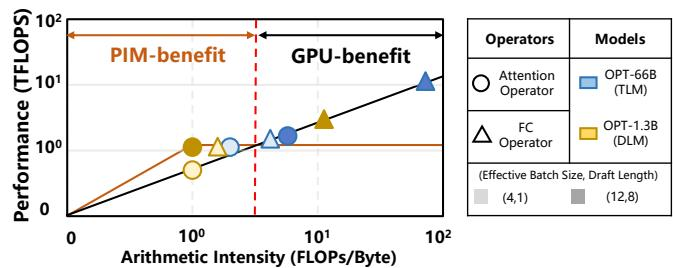
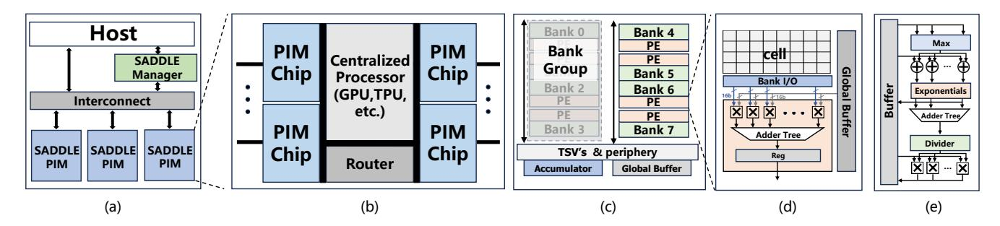
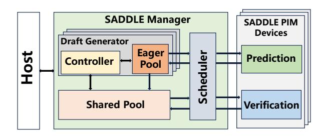
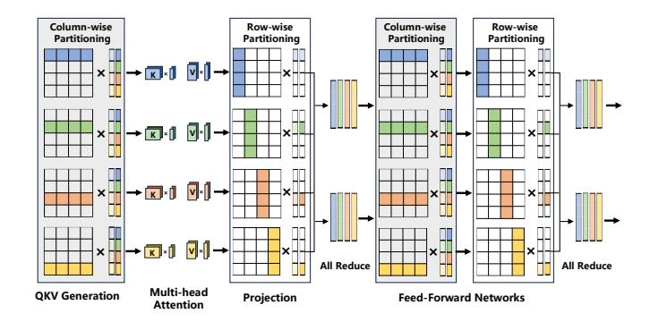
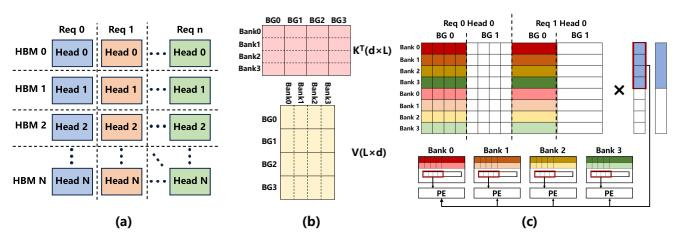

# B. Our Proposal: Adaptive Draft Sequence Length for PIM-Enabled Heterogeneous Systems

Through the above comprehensive analysis, a seemingly intuitive solution for achieving high-throughput speculative decoding is to adopt *adaptive draft sequence lengths* in existing PIM-enabled heterogeneous systems. This would enable flexible and on-demand draft token generation to mitigate redundant computation and parallelism degradation. However, realizing this goal poses three significant challenges.

First, several dynamically changing factors—such as the request task and model architecture—jointly determine the optimal draft sequence length. As shown in Figure 4(b), under the OPT-1.3B model, the three request tasks exhibit different optimal draft lengths across speculative decoding iterations. Moreover, Figure 4(c) reveals that switching from OPT-1.3B to LLaMA3-1B alters the optimal draft lengths for the same tasks and decoding iterations. These observations demonstrate that both task semantics and model choice significantly influence the optimal draft sequence length, creating a vast search space that is infeasible to exhaustively explore at runtime.

Second, using adaptive draft sequence lengths together with the inherently sequential execution of the DLM and TLM introduces severe pipeline bubbles. In standard speculative decoding, the DLM first performs d decoding iterations to generate d draft tokens per request, after which the TLM verifies all tokens in parallel. However, as illustrated in Figure 5(b), when requests in a batch have different draft lengths, those with shorter drafts must wait until the DLM completes the longest draft before verification can proceed. This synchronization introduces significant idle time, inflating the overall inference latency.

Third, dynamically varying draft lengths alter the arithmetic intensity of operators, making the static operator-to-device

Fig. 6. Roofline analysis of speculative decoding operators on OPT-66B (TLM) + OPT-1.3B (DLM) under varying draft sequence lengths and effective batch sizes. The arithmetic intensity (FLOPs/Byte) and performance (TFLOPS) of the attention and FC operators shift significantly across configurations, highlighting transitions in bottlenecks (PIM compute-bound vs. GPU bandwidth-bound) and the corresponding optimal hardware execution targets.

mappings in existing systems [38] suboptimal. To examine this effect, we conduct a roofline analysis on OPT-66B + OPT-1.3B under varying draft lengths and effective batch sizes, as shown in Figure 6. Here, *effective batch size* refers to the number of active requests at each stage of draft token generation. This number decreases as requests complete early and increases again when completed requests pass verification and resume prediction. The analysis shows that operator arithmetic intensity (FLOPs/byte) varies substantially with these parameters, thereby shifting the optimal hardware execution target. For instance, as the draft length increases from 1 to 8, the GPU outperforms PIM units for the TLM attention operator, even though the operator remains memory-bound on the GPU.

A more complex case arises when a batch starts with 12 requests, each with a distinct draft length. Once 8 shorter requests complete token generation, the effective batch size for subsequent DLM computation drops to 4. This change lowers the arithmetic intensity of the DLM's FC operator, transitioning it from GPU bandwidth-bound to PIM compute-bound. Hence, the optimal hardware target shifts from GPU to PIM. Static mappings thus result in inefficiencies, and repeatedly invoking offline remapping tools incurs high overhead, which may outweigh any gains from re-optimization.

#### IV. THE SADDLE ARCHITECTURE

In this section, we first present the overall architecture of SADDLE, then describe its workflow, and finally elaborate on its three key techniques.

#### A. Architecture Overview

Figure 7(a) illustrates the overall architecture of SADDLE, which consists of a host, a hardware manager, and multiple SADDLE PIM devices to enable end-to-end acceleration of speculative decoding with adaptive draft sequence lengths. The host communicates with the PIM devices through high-speed interconnects (e.g., CXL [45] or NVLink [33]). The hardware manager dynamically adjusts draft sequence lengths, coordinates pipeline scheduling between the DLM and TLM, and performs runtime operator scheduling. Model weights and KV caches for both the TLM and DLM reside on the

Fig. 7. Overview of the SADDLE computing system, consisting of a host, SADDLE Manager, and multiple SADDLE PIM devices interconnected via high-speed links (e.g., CXL or NVLink). (b) Architecture of a SADDLE PIM device, including a centralized processor (e.g., GPU or TPU), router, and multiple PIM chips. (c) Internal structure of a PIM chip based on the HBM-PIM architecture, showing the pseudo-channel (pCH) with PE-attached banks, global buffer, and accumulator. (d) Datapath architecture of a Processing Element (PE) supporting parallel matrix computations. (e) Specialized functional unit (SFU) for softmax and related operations such as normalization.

Fig. 8. Overview of the SADDLE Manager

PIM devices. The number of PIM devices can be scaled to accommodate varying model sizes and inference workloads.

**SADDLE Manager.** Leveraging pipeline parallelism, the SADDLE Manager assigns a *Draft Generator* to each microbatch, consisting of a *Controller* and an *Eager Pool*. As shown in Figure 8, the Manager also includes a *Shared Pool* and a *Scheduler*. The Controller adaptively adjusts the draft sequence length for each request in the batch and determines whether a request already has draft tokens undergoing verification. If not, the newly generated token is placed in the Shared Pool; otherwise, it is temporarily held in the Eager Pool. All the tokens in the Shared Pool are verified in parallel, while the Scheduler performs dynamic operator remapping to appropriate hardware resources (PIMs or GPUs) to ensure optimal execution.

**SADDLE PIM Devices.** As shown in Figure 7(b), each SADDLE PIM device consists of a centralized processor, a router, and multiple PIM chips. In our design, the centralized processor is a GPU, although other high-performance processors (e.g., TPUs) optimized for compute-intensive operators can also be used. To maximize throughput, we employ HBM-based PIM chips due to their high bandwidth. The router handles data transfers between the PIM devices.

**PIM Chips.** Each PIM chip is based on the commercial HBM-PIM architecture [20]. It comprises a buffer die stacked beneath eight DRAM dies, all vertically integrated using *through-silicon vias* (TSVs). Each DRAM die exposes eight independently operable *pseudo channels* (pCHs), and each

pCH contains four *bank groups* (BGs), with each bank group comprising four banks. Figure 7(c) illustrates a subset of a pCH, which includes a global buffer and an accumulator.

**PEs.** Each bank is paired with a dedicated PE. As illustrated in Figure 7(d), each PE consists of 16 FP16 multipliers, 16 FP16 adders, and associated registers. It processes two 256-bit operands per cycle, sourced from the bank's local row buffer and the pCH's global buffer. This architecture has been validated as feasible in prior work [38], [64]. While adding more arithmetic units could further increase bandwidth, doing so would violate HBM's stringent area and power constraints, as these units are fabricated using a DRAM process rather than a logic-optimized one. All PEs within a pCH operate in parallel across banks, thereby maximizing internal memory bandwidth.

**SFUs.** In addition to GEMV, Transformer layers involve operations such as residual addition, softmax, layer normalization, and activation functions. To support these operations, we integrate a *Specialized Functional Unit* (SFU) on the buffer die of each HBM stack, as depicted in Figure 7(e). The SFU is designed to efficiently handle these non-matrix operations, complementing the PEs and enhancing overall support for end-to-end Transformer inference.

#### B. Execution Flow and Data Mapping

As LLM parameters and KV cache sizes continue to grow, their memory demands can easily exceed the capacity of a single device. Pipeline parallelism [2], [17], [30], [56], [63] is a widely adopted technique for distributing LLM inference workloads. Following prior work [22], [30], [63], we partition PIM devices into S groups and assign model layers to S pipeline stages, each responsible for sequentially processing its assigned layers. A batch is divided into slightly more than S micro-batches—each comprising a subset of requests in the batch—to fully occupy all pipeline stages, thereby maximizing resource utilization and hiding communication overhead.

As a caveat, this pipelined execution operates on microbatches, with each stage processing one at a time. Hereafter, references to micro-batches are made in this context.

Due to the distinct computational characteristics of DLM and TLM operators in speculative decoding—along with dy-

Fig. 9. Data sharding and execution flow of the decoder. QKV and first FFN layers use column-wise partitioning, while attention projections and second FFN layers use row-wise partitioning. AllReduce consolidates intermediate results to enable parallel execution with minimal communication.

namically varying draft lengths and effective micro-batch sizes—the optimal hardware accelerator for each operator may shift at runtime. This necessitates a carefully designed data mapping scheme that encompasses both the placement of model weight parameters in memory banks and the allocation of reserved space for KV caches used in attention computations, as these caches dynamically expand with each generated token.

To maximize inference throughput, the data mapping scheme must meet three key objectives [53]. First, it should exploit data locality by co-locating weights so that activations from multiple requests in a micro-batch access the same bank or buffer, improving reuse [55]. Second, it should balance the workload by evenly assigning non-reusable operators across bank groups or pCHs, thereby improving parallelism and bandwidth utilization. Third, it should reduce inter-PIM-device communication by minimizing data migration between operators or memory banks, lowering both latency and energy.

Figure 9 illustrates SADDLE's execution flow and data mapping for the QKV and FFN layers, as detailed below.

Weight Matrix Partitioning. Weight matrices can be partitioned along rows or columns. For QKV generation, as shown in Figure 9, we apply row-wise partitioning (i.e., by attention heads) to keep each head's weights contiguous. The input dimension equals the model's hidden size  $d_{\rm model}$ , and each head generates an output of size  $d_h = d_{\rm model}/n$ , where n is the number of heads. This layout allows the QKV outputs to be directly consumed by the MHA stage, where each head computes a  $d_h$ -dimensional output vector.

In the subsequent projection step, the weight matrix is partitioned column-wise, with each partition producing a partial output vector of size  $d_{\rm model}$ . An all-reduce operation then aggregates these partial results into a complete output vector before feeding into the FFN. The FFN's two FC layers adopt a similar scheme: the first FC layer uses column-wise partitioning, while the second uses row-wise. This alternating partitioning maximizes inter-PIM-device bandwidth utilization while preserving computational continuity within each operator.

Fig. 10. Mapping strategy for the KV cache. (a) Each attention head is assigned to a specific HBM stack, with heads from different requests potentially sharing the same stack. (b)  $K^{\top}$  is partitioned column-wise at the pCH and BG levels, and row-wise at the bank level. V is partitioned row-wise at the pCH and BG levels, and column-wise at the bank level. (c) Bank-level layout and dataflow for computing attention:  $K^T$  and V matrices are partitioned across bank groups and striped across banks to balance load and maximize row buffer reuse and internal memory bandwidth. The q vector is broadcast from the global buffer to all banks in a group for parallel processing.

**KV Cache Mapping.** Figure 10(a) illustrates our KV cache mapping strategy. Each attention head is assigned to a specific HBM stack, and multiple heads from different requests may share the same stack. As attention heads operate independently, no inter-head communication is required.

 $K^T$  matrices are first partitioned column-wise across different BGs. Within each BG,  $K^T$  matrices are further striped row-wise across all banks. In contrast, V matrices are first partitioned row-wise across BGs and further striped column-wise across all banks within each BG. This partitioning strategy balances load and maximizes row buffer reuse and internal memory bandwidth.

To fully utilize peak internal bandwidth, our design maximizes row buffer usage by ensuring broad data consumption from it. Figure 10(c) illustrates an example of computing the multiplication between the q and v vectors: the q vector is broadcast from the global buffer to all banks in the bank group, enabling parallel computation across banks.

#### C. Adaptive Draft Length Adjustment

The goal of adjusting the draft sequence length for each request is to closely approximate its optimal value. However, determining this optimal length *before* the prediction stage begins is inherently difficult. Fortunately, it can be estimated *adaptively* during prediction by monitoring the cumulative probability of the generated tokens. This allows the system to decide when to halt drafting early, thereby avoiding unnecessary computation on tokens that are likely to be rejected.

Specifically, at each drafting iteration t, the Controller first computes the DLM's predicted distribution over next tokens, denoted  $P(x_t \mid x_{< t})$  and samples a token  $x_t$  from it. Let  $p_t := P(x_t \mid x_{< t})$  denote the probability of the sampled token. The cumulative probability of the current draft sequence up to step t is then computed as  $H_t = \prod_{i=1}^t p_i$ .

As the draft sequence grows, the cumulative probability  $H_t$  typically decreases. To avoid drafting tokens with low confidence, we introduce a threshold-based stopping mechanism: if  $H_t$  drops below a predefined threshold  $\tau$  after sampling a token, the Controller terminates drafting for that request.

The threshold τ is learned offline using a validation set of real-world input sequences. For each request, we run the full prediction-verification pipeline, recording Hj and the final verification outcome at each draft step j. We estimate the conditional success rate curve over Hj and identify the 20% interval that yields the highest average draft length while maintaining at least a 90% verification success rate. These empirical criteria strike a balance between throughput and correctness. A discrete grid search over this interval selects the optimal τ .

At runtime, τ can be further adjusted dynamically. Lowering τ under light system load allows longer drafts, boosting parallelism and throughput. This adaptive strategy ensures that only high-confidence tokens are produced. If a token has low probability, the resulting drop in Ht triggers early stopping, avoiding wasteful computation on likely-to-be-invalid tokens.

The Controller integrates a softmax unit, multipliers, and comparators to enable fast, low-latency decisions for dynamically determining draft lengths.

Despite the benefits of adaptive draft lengths, applying them independently to each request in a micro-batch introduces synchronization challenges. As illustrated in Figure 5(b), requests that complete drafting early are forced to idle until the slowest request finishes, delaying the transition to the verification stage. While this synchronization barrier enables more draft tokens to be verified in parallel, it also causes early-finished requests to incur additional waiting time, increasing their intertoken latency and partially offsetting the gains from adaptive drafting.

To address this issue, we introduce a cross-micro-batch *Shared Pool* for draft tokens. Rather than verifying tokens immediately after generation, each micro-batch's Draft Generator accumulates them in the Shared Pool. When the total reaches the GPU's parallel verification capacity C or the GPU becomes idle, all tokens are dispatched to the TLM for verification. This *cross-micro-batch verification* strategy improves utilization and reduces idle time. The Shared Pool leverages *Content Addressable Memory* (CAM) for efficient storage, indexing, and retrieval.

Simple requests are granted longer draft lengths, while more complex ones receive shorter lengths. This is because simple requests tend to produce high-confidence tokens that are more likely to pass verification, making it efficient to generate longer drafts for them. In contrast, complex requests are more prone to verification failures, so limiting their draft length helps avoid unnecessary computation and reduces wasted effort. The Manager adopts a greedy strategy to prioritize and verify draft tokens that are most likely to pass verification across all requests. This approach maximizes effective system throughput and prevents any single request with an excessively long draft from delaying verification for the entire micro-batch, thereby ensuring low latency and high responsiveness.

