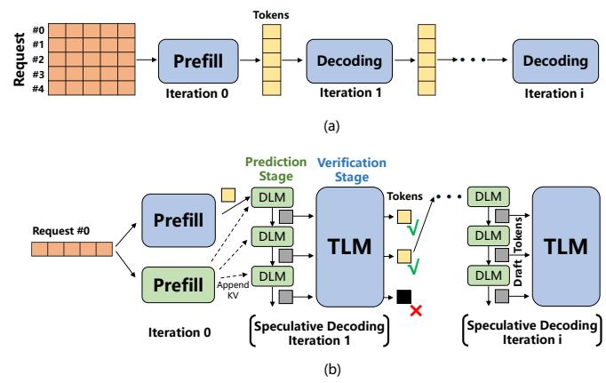
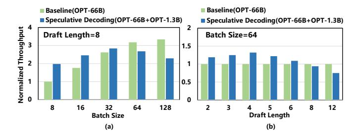
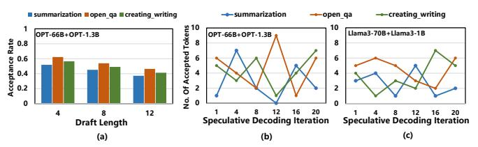
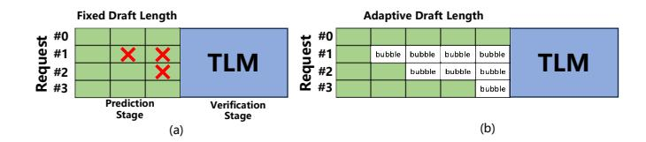

# B. Parallel Optimization Techniques in LLM Inference

In production LLM inference systems, users issue requests continuously. To overcome the low throughput of serial autoregressive decoding and ensure timely responses, two parallel optimization techniques are introduced: *batching* and *speculative decoding*. These techniques enable concurrent decoding of multiple tokens, improving overall inference throughput by generating more than one token per decoding iteration.

Fig. 2. Batching and speculative decoding in LLM inference. (a) Batching enables request-level parallelism. (b) Speculative decoding enables token-level parallelism via draft token generation (DLM) and parallel verification (TLM).

**Batching.** As illustrated in Figure 2(a), batching [1], [23], [40], [58], [63] allows a single decoding iteration to generate multiple tokens in parallel across different user requests. In the FC operator, which multiplies each token's activation vector with a shared weight matrix, batching transforms multiple GEMVs from different requests into a single *general matrix-matrix multiplication* (GEMM), enabling efficient request-level parallelism.

In the attention operator, the query vector of the current token is multiplied by a matrix composed of the key vectors from all previous tokens, followed by another matrix-vector multiplication with the corresponding value vectors. These operations require frequent access to the KV cache, and in large-batch scenarios, the resulting memory traffic can become a bottleneck, constraining LLM inference by memory bandwidth.

**Speculative Decoding.** As shown in Figure 2(b), speculative decoding [4], [24], [60] introduces a parallel decoding mechanism comprising two stages: *serial draft token generation* (prediction) and *parallel draft token verification* (verification). First, a lightweight *draft language model* (DLM) rapidly predicts the next d draft tokens through d sequential decoding iterations. These tokens are then simultaneously verified by the *target language model* (TLM), enabling *token-level parallelism*.

Draft tokens that pass verification are accepted as output. If a token is rejected, it and all subsequent draft tokens are discarded. The TLM corrects the first erroneous token and uses it as the input for the next speculative iteration. Notably, verifying multiple tokens with the TLM is only slightly slower than generating a single token with the original LLM. Thus, when draft tokens are accepted, speculative decoding can produce multiple output tokens in one iteration. Even in the worst case, it still yields one corrected token.

Specifically, during the prediction stage, the DLM iteratively generates d draft tokens  $(x_1, x_2, \ldots, x_d)$ , while in the verification stage, the TLM simultaneously computes the corresponding probabilities  $p_T(x_1), p_T(x_2), \ldots, p_T(x_d)$ . A draft token

Fig. 3. Inference throughput of SpecPIM (OPT-66B+OPT-1.3B) versus the baseline (OPT-66B) under (a) varying batch sizes (draft length = 8) and (b) varying draft lengths (batch size = 64). Throughput is normalized to the baseline. SpecPIM's throughput peaks at d=4, but degrades with longer drafts due to increased token rejection and wasted computation.

 $x_i$  is accepted if the DLM probability  $p_D(x_i)$  is less than or equal to the TLM probability  $p_T(x_i)$ ; otherwise, it is rejected with probability  $1 - \frac{p_T(x_i)}{p_D(x_i)}$  and resampled from a normalized distribution proportional to  $\max(0, p_T(x_i) - p_D(x_i))$ . Moreover, if all d draft tokens are accepted, the TLM proceeds to generate an additional token  $x_{d+1}$ , which then serves as the input for the next round of DLM prediction. This prediction-verification cycle repeats until the end-of-sequence token is produced.

#### C. PIM-Enabled Heterogeneous Systems for LLM Inference

Recent studies [15], [22], [38], [59], [64] have explored PIM-based acceleration for LLM inference. By embedding *processing elements* (PEs) within memory and offloading memory-bound operators to them, PIM leverages bank-level parallelism to deliver higher internal bandwidth and reduces data movement by transferring only the final results.

AttAcc [38] accelerates autoregressive decoding by offloading attention operators to HBM-based PIM units, while executing other operators on the GPU. NeuPIM [16] and IANUS [44] integrate NPUs with PIM units to build heterogeneous systems for LLM inference. They employ dual-buffering and PIM-aware scheduling, respectively, to enable concurrent execution across NPUs and PIM units.

SpecPIM [22] is the first PIM-enabled heterogeneous system tailored for speculative decoding. It performs offline analysis to assign different operators to either PIM units or xPUs based on the initial parameter configuration (e.g., a fixed draft sequence length) before execution and maintains the operator-to-device mapping scheme unchanged throughout inference. Invoking offline analysis to reassign operators in response to dynamic changes in configuration parameters introduces non-negligible runtime overhead, which can easily outweigh the potential performance gains from remapping.

PAPI [15] supports operator remapping in response to changes in batch size, enabling flexible hardware configurations. However, it is primarily designed for a single model—the TLM—and falls short of achieving end-to-end acceleration for speculative decoding. In particular, it does not address the idle time introduced by the sequential execution between the DLM and TLM.

Fig. 4. (a) Token acceptance rates of the OPT-66B + OPT-1.3B model pair across three task categories in the Dolly dataset under different fixed draft lengths. (b) Per-iteration distribution of accepted tokens during speculative decoding for each task category using OPT-66B + OPT-1.3B. (c) Same as (b) using LLaMA3-70B + LLaMA3-1B. The results reveal dynamic and task-specific variations in optimal draft lengths across iterations and model pairs.

#### III. MOTIVATION

In this section, we analyze speculative decoding throughput on a PIM-enabled heterogeneous system, motivating the design of our approach.

A. Bottleneck Analysis of Speculative Decoding on Existing PIM-Enabled Heterogeneous Systems

We analyze inefficiencies in existing solutions using SpecPIM [22], a state-of-the-art PIM-enabled heterogeneous system with four NVIDIA A100 GPUs, each paired with five HBM-PIM devices [38]. We adopt OPT-66B [61] as the TLM and OPT-1.3B as the DLM (denoted OPT-66B+OPT-1.3B). The baseline uses the same hardware as SpecPIM but runs conventional autoregressive decoding with OPT-66B. By default, we set the batch size to 64, draft length to 8, and use the Dolly [7] dataset for evaluation.

Figure 3(a) shows the inference throughput of SpecPIM and the baseline system under varying batch sizes. SpecPIM's throughput first increases with batch size but then decreases, and notably, falls below that of the baseline with standard autoregressive decoding when the batch size reaches 64.

The root cause of the throughput degradation lies in the fixed draft sequence length. Figure 3(b) shows SpecPIM's throughput at batch size 64 under varying draft lengths. Throughput peaks at d=4, beating the baseline by  $1.41\times$ , but degrades as d increases, falling below the baseline at d=8.

While longer draft lengths theoretically offer higher TLM parallelism, they lower token acceptance rates. As shown in Figure 4(a), acceptance rates across creative\_writing, summarization, and open\_qa drop with longer drafts, leading to more discarded tokens that waste compute and memory. Conversely, short draft lengths (e.g., d=2) produce too few tokens per prediction stage, increasing verification frequency and reducing TLM parallelism. For example, d=2 yields  $1.12\times$  lower throughput than d=4.

Moreover, while an appropriate draft length can be selected for a given batch size (e.g., d=4 in Figure 3(b)), applying the same fixed draft length to all requests in the batch results in suboptimal throughput due to wasted computation (Figure 5(a)). This inefficiency arises because, in each speculative decoding iteration—consisting of a DLM prediction stage followed by a TLM verification stage—each request has its

Fig. 5. Inefficiencies in speculative decoding pipeline designs: (a) Fixed draft lengths lead to wasted computation when draft tokens are later rejected by the TLM (marked by X); (b) A naive realization of adaptive draft length introduces pipeline bubbles due to synchronization delays when requests in the same batch have varying draft lengths.

own optimal draft length, defined as the maximum number of draft tokens that can be accepted in that iteration.

Figure 4(b) presents the optimal draft lengths across different speculative decoding iterations for three request tasks. For instance, in the creative\_writing task, the optimal draft length decreases from 5 in the first iteration to 1 by the 12th iteration. Consequently, using a fixed draft length across all requests and decoding iterations leads to either redundant computation (when the fixed value exceeds the optimal length) or reduced parallelism (when it falls short), both of which degrade overall inference efficiency.

