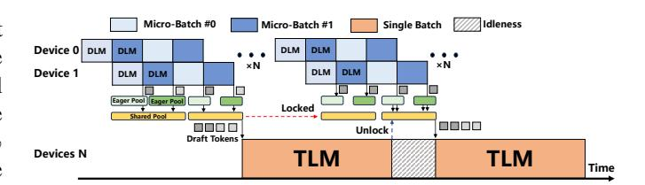

# *D. Prediction-Verification Decoupled Asynchronous Pipeline*

While our cross-micro-batch verification mechanism enhances parallelism, it may inadvertently exacerbate idle pe-

Fig. 11. Example execution timelines of synchronous pipeline

riods. Since tokens from multiple requests are aggregated into the Shared Pool, the pool can quickly reach its verification threshold after collecting only a few draft tokens per request. This premature saturation forces some requests to stop drafting earlier than optimal, limiting the depth of draft generation. For instance, a request that could ideally generate five draft tokens may be compelled to proceed to verification after producing only two, due to the Shared Pool filling up. As a result, the request fails to fully exploit its drafting potential, reducing overall efficiency.

To this end, we decouple the prediction and verification stages to break their strict sequential dependency, allowing requests to continue drafting tokens even while verification is underway. This mechanism relies on an optimistic assumption: all draft tokens currently under verification will be accepted. Based on this assumption, any new tokens generated by the DLM during the verification stage are treated as valid and will be seamlessly incorporated into the next round of TLM verification.

Figure 11 illustrates the parallel execution of DLM prediction and TLM verification. Initially, draft tokens generated for each micro-batch are directly inserted into the Shared Pool. Once the Shared Pool is full, the TLM verification is invoked to validate all draft tokens currently stored in the Shared Pool. Meanwhile, for any request whose cumulative acceptance probability Ht remains above the threshold τ , DLM prediction continues to generate new draft tokens, which are temporarily stored into the Eager Pool. After TLM verification completes, draft tokens in the Eager Pool are processed as follows. If all previously generated draft tokens of a request are accepted by the TLM, the newly generated draft tokens for that same request are migrated from the Eager Pool into the Shared Pool. In contrast, if a draft token of a request is rejected by the TLM, all newly generated draft tokens for that request are discarded, and DLM prediction is resumed using the TLM-corrected token as the new input. Note that whenever the Shared Pool is not full, newly generated draft tokens bypass the Eager Pool and are inserted directly into the Shared Pool. In this way, the DLM prediction executes concurrently with the TLM verification, minimizing idle time and improving overall hardware resource utilization. Note that draft token migration between the Shared Pool and the Eager Pool involves only lightweight on-chip memory operations and therefore incurs negligible performance overhead. Moreover, since these cached draft tokens are refreshed after each verification iteration, the required capacities of both the Eager Pool and the Shared Pool remain extremely small (∼1 KB).

