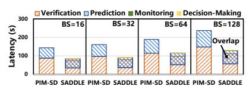
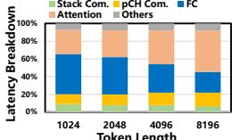
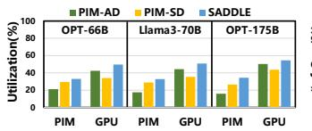
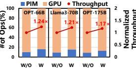

# E. Performance Discussion

Latency Breakdown. Figure 16 shows the breakdown of the end-to-end inference latency of PIM-SD and SADDLE. We observe that only 0.83% of SADDLE's end-to-end latency is spent in monitoring and decision-making. This overhead is negligible because monitoring and decision making only require a few multiplications to update  $H_t = \prod_{i=1}^t p_i$  and a simple comparison  $H_t > \tau$ , both implemented as dedicated hardware modules in the SADDLE Manager. By adaptively adjusting the draft length, redundant computation and parallelism degradation are effectively mitigated. SADDLE reduces the prediction and verification latency by  $1.18\times$  and  $1.23\times$ , respectively, compared to PIM-SD. Furthermore, the decoupled asynchronous pipeline overlaps prediction and verification, achieving  $1.73\times$  end-to-end latency reduction.

**Communication Costs.** Figure 17 breaks down the the execution time of SADDLE's TLM verification phase. We see that only 13.54% of the TLM verification time is spent in cross-pCH communication. The reasons are twofold. First, accumulators are placed on each DRAM die to locally aggregate partial results from different bank groups, thereby reducing the volume of data transmitted across pCHs. Second, the high internal memory bandwidth further mitigates communication latency. Similarly, cross-stack communication accounts for 7.51% and does not become a performance bottleneck due to the following two reasons. First, we integrate an SFU on the buffer die of each HBM stack to aggregate partial results from different pCHs, effectively minimizing cross-stack data movement volume. Second, high internal (2 TB/s intra-device) and inter-device (600 GB/s) bandwidths further hide the crossstack communication latency.

Hardware Utilization. A key contributor to SADDLE's throughput improvement is its higher hardware resource utilization across both the GPU and PIM subsystems. Figure 18 depicts the average utilization of GPU and PIM for PIM-AD, PIM-SD, and SADDLE at a batch size of 64 across three models. Compared with PIM-AD and PIM-SD, SADDLE improves the GPU utilization by  $1.13 \times$  and  $1.37 \times$ , and enhances the PIM utilization by  $1.84 \times$  and  $1.18 \times$ , respectively. These gains arise from SADDLE's asynchronous decoding pipeline, which effectively alleviates pipeline stalls.

As shown in Figure 19, without arithmetic intensity-aware operator scheduling, SADDLE executes 9.51% of operations

Fig. 16. Latency breakdown of PIM-SD and Fig. 17. The execution time Fig. 18. The PIM and GPU utiliza- Fig. 19. SADDLE

TLM verification phase

breakdown of SADDLE's tion of SADDLE and baselines across down and the throughput of SAD-

The FLOPS break-DLE without and with operator scheduling

on PIM and 90.49% on the GPU, respectively. After enabling operator scheduling, these proportions shift to 14.89% and 85.11%, yielding a 1.21× throughput improvement by fully exploiting the acceleration potential of the heterogeneous architecture.

#### F. Area Overhead

SADDLE introduces an area overhead of approximately 16.24 mm2 per DRAM die and 1.62 mm2 per buffer die in an HBM stack. Each pCH integrates 16 PEs and 4 accumulators. In a 1z-nm DRAM process [39], [43], a PE occupies  $0.116 \,\mathrm{mm}^2$  and an accumulator  $0.044 \,\mathrm{mm}^2$ . PE area is split among arithmetic units (57%), on-chip buffers (16%), and control logic (27%), while accumulator area is dominated by arithmetic. Our PE control logic is specialized for matrix-vector products, keeping it compact compared to prior PIM designs supporting general operations. Given a 121 mm2 HBM3 die, our PIM logic contributes 13.4% DRAM-die area overhead, which is comparable to prior HBM-PIM accelerators [15], [38]. Therefore, in our design, the additional computational logic does not compromise memory capacity. On the 7 nm buffer die, the softmax accelerator and its accumulator occupy 1.44 mm2 and 0.18 mm2, respectively, with most area attributed to buffering in the softmax unit.

#### VI. RELATED WORK

**ASIC-based LLM Accelerators:**  $A^3$  [13] accelerates attention by identifying key connections and applying top-k approximation to handle long sequences. SpAtten [49] optimizes different Transformer stages using cascaded tokens, head pruning, and progressive quantization to exploit token/head sparsity and quantization. Sanger [26] predicts sparse attention with low-precision computation and improves hardware efficiency via pack and split methods. ELSA [14] computes input hashes at runtime to find the most similar keys based on hash distance and restricts attention to these pairs. DOTA [41] introduces a dynamic sparse attention predictor that learns attention weight patterns via an approximate detector. These approaches reduce attention computation via sparsification (e.g., top-k, head pruning), low-precision quantization, hashbased filtering, and dynamic sparsity prediction. However, as they target only the attention layer, they struggle to deliver high end-to-end speedups under large batch sizes.

PIM-based LLM Accelerators: PIM brings compute kernels like GEMV and attention closer to DRAM banks, reducing off-chip transfers and latency. With processing elements near memory arrays, PIM leverages on-chip bandwidth far exceeding that of standard DRAM channels, making it ideal for memory-bound workloads like autoregressive decoding, where KV cache size scales with context length and batch size. TransPIM [64] pioneers memory-centric transformer inference by placing QKV tiles in adjacent banks and computing attention entirely in DRAM, while offloading softmax and residual paths to the host via an interposer. CENT [11] links CXL-attached PIM modules in a GPU-free fabric, promoting modular near-bank compute with memory expansion as a cost-effective scaling strategy. However, PIM-only designs fall short in accelerating compute-bound FC layers.

PIM-Enabled Heterogeneous Systems for LLM Inference: AttAcc [38] offloads attention to HBM-PIM while retaining FC operators on the GPU, aligning operator placement with bandwidth and compute demands to support batched generation. IANUS [44] combines an NPU and PIM behind a shared memory fabric, avoiding explicit copies but limiting concurrency between normal accesses and PIM execution, favoring low-latency over throughput. SpecPIM [22] addresses speculative decoding via offline scheduling using genetic algorithms and Monte Carlo Tree Search to optimize task placement per batch size and draft length, though it lacks adaptability at runtime. PAPI [15] dynamically profiles operator intensity and reallocates workloads between GPU and PIM to minimize idle time as decoding progresses. These systems highlight the trend of dynamic scheduling based on workload behavior. SADDLE advances this line by adaptively orchestrating speculative decoding end-to-end, achieving higher throughput.

Adaptive Draft Sequence Length: The concept of adaptive draft sequence length has been explored in prior work [28], [50]. Disco [28] employs a lightweight classifier to decide, after generating each draft token, whether to continue drafting or switch to verification. OPT-Tree [50], under a given node budget, performs a stepwise greedy search to construct an optimal draft tree that maximizes the expected accepted length. These studies demonstrate that adaptive draft length methods effectively reduce latency in single-request scenarios. However, a long-standing practical challenge lies in enabling largebatch speculative decoding. SADDLE employs a lightweight, hardware-friendly adaptive draft length method that is plugand-play and requires no additional training. More importantly, SADDLE integrates adaptive drafting with batching and introduces a novel prediction-verification decoupled asynchronous pipeline to mitigate pipeline stalls exacerbated by varying draft lengths across requests within a batch. This enables the hardware to achieve significant throughput gains with speculative decoding, rather than only reducing latency for a single batch. Advanced adaptive drafting algorithms can also be incorporated into SADDLE, as they are orthogonal and complementary to our system-level design.

