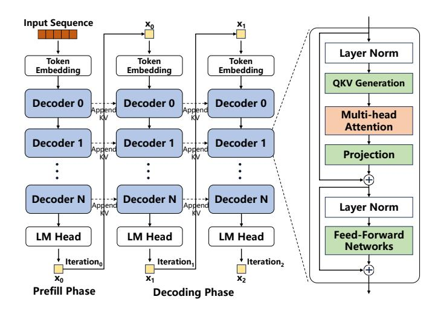

# I. INTRODUCTION

Transformer-based *large language models* (LLMs) [3], [35], [47], [62] are revolutionizing the AI application ecosystem with their exceptional generative capabilities. They are widely deployed in a range of applications, including chatbots [8], [10], [36], code auto-completion [6], [31], [54], and complex reasoning services [12], [42].

LLM inference typically consists of two phases: *prefill* and *decoding*. In the prefill phase, the model processes all input tokens in the prompt (e.g., a request sequence) to generate the first output token. In the subsequent decoding phase, the model generates one output token per iteration in an autoregressive manner, where each token generation depends on the token produced in the previous iteration. As a result, generating T output tokens requires T−1 sequential decoding steps, which leads to low throughput and underutilization of compute resources during inference.

To improve inference throughput during the decoding phase, *speculative decoding* [5], [21], [29], [46], [60] has emerged as a promising technique. It first employs a lightweight *draft language model* (DLM) to predict the next d tokens for a given request, where d is a user-defined hyperparameter known as the draft sequence length. The original LLM, referred to as the *target language model* (TLM), then verifies these d draft tokens in parallel. During verification, if a draft token is rejected by the TLM, it is replaced with the TLM's own output token, and all subsequent draft tokens are discarded. Since DLM prediction is significantly faster than TLM verification, speculative decoding can substantially improve inference throughput—provided that a high proportion of DLM-generated tokens are accepted by the TLM.

The DLM prediction and TLM verification stages in speculative decoding exhibit distinct computational characteristics. The DLM still performs autoregressive decoding, predicting one draft token per iteration through memory-intensive matrixvector multiplication operations. In contrast, the TLM verifies multiple draft tokens in parallel, relying on compute-intensive matrix-matrix multiplication operations. This computational heterogeneity has spurred research into xPU–PIM heterogeneous acceleration strategies for speculative decoding. Recent studies [16], [22], [38], [44] have explored PIM-enabled heterogeneous systems that coordinate computation-centric xPUs (e.g., GPUs and TPUs) with memory-centric PIM units (e.g., HBM-based devices with integrated PIM dies). These systems accelerate speculative decoding by statically mapping compute-intensive operators to xPUs and memory-intensive

\*Corresponding author: Qinggang Wang (qgwang@hust.edu.cn).

operators to PIM units.

However, existing PIM-enabled heterogeneous systems [15], [22] fall short of fully exploiting the acceleration potential of speculative decoding. As shown in §III, increasing the number of concurrent requests (i.e., batch size) leads to lower throughput than systems using conventional autoregressive decoding without speculative decoding. This performance degradation arises from a large number of draft tokens being discarded during the verification phase, rendering the computation spent on their generation and verification ineffective. While such redundant computation may be tolerable under small batch sizes, it becomes increasingly detrimental as the batch size grows—consuming valuable hardware resources that could otherwise be used for effective inference and ultimately resulting in a significant drop in overall throughput.

Our investigation reveals that the root cause of redundant computation in existing systems is the use of a fixed draft sequence length. In practice, *draft token acceptance rates*—the ratio of accepted to predicted tokens—vary significantly across models, datasets, and batch sizes [25], [57]. As a result, the optimal draft length should adapt dynamically at runtime. When the optimal draft length is shorter than the fixed one, the DLM generates superfluous tokens that are likely to be rejected, resulting in wasted computation and reduced inference throughput. Conversely, when the optimal draft length exceeds the fixed one, the DLM could have generated more tokens that the TLM would accept in a single verification round. However, the fixed-length constraint forces repeated interruptions of DLM prediction and incurs multiple TLM verification rounds, reducing parallelism and further degrading throughput.

To enable high-throughput speculative decoding on PIMenabled heterogeneous systems, we propose leveraging an *adaptive draft sequence length* to allow flexible, on-demand draft token generation that addresses both redundant computation and degraded parallelism. However, incorporating adaptive draft lengths introduces three key challenges.

First, determining the optimal draft sequence length is nontrivial, as it depends on dynamic factors such as the model, dataset, and input request. Identifying an appropriate length for each request on-the-fly must incur minimal runtime overhead.

Second, variable draft lengths across requests combined with the sequential execution of the DLM and TLM can lead to severe pipeline bubbles. Specifically, the TLM must wait for the DLM to complete its predictions before starting verification, and the DLM must stall until verification finishes before proceeding to the next round. Within a batch, requests with shorter draft lengths are forced to wait for those with longer ones to finish DLM prediction before triggering TLM verification, further exacerbating idle time and increasing overall inference latency.

Third, the varying draft lengths dynamically alter the arithmetic intensity of operators, making static operator-to-device mappings suboptimal. For example, SpecPIM [22] determines its operator mapping through offline analysis based on initial configuration and does not adjust during execution. When draft lengths change at runtime, such static mapping can assign compute-intensive operators to PIM units or memory-intensive operators to xPUs, resulting in inefficient execution.

This paper develops a PIM-enabled heterogeneous system for high-throughput speculative decoding that supports adaptive draft sequence lengths while mitigating the associated performance challenges. We introduce SADDLE, a PIM-enabled heterogeneous System that leverages ADaptive Draft sequence LEngths to enhance speculative decoding throughput.

SADDLE embodies three key technical innovations. First, it features a runtime adaptive draft length adjustment mechanism that dynamically tunes the draft length for each request based on its cumulative acceptance probability, thereby reducing invalid draft token generation and verification while preserving parallelism. Second, SADDLE employs an asynchronous speculative decoding pipeline that decouples DLM prediction from TLM verification to alleviate pipeline stalls. Third, it integrates an arithmetic intensity-aware operator scheduling strategy that continuously monitors operator arithmetic intensity and dynamically maps operators to the most suitable hardware units, thereby maximizing the acceleration potential of the heterogeneous architecture.

In summary, this paper makes the following contributions:

- We identify the intrinsic cause of suboptimal speculative decoding throughput in existing PIM-enabled heterogeneous systems and elucidate the key challenges these systems face when adopting adaptive draft sequence lengths.
- We propose *SADDLE*, a heterogeneous system that combines GPUs with HBM-based PIM devices to enable high-throughput speculative decoding. SADDLE dynamically adjusts the draft sequence length per request to reduce invalid token generation and verification, representing the first use of adaptive draft lengths in PIMenabled heterogeneous systems.
- SADDLE incorporates two novel mechanisms: an asynchronous speculative decoding pipeline to mitigate pipeline stalls, and an arithmetic intensity–aware operator scheduler that maximizes the acceleration potential of the heterogeneous architecture.
- We evaluate SADDLE on diverse LLM models and datasets, demonstrating that it outperforms the stateof-the-art GPU-only and GPU+PIM systems, achieving average throughput improvements of 2.88× and 1.71×, respectively.

The rest of this paper is organized as follows. §II introduces the necessary background on speculative decoding and PIMenabled heterogeneous systems. §III presents a comprehensive performance analysis of speculative decoding on a PIMenabled heterogeneous system and motivates our design. §IV details the proposed SADDLE architecture along with its three key components. §V reports and analyzes our experimental results. §VI reviews related work, and §VII concludes.

Fig. 1. Transformer-based LLM structure

#### II. BACKGROUND

In this section, we review transformer-based LLM inference, its parallelism optimizations, and PIM-enabled heterogeneous acceleration solutions.

