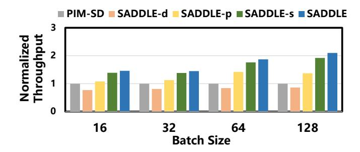
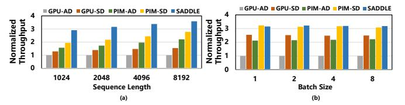

# TABLE I MODEL CONFIGURATIONS

| Model  | #Parameters | $d_{\rm model}$ | #Layers | #Heads |
|--------|-------------|-----------------|---------|--------|
| OPT    | 1.3B        | 2048            | 24      | 32     |
|        | 6.7B        | 4096            | 32      | 32     |
|        | 66B         | 9216            | 64      | 72     |
|        | 175B        | 12288           | 96      | 96     |
| Llama3 | 1B          | 2048            | 16      | 32     |
|        | 70B         | 8192            | 80      | 64     |

scaled to the DRAM process [9]. For HBM energy modeling, we reference activation and read energy values from prior work [34].

#### B. Overall Performance

**Throughput.** As shown in Figure 12, SADDLE consistently achieves the highest throughput across all workloads. Compared to GPU-AD, GPU-SD, PIM-AD, and PIM-SD, it improves average throughput by  $3.36\times$ ,  $2.88\times$ ,  $1.94\times$ , and  $1.71\times$ , respectively.

At batch sizes of 16 and 32, both GPU/PIM-SD and SADDLE outperform GPU/PIM-AD, showing that under light workloads, speculative decoding benefits from its predictive mechanism. However, as batch size increases, the performance advantage of GPU/PIM-SD over GPU/PIM-AD diminishes or even reverses. In contrast, SADDLE sustains a clear performance lead, demonstrating its effectiveness under heavier workloads. These gains arise from several factors. First, SADDLE adaptively adjusts the number of draft tokens per request at runtime, avoiding the computational waste inherent in fixed-length speculative decoding. When optimal draft lengths vary significantly across requests, this fine-grained control reduces unnecessary computation, resulting in higher effective throughput—especially evident under larger batch sizes.

Second, SADDLE mitigates the imbalance caused by variable draft lengths through cross-micro-batch verification, elim-

inating pipeline stalls between prediction and verification. This enables parallel execution of the DLM and TLM, unlocking greater acceleration potential.

Third, SADDLE dynamically maps each operator to either PIM or GPU based on its arithmetic intensity and bandwidth requirements, further boosting overall system efficiency.

Energy Efficiency. Figure 13 characterizes the energy efficiency achieved by SADDLE compared to our baselines. Specifically, SADDLE improves average energy efficiency by  $6.81\times$ ,  $5.96\times$ ,  $2.32\times$ , and  $1.45\times$  compared to GPU-AD, GPU-SD, PIM-AD, and PIM-SD, respectively. Compared to GPU-AD/SD, SADDLE offloads memory-bound operators to the PIM chip, thereby avoiding the high energy cost of frequently transferring intermediate activation matrices to GPU global memory. Relative to PIM-AD, although speculative decoding introduces additional FLOPs, overall energy consumption decreases due to significantly reduced global memory accesses. Compared to PIM-SD, SADDLE further lowers energy overhead by eliminating redundant computations for invalid tokens. In summary, the performance gains delivered by SADDLE directly translate into substantial improvements in energy efficiency.

The impact of PIM on power consumption is twofold. On the one hand, PIM substantially reduces data movement between the HBM and the GPU for memory-bound operators, thereby lowering overall device power. On the other hand, DRAM access power scales with the number of concurrently accessed banks, and bank-level parallel accesses issued by all PEs account for the majority of power consumption. In our design, the TLM attention and DLM FC operators exploit token-level and request-level data reuse to increase arithmetic intensity, thereby reducing the number of bank accesses and mitigating DRAM access power. As a result, the overall device power remains within the assumed thermal design envelope.

Fig. 14. Throughput of SADDLE (OPT-66B+OPT-1.3B) and its variants across batch sizes (normalized to PIM-SD), highlighting gains from adaptive length, shared pool, eager pool, and dynamic mapping

#### C. Ablation Analysis

To assess the contribution of each design component to overall performance, we evaluate several SADDLE variants on OPT-66B and OPT-1.3B. These include: using only the adaptive draft length strategy (SADDLE-d); combining adaptive draft length with the Shared Pool for cross-micro-batch verification (Section IV-C), while still executing the DLM and TLM sequentially (SADDLE-p); and a configuration that adds the eager pool mechanism (Section IV-D) while mapping FC operators to the GPU and attention operators (Section IV-E) to PIM (SADDLE-s). Figure 14 presents the performance of these variants, normalized to PIM-SD.

We observe that applying only adaptive draft length (SADDLE-d) results in an average throughput reduction of 1.22× compared to PIM-SD. This highlights that adaptive drafting alone does not improve performance due to interstage pipeline bubbles (Figure 5(b)) and fluctuating operator intensity (Figure 6). Introducing the Shared Pool for cross-micro-batch verification in SADDLE-p improves performance by 1.52× over SADDLE-d and by 1.25× over PIM-SD on average. Incorporating the eager pool mechanism yields an additional 1.24× speedup. Finally, SADDLE-s, which dynamically maps operators to GPUs or PIMs, achieves a further 1.13× improvement.

These results confirm each component's contribution to SADDLE's performance gains.

#### D. Sensitivity Analysis

**Sequence Length.** LLMs are trending toward longer sequence lengths to capture extended contexts. Figure 15(a) shows SADDLE's performance on Llama3.1-70B+Llama3.2-1B for decoding lengths from 1024 to 8192 with batch size 16, normalized to GPU-AD. SADDLE's advantage grows with longer sequences, as the attention layer's execution time increases due to the expanded KV cache. Offloading attention to PIM yields greater performance gains. Overall, SADDLE consistently outperforms across varying sequence lengths.

**Batch Size.** Figure 15(b) shows SADDLE's performance on OPT-66B+OPT-1.3B for small batch sizes (1, 2, 4 and 8), normalized to GPU-AD. Under light loads, SADDLE matches PIM-SD as wasted computation has minimal impact, while still

Fig. 15. Throughput sensitivity of SADDLE to (a) sequence length and (b) batch size, showing increasing gains with longer sequences and competitive performance under small batches

outperforming other baselines, demonstrating its robustness even at low system utilization.

