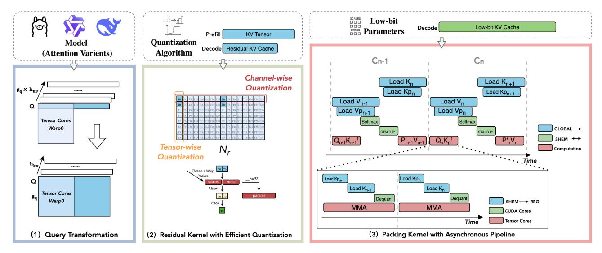

# Algorithm 1 Multi-warps Cooperative Softmax

Require:  $sTMP \in \mathbb{R}^{W_n}$  and  $sAcc \in \mathbb{R}^{T_m \times T_n}$  in SMEM. Require: Load  $Q_i \in \mathbb{R}^{T_m \times d}$  and  $K_i, V_i \in \mathbb{R}^{T_n \times d}$  to REG. 1:  $S_i = Q_i K_j^T$  where  $S_i \in \mathbb{R}^{T_m \times T_n}$ .
2:  $m_i^{new} = \max(m_i, \text{rowmax}(S_i, sTMP))$ .
3:  $P_i = \exp(S_i - m_i^{new})$  where  $P_i \in \mathbb{R}^{T_m \times T_n}$ .
4:  $sAcc = \text{tiled\_copy\_r2s}(P_i)$ .
5:  $P_i' = \text{tiled\_copy\_s2r}(sAcc)$ 6:  $O_i^{new} = P_i'V_j + \text{diag}(e^{m_i - m_i^{new}})O_i$ .

#### V. System Implementation

In this section, we describe how we implement BitDecoding, as illustrated in Fig. 7. Our implementation consists of three major components: (i) a *query transformation* component that supports diverse attention variants in LLMs; (ii) a *Residual Kernel* that performs low-cost quantization and packing while remaining general to both tensor-wise and channel-wise scaling across quantization algorithms; and (iii) a *Packing Kernel* 

Fig. 7: System overview of BitDecoding. (1) Query Transformation restructures the query tensor layout to enable efficient warp-level execution for attention variants on Tensor Cores. (2) Residual Kernel performs quantization and packing with minimal overhead, supporting both tensor-wise and channel-wise scaling. (3) Packing Kernel executes dequantization and matrix multiplication using a fine-grained, asynchronous pipeline, maximizing Tensor Cores and CUDA Cores utilization with low-bit parameters.

with a fine-grained pipeline that fully utilizes both Tensor Cores and CUDA cores. Finally, we discuss architecturespecific optimizations that leverage the advanced features of the latest GPU generations (e.g., Hopper and Blackwell) to further enhance decoding throughput.

