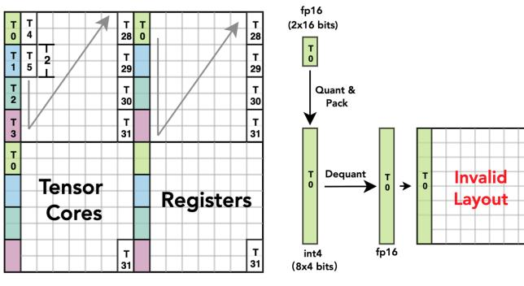
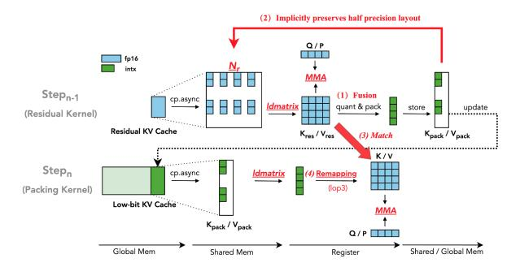

# *B. Open challenges*

Although promising, the *cooperative* use of Tensor Cores and CUDA cores for low-bit KV caches is particularly chal-

- (a) FP16 Fragment layout
- (b) Int4 Fragment layout

Fig. 3: (a) mma.m16n8k16 fragment layout for matrix B. Each thread  $(T_i)$  is assigned a specific set of values based on the instruction-defined interleaved mapping. (b) For INT4, quantization packs values contiguously per thread. After dequantization, the layout misaligns with the expected interleaved pattern.

lenging to implement for several reasons:

Challenge 1: Tensor Cores often suffer from low-bit layout mismatches. Aligning low-bit data layouts with Tensor Cores requirements is difficult, especially in autoregressive generation where KV caches expand dynamically.

At runtime, after quantization and packing, the low-bit KV cache must dequantize into a half-precision layout that matches what Tensor Cores expect. This matching is challenging for three reasons.

First, fragment layouts vary across instructions and GPU generations. After using the optimized data-movement instruction ldmatrix, the fragment residing in registers enforces a strict value-to-thread mapping. Fig. 3a illustrates the registers read by each thread (T) for mma.m16n8k16 with repeat tiling along the N dimension. However, this mapping differs from other Tensor Core instructions (e.g., mma.m16n8k8) and from Hopper's mma.m16n8k8 and mma.m64n64k16.

Second, low-precision bitwidths exacerbate alignment issues. Although Tensor Cores instructions require specific compute types, their rigid, interleaved register layout makes lower-precision data hard to match directly. Without a layout transform, the low-bit register layout becomes an invalid layout for MMA execution due to misalignment with the interleaved access patterns. As shown in Fig. 3b, two FP16 values originally computed by Thread 0 (T0) may be quantized and packed as eight consecutive low-bit values in the KV cache; after unpacking and dequantization, they no longer align with the expected Tensor Core register layout, yielding incorrect values. Even with native low-precision formats in Blackwell, hardware support remains limited, especially for the KV cache, which still depends on continuous quantization and packing; software must therefore carefully handle lowprecision values and micro-scaling factors [20].

Finally, dequantization can bottleneck execution: naive low-

Fig. 4: (a) A single warp along N for register-level operations will experience stalls due to dequantization (DQ) (b) Microlevel comparision with and without dequantization.

bit—FP16 casts are slow [14] and require a **friendly layout** to run efficiently. Prior work such as Ladder [33] and Marlin [9] mitigates mismatch for static weights by inserting separate layout-transformation kernels, but this adds substantial overhead and is unsuitable for dynamic decoding. Experimental details are given in Table II.

Challenge 2: Frequent stalls limit Tensor Cores utilization. We observe that empirically tuned warp layouts and partitioning in high-performance attention kernels often inadvertently degrade low-bit KV-cache performance.

Under FlashAttention's original warp partitioning, the additional dequantization (DQ) can substantially reduce throughput and Tensor Core utilization. As shown in Fig. 4a, FlashAttention assigns a single warp along the N dimension to perform register-level softmax and the matrix multiplication PV, with P stored in registers aligned to the Tensor Core layout. When DQ is inserted before the matmul, this strategy becomes inefficient: small warp tiles of K or V must traverse N sequentially, so DQ frequently stalls the warp. Nsight Compute profiling [21] in Fig. 4b confirms that the added DQ overhead increases memory-access stalls and depresses compute throughput and Tensor Cores utilization, consistent with prior observations [8].

Furthermore, native low-precision formats introduce their own overhead despite eliminating dequantization. Specifically, to utilize low-precision Tensor Cores for the second matrix multiplication (PV), the probability matrix P must be dynamically re-quantized after the softmax operation:  $P_{f16} = \operatorname{softmax}(Q_{f4}K_{f4}^T)$ ,  $O_{f16} = \operatorname{\mathbf{Quant}}(P_{f16})V_{f4}$ . This onthe-fly quantization creates a new computational bottleneck that can similarly stall Tensor Cores execution.

Challenge 3: Lack of generalizable system optimizations for different low-bit KV-cache methods. Popular KV-cache quantization methods use diverse scaling granularities for the Key tensor—tensor-wise [12], [37] and channel-wise [13], [18]—which complicates building a unified system that supports them all. Online quantization and packing require reductions and element-wise transforms, adding nontrivial runtime overhead. Moreover, auxiliary metadata (scale and zero-point) increases memory traffic and, without careful scheduling, disrupts the load—compute pipeline. Prior mixed-precision kernel optimizations [9], [33] target static weight quantization and

Fig. 5: Overview of methods for optimizing low-bit layout on Tensor Cores. (1) Fused computation and quantization within Tensor Cores fragments. (2) The low-bit packing data preserves FP16 values. (3) Low-bit Layout matches with the dequantized half-precision layout. (4) Layout remapping for faster dequantization.

do not generalize to the dynamic, step-by-step nature of KV caches. To date, generalizable system-level optimization techniques for high-performance, low-bit KV-cache quantization are lacking.

## IV. BITDECODING DESIGN

In this section, we present the design of BitDecoding system which realizes the cooperative use of Tensor Cores and CUDA cores in supporting low-bit KV cache. The design primarily contains (i) new methods and principles for optimizing the low-bit layout in using Tensor Cores, and (ii) new strategies for parallelizing and coordinating GPU warps that can minimize the stalls due to dequantization.

