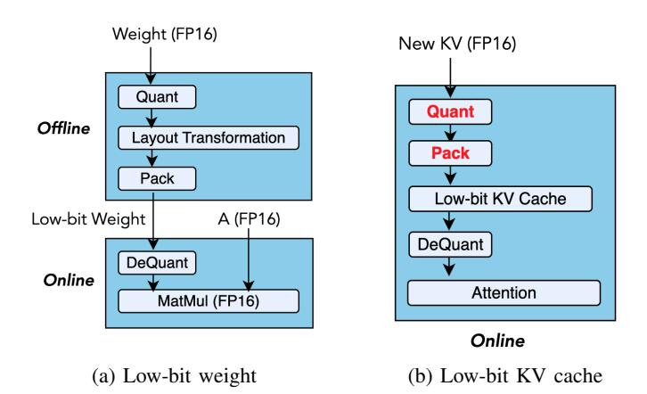

# I. INTRODUCTION

The ability of Large Language Models (LLMs) to process long contexts [7], [23], [30] has unlocked new capabilities, such as book summarization [4], multi-modal understanding [35], and test-time scaling [11], [22]. However, these advancements come with significant memory and computational challenges, primarily due to the large size of the Key-Value (KV) cache in long-context scenarios. During autoregressive decoding, LLMs must repeatedly access this growing cache for each generated token, which increases memory usage and slows down decoding. The problem worsens with larger batch sizes, as the KV cache scales linearly with the number of concurrent queries. For example, a 7B model requires approximately 14GB GPU memory for its parameters, but with a 32K context length and a batch size of 8, the KV cache alone consumes 128GB GPU memory [12], creating a significant memory bottleneck.

To address this growing bottleneck, KV cache quantization has emerged as a promising solution. By reducing the bit-width of the KV cache, quantization lowers memory overhead and improves overall efficiency. Recent quantization algorithms have shown that low-bit KV cache can retain high accuracy. QServe [16] demonstrates 4-bit KV cache improves throughput on models like LLaMA-3 and Qwen-1.5 while maintaining strong accuracy, even together with 4-bit weight and 8-bit activation. Further research [13], [18], [27] shows that 2-bit KV cache can achieve near fp16 accuracy. Kivi [18], for instance, incurs only a 0.6% accuracy drop on LongBench [3] with a 2-bit KV cache on LLaMA-2- 7B-Chat. Recent studies [29], [36] explore 1-bit quantization for KV cache, maintaining acceptable accuracy under specific conditions. These results confirm that KV cache quantization strikes an effective balance between efficiency and accuracy, making it viable for long-context LLM deployment.

*Despite the memory savings, current system support for low-bit KV cache struggles to deliver the expected speedup.* Previous implementations [16], [18], [37] remain preliminary and case-specific, with significant room for further systematic optimization. A major bottleneck lies in the overhead introduced by quantization and dequantization. Although the KV cache is low-bit, the query (Q) values and attention scores remain in high precision. This results in mixed-precision matrix multiplications (mpGEMM), which existing hardware does not natively support, requiring dequantization before multiplication. Previous mpGEMM kernels like Ladder [33] and Marlin [9] are designed for low-bit weights but cannot be directly applied to low-bit KV caches. This is because weights are *static and stored offline*, while KV caches are *dynamic and generated online*. In autoregressive decoding, each newly generated token requires quantization, packing, and dequantization of the low-bit KV cache, introducing significant overhead and complexity in GPU kernel design, as illustrated in Fig. 1.

To address this, our insight is to leverage Tensor Cores for intensive matrix multiplications while efficiently utilizing

†Work partially done during an internship at Microsoft Research.

∗Corresponding author.

Fig. 1: Comparison of mixed-precision matrix multiplication for low-bit weight and low-bit KV cache. (a) Quantized weights can be preprocessed offline. (b) KV cache requires online quantization and packing for each newly generated token.

CUDA cores for KV cache dequantization. Previous work either implemented with separated kernels or fused attention operations relied solely on CUDA cores, leaving Tensor Cores underutilized, as shown in Fig. 2. Our approach is based on three key observations: First, modern language models employ Grouped-Query Attention (GQA) and Multi-Query Attention (MQA), which share a group of keys across multiple queries, enabling Tensor Cores to accelerate dot products in the selfattention mechanism. Second, leveraging Tensor Cores can alleviate computational pressure on CUDA cores, enabling more efficient execution of low-bit operations. Finally, newer GPU architectures provide distinct mechanisms: Hopper's support for asynchronous execution and warp specialization allows low-bit operations to overlap with computation [19], while Blackwell's native support for low-precision formats (e.g., MXFP4) reduces these overheads by minimizing the need for on-the-fly data conversion.

Efficiently leveraging Tensor Cores for decoding with lowbit KV caches poses significant challenges. First, Tensor Cores require dequantized low-bit data to be aligned with highprecision formats, which is difficult in autoregressive decoding as the KV cache grows dynamically and must conform to Tensor Cores-specific layouts. Without optimized layouts, Tensor Cores may exhibit poor utilization or even produce incorrect results. Second, the high cost of dequantization can stall Tensor Cores execution, reducing GPU occupancy due to mismatched workloads between CUDA cores and Tensor Cores. Third, supporting low-bit KV caches across diverse attention mechanisms and quantization algorithms—with varying tensor-wise and channel-wise scaling—demands a general yet highly optimized implementation. Without careful design, either CUDA cores or Tensor Cores become performance bottlenecks during long-context generation.

To address the above challenges, we have designed and implemented BitDecoding, a high-performance long-context

Fig. 2: Comparison of different low-bit KV cache systems against half-precision FlashAttention. Each system follows the attention formulation Out = softmax(Q D(K′⊤)) D(V ′ ), where K′ and V ′ are low-bit quantized Key and Value tensors, and D(·) denotes the dequantization function.

LLMs inference system with low-bit KV cache. The design of BitDecoding delivers several contributions essential for exploiting Tensor Cores, including: (i) inducing low-bit optimized layouts based on hardware instructions, (ii) aligning warps with residual buffer to saturate Tensor Cores, (iii) remapping layouts for faster dequantization, and (iv) coordinating kernels for quantization and dequantization. In addition, we contribute new strategies for parallelizing GPU warps to mitigate low-bit operations overhead, including (i) efficient warp parallelism layout, and (ii) enhancing attention algorithms for fast warp synchronization leveraging the GPU memory hierarchy.

We further contribute implementation techniques in BitDecoding for LLMs inference, including: (i) a query transformation approach that enables efficient execution of diverse attention variants, allowing BitDecoding to be easily adopted in existing LLMs; (ii) a high-performance quantization kernel that supports both channel-wise and tensor-wise scaling, ensuring generality across quantization algorithms; and (iii) a dequantization kernel with a software-defined pipeline that coordinates CUDA and Tensor Cores for GEMM and dequantization, while overlapping data movement, including extra low-bit metadata; furthermore, BitDecoding incorporates architecture-specific optimizations that unlock Hopper's warpgroup tensor operations and Blackwell's native low-precision tensor formats to maximize decoding performance on the latest GPU generations.

BitDecoding is evaluated at both the kernel and endto-end levels across Blackwell, Hopper, Ada, and Ampere GPU architectures. At the kernel level, it outperforms FP16 FlashDecoding-v2 by up to 8.6× on Blackwell (e.g., RTX 5090, using native MXFP4 format support), 8.0× on Hopper, 7.5× on Ada, and 4.8× on Ampere, while surpassing QServe by up to 4.3×. At the end-to-end model level, BitDecoding reduces single-batch decoding latency by 3× on LLaMA-3.1- 8B with a 128K sequence length and achieves over 4× higher serving throughput than QServe.

