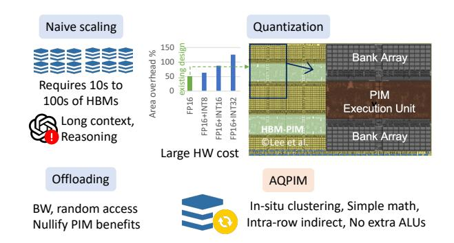
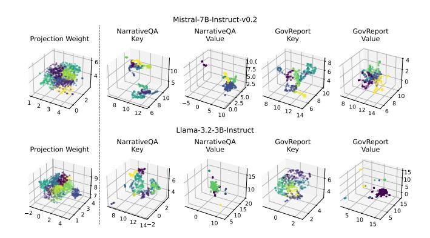
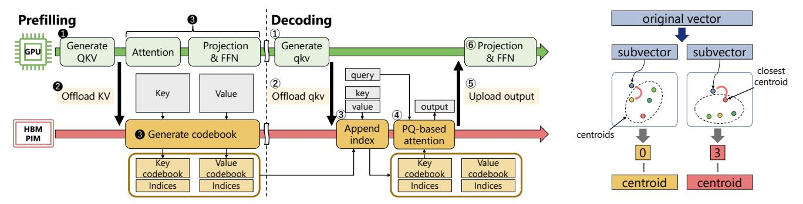
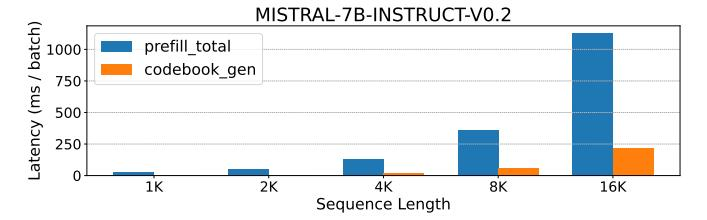
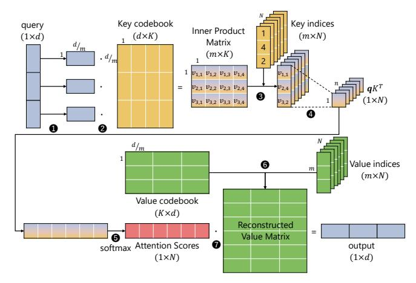
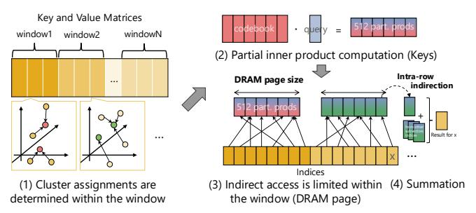
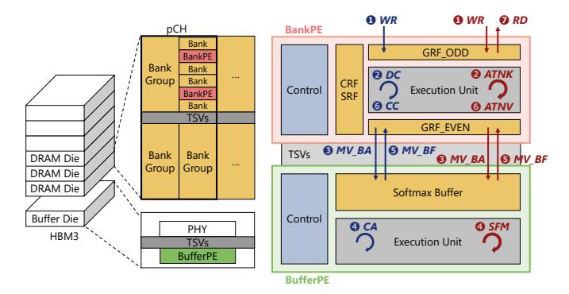
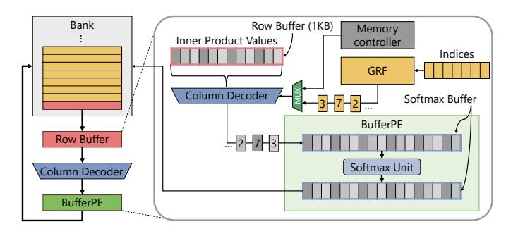
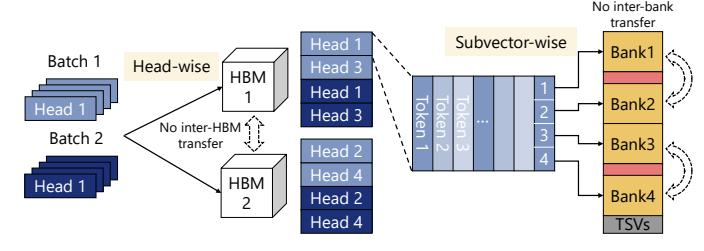

# *A. PIM Acceleration for LLM Inference*

The escalating demand for processing longer texts with LLMs has led to a significant expansion of their context window sizes. Modern models like Llama 3 [19], GPT-4o [52] and Gemini 1.5 [61] support context windows of up to 128K, 128K, and 1M tokens, respectively. This trend substantially increases the memory access demands. Furthermore, recent advancements in LLMs enable them to generate longer outputs for complex tasks such as reasoning [5], [16], [18], [62], where the model produces detailed explanatory tokens to clarify the logical process, leading to longer decoding output.

Processing long-context in LLM inference presents a critical bottleneck, particularly within the attention mechanism. Attention layers are frequently memory-bound, especially during the decoding phase. This is because each new token generation requires accessing the KV cache, which stores all previously generated tokens. As the context window grows, the KV cache size scales linearly, demanding significant memory bandwidth to fetch these large data structures for GEMV operations.

Recognizing this, prior PIM accelerators such as AttAcc! [56] and NeuPIMs [24] specifically target attention computation as the primary performance bottleneck for LLM inference, and apply PIM for memory-bound operations. AttAcc! proposes a heterogeneous system that combines the powerful computational capabilities of GPU with the high intra-memory bandwidth of PIM. NeuPIMs, on the other hand, integrates NPU with PIM, aiming to maximize concurrent processing by employing a dual row buffer architecture for simultaneous data access and a sub-batch interleaving for finegrained pipelining.

However, existing PIM architectures struggle with a critical challenge: the sheer volume of KV caches generated, particularly in long-context scenarios, which can reach hundreds of GBs. This often surpasses PIM's memory capacity, especially since *implementing bank-level PIM incurs costs that reduce memory density*. Without mitigation, this can lead to out-ofmemory (OOM) crashes, making KV cache compression or offloading crucial for ensuring efficient and scalable performance.

### *B. KV Cache Mitigation*

Several approaches have been proposed to reduce the memory footprint of the KV cache in the device memory: *eviction*, *offloading*, and *quantization*.

Eviction: Following both static [3], [8], [65], [70] and dynamic eviction strategies [1], [33], [40], [53], [74], evictionbased methods keep important tokens to enable lightweight attention computations. StreamingLLM [65] introduces a static token eviction rule that retains certain initial tokens, referred to as *sink tokens*, along with a sliding window, since these tokens tend to produce high attention scores. SnapKV [40] dynamically calculates token importance scores by aggregating recent attention scores during prefilling, and then selects the top-k tokens based on these scores, where k is the number of tokens to be retained. As a result, KV cache becomes sparse, reducing both memory usage and computational cost in the attention mechanism. However, eviction-based approaches inherently suffer from irreversible token loss, leading to accuracy degradation, particularly in long-context scenarios.

Offloading and Sparsification: To mitigate this irreversible token loss, offloading methods [44], [45], [59], [63], [72], [76] preserve the entire KV cache within the memory hierarchy, including the host's main memory and storage. To minimize the overhead of accessing low-bandwidth memory, offloading methods often employ *sparse attention*, which selects only the important tokens for attention computation, thereby reducing data transfer from low-bandwidth memory. Various approaches to vector similarity search, including PQ [72] and graphbased ANNS [44], are employed to identify important tokens, and by retrieving only a small subset of KVs from the host memory, they minimize data transfer overhead. However, these approaches suffer from the bandwidth limitation of the external memory and scattered memory access patterns. For example, NVIDIA's H100 GPU [51] has approximately 26× lower bandwidth for CPU memory access compared to that of HBM. In addition, sparse attention methods often struggle to maintain memory efficiency in Grouped-Query Attention (GQA) and Multiple-Query Attention (MQA) because the shared KV-cache requires accessing the union of KV selections from all query heads within a group, requiring high memory access [67].

Quantization: Quantization [17], [77] has been widely explored for model compression in neural networks, and has also been applied to KV cache compression [11], [23], [26], [41], [42], [47], [58], [64], [75]. It can be categorized into uniform and non-uniform quantization depending on how the original value is mapped into a quantized value.

Uniform quantization maps a real value into an integer by rounding to the nearest integer within fixed intervals. A group of integer values is multiplied by a scaling factor to align the distribution of quantized values with the original. Despite its small bandwidth requirements, it suffers from accuracy degradation, especially when applied to KV cache due to its outliers. Existing works mitigate this problem by increasing the granularity of quantization [23], [42], optimizing granularity depending on the target [47], or smoothing outliers [41], [58], [64]). In addition, achieving inference acceleration often necessitates the quantization of model weights as well, which may result in accuracy degradation.

Non-uniform quantization [26], [27], [68], [69] maps the original distribution into non-uniform datatypes. KVQuant [26] determines the datatypes by using calibration data. It minimizes the quantization error in calibration datasets to obtain optimal quantization values. M-ANT [27] introduces an adaptive numerical type that can support diverse distributions. This also leverages calibration datasets to determine the distribution of KV cache to avoid computational overhead. However, the requirement of calibration datasets potentially leads to sub-optimal performance, especially when processing inputs with different distributions.

The cluster-based approach can mitigate this problem by adjusting quantization values to match the original distribution on the fly. Rather than relying on calibration data, it directly computes quantization centroids from the input data, resulting in accuracy-optimal methods for a specified bit-width. Despite

Fig. 1: Scaling challenges of existing PIM designs for LLMs. The die photo is taken from the HBM-PIM paper [39].

its compression efficiency, it has been considered to be impractical due to the required bandwidth coming from the iterative process for centroid calculation [67]. Thus, its application is typically limited to weight-only quantization with a limited granularity of quantization [68], [69].

## *C. Motivation*

*1) The PIM Capacity Wall and Quantization Dilemma:* While PIM architectures show promise for accelerating LLM inference, they face a fundamental *capacity scaling problem*, as illustrated in Figure 1. Current PIM accelerators are primarily performance-focused, often assuming the entire KV cache fits within PIM's limited on-chip memory. This assumption quickly breaks down in long-context scenarios, where the KV cache can swell to hundreds of GBs. For instance, a SOTA accelerator like AttAcc! [56] already requires as many as 40 HBM-PIM devices to support even short contexts. This number becomes prohibitively large and economically unviable for the long-context scenarios targeted by modern LLMs.

A seemingly obvious solution—offloading the excess KV cache to the host memory hierarchy—is not a feasible remedy. The high communication overhead of traversing the PCIe bus would nullify PIM's performance gains. Furthermore, sparse attention techniques often used in conjunction with offloading introduce scattered, irregular memory access patterns that directly conflict with PIM's architectural need for data locality to achieve high utilization of its PEs.

This leads to the consideration of data compression techniques, such as quantization. However, implementing conventional quantization methods directly within PIM presents a critical dilemma. Mainstream quantization/dequantization schemes often rely on integer or mixed precision arithmetic (e.g., INT16/INT32 with FP16 [42]) and complex scaling operations. Integrating the necessary compute units for these operations into the already area-constrained bank-level PEs would incur a prohibitive area overhead. As noted in prior work [35], [39], simply adding these integer MAC units could increase the logic area from 50% (FP16 only) to as much as 126% (FP16+INT32), severely compromising memory density. Thus, simply adding new hardware to PIM is not a practical path forward.

2) Our Goals: The challenges identified above define a clear set of principles that must guide the design of a truly practical and scalable PIM-based LLM accelerator. This work introduces AQPIM, a framework built upon the following core design goals:

High-Ratio Compression with High Fidelity in PIM. The primary goal is to break the capacity wall. This requires a compression technique that can drastically reduce the KV cache footprint while preserving model accuracy. Our key insight comes from observing the fundamental properties of activations. The distribution of activations is highly context-dependent, exhibiting significant *locality and similarity*. This is visually demonstrated in Figure 2 using UMAP [49], a dimensionality reduction technique that preserves data's topological structure. As illustrated, key and value vectors exhibit a non-uniform distribution with tight clusters, unlike the more evenly distributed weight vectors. This inherent locality makes the KV cache particularly well-suited for clustering-based quantization such as Product Quantization (PQ), as clusters can naturally adapt to the underlying data distribution.

Synergistic Algorithm-Hardware Co-design. The solution must actively leverage PIM's unique strengths, not just work around its constraints. While powerful, clustering-based quantization has been considered impractical for on-the-fly use due to its massive bandwidth demand in conventional systems. Our design turns this challenge into an opportunity by repurposing PIM's large, underutilized internal bandwidth to service the demands of online clustering. This synergy makes a superior but previously inaccessible algorithm practical, achieving both high compression and high accuracy.

Efficient Computation with Minimal Area Overhead. With online clustering made feasible, the next challenge is performing attention computation without introducing significant logic to the PIM PEs. We introduce a technique to transform the expensive GEMV operations into a sequence of localized lookups and summations of centroids, which is inherently suited for the simple FP16 MAC units already present in PIM. A key advantage of our approach is that it operates directly on the compressed data, eliminating the need for a separate dequantization. The two potential bottlenecks of this approach, i.e., random lookup latency and data growth, are solved via a tight algorithmic and architectural co-design. To eliminate lookup latency, we employ a page-aware windowed clustering algorithm. This method maps tokens within a sliding context window to a compact set of centroids that are guaranteed to reside within a single DRAM row. Architecturally, we then introduce a minimal hardware enhancement (indirect addressing in the row buffer) to capitalize on this data locality, making every lookup a fast row-buffer hit. This, combined with an efficient page-aware strategy to update token indices as the context grows, makes the entire computation efficient on existing hardware.

AQPIM is the realization of these design goals, offering a comprehensive framework that enables efficient and flexible activation quantization for next-generation LLM inference on PIM architectures.

Fig. 2: Locality within the projection weights (left-most) and KV cache (right-four) visualized by UMAP [49], using Mistral-7B-Instruct-v0.2 [32] and Llama-3.2-3B-Instruct [19] running NarrativeQA [37] and GovReport [28]. We present the full results in [71].

#### III. AQPIM

#### A. Overview

This paper proposes AQPIM, an activation quantization framework utilizing PIM for efficient activation handling and attention computation in large-scale models. Leveraging PIM's high internal bandwidth, AQPIM employs an online, context-aware clustering-based quantization to compress activations. Furthermore, AQPIM uses the resulting *codebooks*, i.e., data structures originally used to reproduce vectors, directly for GEMV. This enables attention computation directly on the compressed data (without decompression) and repetitive reuse of the partial results, significantly reducing both memory foot-print and computational overhead within the PIM architecture.

Figure 3a provides an overview of AQPIM. Similar to prior work [24], [56], AQPIM leverages both the high computational power of GPUs and the high intra-memory bandwidth of PIMs. During the prefilling, GPU generates the QKV matrices and offloads KV to PIM 2. Then, GPU computes attention and processes projection and feedforward network (FFN) 3. Meanwhile, PIM generates the *codebooks* and mapping indices with key and value clustering and compression 3 in parallel with the GPU execution. During the decoding, GPU generates the qkv vectors (hereafter, vectors are expressed with lower case) 1 and sends them to PIM 2. Subsequently, PIM appends their indices 3 and computes the attention output using the compressed format 4. Finally, attention output is transferred back to the GPU 5, followed by GPU's processing projection and feedforward operations 6.

The sequential GPU-PIM processing during the decoding phase may cause GPU idling, especially when the context gets long. This is mitigated by sequence-by-sequence pipelining, where GPU generates query, key, and value vectors for each sequence and immediately offloads them to the PIM, while it proceeds to process the next sequence.

(a) AQPIM execution flow during prefilling and decoding with GPU and HBM-PIM.

(b) PQ applies clustering-based quantization.

Fig. 3: Overview of AQPIM and Product Quantization (PQ).

#### B. Product Quantization

As motivated in Section II-C, AQPIM is designed to: (a) leverage context-dependent similarity and locality through its quantization scheme, (b) achieve a balanced trade-off between compression efficiency and PIM-suitable bandwidth, (c) effectively utilize the localized memory scope of PIM, and (d) minimize both memory footprint and computation within the PIM architecture. To this end, we adopt Product Quantization (PQ) as our baseline quantization technique.

PQ is a vector quantization technique widely recognized in the approximate nearest neighbor search (ANNS) for its capacity to significantly compress high-dimensional vector data while preserving locality and similarity. As illustrated in Figure 3b, PQ has two fundamental characteristics: (1) vector splitting and (2) clustering-based quantization. (1) Vector Splitting decomposes high-dimensional vectors into smaller subvectors. This allows for parallel processing across subvector groups, effectively utilizing PIM's high parallelism and localized memory scope, while improving expressibility by combining multiple subvector spaces to reconstruct a vector. (2) Clustering-based quantization significantly reduces quantization error by exploiting similarity and locality in data distribution. PQ typically employs k-means clustering, which partitions vectors into k clusters based on the Euclidean distance. Since distance calculation for each vector is independent, this approach aligns well with the parallel processing capabilities of PIM.

Clustering has been used to *identify* important tokens in offloading-based sparse attention approaches like PQ-Cache [72] and Squeezed Attention [25], where a *full exact copy of KVs is kept at and fed from CPU*. Importantly, AQPIM *directly* uses PQ as a quantization method and KV source in PIM without the full KV copy. This eliminates the need for CPU offloading and bandwidth for KV transfers, while we observe that the naive adoption of PQ as a KV source results in a non-trivial accuracy drop. This will be addressed by our algorithmic techniques introduced in Sections III-C and III-D.

**PQ** for KV Cache Quantization: PQ's codebook generation can be a significant bottleneck when applying PQ for KV cache quantization during inference. To overcome this

Fig. 4: The latency comparison of the prefilling and the clustering process in 128 head-dimensional space.

issue, we leverage underutilized PIM resources during the prefilling stage. Figure 3a shows parallel processing of GPU and PIM. PIM generates the codebooks concurrently with GPU computation during the prefilling stage.

To keep up with the GPU's throughput, codebook generation must be completed before the GPU offloads KV of the subsequent layer. While standard k-means iterates cluster reassignment until convergence, our experiments demonstrate that just *four* iterations converge to a stable state and yield comparable accuracy, effectively hiding the clustering process behind the GPU's computations. The clustering overhead can be completely hidden regardless of sequence length, as shown in Figure 4. Given a vector PEs, while the latency for attention scales with  $N^2$ , clustering scales with  $n_{\text{centroids}}N$ , where  $n_{\text{centroids}}$  is a constant and  $n_{\text{centroids}} \ll N$ . Furthermore, peak memory usage is minimized by layer-wise codebook generation, enabling sequential compression of KV cache.

**PQ** for Efficient Attention Computation: PQ significantly optimizes attention computation by directly leveraging codebook representations. In PQ, the key cache is decomposed into a key codebook and a set of key indices. The key codebook contains centroids generated during the prefilling stage, and the key indices indicate the centroid assignment for each original token. Since our goal is to compute the inner product of the query vector and the key matrix, the reconstruction of the full key matrix can be skipped. Figure 5 illustrates this skip method. The query vector is first divided into m subvectors  $\mathbf{0}$ . Subsequently, each subvector is multiplied with its corresponding codebook's submatrix, collectively forming an inner product matrix  $\mathbf{0}$ . The key indices, indicating centroid

Fig. 5: Computation flow of PQ-based attention. Matrix multiplications are simplified by inner product matrix lookup and summation.

assignments, are then used to lookup values in the inner product matrix 3. The retrieved values are summed along the vector splitting axis **4**, which produces an approximation of the inner product  $qK^T$ . This sequence of operations **0–4** dramatically reduces the computational cost of obtaining  $qK^T$ by avoiding the explicit multiplication between the query and the full key matrix. Subsequently, the softmax function is applied to  $qK^T$  to produce the attention scores **6**. The value matrix is reconstructed using the value codebook and value indices **6**. Finally, the output vector is computed as the inner product of the attention scores and the reconstructed value matrix **1**. This method achieves substantial computational savings by replacing large-scale matrix multiplications with efficient, localized codebook lookups and summations. Our PQbased attention mechanism is orthogonal to recent techniques such as Grouped-Query Attention (GQA) and Multiple-Query Attention (MQA).

Mitigating Random Access for Efficient Lookup: A naive implementation of the inner product matrix lookup in PQ-based attention generates irregular memory accesses that lead to frequent DRAM row activations.

To address this issue, we propose a *page-aware windowed* clustering method, co-designed with intra-row indirection support in AQPIM introduced later in section III-F. The core idea is to restrict the indirect access to happen within a single DRAM row in a bank by co-locating all related inner product values.

For example, HBM-PIM architecture has 1KB row buffers in each bank, which stores 512 inner product values (in FP16 format), and we use that many centroids for a given context window so that indirection only happens within a page. Although a single window that maps the entire sequence to 512 centroids suffices for most long-context scenarios, it can be extended for more centroids. To do this, as shown in Figure 6 (1) a sequence is divided into multiple windows, and as the window advances, the previous centroids are copied to a new page and subsequently updated for the window. Then, (2)

Fig. 6: Page-aware windowed clustering.

partial inner product is computed, and (3) intra-row indirection performs lookups within a DRAM page. Since indirect access within each window is fully contained within a single row, it greatly minimizes the number of row activations, reducing it to as few as the number of windows. The partial results are then (4) summed up with partial products from different subvectors.

This approach is also extended for the value codebook, while we may loop over the value indices multiple times to accommodate the larger tensor dimensions.

#### C. Weighted Codebook Generation

Despite PQ offering potential benefits of acceleration of attention computation, just applying standard PQ to attention layers leads to substantial accuracy loss. Consequently, prior work PQCache [72] limits its use to identifying important tokens and retrieves their original KVs from CPU memory. We hypothesize that this accuracy degradation stems from PQ's inherent inability to account for the varying levels of importance among different tokens. Previous studies [65], [74] have shown that certain tokens consistently receive high attention scores. These critical tokens play a crucial role in preserving model accuracy, but the conventional PQ treats all tokens equally during quantization.

To address this problem, we propose importance-weighted k-means clustering, ensuring that tokens with higher attention scores are quantized with fewer quantization errors. We modify the k-means clustering process by incorporating attention score-based weighting, giving higher priority to tokens with greater impact on the model accuracy. First, we compute a weight vector  $\boldsymbol{w} \in \mathbb{R}^N$  from the attention score matrix  $\mathbf{S} \in \mathbb{R}^{N \times N}$ . Each weight is the sum of attention scores received from the last t tokens in the sequence:

$$\boldsymbol{w} = \operatorname{sum}(\mathbf{S}[-t:,:], \operatorname{axis} = 0), \tag{1}$$

where t is a tunable window size. The algorithm then iteratively minimizes a weighted objective function, which is the total weighted squared Euclidean distance between each token  $\boldsymbol{x}_n$  and its assigned cluster centroid  $\boldsymbol{\mu}_k$ . In each iteration, tokens are assigned to their closest centroid, and centroids are subsequently updated using a weighted average of their members:

$$\mu_k = \frac{\sum_{n \in C_k} w_n x_n}{\sum_{n \in C_k} w_n},\tag{2}$$

where  $C_k$  is the set of indices for the tokens assigned to the k-th cluster. By introducing these weights, the centroids are more influenced by tokens exhibiting high attention scores, thereby greatly reducing quantization error for these critical tokens. As a result, this approach improves accuracy retention while preserving the benefits of PQ compression.

The weights  $\boldsymbol{w}$  defined in Eq. (1) are computed on the GPU during the prefilling phase. Since the attention score  $\boldsymbol{S}$  is used in both attention and weights computations, the additional computational overhead is minimal and aligns with FlashAttention [10].

#### D. Optimization of Vector Splitting

Standard PQ splits vectors without considering inter-channel similarity, which often leads to higher quantization errors. To address this, we introduce a channel sorting preprocessing step. By grouping highly correlated channels together before partitioning, this approach creates more cohesive subvectors, thereby minimizing quantization error while maintaining the original codebook size.

Our sorting method groups channels based on cosine similarity. The process begins by randomly selecting a reference channel. The cosine similarity is then computed between this reference channel and all other channels. Based on the results, the top-k most similar channels are greedily selected to form a group. These steps are repeated m times, where m is the number of subvectors, until every channel has been assigned to one of the groups. As a result, channel vectors within each group exhibit high mutual cosine similarity. Compared to coupling contiguous channels for quantization [73], pre-sorting helps increase intra-group affinity, reducing quantization error.

This channel sorting operation can be seamlessly integrated into the projection matrices, effectively hiding any associated overhead. Following the approach of [11], we introduce static sorting matrices,  $P_k$  and  $P_v$  for the key and value vectors. The sorting matrices can be absorbed into the projection matrices. Specifically, they can be incorporated as  $W_q' = W_q P_k$ ,  $W_k' = W_k P_k$ ,  $W_v' = W_v P_v$ , and  $W_o = W_o P_v^T$ . Moreover, these sorting matrices are generated offline using a calibration dataset, such as Wikitext-2-v1 [50], thereby avoiding additional runtime overhead during inference.

#### E. System Architecture

We consider a hardware design based on HBM [31] integrated with PIM. HBM provides high memory bandwidth thanks to its 3D-stacked DRAM dies, which are interconnected via through-silicon vias (TSVs). This 3D architecture also enables high energy efficiency since data can be transferred over much shorter distances. HBM has been adopted in recent GPUs such as NVIDIA's H100 [51], making it a suitable candidate for integration with PIM.

**Execution Unit**: A key challenge in HBM-PIM design is the placement of PE, which significantly impacts throughput and energy efficiency. To address this issue, AttAcc! [56] explores PE placement in terms of peak power, throughput, energy consumption, and area overhead. Building on this analysis,

Fig. 7: AQPIM architecture and dataflow.

TABLE I: List of AQPIM operations.

| Process                   | Place    | Necessary Unit          |
|---------------------------|----------|-------------------------|
| Distance Calculation (DC) | BankPE   | ADD, MUL, SUM           |
| Cluster Assignment (CA)   | BufferPE | MIN                     |
| Centroid Calculation (CC) | Both     | MUL, SUM, DIV           |
| Attention (ATNK, ATNV)    | BankPE   | MUL, SUM                |
| Softmax (SFM)             | BufferPE | ADD, SUM, MAX, DIV, EXP |

we introduce two PE architectures: BankPE and BufferPE, as illustrated in Figure 7. BankPE is placed adjacent to the DRAM banks, leveraging the high internal bandwidth while facing strict area constraints. In contrast, BufferPE is located in the buffer die of HBM. Although it provides lower bandwidth compared to BankPE, it benefits from fewer area constraints. Moreover, BufferPE is particularly advantageous for dataintensive operations that involve inter-bank data movement, which would otherwise introduce bottlenecks in BankPEs. Importantly, we design the microarchitectures for BankPE and BufferPE based on their individual strengths and limitations. While we utilize the architectural modules based on AttAcc!, we optimize them to be well-suited for our AQPIM algorithms.

We identify the necessary computation unit for PO and attention, as shown in Table I. Distance calculation (DC), centroid calculation (CC), and attention computation (ATNK, ATNV) are not data-intensive. This motivates placing their corresponding computation units in BankPE. Moreover, since some units overlap, frequently used operations can be efficiently assigned to BankPE, minimizing its area overhead. From this perspective, ADD, MUL, and SUM units are placed in BankPE. In contrast, data-intensive operations, such as cluster assignment (CA) and softmax-related operations (SFM), are assigned to BufferPE to reduce inefficient inter-bank data transfers. This placement is also suitable because the DIV and EXP calculators consume relatively large chip area. Note that AOPIM does not introduce any specialized computation units or ALUs for quantization to area constraint BankPEs and only uses existing FP16 MAC units.

**Dataflow**: Figure 7 also illustrates the data flow for both codebook generation (blue arrows) and attention computation (red arrows). Codebook generation begins with receiving KV matrices from the GPU, which are then distributed to each BankPE ①. Each BankPE performs distance calculation (DC) ②, and the results are transmitted to the BufferPE ③. The

BufferPE then determines cluster assignments (CA) **9** and returns the assignment results to their respective banks **6**. Based on these assignments, each BankPE performs centroid calculation (CC) **6**. The BankPE computes the numerator (a weighted sum of vectors), while the BufferPE computes the reciprocal of the denominator (a sum of weights), as presented in Eq. (2). The final division is thus reduced to a single multiplication at the BankPE. Steps **9**-**6** are iteratively repeated until the codebook is ultimately generated.

The attention computation begins with the query vector being received ①. Each BankPE performs multiplication between the query and key codebook (ATNK) ②, and transfers the results to the BufferPE ③. The BufferPE then computes the softmax function (SFM) ④ and returns the results to each BankPE ⑤. Finally, each BankPE performs the final attention computation (ATNV) ⑥, sending the attention output to the GPU ⑦.

Commands: Several dedicated PIM commands are introduced on top of the AttAcc! design to control PQ-related processes. PIM\_SET\_CONFIG broadcasts the PQ configuration, including parameters such as the number of subvectors and the number of centroids. PIM\_MAC\_AB executes MAC operations in all banks. PIM\_SFM executes softmaxrelated operations within BufferPE. PIM\_RET executes row buffer retrieval explained in section III-F. In addition to computational commands, we use several data movement commands. PIM MV BA command moves data from BankPE to BufferPE, and PIM\_MV\_BF command transfers data from BufferPE back to BankPE. To manage I/O, PIM\_RD command reads the final results of attention computation from the bank, and PIM WR writes input data to the bank as the initial step of the processing. Finally, to ensure proper DRAM operation, we include system-level commands such as PIM ACT AB command, which activates DRAM rows in all banks. Although these commands are not yet implemented on HBM-PIM, they are issued through the standard HBM command path in the same manner as conventional DRAM commands.

## F. Intra-Row Indirection

Since clustering assigns arbitrary centroids, the following lookup operations during attention computation involve random access to the inner product table. To efficiently manage these irregular memory access patterns, we propose the intrarow indirection architecture, as illustrated in Figure 8. This mechanism operates as follows: First, the row storing the target (inner product) values is activated, and transfer the data into a row buffer. Then, the lookup indices stored in a general-purpose register file (GRF) are redirected to the column decoder. The column decoder then outputs the corresponding values, which are streamed through the existing datapaths to the buffer die or GRF. The BufferPE executes the subsequent softmax operation and transfers the results back to the banks.

Importantly, only a single row activation is necessary as long as the memory address scope represented by indices fits entirely within a row buffer, which is guaranteed by pageaware windowed clustering. Moreover, this mechanism incurs

Fig. 8: Intra-row indirection for efficient random access.

no significant additional area overhead, making it well-suited for BankPE, which often faces severe area constraints.

## G. Data Mapping Strategy

We design an efficient data mapping strategy to maximize PIM utilization, as illustrated in Figure 9. Attention computation is inherently parallel due to mechanisms such as MHA and GQA. In addtion, PQ's codebook is applied per head. From this, each attention head is mapped to a separate HBM. This head-wise mapping effectively eliminates unnecessary data transfers between HBMs, ensuring a high utilization even when multiple heads share a stack. Moreover, within the AQPIM framework, each head is further split into multiple subvectors. To maximize BankPEs utilization, each subvector should be assigned to a different bank. This implies that PIM utilization is maximized if  $N_{\rm subvecs} > \frac{N_{\rm banks}}{N_{\rm heads} \times N_{\rm batches}}$ . It is easy to satisfy this condition with practical LLM setups. This bankwise data mapping is realized by simply incrementing the address because AQPIM employs an address mapping scheme that utilizes the lower bits of the memory address for bank selection.

#### H. Memory Allocation

To use memory space effectively and minimize unnecessary memory remapping, the memory region in each bank must be handled properly. We utilize a simple and effective memory allocating strategy. The memory region is allocated before the prefilling phase. The codebook region is fixed and constant, and the buffer region used during prefilling is also fixed and reused for each layer. PQ indices are allocated layer by layer at the page granularity. A fixed-size PQ index region for prefilling phase is allocated between the codebook and buffer regions and overwrites the buffer region thereafter during decoding. These regions need not be dynamically reclaimed, but released at once after completion.

#### IV. EVALUATION

#### A. Experimental Setup

**Models**: We conduct experiments using two open-source LLMs: Mistral-7B-Instruct-v0.2 [32] and Llama-3.2-3B-Instruct [19]. These models have long context window sizes of 32K and 128K, respectively. We use bfloat16 for both models, which is a common format for LLM inference.

Fig. 9: Data mapping strategy. Each head is assigned to a separate HBM, and each subvector set is mapped to an individual memory bank.

Tasks: We evaluate AQPIM using LongBench [2], a widely used benchmark for long-context LLM inference. LongBench includes diverse task categories such as single- and multidocument question answering, summarization, few-shot learning, synthetic tasks, and code completion. To evaluate overall accuracy trends, we select one representative task from each of these categories for our experiments.

Baselines: We compare AQPIM with SnapKV [40], PQ-Cache [72], and SKVQ [11]. SnapKV is also a state-of-theart sparse attention method that dynamically selects tokens during inference, enabling efficient long-context processing. PQCache is an offloading method that uses PQ to identify important tokens. It offloads KV cache to CPU memory and retrieves a small number of tokens based on a maximum inner product search with PQ. SKVQ is a state-of-the-art quantization approach that reorders channels to minimize the quantization error within each quantization group.

Hyperparameters: Based on the configurations of PQ-Cache and SKVQ, we retain the first 8 tokens with full precision, which is well known as sink tokens. We adopt the same approach in AQPIM. In addition, similar to other methods, AQPIM preserves the most recent 32 tokens, referred to as sliding window tokens, with full precision. We also use these 32 (= t) tokens to calculate weight w defined in Eq. (1). AQPIM also has two key hyperparameters: the number of subvectors and the number of centroids. First, to determine the optimal number of subvectors, we conduct experiments on a subset of LongBench with Mistral-7B-Instruct-v0.2. In these experiments, we vary the number of subvectors m while keeping the number of centroids fixed at 512. As shown in Table II, using 32 subvectors achieves the best balance. Subsequently, we varied the number of centroids, observing that accuracy saturated at 512 centroids, as shown in Table III. This number of centroids (512) is also well-suited for intrarow indirection, explained in section III-F.

Online codebook update: We tried OnlinePQ [66], which progressively updates centroids at each decoding step. However, it is observed to have little impact on accuracy, even on LongBench. Moreover, in some cases, it negatively affected accuracy; for example, the average score of LongBench tasks is 0.36 points lower than that of the non-OnlinePQ configuration. Therefore, we omit OnlinePQ from our experiments.

TABLE II: Accuracy comparison across different number of subvectors m.

| Configuration | m=2   | m=4   | m=8   | m=16  | m=32  | m=64  |
|---------------|-------|-------|-------|-------|-------|-------|
| NarrativeQA   | 21.45 | 20.58 | 21.36 | 22.09 | 22.59 | 21.81 |
| HotpotQA      | 31.35 | 32.31 | 35.71 | 37.40 | 37.83 | 37.85 |
| GovReport     | 21.05 | 21.42 | 22.49 | 25.91 | 29.88 | 30.73 |
| TREC          | 51.00 | 57.00 | 65.50 | 70.00 | 71.00 | 71.00 |
| PRetrieval    | 86.35 | 87.13 | 88.81 | 88.19 | 87.69 | 86.85 |
| LCC           | 53.83 | 54.89 | 55.03 | 55.45 | 55.33 | 55.23 |
| Average       | 44.17 | 45.56 | 48.15 | 49.84 | 50.72 | 50.58 |

TABLE III: Accuracy comparison across different number of centroids K.

| Configuration | K=64  | K=128 | K=256 | K=512 | K=1024 |
|---------------|-------|-------|-------|-------|--------|
| NarrativeQA   | 23.25 | 23.09 | 21.37 | 22.59 | 21.91  |
| HotpotQA      | 37.38 | 38.08 | 38.00 | 37.83 | 38.13  |
| GovReport     | 22.99 | 25.49 | 28.53 | 29.88 | 30.74  |
| TREC          | 69.00 | 70.50 | 71.00 | 71.00 | 71.00  |
| PRetrieval    | 81.56 | 88.17 | 87.85 | 87.69 | 87.36  |
| LCC           | 54.08 | 54.66 | 55.17 | 55.33 | 55.20  |
| Average       | 48.04 | 50.00 | 50.32 | 50.72 | 50.72  |

### *B. Experiments on LongBench*

We compare the tradeoff between memory reduction ratio and accuracy of AQPIM against SnapKV, PQCache, and SKVQ. As shown in Figure 10, AQPIM achieves a comparable tradeoff across all tasks and on both models. Compared to SnapKV and SKVQ, AQPIM tends to exhibit a better tradeoff, thereby demonstrating that PQ, a clustering-based method, delivers higher quantization quality. While PQCache maintains high accuracy even under aggressive compression ratios by storing the full KV cache in CPU memory and thereby mitigating information loss, AQPIM achieves comparable accuracy up to approximately 80% compression while operating entirely within PIM memory.

