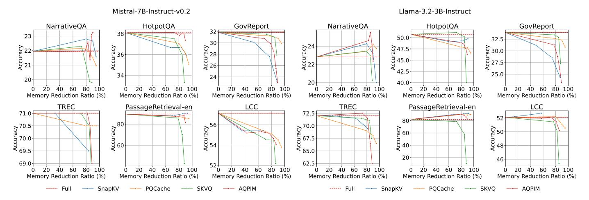
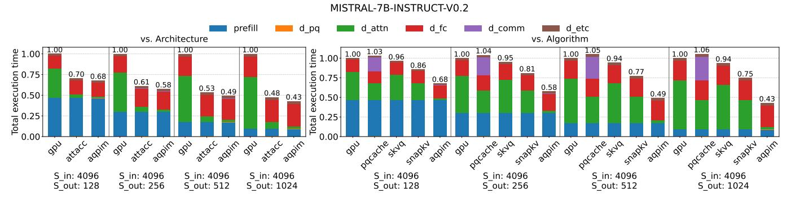
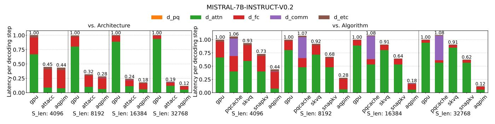
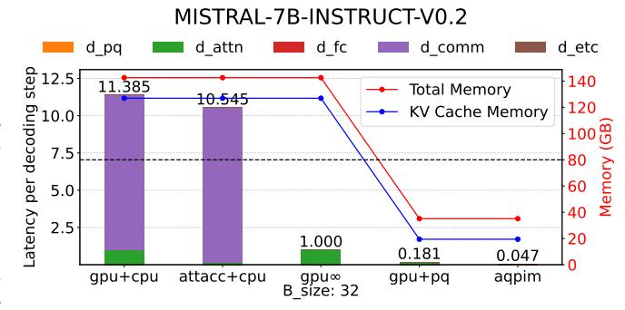
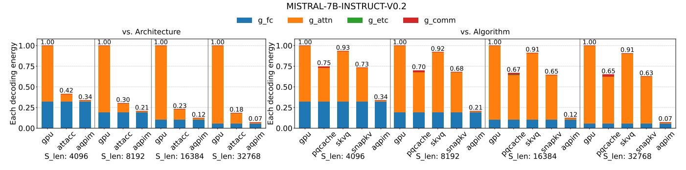
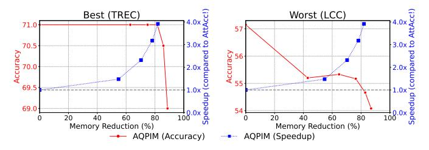

# *D. System Simulation*

Hardware configuration: We simulate the performance of the AQPIM by comparing a conventional system with GPU+HBMs, GPU+HBM-PIMs (AttAcc! [56]), GPU+AQPIM. All simulated configurations utilize NVIDIA's H100 GPUs [51]. The baseline conventional GPU+HBMs consists of 1 H100 GPU core and 5 16GB HBM modules.

Fig. 10: Memory reduction ratio vs. accuracy.

Fig. 11: Normalized total execution time comparing different architectures (left) and algorithms (right).

Fig. 12: Normalized decoding time comparing different architectures (left) and algorithms (right).

In the PIM-enabled systems (AttAcc! and AQPIM) replace 4 16GB HBMs with 4 16GB HBM-PIMs. These HBM-PIMs are allocated for KV cache storage, while the remaining HBMs are used for other data, such as model parameters. In addition, we used Intel's Xeon Platinum 8480+ Processor [30] in our experiments with CPU.

**Baselines**: We compare AQPIM against other architectures and KV cache compression methods. The architectures include GPU+HBMs and AttAcc!, while the KV cache compression methods include PQCache, SKVQ, and SnapKV. For AQPIM, we set the number of subvectors to 32 and the number of centroids to 512. For the other compression methods, we set the memory reduction ratio to 80%.

Note a key difference in assumptions: AttAcc! does not inherently address scenarios where large KV caches overflow the HBM-PIM memory. In contrast, AQPIM operates under the assumption that while the model itself can fit within memory, the full KV cache may not, thus necessitating compression. Importantly, our approach can also scale out to provide a larger memory capacity to accommodate larger models. Even when the dimensionality increases, AQPIM can scale by increasing the number of subvector sets to keep the per-codebook vector space constant. This preserves the expressive power of subvectors and codebooks while enabling scaling with the abundant bank resources.

Simulator: To evaluate these baselines, we constructed

TABLE IV: Effect of introduced PQ optimizations. Both importance-weighted clustering and channel pre-sorting contribute to accuracy improvement particularly under aggressive compression situations.

| Configuration | Standard PQ | w/o weighting | w/o pre-sort | AQPIM |
|---------------|-------------|---------------|--------------|-------|
| NarrativeQA   | 18.35       | 20.51         | 21.42        | 23.09 |
|               |             |               |              |       |
| HotpotQA      | 37.06       | 34.39         | 36.65        | 38.08 |
| GovReport     | 24.45       | 25.63         | 23.55        | 25.49 |
| TREC          | 70.65       | 70.15         | 69.65        | 70.50 |
| PRetrieval    | 61.26       | 55.49         | 86.47        | 88.17 |
| LCC           | 53.94       | 53.34         | 54.83        | 54.66 |
| Average       | 44.29       | 43.25         | 48.76        | 50.00 |

a customized GPU-PIM simulator for LLM inference, built upon the AttAcc! simulator [55]. This simulator itself is a modified version of Ramulator [20], [36], [48], adapted to simulate LLM inference. The simulator takes three inputs: system configuration, model details, and input configurations, and outputs both execution time and energy consumption.

Energy and Area: AQPIM repurposes most of the existing HBM peripherals (e.g., 1K row buffer and column decoder) and the PE designs implemented in AttAcc! [56]. The added logic for intra-row indirection, which is synthesized with the same PDK [9] and scaled with the same DRAM die density ratio as AttAcc!, is 0.0565mm2 per HBM. This is only 0.43% of BankPE area of HBM3 implementing AttAcc!. BufferPE in AttAcc! already has all the required components in Table I in their accumulators and softmax units.

Timing and energy consumption used in our simulation are based on the synthesis results reported on AttAcc!. Since the column decoder input is latched for pipelining,  $t_{\rm CCDL}$  (delay between RDs to the same BG) will not be affected by our modifications. DRAM traffic and contentions are entirely managed by DRAM controllers and modeled in our simulator.

While our tested model and algorithm employ the de facto standard bfloat16, the architecture simulation is conducted using FP16 to make it directly comparable to prior work [56]. Comparing FP16 and bfloat16 MAC implementations on HBM-PIM, the bfloat16 unit has identical latency but provides 13% smaller area and 14% better energy efficiency per operation [39]. While FP16 can still gain considerable benefits from our approaches, bfloat16 would also be a compelling option for future HBM-PIM designs.

**Scenarios & Models:** Our experiments evaluate a range of scenarios by varying input lengths, output lengths, and batch sizes. Unless otherwise specified, we use a batch size of 16. The evaluated model is Mistral-7B-Instruct-v0.2 [32].

## E. Performance

We first compare the total execution time of the different approaches. Figure 11 presents the normalized total execution time for a 4K input, varying the output length. The left graph compares the performance of GPU, AttAcc!, and AQPIM. AQPIM significantly reduces the matrix multiplication (matmul) execution time during the decoding phase. This reduction ratio increases with longer output lengths, achieving up to a  $2.33 \times$  faster overall execution time.

Fig. 13: Decomposition analysis of decoding speedups. gpu $\infty$  is a baseline that assumes infinite GPU memory capacity. Both gpu+pg and agpim utilize PQ compression.

The right graph compares PQCache, SKVQ, SnapKV, and AQPIM. All compression methods, except for AQPIM, were executed on GPU, since their designs are not primarily intended for PIM. As illustrated, PQCache experiences performance limitations due to communication overhead with CPU memory. SKVQ achieves some speedup over the GPU baseline due to the reduced data transfer, but its acceleration is limited since current GPUs do not efficiently handle quantized low bit values, often requiring upcasting to larger bit precision. SnapKV demonstrates better acceleration than other methods, but its performance gain remains considerably smaller than that of AQPIM. This is attributed to AQPIM's ability to leverage both architectural acceleration from PIM and algorithmic optimizations from PQ-based attention.

Moreover, as the output length increases, the decoding phase becomes dominant in the total execution time. Therefore, our subsequent analysis focuses solely on the decoding process.

We secondly compare the execution time of each decoding step, varying the input length. Figure 12 presents the normalized execution time per decoding step. The left graph compares different architectures, and the right graph compares algorithms. AQPIM greatly reduces matmul execution time compared to both architectures and algorithms, achieving up to an  $8.33\times$  speedup, and this effect becomes more notable as the input length increases. This is because AQPIM maintains a fixed number of centroids at 512, which fit within a DRAM row, thus ensuring a constant matmul cost. Although the retrieval cost increases with sequence length, this cost remains negligible due to our efficient intra-row indirection mechanism, as discussed in Section III-E.

We further analyze the speedup breakdown of AQPIM. In this analysis, we will also assume an imaginary GPU with infinite memory capacity ( $\mathtt{gpu}\infty$ ) to separate the contribution from GPU-CPU communication reduction of AQPIM. Figure 13 presents four evaluation scenarios:  $\mathtt{gpu+cpu}$  (GPU offloads KV cache to CPU when it overflows),  $\mathtt{gpu}\infty$  (infinite GPU memory, no offloading penalty),  $\mathtt{gpu+pq}$  (PQ compressed KV with GPU), and  $\mathtt{AQPIM}$ . Note that  $\mathtt{gpu+pq}$  does not account for PQ compression overhead incurred during prefilling, thus providing an idealistic result.

The elimination of the offloading penalty yields a per-

Fig. 14: Normalized energy for decoding comparing different architectures (left) and algorithms (right).

TABLE V: Indirection cycles (Sequenth length = 4K).

|                                     | On BankPE | On BufferPE |
|-------------------------------------|-----------|-------------|
| Key (including transfer to Softmax) | 33089     | 37185       |
| Value                               | 7373      | 181875      |

formance gain of 11.39×. This roughly aligns with the gap between GPU's memory bandwidth (3.35TB/s) and PCIe bandwidth (256GB/s). The reduced memory footprint from PQ compression contributes to an additional 5.52× speedup. This is consistent with the high data compressibility of PQ (6.53× reduction of KV capacity). Finally, AQPIM's dedicated architectural optimization yields another 3.85× speedup. While our PIM baseline, AttAcc!, offers 7.2× higher aggregated internal memory bandwidth compared to GPU (3.35TB/s), the un-accelerated operations (e.g. FFN) dominate the decoding latency of AQPIM. However, solely comparing the attention phase observes 10.33× speedup, exceeding the bandwidth gap. This happens because AQPIM can produce more data than a row with a single ACT through data reuse in row buffers during indirection.

When compared to an imaginary AttAcc! (not shown in the figure) that has infinite capacity but the same PE counts, AQPIM achieves  $3.4\times$  speedup. While the gain can be explained by the reduced KV size, it is smaller than gpu+pq's  $5.52\times$  speedup against gpu $\infty$  because AttAcc's PIM diminishes the share of attention in the total decoding time.

Lastly, we evaluate the benefits of intra-row indirection. An alternative approach is to perform gather operations on the BufferPE, transferring the entire row data. The results are summarized in Table V. While intra-row indirection at BankPEs significantly reduces off-bank data transfer, performing it on the BufferPE incurs a costly data transfer and resource contention. While the gap is narrower for Keys as they are anyway transferred to BufferPEs for softmax operations, value matrix experiences significant overhead as it necessitates unnecessary roundtrip to the BufferPE between BankPE operations.

## F. Accuracy & Speedup vs. Memory Reduction

Figure 15 analyzes the the trade-offs among accuracy, speedup, and memory reduction focusing on the attention kernel. Due to limited space, we show those with the best and worst tradeoffs. In the best-case scenario (left), AQPIM maintains high accuracy even with extreme compression, achieving

Accuracy & Speedup vs. Memory Reduction

Fig. 15: Accuracy & Speedup vs. Memory Reduction.

a significant speedup. Even in the worst case scenario, AQPIM achieve a comparable accuracy while offering a substantial speedup. Note that compression rate can be flexibly adjusted without hardware modification.

#### G. Energy Efficiency

We estimated the energy consumption across different approaches. Figure 14 presents the normalized energy consumption per decoding step, varying the input length. Regarding architectural comparisons (left), AQPIM significantly reduces the energy consumed in attention calculation. Compared to the GPU baseline, AQPIM achieves up to a 14.29× improvement in energy efficiency. In terms of algorithmic comparisons (right), AQPIM surpasses other methods in energy efficiency for "attention" components. The energy for "attention" is decreased because AQPIM utilizes a hardware-aware PQ-based attention mechanism, incorporating fixed-size matmul and row buffer retrieval mechanism.

#### V. CONCLUSION

In this work, we observe that activations exhibit both locality and similarity, derived from contextual information. Based on the trade-off between compressibility and required memory bandwidth, we propose a clustering-based approach to better exploit the underutilized capabilities of PIM. PQ, a clustering-based method, is well-suited to preserve locality. We further enhance PQ by introducing importance-aware and data-driven optimizations to maintain high accuracy while drastically reducing memory footprint. Additionally, we propose a fast attention computation mechanism that directly operates on the compressed format, enabling localized memory access patterns favorable for PIM.

### ACKNOWLEDGEMENTS

This work was supported by JSPS KAKENHI Grant Numbers JP25K03092, JP23H05489, JST BOOST Grant Number JPMJBY24G7, JST PRESTO Grant Number JPMJPR22P7, and JST ALCA-Next Grant Number JPMJAN24F3.

### REFERENCES

- [1] M. Adnan, A. Arunkumar, G. Jain, P. Nair, I. Soloveychik, and P. Kamath, "Keyformer: Kv cache reduction through key tokens selection for efficient generative inference," *Proceedings of Machine Learning and Systems*, vol. 6, pp. 114–127, 2024.
- [2] Y. Bai, X. Lv, J. Zhang, H. Lyu, J. Tang, Z. Huang, Z. Du, X. Liu, A. Zeng, L. Hou, Y. Dong, J. Tang, and J. Li, "LongBench: A bilingual, multitask benchmark for long context understanding," in *Proceedings of the 62nd Annual Meeting of the Association for Computational Linguistics (Volume 1: Long Papers)*, L.-W. Ku, A. Martins, and V. Srikumar, Eds. Bangkok, Thailand: Association for Computational Linguistics, Aug. 2024, pp. 3119–3137. [Online]. Available: https://aclanthology.org/2024.acl-long.172/
- [3] I. Beltagy, M. E. Peters, and A. Cohan, "Longformer: The longdocument transformer," *arXiv preprint arXiv:2004.05150*, 2020.
- [4] A. Bulatov, Y. Kuratov, Y. Kapushev, and M. S. Burtsev, "Scaling transformer to 1m tokens and beyond with rmt," 2024. [Online]. Available: https://arxiv.org/abs/2304.11062
- [5] W. Chen, X. Ma, X. Wang, and W. W. Cohen, "Program of thoughts prompting: Disentangling computation from reasoning for numerical reasoning tasks,(2022)," *arXiv preprint arXiv:2211.12588*, 2022.
- [6] Y.-H. Chen, T.-J. Yang, J. Emer, and V. Sze, "Eyeriss v2: A flexible accelerator for emerging deep neural networks on mobile devices," *IEEE Journal on Emerging and Selected Topics in Circuits and Systems*, vol. 9, no. 2, pp. 292–308, 2019.
- [7] P. Chi, S. Li, C. Xu, T. Zhang, J. Zhao, Y. Liu, Y. Wang, and Y. Xie, "Prime: A novel processing-in-memory architecture for neural network computation in reram-based main memory," *ACM SIGARCH Computer Architecture News*, vol. 44, no. 3, pp. 27–39, 2016.
- [8] R. Child, S. Gray, A. Radford, and I. Sutskever, "Generating long sequences with sparse transformers," *arXiv preprint arXiv:1904.10509*, 2019.
- [9] L. T. Clark, V. Vashishtha, L. Shifren, A. Gujja, S. Sinha, B. Cline, C. Ramamurthy, and G. Yeric, "Asap7: A 7-nm finfet predictive process design kit," *Microelectronics Journal*, vol. 53, pp. 105–115, 2016. [Online]. Available: https://www.sciencedirect.com/science/article/pii/ S002626921630026X
- [10] T. Dao, D. Fu, S. Ermon, A. Rudra, and C. Re, "Flashattention: ´ Fast and memory-efficient exact attention with io-awareness," in *Advances in Neural Information Processing Systems*, S. Koyejo, S. Mohamed, A. Agarwal, D. Belgrave, K. Cho, and A. Oh, Eds., vol. 35. Curran Associates, Inc., 2022, pp. 16 344–16 359. [Online]. Available: https://proceedings.neurips.cc/paper files/paper/ 2022/file/67d57c32e20fd0a7a302cb81d36e40d5-Paper-Conference.pdf
- [11] H. Duanmu, Z. Yuan, X. Li, J. Duan, X. ZHANG, and D. Lin, "SKVQ: Sliding-window key and value cache quantization for large language models," in *First Conference on Language Modeling*, 2024. [Online]. Available: https://openreview.net/forum?id=nI6JyFSnyV
- [12] C. Eckert, X. Wang, J. Wang, A. Subramaniyan, R. Iyer, D. Sylvester, D. Blaaauw, and R. Das, "Neural cache: Bit-serial in-cache acceleration of deep neural networks," in *2018 ACM/IEEE 45Th annual international symposium on computer architecture (ISCA)*. IEEE, 2018, pp. 383–396.
- [13] D. Fujiki, "Mvc: Enabling fully coherent multi-data-views through the memory hierarchy with processing in memory," in *Proceedings of the 56th Annual IEEE/ACM International Symposium on Microarchitecture*, 2023, pp. 800–814.
- [14] D. Fujiki, S. Mahlke, and R. Das, "Duality cache for data parallel acceleration," in *Proceedings of the 46th International Symposium on Computer Architecture*, 2019, pp. 397–410.
- [15] D. Fujiki, X. Wang, A. Subramaniyan, and R. Das, *In-/near-memory Computing*. Springer, 2021.
- [16] L. Gao, A. Madaan, S. Zhou, U. Alon, P. Liu, Y. Yang, J. Callan, and G. Neubig, "Pal: Program-aided language models," in *International Conference on Machine Learning*. PMLR, 2023, pp. 10 764–10 799.

- [17] A. Gholami, S. Kim, Z. Dong, Z. Yao, M. W. Mahoney, and K. Keutzer, "A survey of quantization methods for efficient neural network inference," in *Low-power computer vision*. Chapman and Hall/CRC, 2022, pp. 291–326.
- [18] Z. Gou, Z. Shao, Y. Gong, yelong shen, Y. Yang, M. Huang, N. Duan, and W. Chen, "ToRA: A tool-integrated reasoning agent for mathematical problem solving," in *The Twelfth International Conference on Learning Representations*, 2024.
- [19] A. Grattafiori, A. Dubey, A. Jauhri, A. Pandey, A. Kadian, A. Al-Dahle, A. Letman, A. Mathur, A. Schelten, A. Vaughan, A. Yang, A. Fan, A. Goyal, A. Hartshorn, A. Yang, A. Mitra, A. Sravankumar, A. Korenev, A. Hinsvark, A. Rao, A. Zhang, A. Rodriguez, A. Gregerson, A. Spataru, B. Roziere, B. Biron, B. Tang, B. Chern, C. Caucheteux, C. Nayak, C. Bi, C. Marra, C. McConnell, C. Keller, C. Touret, C. Wu, C. Wong, C. C. Ferrer, C. Nikolaidis, D. Allonsius, D. Song, D. Pintz, D. Livshits, D. Wyatt, D. Esiobu, D. Choudhary, D. Mahajan, D. Garcia-Olano, D. Perino, D. Hupkes, E. Lakomkin, E. AlBadawy, E. Lobanova, E. Dinan, E. M. Smith, F. Radenovic, F. Guzman, F. Zhang, G. Synnaeve, G. Lee, G. L. Anderson, G. Thattai, ´ G. Nail, G. Mialon, G. Pang, G. Cucurell, H. Nguyen, H. Korevaar, H. Xu, H. Touvron, I. Zarov, I. A. Ibarra, I. Kloumann, I. Misra, I. Evtimov, J. Zhang, J. Copet, J. Lee, J. Geffert, J. Vranes, J. Park, J. Mahadeokar, J. Shah, J. van der Linde, J. Billock, J. Hong, J. Lee, J. Fu, J. Chi, J. Huang, J. Liu, J. Wang, J. Yu, J. Bitton, J. Spisak, J. Park, J. Rocca, J. Johnstun, J. Saxe, J. Jia, K. V. Alwala, K. Prasad, K. Upasani, K. Plawiak, K. Li, K. Heafield, K. Stone, K. El-Arini, K. Iyer, K. Malik, K. Chiu, K. Bhalla, K. Lakhotia, L. Rantala-Yeary, L. van der Maaten, L. Chen, L. Tan, L. Jenkins, L. Martin, L. Madaan, L. Malo, L. Blecher, L. Landzaat, L. de Oliveira, M. Muzzi, M. Pasupuleti, M. Singh, M. Paluri, M. Kardas, M. Tsimpoukelli, M. Oldham, M. Rita, M. Pavlova, M. Kambadur, M. Lewis, M. Si, M. K. Singh, M. Hassan, N. Goyal, N. Torabi, N. Bashlykov, N. Bogoychev, N. Chatterji, N. Zhang, O. Duchenne, O. C¸ elebi, P. Alrassy, P. Zhang, P. Li, P. Vasic, P. Weng, P. Bhargava, P. Dubal, P. Krishnan, P. S. Koura, P. Xu, Q. He, Q. Dong, R. Srinivasan, R. Ganapathy, R. Calderer, R. S. Cabral, R. Stojnic, R. Raileanu, R. Maheswari, R. Girdhar, R. Patel, R. Sauvestre, R. Polidoro, R. Sumbaly, R. Taylor, R. Silva, R. Hou, R. Wang, S. Hosseini, S. Chennabasappa, S. Singh, S. Bell, S. S. Kim, S. Edunov, S. Nie, S. Narang, S. Raparthy, S. Shen, S. Wan, S. Bhosale, S. Zhang, S. Vandenhende, S. Batra, S. Whitman, S. Sootla, S. Collot, S. Gururangan, S. Borodinsky, T. Herman, T. Fowler, T. Sheasha, T. Georgiou, T. Scialom, T. Speckbacher, T. Mihaylov, T. Xiao, U. Karn, V. Goswami, V. Gupta, V. Ramanathan, V. Kerkez, V. Gonguet, V. Do, V. Vogeti, V. Albiero, V. Petrovic, W. Chu, W. Xiong, W. Fu, W. Meers, X. Martinet, X. Wang, X. Wang, X. E. Tan, X. Xia, X. Xie, X. Jia, X. Wang, Y. Goldschlag, Y. Gaur, Y. Babaei, Y. Wen, Y. Song, Y. Zhang, Y. Li, Y. Mao, Z. D. Coudert, Z. Yan, Z. Chen, Z. Papakipos, A. Singh, A. Srivastava, A. Jain, A. Kelsey, A. Shajnfeld, A. Gangidi, A. Victoria, A. Goldstand, A. Menon, A. Sharma, A. Boesenberg, A. Baevski, A. Feinstein, A. Kallet, A. Sangani, A. Teo, A. Yunus, A. Lupu, A. Alvarado, A. Caples, A. Gu, A. Ho, A. Poulton, A. Ryan, A. Ramchandani, A. Dong, A. Franco, A. Goyal, A. Saraf, A. Chowdhury, A. Gabriel, A. Bharambe, A. Eisenman, A. Yazdan, B. James, B. Maurer, B. Leonhardi, B. Huang, B. Loyd, B. D. Paola, B. Paranjape, B. Liu, B. Wu, B. Ni, B. Hancock, B. Wasti, B. Spence, B. Stojkovic, B. Gamido, B. Montalvo, C. Parker, C. Burton, C. Mejia, C. Liu, C. Wang, C. Kim, C. Zhou, C. Hu, C.-H. Chu, C. Cai, C. Tindal, C. Feichtenhofer, C. Gao, D. Civin, D. Beaty, D. Kreymer, D. Li, D. Adkins, D. Xu, D. Testuggine, D. David, D. Parikh, D. Liskovich, D. Foss, D. Wang, D. Le, D. Holland, E. Dowling, E. Jamil, E. Montgomery, E. Presani, E. Hahn, E. Wood, E.-T. Le, E. Brinkman, E. Arcaute, E. Dunbar, E. Smothers, F. Sun, F. Kreuk, F. Tian, F. Kokkinos, F. Ozgenel, F. Caggioni, F. Kanayet, F. Seide, G. M. Florez, G. Schwarz, G. Badeer, G. Swee, G. Halpern, G. Herman, G. Sizov, Guangyi, Zhang, G. Lakshminarayanan, H. Inan, H. Shojanazeri, H. Zou, H. Wang, H. Zha, H. Habeeb, H. Rudolph, H. Suk, H. Aspegren, H. Goldman, H. Zhan, I. Damlaj, I. Molybog, I. Tufanov, I. Leontiadis, I.-E. Veliche, I. Gat, J. Weissman, J. Geboski, J. Kohli, J. Lam, J. Asher, J.-B. Gaya, J. Marcus, J. Tang, J. Chan, J. Zhen, J. Reizenstein, J. Teboul, J. Zhong, J. Jin, J. Yang, J. Cummings, J. Carvill, J. Shepard, J. McPhie, J. Torres, J. Ginsburg, J. Wang, K. Wu, K. H. U, K. Saxena, K. Khandelwal, K. Zand, K. Matosich, K. Veeraraghavan, K. Michelena, K. Li, K. Jagadeesh,

- K. Huang, K. Chawla, K. Huang, L. Chen, L. Garg, L. A, L. Silva, L. Bell, L. Zhang, L. Guo, L. Yu, L. Moshkovich, L. Wehrstedt, M. Khabsa, M. Avalani, M. Bhatt, M. Mankus, M. Hasson, M. Lennie, M. Reso, M. Groshev, M. Naumov, M. Lathi, M. Keneally, M. Liu, M. L. Seltzer, M. Valko, M. Restrepo, M. Patel, M. Vyatskov, M. Samvelyan, M. Clark, M. Macey, M. Wang, M. J. Hermoso, M. Metanat, M. Rastegari, M. Bansal, N. Santhanam, N. Parks, N. White, N. Bawa, N. Singhal, N. Egebo, N. Usunier, N. Mehta, N. P. Laptev, N. Dong, N. Cheng, O. Chernoguz, O. Hart, O. Salpekar, O. Kalinli, P. Kent, P. Parekh, P. Saab, P. Balaji, P. Rittner, P. Bontrager, P. Roux, P. Dollar, P. Zvyagina, P. Ratanchandani, P. Yuvraj, Q. Liang, R. Alao, R. Rodriguez, R. Ayub, R. Murthy, R. Nayani, R. Mitra, R. Parthasarathy, R. Li, R. Hogan, R. Battey, R. Wang, R. Howes, R. Rinott, S. Mehta, S. Siby, S. J. Bondu, S. Datta, S. Chugh, S. Hunt, S. Dhillon, S. Sidorov, S. Pan, S. Mahajan, S. Verma, S. Yamamoto, S. Ramaswamy, S. Lindsay, S. Lindsay, S. Feng, S. Lin, S. C. Zha, S. Patil, S. Shankar, S. Zhang, S. Zhang, S. Wang, S. Agarwal, S. Sajuyigbe, S. Chintala, S. Max, S. Chen, S. Kehoe, S. Satterfield, S. Govindaprasad, S. Gupta, S. Deng, S. Cho, S. Virk, S. Subramanian, S. Choudhury, S. Goldman, T. Remez, T. Glaser, T. Best, T. Koehler, T. Robinson, T. Li, T. Zhang, T. Matthews, T. Chou, T. Shaked, V. Vontimitta, V. Ajayi, V. Montanez, V. Mohan, V. S. Kumar, V. Mangla, V. Ionescu, V. Poenaru, V. T. Mihailescu, V. Ivanov, W. Li, W. Wang, W. Jiang, W. Bouaziz, W. Constable, X. Tang, X. Wu, X. Wang, X. Wu, X. Gao, Y. Kleinman, Y. Chen, Y. Hu, Y. Jia, Y. Qi, Y. Li, Y. Zhang, Y. Zhang, Y. Adi, Y. Nam, Yu, Wang, Y. Zhao, Y. Hao, Y. Qian, Y. Li, Y. He, Z. Rait, Z. DeVito, Z. Rosnbrick, Z. Wen, Z. Yang, Z. Zhao, and Z. Ma, "The llama 3 herd of models," 2024. [Online]. Available: https://arxiv.org/abs/2407.21783
- [20] S. R. Group, "Ramulator2.0," 2023, https://github.com/CMU-SAFARI/ ramulator2.
- [21] D. Guo, D. Yang, H. Zhang, J. Song, R. Zhang, R. Xu, Q. Zhu, S. Ma, P. Wang, X. Bi *et al.*, "Deepseek-r1: Incentivizing reasoning capability in llms via reinforcement learning," *arXiv preprint arXiv:2501.12948*, 2025.
- [22] M. U. Hadi, R. Qureshi, A. Shah, M. Irfan, A. Zafar, M. B. Shaikh, N. Akhtar, J. Wu, S. Mirjalili *et al.*, "Large language models: a comprehensive survey of its applications, challenges, limitations, and future prospects," *Authorea Preprints*, vol. 1, pp. 1–26, 2023.
- [23] Y. He, L. Zhang, W. Wu, J. Liu, H. Zhou, and B. Zhuang, "Zipcache: Accurate and efficient KV cache quantization with salient token identification," in *The Thirty-eighth Annual Conference on Neural Information Processing Systems*, 2024. [Online]. Available: https://openreview.net/forum?id=5t4ZAkPiJs
- [24] G. Heo, S. Lee, J. Cho, H. Choi, S. Lee, H. Ham, G. Kim, D. Mahajan, and J. Park, "Neupims: Npu-pim heterogeneous acceleration for batched llm inferencing," in *Proceedings of the 29th ACM International Conference on Architectural Support for Programming Languages and Operating Systems, Volume 3*, ser. ASPLOS '24. New York, NY, USA: Association for Computing Machinery, 2024, p. 722–737. [Online]. Available: https://doi.org/10.1145/3620666.3651380
- [25] C. Hooper, S. Kim, H. Mohammadzadeh, M. Maheswaran, S. Zhao, J. Paik, M. W. Mahoney, K. Keutzer, and A. Gholami, "Squeezed attention: Accelerating long context length llm inference," 2025. [Online]. Available: https://arxiv.org/abs/2411.09688
- [26] C. Hooper, S. Kim, H. Mohammadzadeh, M. W. Mahoney, Y. S. Shao, K. Keutzer, and A. Gholami, "Kvquant: Towards 10 million context length llm inference with kv cache quantization," in *Advances in Neural Information Processing Systems*, A. Globerson, L. Mackey, D. Belgrave, A. Fan, U. Paquet, J. Tomczak, and C. Zhang, Eds., vol. 37. Curran Associates, Inc., 2024, pp. 1270–1303. [Online]. Available: https://proceedings.neurips.cc/paper files/paper/ 2024/file/028fcbcf85435d39a40c4d61b42c99a4-Paper-Conference.pdf
- [27] W. Hu, H. Zhang, C. Guo, Y. Feng, R. Guan, Z. Hua, Z. Liu, Y. Guan, M. Guo, and J. Leng, "M-ant: Efficient low-bit group quantization for llms via mathematically adaptive numerical type," *arXiv preprint arXiv:2502.18755*, 2025.
- [28] L. Huang, S. Cao, N. Parulian, H. Ji, and L. Wang, "Efficient attentions for long document summarization," in *Proceedings of the 2021 Conference of the North American Chapter of the Association for Computational Linguistics: Human Language Technologies*, K. Toutanova, A. Rumshisky, L. Zettlemoyer, D. Hakkani-Tur, I. Beltagy, S. Bethard, R. Cotterell, T. Chakraborty, and Y. Zhou, Eds.

- Online: Association for Computational Linguistics, Jun. 2021, pp. 1419– 1436. [Online]. Available: https://aclanthology.org/2021.naacl-main.112/
- [29] IEA. Energy and AI analysis. [Online]. Available: https://www.iea. org/reports/energy-and-ai
- [30] Intel, "Intel xeon platinum 8480+ processor," 2023, https: //www.intel.com/content/www/us/en/products/sku/231746/intel-xeonplatinum-8480-processor-105m-cache-2-00-ghz/specifications.html.
- [31] JEDEC, "High bandwidth memory dram (hbm3)," 2022.
- [32] A. Q. Jiang, A. Sablayrolles, A. Mensch, C. Bamford, D. S. Chaplot, D. de las Casas, F. Bressand, G. Lengyel, G. Lample, L. Saulnier, L. R. Lavaud, M.-A. Lachaux, P. Stock, T. L. Scao, T. Lavril, T. Wang, T. Lacroix, and W. E. Sayed, "Mistral 7b," 2023. [Online]. Available: https://arxiv.org/abs/2310.06825
- [33] H. Jiang, Y. Li, C. Zhang, Q. Wu, X. Luo, S. Ahn, Z. Han, A. Abdi, D. Li, C.-Y. Lin *et al.*, "Minference 1.0: Accelerating pre-filling for long-context llms via dynamic sparse attention," *Advances in Neural Information Processing Systems*, vol. 37, pp. 52 481–52 515, 2024.
- [34] H. Jegou, M. Douze, and C. Schmid, "Product quantization for nearest ´ neighbor search," *IEEE Transactions on Pattern Analysis and Machine Intelligence*, vol. 33, no. 1, pp. 117–128, 2011.
- [35] J. H. Kim, S.-h. Kang, S. Lee, H. Kim, W. Song, Y. Ro, S. Lee, D. Wang, H. Shin, B. Phuah *et al.*, "Aquabolt-xl: Samsung hbm2-pim with inmemory processing for ml accelerators and beyond," in *2021 IEEE Hot Chips 33 Symposium (HCS)*. IEEE, 2021, pp. 1–26.
- [36] Y. Kim, W. Yang, and O. Mutlu, "Ramulator: A fast and extensible dram simulator," *IEEE Comput. Archit. Lett.*, vol. 15, no. 1, p. 45–49, Jan. 2016. [Online]. Available: https://doi.org/10.1109/LCA.2015.2414456
- [37] T. Kocisk ˇ y, J. Schwarz, P. Blunsom, C. Dyer, K. M. Hermann, G. Melis, ´ and E. Grefenstette, "The NarrativeQA reading comprehension challenge," *Transactions of the Association for Computational Linguistics*, vol. 6, pp. 317–328, 2018. [Online]. Available: https://aclanthology.org/Q18-1023/
- [38] S. Lee, S.-h. Kang, J. Lee, H. Kim, E. Lee, S. Seo, H. Yoon, S. Lee, K. Lim, H. Shin *et al.*, "Hardware architecture and software stack for pim based on commercial dram technology: Industrial product," in *2021 ACM/IEEE 48th Annual International Symposium on Computer Architecture (ISCA)*. IEEE, 2021, pp. 43–56.
- [39] S. Lee, S.-h. Kang, J. Lee, H. Kim, E. Lee, S. Seo, H. Yoon, S. Lee, K. Lim, H. Shin, J. Kim, O. Seongil, A. Iyer, D. Wang, K. Sohn, and N. S. Kim, "Hardware architecture and software stack for pim based on commercial dram technology : Industrial product," in *2021 ACM/IEEE 48th Annual International Symposium on Computer Architecture (ISCA)*, 2021, pp. 43–56.
- [40] Y. Li, Y. Huang, B. Yang, B. Venkitesh, A. Locatelli, H. Ye, T. Cai, P. Lewis, and D. Chen, "SnapKV: LLM knows what you are looking for before generation," in *The Thirty-eighth Annual Conference on Neural Information Processing Systems*, 2024. [Online]. Available: https://openreview.net/forum?id=poE54GOq2l
- [41] H. Lin, H. Xu, Y. Wu, J. Cui, Y. Zhang, L. Mou, L. Song, Z. Sun, and Y. Wei, "Duquant: Distributing outliers via dual transformation makes stronger quantized LLMs," in *The Thirty-eighth Annual Conference on Neural Information Processing Systems*, 2024. [Online]. Available: https://openreview.net/forum?id=mp8u2Pcmqz
- [42] Y. Lin\*, H. Tang\*, S. Yang\*, Z. Zhang, G. Xiao, C. Gan, and S. Han, "Qserve: W4a8kv4 quantization and system co-design for efficient llm serving," *arXiv preprint arXiv:2405.04532*, 2024.
- [43] A. Liu, B. Feng, B. Xue, B. Wang, B. Wu, C. Lu, C. Zhao, C. Deng, C. Zhang, C. Ruan *et al.*, "Deepseek-v3 technical report," *arXiv preprint arXiv:2412.19437*, 2024.
- [44] D. Liu, M. Chen, B. Lu, H. Jiang, Z. Han, Q. Zhang, Q. Chen, C. Zhang, B. Ding, K. Zhang *et al.*, "Retrievalattention: Accelerating long-context llm inference via vector retrieval," *arXiv preprint arXiv:2409.10516*, 2024.
- [45] G. Liu, C. Li, J. Zhao, C. Zhang, and M. Guo, "Clusterkv: Manipulating llm kv cache in semantic space for recallable compression," 2024. [Online]. Available: https://arxiv.org/abs/2412.03213
- [46] Z.-G. Liu, P. N. Whatmough, Y. Zhu, and M. Mattina, "S2ta: Exploiting structured sparsity for energy-efficient mobile cnn acceleration," in *2022 IEEE International Symposium on High-Performance Computer Architecture (HPCA)*. IEEE, 2022, pp. 573–586.
- [47] Z. Liu, J. Yuan, H. Jin, S. H. Zhong, Z. Xu, V. Braverman, B. Chen, and X. Hu, "Kivi: a tuning-free asymmetric 2bit quantization for kv cache," in *Proceedings of the 41st International Conference on Machine Learning*, ser. ICML'24. JMLR.org, 2024.

- [48] H. Luo, Y. C. Tugrul, F. N. Bostancı, A. Olgun, A. G. Ya ˘ glıkc¸ı, and ˘ O. Mutlu, "Ramulator 2.0: A modern, modular, and extensible dram simulator," *IEEE Comput. Archit. Lett.*, vol. 23, no. 1, p. 112–116, Jan. 2024. [Online]. Available: https://doi.org/10.1109/LCA.2023.3333759
- [49] L. McInnes, J. Healy, and J. Melville, "Umap: Uniform manifold approximation and projection for dimension reduction," 2020. [Online]. Available: https://arxiv.org/abs/1802.03426
- [50] S. Merity, C. Xiong, J. Bradbury, and R. Socher, "Pointer sentinel mixture models," in *International Conference on Learning Representations*, 2017. [Online]. Available: https://openreview.net/ forum?id=Byj72udxe
- [51] NVIDIA, "Nvidia h100 tensor core gpu," 2024, https://arc.net/l/quote/ btwhvenw.
- [52] OpenAI, "Models," 2024, https://platform.openai.com/docs/models/gpt-4o.
- [53] M. Oren, M. Hassid, N. Yarden, Y. Adi, and R. Schwartz, "Transformers are multi-state rnns," *arXiv preprint arXiv:2401.06104*, 2024.
- [54] A. Parashar, M. Rhu, A. Mukkara, A. Puglielli, R. Venkatesan, B. Khailany, J. Emer, S. W. Keckler, and W. J. Dally, "Scnn: An accelerator for compressed-sparse convolutional neural networks," *ACM SIGARCH computer architecture news*, vol. 45, no. 2, pp. 27–40, 2017.
- [55] J. Park and J. Choi, "attacc simulator," 2024, https://github.com/scalesnu/attacc simulator.
- [56] J. Park, J. Choi, K. Kyung, M. J. Kim, Y. Kwon, N. S. Kim, and J. H. Ahn, "Attacc! unleashing the power of pim for batched transformerbased generative model inference," in *Proceedings of the 29th ACM International Conference on Architectural Support for Programming Languages and Operating Systems, Volume 2*, ser. ASPLOS '24. New York, NY, USA: Association for Computing Machinery, 2024, p. 103–119. [Online]. Available: https://doi.org/10.1145/3620665.3640422
- [57] A. Shafiee, A. Nag, N. Muralimanohar, R. Balasubramonian, J. P. Strachan, M. Hu, R. S. Williams, and V. Srikumar, "Isaac: A convolutional neural network accelerator with in-situ analog arithmetic in crossbars," *ACM SIGARCH Computer Architecture News*, vol. 44, no. 3, pp. 14–26, 2016.
- [58] W. Shao, M. Chen, Z. Zhang, P. Xu, L. Zhao, Z. Li, K. Zhang, P. Gao, Y. Qiao, and P. Luo, "Omniquant: Omnidirectionally calibrated quantization for large language models," in *ICLR*, 2024. [Online]. Available: https://openreview.net/forum?id=8Wuvhh0LYW
- [59] Y. Sheng, L. Zheng, B. Yuan, Z. Li, M. Ryabinin, B. Chen, P. Liang, C. Re, I. Stoica, and C. Zhang, "FlexGen: High-throughput generative inference of large language models with a single GPU," in *Proceedings of the 40th International Conference on Machine Learning*, ser. Proceedings of Machine Learning Research, A. Krause, E. Brunskill, K. Cho, B. Engelhardt, S. Sabato, and J. Scarlett, Eds., vol. 202. PMLR, 23–29 Jul 2023, pp. 31 094–31 116. [Online]. Available: https://proceedings.mlr.press/v202/sheng23a.html
- [60] V. Sze, Y.-H. Chen, T.-J. Yang, and J. S. Emer, *Efficient processing of deep neural networks*. Springer, 2020.
- [61] G. Team, P. Georgiev, V. I. Lei, R. Burnell, L. Bai, A. Gulati, G. Tanzer, D. Vincent, Z. Pan, S. Wang, S. Mariooryad, Y. Ding, X. Geng, F. Alcober, R. Frostig, M. Omernick, L. Walker, C. Paduraru, C. Sorokin, A. Tacchetti, C. Gaffney, S. Daruki, O. Sercinoglu, Z. Gleicher, J. Love, P. Voigtlaender, R. Jain, G. Surita, K. Mohamed, R. Blevins, J. Ahn, T. Zhu, K. Kawintiranon, O. Firat, Y. Gu, Y. Zhang, M. Rahtz, M. Faruqui, N. Clay, J. Gilmer, J. Co-Reyes, I. Penchev, R. Zhu, N. Morioka, K. Hui, K. Haridasan, V. Campos, M. Mahdieh, M. Guo, S. Hassan, K. Kilgour, A. Vezer, H.-T. Cheng, R. de Liedekerke, S. Goyal, P. Barham, D. Strouse, S. Noury, J. Adler, M. Sundararajan, S. Vikram, D. Lepikhin, M. Paganini, X. Garcia, F. Yang, D. Valter, M. Trebacz, K. Vodrahalli, C. Asawaroengchai, R. Ring, N. Kalb, L. B. Soares, S. Brahma, D. Steiner, T. Yu, F. Mentzer, A. He, L. Gonzalez, B. Xu, R. L. Kaufman, L. E. Shafey, J. Oh, T. Hennigan, G. van den Driessche, S. Odoom, M. Lucic, B. Roelofs, S. Lall, A. Marathe, B. Chan, S. Ontanon, L. He, D. Teplyashin, J. Lai, P. Crone, B. Damoc, L. Ho, S. Riedel, K. Lenc, C.-K. Yeh, A. Chowdhery, Y. Xu, M. Kazemi, E. Amid, A. Petrushkina, K. Swersky, A. Khodaei, G. Chen, C. Larkin, M. Pinto, G. Yan, A. P. Badia, P. Patil, S. Hansen, D. Orr, S. M. R. Arnold, J. Grimstad, A. Dai, S. Douglas, R. Sinha, V. Yadav, X. Chen, E. Gribovskaya, J. Austin, J. Zhao, K. Patel, P. Komarek, S. Austin, S. Borgeaud, L. Friso, A. Goyal, B. Caine, K. Cao, D.-W. Chung, M. Lamm, G. Barth-Maron, T. Kagohara, K. Olszewska, M. Chen, K. Shivakumar, R. Agarwal, H. Godhia, R. Rajwar, J. Snaider,

X. Dotiwalla, Y. Liu, A. Barua, V. Ungureanu, Y. Zhang, B.-O. Batsaikhan, M. Wirth, J. Qin, I. Danihelka, T. Doshi, M. Chadwick, J. Chen, S. Jain, Q. Le, A. Kar, M. Gurumurthy, C. Li, R. Sang, F. Liu, L. Lamprou, R. Munoz, N. Lintz, H. Mehta, H. Howard, M. Reynolds, L. Aroyo, Q. Wang, L. Blanco, A. Cassirer, J. Griffith, D. Das, S. Lee, J. Sygnowski, Z. Fisher, J. Besley, R. Powell, Z. Ahmed, D. Paulus, D. Reitter, Z. Borsos, R. Joshi, A. Pope, S. Hand, V. Selo, V. Jain, N. Sethi, M. Goel, T. Makino, R. May, Z. Yang, J. Schalkwyk, C. Butterfield, A. Hauth, A. Goldin, W. Hawkins, E. Senter, S. Brin, O. Woodman, M. Ritter, E. Noland, M. Giang, V. Bolina, L. Lee, T. Blyth, I. Mackinnon, M. Reid, O. Sarvana, D. Silver, A. Chen, L. Wang, L. Maggiore, O. Chang, N. Attaluri, G. Thornton, C.-C. Chiu, O. Bunyan, N. Levine, T. Chung, E. Eltyshev, X. Si, T. Lillicrap, D. Brady, V. Aggarwal, B. Wu, Y. Xu, R. McIlroy, K. Badola, P. Sandhu, E. Moreira, W. Stokowiec, R. Hemsley, D. Li, A. Tudor, P. Shyam, E. Rahimtoroghi, S. Haykal, P. Sprechmann, X. Zhou, D. Mincu, Y. Li, R. Addanki, K. Krishna, X. Wu, A. Frechette, M. Eyal, A. Dafoe, D. Lacey, J. Whang, T. Avrahami, Y. Zhang, E. Taropa, H. Lin, D. Toyama, E. Rutherford, M. Sano, H. Choe, A. Tomala, C. Safranek-Shrader, N. Kassner, M. Pajarskas, M. Harvey, S. Sechrist, M. Fortunato, C. Lyu, G. Elsayed, C. Kuang, J. Lottes, E. Chu, C. Jia, C.-W. Chen, P. Humphreys, K. Baumli, C. Tao, R. Samuel, C. N. dos Santos, A. Andreassen, N. Rakicevi ´ c, D. Grewe, ´ A. Kumar, S. Winkler, J. Caton, A. Brock, S. Dalmia, H. Sheahan, I. Barr, Y. Miao, P. Natsev, J. Devlin, F. Behbahani, F. Prost, Y. Sun, A. Myaskovsky, T. S. Pillai, D. Hurt, A. Lazaridou, X. Xiong, C. Zheng, F. Pardo, X. Li, D. Horgan, J. Stanton, M. Ambar, F. Xia, A. Lince, M. Wang, B. Mustafa, A. Webson, H. Lee, R. Anil, M. Wicke, T. Dozat, A. Sinha, E. Piqueras, E. Dabir, S. Upadhyay, A. Boral, L. A. Hendricks, C. Fry, J. Djolonga, Y. Su, J. Walker, J. Labanowski, R. Huang, V. Misra, J. Chen, R. Skerry-Ryan, A. Singh, S. Rijhwani, D. Yu, A. Castro-Ros, B. Changpinyo, R. Datta, S. Bagri, A. M. Hrafnkelsson, M. Maggioni, D. Zheng, Y. Sulsky, S. Hou, T. L. Paine, A. Yang, J. Riesa, D. Rogozinska, D. Marcus, D. E. Badawy, Q. Zhang, L. Wang, H. Miller, J. Greer, L. L. Sjos, A. Nova, H. Zen, R. Chaabouni, M. Rosca, J. Jiang, C. Chen, R. Liu, T. Sainath, M. Krikun, A. Polozov, J.-B. Lespiau, J. Newlan, Z. Cankara, S. Kwak, Y. Xu, P. Chen, A. Coenen, C. Meyer, K. Tsihlas, A. Ma, J. Gottweis, J. Xing, C. Gu, J. Miao, C. Frank, Z. Cankara, S. Ganapathy, I. Dasgupta, S. Hughes-Fitt, H. Chen, D. Reid, K. Rong, H. Fan, J. van Amersfoort, V. Zhuang, A. Cohen, S. S. Gu, A. Mohananey, A. Ilic, T. Tobin, J. Wieting, A. Bortsova, P. Thacker, E. Wang, E. Caveness, J. Chiu, E. Sezener, A. Kaskasoli, S. Baker, K. Millican, M. Elhawaty, K. Aisopos, C. Lebsack, N. Byrd, H. Dai, W. Jia, M. Wiethoff, E. Davoodi, A. Weston, L. Yagati, A. Ahuja, I. Gao, G. Pundak, S. Zhang, M. Azzam, K. C. Sim, S. Caelles, J. Keeling, A. Sharma, A. Swing, Y. Li, C. Liu, C. G. Bostock, Y. Bansal, Z. Nado, A. Anand, J. Lipschultz, A. Karmarkar, L. Proleev, A. Ittycheriah, S. H. Yeganeh, G. Polovets, A. Faust, J. Sun, A. Rrustemi, P. Li, R. Shivanna, J. Liu, C. Welty, F. Lebron, A. Baddepudi, S. Krause, E. Parisotto, R. Soricut, Z. Xu, D. Bloxwich, M. Johnson, B. Neyshabur, J. Mao-Jones, R. Wang, V. Ramasesh, Z. Abbas, A. Guez, C. Segal, D. D. Nguyen, J. Svensson, L. Hou, S. York, K. Milan, S. Bridgers, W. Gworek, M. Tagliasacchi, J. Lee-Thorp, M. Chang, A. Guseynov, A. J. Hartman, M. Kwong, R. Zhao, S. Kashem, E. Cole, A. Miech, R. Tanburn, M. Phuong, F. Pavetic, S. Cevey, R. Comanescu, R. Ives, S. Yang, C. Du, B. Li, Z. Zhang, M. Iinuma, C. H. Hu, A. Roy, S. Bijwadia, Z. Zhu, D. Martins, R. Saputro, A. Gergely, S. Zheng, D. Jia, I. Antonoglou, A. Sadovsky, S. Gu, Y. Bi, A. Andreev, S. Samangooei, M. Khan, T. Kocisky, A. Filos, C. Kumar, C. Bishop, A. Yu, S. Hodkinson, S. Mittal, P. Shah, A. Moufarek, Y. Cheng, A. Bloniarz, J. Lee, P. Pejman, P. Michel, S. Spencer, V. Feinberg, X. Xiong, N. Savinov, C. Smith, S. Shakeri, D. Tran, M. Chesus, B. Bohnet, G. Tucker, T. von Glehn, C. Muir, Y. Mao, H. Kazawa, A. Slone, K. Soparkar, D. Shrivastava, J. Cobon-Kerr, M. Sharman, J. Pavagadhi, C. Araya, K. Misiunas, N. Ghelani, M. Laskin, D. Barker, Q. Li, A. Briukhov, N. Houlsby, M. Glaese, B. Lakshminarayanan, N. Schucher, Y. Tang, E. Collins, H. Lim, F. Feng, A. Recasens, G. Lai, A. Magni, N. D. Cao, A. Siddhant, Z. Ashwood, J. Orbay, M. Dehghani, J. Brennan, Y. He, K. Xu, Y. Gao, C. Saroufim, J. Molloy, X. Wu, S. Arnold, S. Chang, J. Schrittwieser, E. Buchatskaya, S. Radpour, M. Polacek, S. Giordano, A. Bapna, S. Tokumine, V. Hellendoorn, T. Sottiaux, S. Cogan, A. Severyn, M. Saleh, S. Thakoor, L. Shefey, S. Qiao, M. Gaba, S. yiin Chang, C. Swanson, B. Zhang, B. Lee, P. K. Rubenstein, G. Song, T. Kwiatkowski, A. Koop, A. Kannan, D. Kao, P. Schuh, A. Stjerngren, G. Ghiasi, G. Gibson, L. Vilnis, Y. Yuan, F. T. Ferreira, A. Kamath, T. Klimenko, K. Franko, K. Xiao, I. Bhattacharya, M. Patel, R. Wang, A. Morris, R. Strudel, V. Sharma, P. Choy, S. H. Hashemi, J. Landon, M. Finkelstein, P. Jhakra, J. Frye, M. Barnes, M. Mauger, D. Daun, K. Baatarsukh, M. Tung, W. Farhan, H. Michalewski, F. Viola, F. de Chaumont Quitry, C. L. Lan, T. Hudson, Q. Wang, F. Fischer, I. Zheng, E. White, A. Dragan, J. baptiste Alayrac, E. Ni, A. Pritzel, A. Iwanicki, M. Isard, A. Bulanova, L. Zilka, E. Dyer, D. Sachan, S. Srinivasan, H. Muckenhirn, H. Cai, A. Mandhane, M. Tariq, J. W. Rae, G. Wang, K. Ayoub, N. FitzGerald, Y. Zhao, W. Han, C. Alberti, D. Garrette, K. Krishnakumar, M. Gimenez, A. Levskaya, D. Sohn, J. Matak, I. Iturrate, M. B. Chang, J. Xiang, Y. Cao, N. Ranka, G. Brown, A. Hutter, V. Mirrokni, N. Chen, K. Yao, Z. Egyed, F. Galilee, T. Liechty, P. Kallakuri, E. Palmer, S. Ghemawat, J. Liu, D. Tao, C. Thornton, T. Green, M. Jasarevic, S. Lin, V. Cotruta, Y.-X. Tan, N. Fiedel, H. Yu, E. Chi, A. Neitz, J. Heitkaemper, A. Sinha, D. Zhou, Y. Sun, C. Kaed, B. Hulse, S. Mishra, M. Georgaki, S. Kudugunta, C. Farabet, I. Shafran, D. Vlasic, A. Tsitsulin, R. Ananthanarayanan, A. Carin, G. Su, P. Sun, S. V, G. Carvajal, J. Broder, I. Comsa, A. Repina, W. Wong, W. W. Chen, P. Hawkins, E. Filonov, L. Loher, C. Hirnschall, W. Wang, J. Ye, A. Burns, H. Cate, D. G. Wright, F. Piccinini, L. Zhang, C.-C. Lin, I. Gog, Y. Kulizhskaya, A. Sreevatsa, S. Song, L. C. Cobo, A. Iyer, C. Tekur, G. Garrido, Z. Xiao, R. Kemp, H. S. Zheng, H. Li, A. Agarwal, C. Ngani, K. Goshvadi, R. Santamaria-Fernandez, W. Fica, X. Chen, C. Gorgolewski, S. Sun, R. Garg, X. Ye, S. M. A. Eslami, N. Hua, J. Simon, P. Joshi, Y. Kim, I. Tenney, S. Potluri, L. N. Thiet, Q. Yuan, F. Luisier, A. Chronopoulou, S. Scellato, P. Srinivasan, M. Chen, V. Koverkathu, V. Dalibard, Y. Xu, B. Saeta, K. Anderson, T. Sellam, N. Fernando, F. Huot, J. Jung, M. Varadarajan, M. Quinn, A. Raul, M. Le, R. Habalov, J. Clark, K. Jalan, K. Bullard, A. Singhal, T. Luong, B. Wang, S. Rajayogam, J. Eisenschlos, J. Jia, D. Finchelstein, A. Yakubovich, D. Balle, M. Fink, S. Agarwal, J. Li, D. Dvijotham, S. Pal, K. Kang, J. Konzelmann, J. Beattie, O. Dousse, D. Wu, R. Crocker, C. Elkind, S. R. Jonnalagadda, J. Lee, D. Holtmann-Rice, K. Kallarackal, R. Liu, D. Vnukov, N. Vats, L. Invernizzi, M. Jafari, H. Zhou, L. Taylor, J. Prendki, M. Wu, T. Eccles, T. Liu, K. Kopparapu, F. Beaufays, C. Angermueller, A. Marzoca, S. Sarcar, H. Dib, J. Stanway, F. Perbet, N. Trdin, R. Sterneck, A. Khorlin, D. Li, X. Wu, S. Goenka, D. Madras, S. Goldshtein, W. Gierke, T. Zhou, Y. Liu, Y. Liang, A. White, Y. Li, S. Singh, S. Bahargam, M. Epstein, S. Basu, L. Lao, A. Ozturel, C. Crous, A. Zhai, H. Lu, Z. Tung, N. Gaur, A. Walton, L. Dixon, M. Zhang, A. Globerson, G. Uy, A. Bolt, O. Wiles, M. Nasr, I. Shumailov, M. Selvi, F. Piccinno, R. Aguilar, S. McCarthy, M. Khalman, M. Shukla, V. Galic, J. Carpenter, K. Villela, H. Zhang, H. Richardson, J. Martens, M. Bosnjak, S. R. Belle, J. Seibert, M. Alnahlawi, B. McWilliams, S. Singh, A. Louis, W. Ding, D. Popovici, L. Simicich, L. Knight, P. Mehta, N. Gupta, C. Shi, S. Fatehi, J. Mitrovic, A. Grills, J. Pagadora, T. Munkhdalai, D. Petrova, D. Eisenbud, Z. Zhang, D. Yates, B. Mittal, N. Tripuraneni, Y. Assael, T. Brovelli, P. Jain, M. Velimirovic, C. Akbulut, J. Mu, W. Macherey, R. Kumar, J. Xu, H. Qureshi, G. Comanici, J. Wiesner, Z. Gong, A. Ruddock, M. Bauer, N. Felt, A. GP, A. Arnab, D. Zelle, J. Rothfuss, B. Rosgen, A. Shenoy, B. Seybold, X. Li, J. Mudigonda, G. Erdogan, J. Xia, J. Simsa, A. Michi, Y. Yao, C. Yew, S. Kan, I. Caswell, C. Radebaugh, A. Elisseeff, P. Valenzuela, K. McKinney, K. Paterson, A. Cui, E. Latorre-Chimoto, S. Kim, W. Zeng, K. Durden, P. Ponnapalli, T. Sosea, C. A. Choquette-Choo, J. Manyika, B. Robenek, H. Vashisht, S. Pereira, H. Lam, M. Velic, D. Owusu-Afriyie, K. Lee, T. Bolukbasi, A. Parrish, S. Lu, J. Park, B. Venkatraman, A. Talbert, L. Rosique, Y. Cheng, A. Sozanschi, A. Paszke, P. Kumar, J. Austin, L. Li, K. Salama, B. Perz, W. Kim, N. Dukkipati, A. Baryshnikov, C. Kaplanis, X. Sheng, Y. Chervonyi, C. Unlu, D. de Las Casas, H. Askham, K. Tunyasuvunakool, F. Gimeno, S. Poder, C. Kwak, M. Miecnikowski, V. Mirrokni, A. Dimitriev, A. Parisi, D. Liu, T. Tsai, T. Shevlane, C. Kouridi, D. Garmon, A. Goedeckemeyer, A. R. Brown, A. Vijayakumar, A. Elqursh, S. Jazayeri, J. Huang, S. M. Carthy, J. Hoover, L. Kim, S. Kumar, W. Chen, C. Biles, G. Bingham, E. Rosen, L. Wang, Q. Tan, D. Engel, F. Pongetti, D. de Cesare, D. Hwang, L. Yu, J. Pullman, S. Narayanan, K. Levin, S. Gopal, M. Li, A. Aharoni, T. Trinh, J. Lo, N. Casagrande, R. Vij, L. Matthey, B. Ramadhana, A. Matthews, C. Carey, M. Johnson, K. Goranova, R. Shah, S. Ashraf, K. Dasgupta, R. Larsen, Y. Wang, M. R. Vuyyuru,

- C. Jiang, J. Ijazi, K. Osawa, C. Smith, R. S. Boppana, T. Bilal, Y. Koizumi, Y. Xu, Y. Altun, N. Shabat, B. Bariach, A. Korchemniy, K. Choo, O. Ronneberger, C. Iwuanyanwu, S. Zhao, D. Soergel, C.-J. Hsieh, I. Cai, S. Iqbal, M. Sundermeyer, Z. Chen, E. Bursztein, C. Malaviya, F. Biadsy, P. Shroff, I. Dhillon, T. Latkar, C. Dyer, H. Forbes, M. Nicosia, V. Nikolaev, S. Greene, M. Georgiev, P. Wang, N. Martin, H. Sedghi, J. Zhang, P. Banzal, D. Fritz, V. Rao, X. Wang, J. Zhang, V. Patraucean, D. Du, I. Mordatch, I. Jurin, L. Liu, A. Dubey, A. Mohan, J. Nowakowski, V.-D. Ion, N. Wei, R. Tojo, M. A. Raad, D. A. Hudson, V. Keshava, S. Agrawal, K. Ramirez, Z. Wu, H. Nguyen, J. Liu, M. Sewak, B. Petrini, D. Choi, I. Philips, Z. Wang, I. Bica, A. Garg, J. Wilkiewicz, P. Agrawal, X. Li, D. Guo, E. Xue, N. Shaik, A. Leach, S. M. Khan, J. Wiesinger, S. Jerome, A. Chakladar, A. W. Wang, T. Ornduff, F. Abu, A. Ghaffarkhah, M. Wainwright, M. Cortes, F. Liu, J. Maynez, A. Terzis, P. Samangouei, R. Mansour, T. Kepa, F.-X. Aubet, A. Algymr, D. Banica, A. Weisz, A. Orban, A. Senges, E. Andrejczuk, M. Geller, N. D. Santo, V. Anklin, M. A. Merey, M. Baeuml, T. Strohman, J. Bai, S. Petrov, Y. Wu, D. Hassabis, K. Kavukcuoglu, J. Dean, and O. Vinyals, "Gemini 1.5: Unlocking multimodal understanding across millions of tokens of context," 2024. [Online]. Available: https://arxiv.org/abs/2403.05530
- [62] J. Wei, X. Wang, D. Schuurmans, M. Bosma, F. Xia, E. Chi, Q. V. Le, D. Zhou *et al.*, "Chain-of-thought prompting elicits reasoning in large language models," *Advances in neural information processing systems*, vol. 35, pp. 24 824–24 837, 2022.
- [63] Y. Wu, M. N. Rabe, D. Hutchins, and C. Szegedy, "Memorizing transformers," in *International Conference on Learning Representations*, 2022. [Online]. Available: https://openreview.net/forum?id=TrjbxzRcnf-
- [64] G. Xiao, J. Lin, M. Seznec, H. Wu, J. Demouth, and S. Han, "Smoothquant: accurate and efficient post-training quantization for large language models," in *Proceedings of the 40th International Conference on Machine Learning*, ser. ICML'23. JMLR.org, 2023.
- [65] G. Xiao, Y. Tian, B. Chen, S. Han, and M. Lewis, "Efficient streaming language models with attention sinks," in *The Twelfth International Conference on Learning Representations*, 2024. [Online]. Available: https://openreview.net/forum?id=NG7sS51zVF
- [66] D. Xu, I. W. Tsang, and Y. Zhang, "Online product quantization," *IEEE Transactions on Knowledge and Data Engineering*, vol. 30, no. 11, pp. 2185–2198, 2018.
- [67] J. Yuan, H. Gao, D. Dai, J. Luo, L. Zhao, Z. Zhang, Z. Xie, Y. X. Wei, L. Wang, Z. Xiao, Y. Wang, C. Ruan, M. Zhang, W. Liang, and W. Zeng, "Native sparse attention: Hardware-aligned and natively trainable sparse attention," 2025. [Online]. Available: https://arxiv.org/abs/2502.11089
- [68] A. H. Zadeh, I. Edo, O. M. Awad, and A. Moshovos, "Gobo: Quantizing attention-based nlp models for low latency and energy efficient inference," in *2020 53rd Annual IEEE/ACM International Symposium on Microarchitecture (MICRO)*. IEEE, 2020, pp. 811–824.
- [69] A. H. Zadeh, M. Mahmoud, A. Abdelhadi, and A. Moshovos, "Mokey: enabling narrow fixed-point inference for out-of-the-box floating-point transformer models," in *Proceedings of the 49th Annual International Symposium on Computer Architecture*, ser. ISCA '22. New York, NY, USA: Association for Computing Machinery, 2022, p. 888–901. [Online]. Available: https://doi.org/10.1145/3470496.3527438
- [70] M. Zaheer, G. Guruganesh, K. A. Dubey, J. Ainslie, C. Alberti, S. Ontanon, P. Pham, A. Ravula, Q. Wang, L. Yang *et al.*, "Big bird: Transformers for longer sequences," *Advances in neural information processing systems*, vol. 33, pp. 17 283–17 297, 2020.
- [71] Zenodo, https://zenodo.org/records/17378113.
- [72] H. Zhang, X. Ji, Y. Chen, F. Fu, X. Miao, X. Nie, W. Chen, and B. Cui, "Pqcache: Product quantization-based kvcache for long context llm inference," 2024. [Online]. Available: https://arxiv.org/abs/2407.12820
- [73] T. Zhang, J. Yi, Z. Xu, and A. Shrivastava, "Kv cache is 1 bit per channel: Efficient large language model inference with coupled quantization," in *Advances in Neural Information Processing Systems*, A. Globerson, L. Mackey, D. Belgrave, A. Fan, U. Paquet, J. Tomczak, and C. Zhang, Eds., vol. 37. Curran Associates, Inc., 2024, pp. 3304–3331. [Online]. Available: https://proceedings.neurips.cc/paper files/paper/ 2024/file/05d6b5b6901fb57d2c287e1d3ce6d63c-Paper-Conference.pdf
- [74] Z. Zhang, Y. Sheng, T. Zhou, T. Chen, L. Zheng, R. Cai, Z. Song, Y. Tian, C. Re, C. Barrett, Z. Wang, and B. Chen, "H2o: Heavy-hitter oracle for efficient generative inference of large language models," in *Thirty-seventh Conference on Neural*

- *Information Processing Systems*, 2023. [Online]. Available: https: //openreview.net/forum?id=RkRrPp7GKO
- [75] Y. Zhao, C.-Y. Lin, K. Zhu, Z. Ye, L. Chen, S. Zheng, L. Ceze, A. Krishnamurthy, T. Chen, and B. Kasikci, "Atom: Low-bit quantization for efficient and accurate llm serving," *Proceedings of Machine Learning and Systems*, vol. 6, pp. 196–209, 2024.
- [76] Y. Zhao, D. Wu, and J. Wang, "Alisa: Accelerating large language model inference via sparsity-aware kv caching," in *2024 ACM/IEEE 51st Annual International Symposium on Computer Architecture (ISCA)*, 2024, pp. 1005–1017.
- [77] X. Zhu, J. Li, Y. Liu, C. Ma, and W. Wang, "A survey on model compression for large language models," *Transactions of the Association for Computational Linguistics*, vol. 12, pp. 1556–1577, 2024.