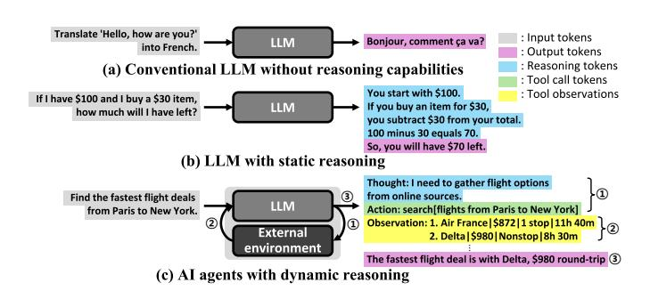
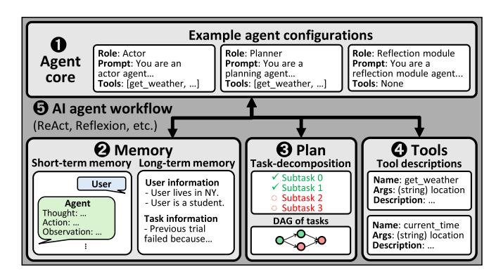

# The Cost of Dynamic Reasoning: Demystifying AI Agents and Test-Time Scaling from an AI Infrastructure Perspective

Jiin Kim KAIST jiin.kim@kaist.ac.kr

Byeongjun Shin KAIST byeongjun.shin@kaist.ac.kr

Jinha Chung KAIST jinha.chung@kaist.ac.kr

Minsoo Rhu KAIST mrhu@kaist.ac.kr

*Abstract*—Large-language-model (LLM)–based AI agents have recently showcased impressive versatility by employing dynamic reasoning, an adaptive, multi-step process that coordinates with external tools. This shift from static, single-turn inference to agentic, multi-turn workflows broadens task generalization and behavioral flexibility, but it also introduces serious concerns about system-level cost, efficiency, and sustainability. This paper presents the first comprehensive system-level analysis of AI agents, quantifying their resource usage, latency behavior, energy consumption, and datacenter-wide power consumption demands across diverse agent designs and test-time scaling strategies. We further characterize how AI agent design choices, such as few-shot prompting, reflection depth, and parallel reasoning, impact accuracy-cost tradeoffs. Our findings reveal that while agents improve accuracy with increased compute, they suffer from rapidly diminishing returns, widening latency variance, and unsustainable infrastructure costs. Through detailed evaluation of representative agents, we highlight the profound computational demands introduced by AI agent workflows, uncovering a looming sustainability crisis. These results call for a paradigm shift in agent design toward compute-efficient reasoning, balancing performance with deployability under real-world constraints.

*Index Terms*—AI agents, test-time scaling, energy consumption, infrastructure sustainability.

#### I. INTRODUCTION

Recent progress in large language models (LLMs) has shifted from scaling model size or pretraining data to improving inference-time behavior, a direction known as *test-time scaling* [48], [75]. Test-time scaling is designed to enhance model performance by allocating additional computation during inference without modifying the model's parameters. This includes techniques such as Chain-of-Thought [84], Tree-of-Thought [95], and others [7], [63], [79], [83], [104]. These approaches promote more deliberate and interpretable *reasoning* within the LLM, enabling it not only to recognize patterns but also to derive conclusions, generate explanations, and solve tasks that require step-by-step logic.

Deploying these reasoning-enhanced LLMs, however, comes at an immense computational cost. Even in current static reasoning models which follow fixed input-output mappings without external tool interaction (Figure 1(a,b)), LLMs run on thousands of GPUs, whose power, cooling, and capital costs drive monthly expenses into the tens of millions of dollars [69]. A single ChatGPT query is estimated to consume about ten times the electricity of a typical web search [12] and requires a substantial amount of cooling water [62].

Fig. 1. Overview of reasoning strategies in LLM-based systems. (a) Conventional LLMs map inputs directly to outputs in a single forward pass, with no explicit intermediate reasoning. (b) Reasoning-enhanced LLMs internally create intermediate steps (e.g., sampling alternative responses or extending token sequences) to deepen or diversify their thought process. (c) AI agents augment this reasoning by 1 planning and invoking external tools, 2 observing the outcomes and adapting their internal reasoning, and iteratively refining their decision-making until they 3 generate the final answer.

As a result, hyperscalers are investing at an unprecedented scale. Meta has already committed over \$10 billion to AI infrastructure [66], and Microsoft operates custom AI supercomputers that draw tens to hundreds of megawatts. As an example, xAI's Colossus AI supercomputer alone employs approximately 100,000 Nvidia H100 GPUs, consuming 150 megawatts in total, with the GPUs alone accounting for around 70 megawatts [88]. For perspective, traditional hyperscale data centers typically draw between 10 and 100 megawatts [27], while advanced semiconductor fabs, such as those operated by Samsung and TSMC, consume several hundred megawatts each [28], [80]. Analysts forecast that total AI infrastructure spending will surpass \$1 trillion within this decade [14], raising serious concerns about power grid sustainability and the economic viability of large-scale LLM deployment.

Given this landscape, the emergence of *AI agents* powered by LLMs with dynamic reasoning threatens to exacerbate these already formidable infrastructure pressures dramatically. Unlike static reasoning models, dynamic reasoning represents an advanced form of test-time scaling that significantly boosts capabilities through active interaction with external environments (Figure 1(c)). Specifically, AI agents continuously plan, invoke external tools, observe outcomes, and iteratively refine their reasoning, often performing dozens of inference calls to satisfy a single user request [72], [96], [102]. Without substantial system-level innovations, per-request computational costs could increase by orders of magnitude, making largescale deployment of agents economically and environmentally prohibitive. Industry leaders are already responding to these challenges: OpenAI's planned Stargate project [55] and Meta's next generation AI data center Hyperion [74] are each projected to require multiple "gigawatts" of power capacity, with costs reaching hundreds of billions of dollars. Yet, despite these developments, the computer architecture community has largely focused on static LLMs, leaving the infrastructure implications of dynamic reasoning workloads underexplored.

To address this critical gap, this paper presents a rigorous, quantitative evaluation of the computational and infrastructural costs of dynamic reasoning. We systematically characterize resource utilization, latency implications, and energy demands inherent in the iterative execution patterns of AI agents. While the serving characteristics of static reasoning LLMs are well understood within the research community, our work presents the first comprehensive, system-level characterization of agent serving costs across diverse configurations and workloads. Each component of our analysis—including the characterization of agent workflows themselves, serving performance, and the impact of test-time scaling—quantifies a distinct dimension of this cost structure, collectively building a unified understanding of its infrastructure-level implications. Our analysis highlights the critical system-level challenges faced when deploying AI agents and identifies opportunities for optimization through architectural improvements, enhanced inference algorithms, and intelligent resource allocation strategies. To the best of our knowledge, this work is the first to provide a system-level characterization of dynamic reasoning in AI agents, grounded in quantitative analysis of end-to-end infrastructure behavior across diverse agentic workflows1 . A key contribution and objective of our study is to quantitatively assess the AI infrastructure cost of dynamic reasoning deployments, and to inform and caution the research community about the urgent need for sustainable, efficient design principles to bridge the gap between advanced algorithmic capabilities and practical, scalable, and sustainable deployment.

#### II. BACKGROUND AND MOTIVATION

#### *A. Definition of AI Agents*

AI agents are inference-time frameworks that extend the capabilities of LLMs by enabling multi-step reasoning, adaptive decision-making, and interaction with the external environment. Unlike conventional LLM applications that produce a single output from a static prompt, AI agents operate through iterative internal reasoning and external actions at inference time. At each iteration, the agent may generate an intermediate reasoning result, call an external tool (e.g., search engine, calculator, or code interpreter), and incorporate the output into its subsequent decisions. This process allows the agent to retrieve missing information and refine its strategy *dynamically* in response to evolving task demands. While this

Fig. 2. Overview of AI agent structure.

adaptivity enhances the ability to handle complex and openended problems, it also leads to variability in the LLM calls, tool usage patterns, and overall computational cost.

#### *B. Core Components and Workflows of AI Agents*

As illustrated in Figure 2, AI agents generally consist of four core components (*agent core, memory, plan*, and *tools*), and *AI agent workflows* interconnect these core components through iterative interactions. These workflows orchestrate how the components dynamically collaborate, enabling the agent's adaptive behaviors.

The 1 *agent core* is the central component responsible for *advanced reasoning*, powered by one or more LLMs configured in specific "roles". These roles typically include an *actor*, which determines the agent's next action; a *planner*, which decomposes high-level goals into subtasks; and a *reflection module*, which evaluates prior reasoning steps and tool interaction trajectories to guide future decisions.

This core reasoning capability of the AI agent is further supported by *memory*, *plan*, and *tools*. 2 *Memory* plays a critical role in enabling the agent to maintain continuity across reasoning steps by storing short-term interaction traces as well as long-term knowledge, including user preferences or experience from past interactions. 3 *Plan* organizes the agent's objective into a sequence of subtasks or a directed acyclic graph (DAG) of interdependent actions. By maintaining an explicit plan, the agent can prioritize actions, track progress, and make forwardlooking decisions that align with the overall task structure. 4 *Tools* extend the agent's capabilities beyond text generation by enabling interaction with external environments. At each step, the agent analyzes its current context, generates a structured command specifying the desired tool and input, executes the tool call, and incorporates the resulting output into its context. This output is then used to guide the next stage of reasoning.

Finally, 5 *AI agent workflow* defines how an agent leverages interactions among the four core components iteratively to carry out reasoning and coordinate actions. AI agents implement their own distinct workflows, reflecting different coordination patterns among components. These workflows can be broadly decomposed into two phases: (1) *LLM inference phase*, where the agent performs internal reasoning tasks such as action generation, planning, or reflection; and (2) *tool use*

1Open-sourced at https://github.com/VIA-Research/AgentBench.

*phase*, where the agent interacts with external environments using tools. These two phases alternate iteratively, forming the backbone of AI agentic systems.

#### C. Test-Time Scaling in AI Agents

Test-time scaling refers to methods that improve the reasoning performance of pretrained LLMs at inference time by increasing the amount of computation used for inference without modifying model parameters [75], [83], [84], [95], [104]. Representative techniques include Chain-of-Thought [84], which guides the model to produce intermediate reasoning steps through carefully crafted prompts, and Tree-of-Thought [95], which expands the reasoning space by exploring multiple reasoning paths. These approaches guide the model to perform step-by-step reasoning, effectively leveraging its internal reasoning capabilities while keeping its parameters fixed.

AI agents build upon this paradigm by implementing testtime reasoning not through prompt design alone, but through multi-step decision-making that integrates tool use and maintenance of intermediate reasoning state. Unlike conventional prompt-based methods that operate within a *static* inputoutput mapping, agents dynamically coordinate multiple model invocations and tool interactions, adapting their behavior based on intermediate outcomes. This form of dynamic reasoning enables agents to respond to new information, revise prior decisions, and handle real-time tasks involving external environments. As such, AI agents redefine test-time scaling by moving beyond conventional inference approaches that rely solely on the model's internal reasoning abilities. This paradigm shift introduces new challenges in efficiency, latency, and resource management, highlighting the need for a systemlevel analysis of the behavior of AI agents.

