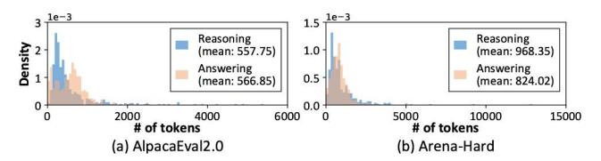
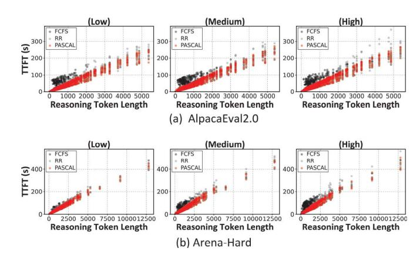
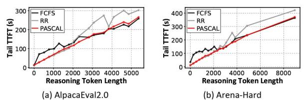
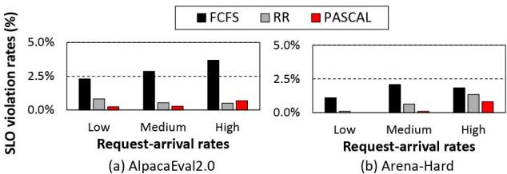
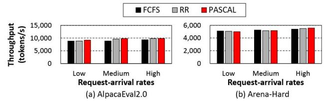
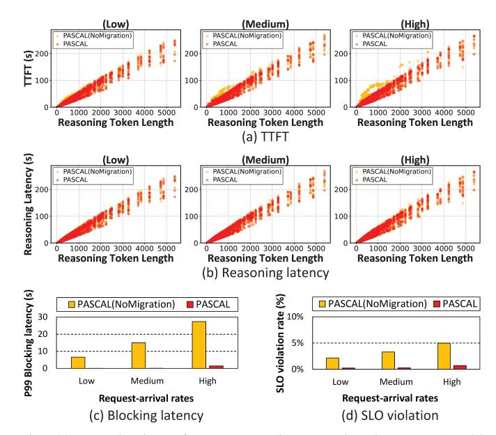
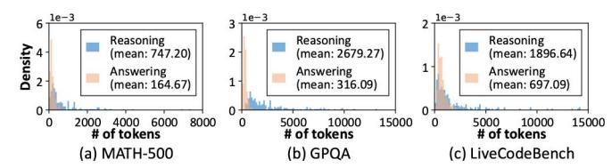
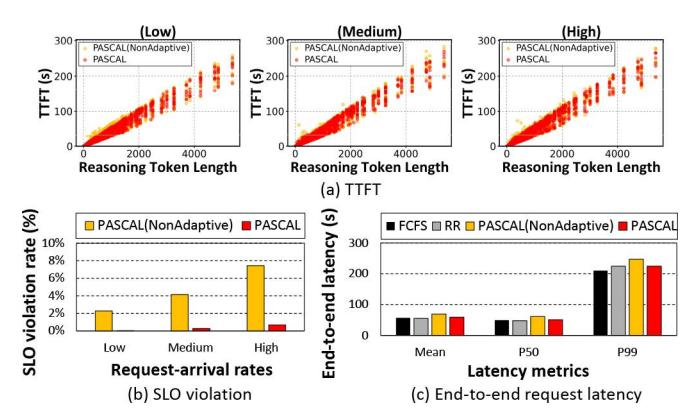
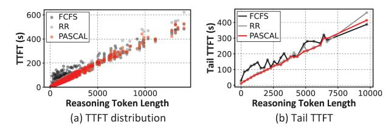

# *C. Intra-instance Scheduler*

This subsection explains how the intra-instance scheduler manages and executes requests within each GPU instance. As shown in Figure 6, each instance maintains a hierarchical priority queue that separates the reasoning and answering phases based on their distinct performance requirements:

• High-priority queue stores requests in the reasoning phase. These requests are served first and receive preferential allocation privilege to GPU memory, minimizing the impact of blocking or preemption on TTFT.

Fig. 8: Reasoning and answering token count distribution for (a) AlpacaEval2.0 [10] and (b) Arena-Hard [29] datasets.

• Low-priority queue: stores requests in the answering phase. Because these requests tolerate preemption better, they are executed using whatever GPU memory remains after high-priority allocations are satisfied.

Occasionally, a single reasoning request with an exceptionally long sequence and a very large KV cache can exhaust the memory needed by answering requests. In such cases, the intra-instance scheduler *demotes* the reasoning request whose KV-cache size exceeds a user-defined threshold to the low-priority queue, effectively treating it as a low-priority answering request. This conditional demotion policy frees GPU memory for answering requests more quickly while minimally impacting reasoning-phase SLOs.

For each priority queue, the scheduler applies a different dispatch strategy. For reasoning requests in the highpriority queue, PASCAL adopts a RR policy. As discussed in Figure 4, when the serving system is constrained by GPU memory, offloading even high-priority reasoning requests becomes inevitable, and both FCFS and RR experience latency degradation. However, the severity of this degradation differs: FCFS increases average latency due to head-of-line blocking across all request lengths, whereas RR provides much faster responsiveness for short reasoning requests at the cost of higher tail latency (Figure 4). To this end, PASCAL selects RR for the high-priority queue to guarantee lower TTFT for short reasoning requests under memory pressure.

Unlike reasoning requests, tokens generated during answering requests are streamed directly to users, making perceived responsiveness critical. As evaluated in Figure 5, RR exhibits high robustness to preemption-induced latency overheads and achieves high SLO attainment rates. To mitigate user-experience degradation under preemption or delayed execution, PASCAL augments RR with a token pacer for answering requests in the low-priority queue. The token pacer regulates the token emission rate to match user expectations, allowing even preempted answering requests to appear responsive. This mechanism enables PASCAL to maintain a high answering-phase SLO success rate under constrained memory, outperforming an FCFS baseline.

## V. EVALUATION

## *A. Methodology*

Simulation framework. We developed a cluster-level simulator to evaluate design points enabled by PASCAL. Inspired by the methodology in [39], our simulator models eight server nodes (instances) connected via a 100 Gbps fabric, each with an NVIDIA H100 96 GB GPU. For single serving instance simulation, we adopt a *profile-based* LLM serving methodology, which prior work has shown to strike a balance between simulation speed and accuracy [1], [6], [30], [39]. The single-instance simulator uses vLLM profiling data and mirrors established techniques [1], [6], [30], [39] to capture GPU execution behavior. We validate it by comparing simulated and measured inference latency on a real system with an Intel Xeon Platinum 8558 CPU and H100 GPU (PCIe 5.0, vLLM 0.6.1, PyTorch 2.4.0, CUDA 12.1). Our simulator achieves a mean absolute percentage error (MAPE) of 1.62% for end-to-end latency and captures key metrics with MAPE values of 12.6% for mean TTFT and 6.49% for TPOT.

Model and dataset. We evaluate PASCAL using DeepSeek-R1-Distill-Qwen-32B [9], [16], an open-source reasoning LLM. The 32B model was chosen to reflect LLM serving scenarios in which GPU memory constraints limit the allocation of KV caches across diverse requests, forcing the scheduler to block or preempt requests as necessary. Serving traces are built from AlpacaEval2.0 [10] and Arena-Hard [29] prompts, queried via OpenAI's o4-mini [38] API, which provides reasoning/answering token counts (Figure 8). These two benchmarks, also used in DeepSeek-R1's evaluation [16], capture chat applications requiring detailed responses. We additionally analyze scenarios with long reasoning but short answers (e.g., problem-solving) in Section V-D.

Scheduling policy. We compare PASCAL against two baseline scheduling algorithms as follows:

- FCFS: The default policy in vLLM. Requests are served strictly in arrival order without distinguishing reasoning and answering phases. When KV cache usage exceeds GPU memory, the KV cache spill to CPU memory, and new admissions pause until space frees up.
- Round-robin (RR): A preemptive scheduler that allocates fixed token quanta to active requests in circular order, regardless of which phase the request is executing; requests that finish their quantum are deprioritized.

For both baselines, reasoning requests are placed on the instance with the smallest KV footprint, and no migration occurs at phase transitions. Token quantum is set to 500 for RR and for each queue in PASCAL. In PASCAL, reasoning requests exceeding 5000 tokens are demoted to the low-priority queue.

Metric. We evaluate schedulers using two metrics: *TTFT* and *SLO violation*. TTFT measures latency from request submission to the first answering token. SLO violations are assessed via QoE, calculated from TPOT starting at the first answering token. Because reasoning-based LLMs have highly variable reasoning lengths, the original QoE metric (which includes a fixed TTFT target) is impractical; we instead compute QoE solely from TPOT and evaluate TTFT separately. An SLO violation is counted when QoE falls below 0.95.

## *B. User Experience (TTFT, SLO Violation) and Throughput*

TTFT. Figure 9 shows the raw TTFT values of all requests as a function of reasoning token length and Figure 10 summarizes the resulting *tail* TTFT. Below we focus on tail TTFT because most requests fit within GPU memory and

Fig. 9: Absolute TTFT for all scheduled requests as a function of reasoning-token length. Experiments were conducted under three request-arrival rates (low, medium, and high). The "high" rate stresses the LLM serving system more severely; exceeding GPU compute and memory capacity increases the likelihood of preemption and blocking. Request arrivals follow a Poisson distribution.

Fig. 10: Tail TTFT latency as a function of reasoning token length under high request-arrival rates. Requests are grouped into 256-token bins based on reasoning token length (e.g., [0–255] bin, [256–511] bin, . . .). These workloads exhibit a highly skewed distribution where more than 70% of requests generate fewer than 1,000 reasoning tokens. This skew causes substantial variation in the number of requests that fall under a given bin. Consequently, we use different tail latency metrics based on the sample size of each bin: maximum TTFT is used for bins with fewer than 10 samples, 90th-percentile (P90) for bins with fewer than 20 samples, P95 for bins with fewer than 100 samples, and P99 otherwise. Bins with fewer than five samples are omitted as we believe they are statistically less meaningful.

scheduling effects are most pronounced in the tail, where memory pressure triggers cache spills and preemption.

The baseline FCFS suffers from head-of-line blocking because once a request starts reasoning, it holds GPU memory until its answering phase completes. As a result, even short-reasoning requests experience severe tail TTFT degradation. RR can mitigate head-of-line blocking, which improves TTFT for shorter requests. In RR, answering phases always follow reasoning phases within each request's lifecycle, but they receive progressively lower priority as the request consumes more time quanta. This behavior implicitly creates a per-request hierarchy (i.e., scheduling priority) that favors reasoning, similar to PASCAL. However, RR cannot enforce a global "reasoning-first" scheduling priority as it does not distinguish the reasoning phase vs. answering phase. For example, a short request that quickly enters its answering phase can retain higher priority than a long reasoning request that has already consumed many quanta, rendering RR's fairness-oriented policy to deprioritize the longer re-

Fig. 11: SLO violation rates across different request-arrival rates.

Fig. 12: Serving throughput across different request-arrival rates.

quest. PASCAL maintains a consistent phase-aware scheduling policy across all requests: reasoning phases always preempt answering phases, and requests migrate to the instance with the least reasoning requests at phase transitions. This avoids head-of-line blocking and keeps tail TTFT low across all datasets and traffic loads. Compared to FCFS, PASCAL cuts tail TTFT by up to 61% on AlpacaEval2.0 and 72% on Arena-Hard, with absolute tail TTFT reductions of 43.22 sec and 64.21 sec, respectively. Compared to RR, PASCAL reduces tail TTFT by up to 89.91 sec and 72.73 sec, a 33% and 29% reduction thereby significantly improving user experience.

It is worth noting that there exists a small number of cases where PASCAL causes minor TTFT degradation, but the absolute increases are small. For example, in AlpacaEval2.0 the worst case is a 13.30 sec increase vs. FCFS (6.12% higher TTFT) and an 8.25 sec increase vs. RR (9.23% higher TTFT). This slight degradation is due to increased preemption among answering requests competing for limited GPU memory. Outside these rare outliers, PASCAL consistently maintains lowest TTFT compared to all baseline schedulers.

SLO violations. As shown in Figure 11, PASCAL consistently achieves lower or comparable answering-phase SLO violation than both baselines across all request-arrival rates. This advantage stems from PASCAL's SLO-aware instance-level scheduling, which routes answering requests to instances with minimal reasoning load, while also prioritizing reasoning phase through its hierarchical queue. At request-arrival rates higher than those in Figure 11, all schedulers inevitably see higher SLO violations, as no serving system can sustain performance once demand exceeds its resource capacity. However, PASCAL confines most degradation to SLO violations while keeping TTFT low, whereas the baseline schedulers degrade in both TTFT and SLO metrics. This resilience arises from PASCAL's strict reasoning-phase prioritization via its hierarchical scheduler.

Serving throughput. Figure 12 shows the overall throughput of the LLM serving system across various request-arrival rates and datasets. Throughput is measured as the total time

Fig. 13: Evaluation of (a) TTFT, (b) reasoning latency, (c) P99 blocking latency, and (d) SLO violation rate on the AlpacaEval2.0 dataset when PASCAL's inter-instance request migration feature is disabled (PASCAL(NoMigration)).

required to generate all output tokens, including both reasoning and answering tokens. As shown, PASCAL achieves throughput comparable to both baseline schedulers, differing by no more than 3%. This result demonstrates that software-level scheduling decisions that account for the distinct reasoning and answering phases of reasoning-based LLMs can significantly improve user experience (in terms of TTFT and TPOT) without compromising overall throughput.

## *C. KV Cache Transfer Overhead*

In our multi-instance server environment, multiple instances may simultaneously migrate requests transitioning into the answering phase (along with their associated KV caches) to the same target instance, causing bandwidth contention and potentially increasing TTFT and overall latency. In our evaluation, we observed P99 KV cache transfer latencies of 0.14 sec for AlpacaEval2.0 and 0.25 sec for Arena-Hard under high request-arrival rates. Since TTFT in these scenarios ranges from a few seconds to several hundred seconds, the impact of KV cache transfer overhead on end-to-end latency is negligible. These results demonstrate that, although KV cache migration introduces some overhead, the performance gains from intelligently migrating phase-transitioning requests across instances far outweigh its costs.

## *D. Discussions*

Importance of migrating requests. To demonstrate the importance of migrating a request at the reasoning-to-answering boundary, we construct a variant of PASCAL that *disables* migration. This version (aka PASCAL(NoMigration)) retains the hierarchical queue design but pins every request to the GPU instance chosen by Algorithm 1; once the reasoning

Fig. 14: Reasoning and answering token count distributions for (a) MATH-500 [17], (b) GPQA [41], and (c) LiveCodeBench [20]. Distributions are derived by querying each benchmark's prompts into the o4-mini model, following the methodology in Section V-A.

Fig. 15: Comparison of PASCAL(NonAdaptive) and PASCAL on the AlpacaEval2.0 dataset. (a) shows the TTFT distributions, (b) presents the SLO violation rates under varying request-arrival rates, and (c) compares the end-to-end latency (covering the entire execution from the reasoning phase to the answering phase) across multiple latency metrics under high request-arrival rates.

phase ends, no inter-instance migration occurs. Under PAS-CAL(NoMigration), the scheduler still prioritizes reasoning requests, but requests can still stall at the phase transition point. If GPU memory is fully utilized by high-priority reasoning requests, an answering request that is routed to the same instance's low-priority queue cannot get scheduled until the GPU memory is freed. Because PASCAL's original placement policy only considers the KV cache footprint during reasoning, it neglects the memory required for answering, thereby elevating the risk of SLO violations.

Figure 13 illustrates these effects. PASCAL(NoMigration) worsens tail TTFT under high request-arrival rates across a broad range of reasoning-token lengths (Figure 13(a)), even though reasoning phase latency remains almost unchanged (Figure 13(b)). To understand the cause, Figure 13(c) reports the latency between the moment a request transitions from reasoning to answering and the moment it is first scheduled. The P99 of this latency (referred to as *blocking latency*) reaches up to 27.39 sec in PASCAL(NoMigration), whereas PASCAL keeps it near zero. Overall, PASCAL(NoMigration) suffers from markedly higher answering phase SLO violation rates than PASCAL (Figure 13(d)), highlighting the value of PASCAL's SLO-aware request migration at phase boundaries.

Effectiveness of adaptive migration. To evaluate the effectiveness of PASCAL's adaptive migration policy, we compare our PASCAL against PASCAL(NonAdaptive), which turns

Fig. 16: (a) TTFT distribution and (b) tail TTFT by reasoning token length, with 50% of the Arena-Hard trace replaced by the reasoning-heavy datasets shown in Figure 14.

off adaptive migration and always triggers request migration at phase transitions, regardless of memory availability. Figure 15(a) and (b) show the TTFT distributions and SLO violation rates of PASCAL(NonAdaptive) versus PASCAL. Although the TTFT distributions appear similar, the SLO violation rate under PASCAL(NonAdaptive) rises sharply with increasing request arrival rates, reaching 7.45% compared to only 0.69% under PASCAL. This degradation occurs because PASCAL(NonAdaptive) ignores each instance's current memory state, migrating requests even when the target instance lacks sufficient GPU memory, while the current instance could have immediately served the answering phase without stalling (see Figure 7(a)). Although the instance-level scheduler excludes instances currently violating their SLOs, its decisions rely solely on the current token pacer state and cannot foresee future memory contention due to unpredictable output lengths. Consequently, such unnecessary migrations increase the risk of future SLO violations for answering requests on the target instance, a problem effectively mitigated by PASCAL's adaptive migration policy. Overall, compared to PASCAL, PASCAL(NonAdaptive) worsens median end-to-end latency by 20.1% and tail latency by 9.7% (Figure 15(c)).

Alternative reasoning datasets. Our evaluation so far has focused on chat applications where users expect detailed responses with long answering tokens. In contrast, problem-solving benchmarks [3], [17], [20], [21], [25], [41] feature lengthy reasoning phases and comparatively short answers. As shown in Figure 14(a)-(c), the number of reasoning tokens can reach as much as 8.48× higher than answering tokens in these datasets. In such *reasoning-heavy* datasets, PASCAL's benefits may diminish because answering phases are too short to cause significant scheduling contention, reducing the impact of phase-aware scheduling.

To this end, we also evaluate a scenario where 50% of Arena-Hard requests are replaced with reasoning-heavy requests sampled uniformly from MATH-500, GPQA, and LiveCodeBench. As shown in Figure 16, PASCAL reduces tail TTFT by up to 70% over FCFS for shorter reasoning segments by mitigating head-of-line blocking, where long reasoning monopolizes GPU memory until answering completes. Even for long-reasoning requests, TTFT rises only 6.8% compared to FCFS, a modest trade-off given the broader gains. Compared to RR, improvements are smaller due to dataset characteristics: short answering phases create minimal interference with reasoning even under baseline scheduling. RR's implicit per-request hierarchy (favoring reasoning over answering, as described in Section V-B) further reduces contention. Thus, PASCAL's explicit phase isolation provides limited additional benefit in this setting. Nonetheless, PASCAL still reduces tail TTFT for certain token ranges by up to 13.9%, with worst-case degradation under 7.7%. SLO violation rates remain similar to RR and consistently lower than FCFS. Overall, PASCAL provides stable, competitive performance even when reasoning–answering contention is minimal.

## VI. RELATED WORKS

LLM serving optimization. Prior work [2], [23], [26], [27], [43], [44], [51] has optimized LLM serving for performance and SLO compliance. ORCA [51] introduces iteration-level scheduling with continuous batching to reduce queuing latency and improve throughput. vLLM [27] combines PagedAttention with continuous batching for high-throughput inference under fine-grained GPU memory management. Andes [31] proposes a QoE-aware preemptive scheduler for streaming services to preserve user-perceived responsiveness. Llumnix [44] supports priority-aware migration by assigning virtual memory usage to requests, guiding dynamic rescheduling to balance load and prioritize high-SLO requests. None of these systems address the unique characteristics of the reasoning phase in reasoning LLMs, leaving TTFT optimization largely unexplored.

Reasoning-based LLM inference. Recent work has tackled inefficiencies in long-chain reasoning. ThinkPrune [19] reduces redundant reasoning steps via reinforcement learning to shorten token sequences without sacrificing performance. Dynasor [13] complements this by predicting requests that are likely to require extended reasoning and allocating additional compute resources accordingly. For requests predicted to have reached a stable or confident reasoning state, Dynasor terminates decoding early to save computation. In contrast, PASCAL is a scheduling framework that exploits the asymmetric resource demands of reasoning versus answering phases, enabling priority-aware execution and dynamic migration across serving instances without modifying models or adding inference-time heuristics. Rather than manipulating the reasoning phase itself, PASCAL introduces a novel phaseaware scheduling mechanism that distinguishes between the two phases while keeping the execution pipeline intact, making it orthogonal to reasoning-token reduction methods [13], [19].

Disaggregated LLM inference. Several prior works [11], [39], [54] leverage the distinct compute characteristics of the prefill and decode stages by disaggregating these stages across dedicated hardware, improving energy efficiency and reducing request contention. DistServe [54], for example, partitions the inference pipeline based on the observation that prefill and decoding interfere with each other due to their differing resource demands, assigning each stage to hardware configurations that better satisfy their stage-specific SLO constraints. In contrast to these disaggregated LLM serving systems, which focus on conventional LLMs, our work targets emerging reasoning-based LLMs, where the decoding stage itself consists of two semantically distinct phases: reasoning and answering. The key contribution of PASCAL is identifying this phase-based execution behavior and intelligently scheduling decoding requests to minimize interference. This insight is orthogonal to existing disaggregated inference systems and can be layered on top of them for additional performance gains.

## VII. FUTURE WORK

PASCAL in heterogeneous system architectures. PASCAL focuses on GPU-centric LLM serving, consistent with many representative prior works [2], [27], [39], [54] where all computations are executed exclusively on GPUs and the CPU is used primarily as a backing storage for offloaded tensors, without participating in the LLM computation process. Meanwhile, several recent studies have explored a *heterogeneous* computing model for LLM inference, in which the CPU collaborates with the GPU to accelerate LLMs [24], [33]. More recently, the introduction of Rubin CPX [35]—a prefill-optimized GPU designed to complement the standard (now relatively decodeoptimized) Rubin GPU [36] by handling the compute-bound prefill stage—has gained attention as it presents opportunity to balance compute and memory utilization across heterogeneous GPUs (i.e., prefill-optimized vs. decode-optimized).

Applying PASCAL's phase-aware scheduling algorithm on top of these emerging heterogeneous compute devices introduces unique design challenges. For instance, offloading KV caches, activations, or weights must be handled more carefully, as these data may still be needed for ongoing computations depending on how compute and memory operations are partitioned across devices, as well as how scheduling policies and inter-device coherence are orchestrated. A deeper exploration of PASCAL in such heterogeneous environments is beyond the scope of this work and is left for future investigation.

Explicit resource partitioning across reasoning and answering phases. In prior works such as DistServe [54] and Splitwise [39], the prefill (compute-bound) and decoding (memory-bound) stages exhibit fundamentally distinct computational characteristics, which makes explicit resource partitioning beneficial. Specifically, DistServe emphasizes the interference between the prefill and decoding stages that stems from their per-step latency difference, where the slower prefill stage delays decoding progress within the same iteration, while Splitwise leverages hardware heterogeneity to better suit each stage's computational characteristics. In contrast, under PASCAL, both the reasoning and answering phases belong to the *same* decoding stage. Thus, applying a DistServe-style explicit partitioning offers little benefit, as the two phases have similar per-step latencies and do not experience the iterationlevel interference that motivates stage separation. Similarly, applying a Splitwise-style explicit resource partitioning is less effective, since both phases share comparable computational characteristics and are equally well-suited to the same hardware resources, yielding no efficiency gain from assigning them to different devices. Consequently, the potential benefits of explicitly partitioning resources across the reasoning and answering phases is questionable, while its drawbacks become more pronounced. A deeper exploration of this design space is left for future work.

## VIII. CONCLUSION

In this paper, we introduce a phase-aware scheduling algorithm for reasoning-based LLM serving systems. Based on our key observation that reasoning latency dominates Time-To-First-Token (TTFT), PASCAL's scheduler applies lightweight phase detection and priority assignment during decoding, enabling our proposed system to honor the asymmetric performance sensitivities of reasoning versus answering tokens. A hierarchical intra-instance queue, combined with SLO-aware inter-instance migration, minimizes tail TTFT while preserving answer-phase token throughput. Consequently, PASCAL delivers consistently low tail latency without sacrificing overall throughput or answer quality.

## ACKNOWLEDGMENT

This work was partly supported by Institute of Information & Communications Technology Planning & Evaluation(IITP) grant funded by the Korea government(MSIT) (No.RS-2024- 00438851, (SW Starlab) High-performance Privacy-preserving Machine Learning System and System Software), (No.RS-2025-02264029, Implementation and Validation of an AI Semiconductor-Based Data Center Composable Cluster Infrastructure, 30%), (No.RS-2025-02214652, Development of SoC Technology for AI Semiconductor-Converged Pooled Storage/Memory), (No. RS-2024-00457882, AI Research Hub Project), Samsung Research Funding Center of Samsung Electronics (SRFC-IT2402-03), and IITP under the Graduate School of Artificial Intelligence Semiconductor(IITP-2026-RS-2023-00256472) grant funded by the Korea government(MSIT). We also thank Yunjae Lee for his constructive feedback that helped improve this paper. Minsoo Rhu is the corresponding author.

## REFERENCES

- [1] A. Agrawal, N. Kedia, J. Mohan, A. Panwar, N. Kwatra, B. Gulavani, R. Ramjee, and A. Tumanov, "Vidur: A Large-Scale Simulation Framework For LLM Inference," in *The Eighth Annual Conference on Machine Learning and Systems (MLSys)*, 2024.
- [2] A. Agrawal, N. Kedia, A. Panwar, J. Mohan, N. Kwatra, B. Gulavani, A. Tumanov, and R. Ramjee, "Taming Throughput-latency Tradeoff in LLM Inference with Sarathi-Serve," in *Proceedings of the USENIX Symposium on Operating Systems Design and Implementation (OSDI)*, 2024.
- [3] V. AI, https://www.vals.ai/benchmarks/aime, 2025.
- [4] K. Alizadeh, S. I. Mirzadeh, D. Belenko, S. Khatamifard, M. Cho, C. C. Del Mundo, M. Rastegari, and M. Farajtabar, "LLM in a flash: Efficient Large Language Model Inference with Limited Memory," in *Proceedings of the ACL (Association for Computational Linguistics)*, 2024.
- [5] R. Anil, S. Borgeaud, J.-B. Alayrac, J. Yu, R. Soricut, J. Schalkwyk, A. M. Dai, A. Hauth, K. Millican, D. Silver, M. Johnson, I. Antonoglou, J. Schrittwieser, A. Glaese, J. Chen, E. Pitler, T. Lillicrap, A. Lazaridou, O. Firat, J. Molloy, M. Isard, P. R. Barham, T. Hennigan, B. Lee, F. Viola, M. Reynolds, Y. Xu, R. Doherty, E. Collins, C. Meyer, E. Rutherford, E. Moreira, K. Ayoub, M. Goel, J. Krawczyk, C. Du, E. Chi, H.-T. Cheng, E. Ni, P. Shah, P. Kane, B. Chan, M. Faruqui, A. Severyn, H. Lin, Y. Li, Y. Cheng, A. Ittycheriah, M. Mahdieh, M. Chen, P. Sun, D. Tran, S. Bagri, B. Lakshminarayanan, J. Liu, A. Orban, F. Gura, H. Zhou, X. Song, A. Boffy, H. Ganapathy, S. Zheng, ¨ H. Choe, Agoston Weisz, T. Zhu, Y. Lu, S. Gopal, J. Kahn, M. Kula, ´ J. Pitman, R. Shah, E. Taropa, M. A. Merey, M. Baeuml, Z. Chen, L. E. Shafey, Y. Zhang, O. Sercinoglu, G. Tucker, E. Piqueras, M. Krikun, I. Barr, N. Savinov, I. Danihelka, B. Roelofs, A. White, A. Andreassen, T. von Glehn, L. Yagati, M. Kazemi, L. Gonzalez, M. Khalman,

J. Sygnowski, A. Frechette, C. Smith, L. Culp, L. Proleev, Y. Luan, X. Chen, J. Lottes, N. Schucher, F. Lebron, A. Rrustemi, N. Clay, P. Crone, T. Kocisky, J. Zhao, B. Perz, D. Yu, H. Howard, A. Bloniarz, J. W. Rae, H. Lu, L. Sifre, M. Maggioni, F. Alcober, D. Garrette, M. Barnes, S. Thakoor, J. Austin, G. Barth-Maron, W. Wong, R. Joshi, R. Chaabouni, D. Fatiha, A. Ahuja, G. S. Tomar, E. Senter, M. Chadwick, I. Kornakov, N. Attaluri, I. Iturrate, R. Liu, Y. Li, S. Cogan, J. Chen, C. Jia, C. Gu, Q. Zhang, J. Grimstad, A. J. Hartman, X. Garcia, T. S. Pillai, J. Devlin, M. Laskin, D. de Las Casas, D. Valter, C. Tao, L. Blanco, A. P. Badia, D. Reitter, M. Chen, J. Brennan, C. Rivera, S. Brin, S. Iqbal, G. Surita, J. Labanowski, A. Rao, S. Winkler, E. Parisotto, Y. Gu, K. Olszewska, R. Addanki, A. Miech, A. Louis, D. Teplyashin, G. Brown, E. Catt, J. Balaguer, J. Xiang, P. Wang, Z. Ashwood, A. Briukhov, A. Webson, S. Ganapathy, S. Sanghavi, A. Kannan, M.-W. Chang, A. Stjerngren, J. Djolonga, Y. Sun, A. Bapna, M. Aitchison, P. Pejman, H. Michalewski, T. Yu, C. Wang, J. Love, J. Ahn, D. Bloxwich, K. Han, P. Humphreys, T. Sellam, J. Bradbury, V. Godbole, S. Samangooei, B. Damoc, A. Kaskasoli, S. M. R. Arnold, V. Vasudevan, S. Agrawal, J. Riesa, D. Lepikhin, R. Tanburn, S. Srinivasan, H. Lim, S. Hodkinson, P. Shyam, J. Ferret, S. Hand, A. Garg, T. L. Paine, J. Li, Y. Li, M. Giang, A. Neitz, Z. Abbas, S. York, M. Reid, E. Cole, A. Chowdhery, D. Das, D. Rogozinska, ´ V. Nikolaev, P. Sprechmann, Z. Nado, L. Zilka, F. Prost, L. He, M. Monteiro, G. Mishra, C. Welty, J. Newlan, D. Jia, M. Allamanis, C. H. Hu, R. de Liedekerke, J. Gilmer, C. Saroufim, S. Rijhwani, S. Hou, D. Shrivastava, A. Baddepudi, A. Goldin, A. Ozturel, A. Cassirer, Y. Xu, D. Sohn, D. Sachan, R. K. Amplayo, C. Swanson, D. Petrova, S. Narayan, A. Guez, S. Brahma, J. Landon, M. Patel, R. Zhao, K. Villela, L. Wang, W. Jia, M. Rahtz, M. Gimenez, L. Yeung, J. Keeling, ´ P. Georgiev, D. Mincu, B. Wu, S. Haykal, R. Saputro, K. Vodrahalli, J. Qin, Z. Cankara, A. Sharma, N. Fernando, W. Hawkins, B. Neyshabur, S. Kim, A. Hutter, P. Agrawal, A. Castro-Ros, G. van den Driessche, T. Wang, F. Yang, S. yiin Chang, P. Komarek, R. McIlroy, M. Luciˇ c,´ G. Zhang, W. Farhan, M. Sharman, P. Natsev, P. Michel, Y. Bansal, S. Qiao, K. Cao, S. Shakeri, C. Butterfield, J. Chung, P. K. Rubenstein, S. Agrawal, A. Mensch, K. Soparkar, K. Lenc, T. Chung, A. Pope, L. Maggiore, J. Kay, P. Jhakra, S. Wang, J. Maynez, M. Phuong, T. Tobin, A. Tacchetti, M. Trebacz, K. Robinson, Y. Katariya, S. Riedel, P. Bailey, K. Xiao, N. Ghelani, L. Aroyo, A. Slone, N. Houlsby, X. Xiong, Z. Yang, E. Gribovskaya, J. Adler, M. Wirth, L. Lee, M. Li, T. Kagohara, J. Pavagadhi, S. Bridgers, A. Bortsova, S. Ghemawat, Z. Ahmed, T. Liu, R. Powell, V. Bolina, M. Iinuma, P. Zablotskaia, J. Besley, D.-W. Chung, T. Dozat, R. Comanescu, X. Si, J. Greer, G. Su, M. Polacek, R. L. Kaufman, S. Tokumine, H. Hu, E. Buchatskaya, Y. Miao, M. Elhawaty, A. Siddhant, N. Tomasev, J. Xing, C. Greer, H. Miller, S. Ashraf, A. Roy, Z. Zhang, A. Ma, A. Filos, M. Besta, R. Blevins, T. Klimenko, C.-K. Yeh, S. Changpinyo, J. Mu, O. Chang, M. Pajarskas, C. Muir, V. Cohen, C. L. Lan, K. Haridasan, A. Marathe, S. Hansen, S. Douglas, R. Samuel, M. Wang, S. Austin, C. Lan, J. Jiang, J. Chiu, J. A. Lorenzo, L. L. Sjosund, S. Cevey, Z. Gleicher, T. Avrahami, ¨ A. Boral, H. Srinivasan, V. Selo, R. May, K. Aisopos, L. Hussenot, L. B. Soares, K. Baumli, M. B. Chang, A. Recasens, B. Caine, A. Pritzel, F. Pavetic, F. Pardo, A. Gergely, J. Frye, V. Ramasesh, D. Horgan, K. Badola, N. Kassner, S. Roy, E. Dyer, V. C. Campos, A. Tomala, Y. Tang, D. E. Badawy, E. White, B. Mustafa, O. Lang, A. Jindal, S. Vikram, Z. Gong, S. Caelles, R. Hemsley, G. Thornton, F. Feng, W. Stokowiec, C. Zheng, P. Thacker, C¸ aglar ˘ Unl ¨ u, Z. Zhang, M. Saleh, ¨ J. Svensson, M. Bileschi, P. Patil, A. Anand, R. Ring, K. Tsihlas, A. Vezer, M. Selvi, T. Shevlane, M. Rodriguez, T. Kwiatkowski, S. Daruki, K. Rong, A. Dafoe, N. FitzGerald, K. Gu-Lemberg, M. Khan, L. A. Hendricks, M. Pellat, V. Feinberg, J. Cobon-Kerr, T. Sainath, M. Rauh, S. H. Hashemi, R. Ives, Y. Hasson, E. Noland, Y. Cao, N. Byrd, L. Hou, Q. Wang, T. Sottiaux, M. Paganini, J.-B. Lespiau, A. Moufarek, S. Hassan, K. Shivakumar, J. van Amersfoort, A. Mandhane, P. Joshi, A. Goyal, M. Tung, A. Brock, H. Sheahan, V. Misra, C. Li, N. Rakicevi ´ c,´ M. Dehghani, F. Liu, S. Mittal, J. Oh, S. Noury, E. Sezener, F. Huot, M. Lamm, N. D. Cao, C. Chen, S. Mudgal, R. Stella, K. Brooks, G. Vasudevan, C. Liu, M. Chain, N. Melinkeri, A. Cohen, V. Wang, K. Seymore, S. Zubkov, R. Goel, S. Yue, S. Krishnakumaran, B. Albert, N. Hurley, M. Sano, A. Mohananey, J. Joughin, E. Filonov, T. Kepa, Y. Eldawy, J. Lim, R. Rishi, S. Badiezadegan, T. Bos, J. Chang, S. Jain, S. G. S. Padmanabhan, S. Puttagunta, K. Krishna, L. Baker, N. Kalb, V. Bedapudi, A. Kurzrok, S. Lei, A. Yu, O. Litvin, X. Zhou, Z. Wu, S. Sobell, A. Siciliano, A. Papir, R. Neale, J. Bragagnolo, T. Toor, T. Chen, V. Anklin, F. Wang, R. Feng, M. Gholami, K. Ling, L. Liu, J. Walter, H. Moghaddam, A. Kishore, J. Adamek, T. Mercado, J. Mallinson, S. Wandekar, S. Cagle, E. Ofek, G. Garrido, C. Lombriser, M. Mukha, B. Sun, H. R. Mohammad, J. Matak, Y. Qian, V. Peswani, P. Janus, Q. Yuan, L. Schelin, O. David, A. Garg, Y. He, O. Duzhyi, A. Algmyr, T. Lottaz, Q. Li, V. Yadav, L. Xu, A. Chinien, R. Shiv- ¨ anna, A. Chuklin, J. Li, C. Spadine, T. Wolfe, K. Mohamed, S. Das, Z. Dai, K. He, D. von Dincklage, S. Upadhyay, A. Maurya, L. Chi, S. Krause, K. Salama, P. G. Rabinovitch, P. K. R. M, A. Selvan, M. Dektiarev, G. Ghiasi, E. Guven, H. Gupta, B. Liu, D. Sharma, I. H. Shtacher, S. Paul, O. Akerlund, F.-X. Aubet, T. Huang, C. Zhu, E. Zhu, E. Teixeira, M. Fritze, F. Bertolini, L.-E. Marinescu, M. Bolle, ¨ D. Paulus, K. Gupta, T. Latkar, M. Chang, J. Sanders, R. Wilson, X. Wu, Y.-X. Tan, L. N. Thiet, T. Doshi, S. Lall, S. Mishra, W. Chen, T. Luong, S. Benjamin, J. Lee, E. Andrejczuk, D. Rabiej, V. Ranjan, K. Styrc, P. Yin, J. Simon, M. R. Harriott, M. Bansal, A. Robsky, G. Bacon, D. Greene, D. Mirylenka, C. Zhou, O. Sarvana, A. Goyal, S. Andermatt, P. Siegler, B. Horn, A. Israel, F. Pongetti, C.-W. L. Chen, M. Selvatici, P. Silva, K. Wang, J. Tolins, K. Guu, R. Yogev, X. Cai, A. Agostini, M. Shah, H. Nguyen, N. Donnaile, S. Pereira, L. Friso, A. Stambler, A. Kurzrok, C. Kuang, Y. Romanikhin, M. Geller, Z. Yan, K. Jang, C.-C. Lee, W. Fica, E. Malmi, Q. Tan, D. Banica, D. Balle, R. Pham, Y. Huang, D. Avram, H. Shi, J. Singh, C. Hidey, N. Ahuja, P. Saxena, D. Dooley, S. P. Potharaju, E. O'Neill, A. Gokulchandran, R. Foley, K. Zhao, M. Dusenberry, Y. Liu, P. Mehta, R. Kotikalapudi, C. Safranek-Shrader, A. Goodman, J. Kessinger, E. Globen, P. Kolhar, C. Gorgolewski, A. Ibrahim, Y. Song, A. Eichenbaum, T. Brovelli, S. Potluri, P. Lahoti, C. Baetu, A. Ghorbani, C. Chen, A. Crawford, S. Pal, M. Sridhar, P. Gurita, A. Mujika, I. Petrovski, P.-L. Cedoz, C. Li, S. Chen, N. D. Santo, S. Goyal, J. Punjabi, K. Kappaganthu, C. Kwak, P. LV, S. Velury, H. Choudhury, J. Hall, P. Shah, R. Figueira, M. Thomas, M. Lu, T. Zhou, C. Kumar, T. Jurdi, S. Chikkerur, Y. Ma, A. Yu, S. Kwak, V. Ahdel, S. Rajayogam, T. Choma, F. Liu, A. Barua, ¨ C. Ji, J. H. Park, V. Hellendoorn, A. Bailey, T. Bilal, H. Zhou, M. Khatir, C. Sutton, W. Rzadkowski, F. Macintosh, R. Vij, K. Shagin, P. Medina, C. Liang, J. Zhou, P. Shah, Y. Bi, A. Dankovics, S. Banga, S. Lehmann, M. Bredesen, Z. Lin, J. E. Hoffmann, J. Lai, R. Chung, K. Yang, N. Balani, A. Brazinskas, A. Sozanschi, M. Hayes, H. F. Alcalde, P. Makarov, ˇ W. Chen, A. Stella, L. Snijders, M. Mandl, A. Karrman, P. Nowak, ¨ X. Wu, A. Dyck, K. Vaidyanathan, R. R, J. Mallet, M. Rudominer, E. Johnston, S. Mittal, A. Udathu, J. Christensen, V. Verma, Z. Irving, A. Santucci, G. Elsayed, E. Davoodi, M. Georgiev, I. Tenney, N. Hua, G. Cideron, E. Leurent, M. Alnahlawi, I. Georgescu, N. Wei, I. Zheng, D. Scandinaro, H. Jiang, J. Snoek, M. Sundararajan, X. Wang, Z. Ontiveros, I. Karo, J. Cole, V. Rajashekhar, L. Tumeh, E. Ben-David, R. Jain, J. Uesato, R. Datta, O. Bunyan, S. Wu, J. Zhang, P. Stanczyk, Y. Zhang, D. Steiner, S. Naskar, M. Azzam, M. Johnson, A. Paszke, C.-C. Chiu, J. S. Elias, A. Mohiuddin, F. Muhammad, J. Miao, A. Lee, N. Vieillard, J. Park, J. Zhang, J. Stanway, D. Garmon, A. Karmarkar, Z. Dong, J. Lee, A. Kumar, L. Zhou, J. Evens, W. Isaac, G. Irving, E. Loper, M. Fink, I. Arkatkar, N. Chen, I. Shafran, I. Petrychenko, Z. Chen, J. Jia, A. Levskaya, Z. Zhu, P. Grabowski, Y. Mao, A. Magni, K. Yao, J. Snaider, N. Casagrande, E. Palmer, P. Suganthan, A. Castano, ˜ I. Giannoumis, W. Kim, M. Rybinski, A. Sreevatsa, J. Prendki, D. So- ´ ergel, A. Goedeckemeyer, W. Gierke, M. Jafari, M. Gaba, J. Wiesner, D. G. Wright, Y. Wei, H. Vashisht, Y. Kulizhskaya, J. Hoover, M. Le, L. Li, C. Iwuanyanwu, L. Liu, K. Ramirez, A. Khorlin, A. Cui, T. LIN, M. Wu, R. Aguilar, K. Pallo, A. Chakladar, G. Perng, E. A. Abellan, M. Zhang, I. Dasgupta, N. Kushman, I. Penchev, A. Repina, X. Wu, T. van der Weide, P. Ponnapalli, C. Kaplan, J. Simsa, S. Li, O. Dousse, F. Yang, J. Piper, N. Ie, R. Pasumarthi, N. Lintz, A. Vijayakumar, D. Andor, P. Valenzuela, M. Lui, C. Paduraru, D. Peng, K. Lee, S. Zhang, S. Greene, D. D. Nguyen, P. Kurylowicz, C. Hardin, L. Dixon, L. Janzer, K. Choo, Z. Feng, B. Zhang, A. Singhal, D. Du, D. McKinnon, N. Antropova, T. Bolukbasi, O. Keller, D. Reid, D. Finchelstein, M. A. Raad, R. Crocker, P. Hawkins, R. Dadashi, C. Gaffney, K. Franko, A. Bulanova, R. Leblond, S. Chung, H. Askham, L. C. Cobo, K. Xu, F. Fischer, J. Xu, C. Sorokin, C. Alberti, C.-C. Lin, C. Evans, A. Dimitriev, H. Forbes, D. Banarse, Z. Tung, M. Omernick, C. Bishop, R. Sterneck, R. Jain, J. Xia, E. Amid, F. Piccinno, X. Wang, P. Banzal, D. J. Mankowitz, A. Polozov, V. Krakovna, S. Brown, M. Bateni, D. Duan, V. Firoiu, M. Thotakuri, T. Natan, M. Geist, S. tan Girgin, H. Li, J. Ye, O. Roval, R. Tojo, M. Kwong, J. Lee-Thorp, C. Yew, D. Sinopalnikov, S. Ramos, J. Mellor, A. Sharma, K. Wu, D. Miller, N. Sonnerat, D. Vnukov, R. Greig, J. Beattie, E. Caveness, L. Bai, J. Eisenschlos, A. Korchemniy, T. Tsai, M. Jasarevic, W. Kong, P. Dao, Z. Zheng, F. Liu, F. Yang, R. Zhu, T. H. Teh, J. Sanmiya, E. Gladchenko, N. Trdin, D. Toyama, E. Rosen, S. Tavakkol, L. Xue, C. Elkind, O. Woodman, J. Carpenter, G. Papamakarios, R. Kemp, S. Kafle, T. Grunina, R. Sinha, A. Talbert, D. Wu, D. Owusu-Afriyie, C. Du, C. Thornton, J. Pont-Tuset, P. Narayana, J. Li, S. Fatehi, J. Wieting, O. Ajmeri, B. Uria, Y. Ko, L. Knight, A. Heliou, N. Niu, S. Gu, C. Pang, Y. Li, N. Levine, ´ A. Stolovich, R. Santamaria-Fernandez, S. Goenka, W. Yustalim, R. Strudel, A. Elqursh, C. Deck, H. Lee, Z. Li, K. Levin, R. Hoffmann, D. Holtmann-Rice, O. Bachem, S. Arora, C. Koh, S. H. Yeganeh, S. Poder, M. Tariq, Y. Sun, L. Ionita, M. Seyedhosseini, P. Tafti, Z. Liu, ˜ A. Gulati, J. Liu, X. Ye, B. Chrzaszcz, L. Wang, N. Sethi, T. Li, B. Brown, S. Singh, W. Fan, A. Parisi, J. Stanton, V. Koverkathu, C. A. Choquette-Choo, Y. Li, T. Lu, A. Ittycheriah, P. Shroff, M. Varadarajan, S. Bahargam, R. Willoughby, D. Gaddy, G. Desjardins, M. Cornero, B. Robenek, B. Mittal, B. Albrecht, A. Shenoy, F. Moiseev, H. Jacobsson, A. Ghaffarkhah, M. Riviere, A. Walton, C. Crepy, A. Parrish, ` Z. Zhou, C. Farabet, C. Radebaugh, P. Srinivasan, C. van der Salm, A. Fidjeland, S. Scellato, E. Latorre-Chimoto, H. Klimczak-Plucinska, ´ D. Bridson, D. de Cesare, T. Hudson, P. Mendolicchio, L. Walker, A. Morris, M. Mauger, A. Guseynov, A. Reid, S. Odoom, L. Loher, V. Cotruta, M. Yenugula, D. Grewe, A. Petrushkina, T. Duerig, A. Sanchez, S. Yadlowsky, A. Shen, A. Globerson, L. Webb, S. Dua, D. Li, S. Bhupatiraju, D. Hurt, H. Qureshi, A. Agarwal, T. Shani, M. Eyal, A. Khare, S. R. Belle, L. Wang, C. Tekur, M. S. Kale, J. Wei, R. Sang, B. Saeta, T. Liechty, Y. Sun, Y. Zhao, S. Lee, P. Nayak, D. Fritz, M. R. Vuyyuru, J. Aslanides, N. Vyas, M. Wicke, X. Ma, E. Eltyshev, N. Martin, H. Cate, J. Manyika, K. Amiri, Y. Kim, X. Xiong, K. Kang, F. Luisier, N. Tripuraneni, D. Madras, M. Guo, A. Waters, O. Wang, J. Ainslie, J. Baldridge, H. Zhang, G. Pruthi, J. Bauer, F. Yang, R. Mansour, J. Gelman, Y. Xu, G. Polovets, J. Liu, H. Cai, W. Chen, X. Sheng, E. Xue, S. Ozair, C. Angermueller, X. Li, A. Sinha, W. Wang, J. Wiesinger, E. Koukoumidis, Y. Tian, A. Iyer, M. Gurumurthy, M. Goldenson, P. Shah, M. Blake, H. Yu, A. Urbanowicz, J. Palomaki, C. Fernando, K. Durden, H. Mehta, N. Momchev, E. Rahimtoroghi, M. Georgaki, A. Raul, S. Ruder, M. Redshaw, J. Lee, D. Zhou, K. Jalan, D. Li, B. Hechtman, P. Schuh, M. Nasr, K. Milan, V. Mikulik, J. Franco, T. Green, N. Nguyen, J. Kelley, A. Mahendru, A. Hu, J. Howland, B. Vargas, J. Hui, K. Bansal, V. Rao, R. Ghiya, E. Wang, K. Ye, J. M. Sarr, M. M. Preston, M. Elish, S. Li, A. Kaku, J. Gupta, I. Pasupat, D.- C. Juan, M. Someswar, T. M., X. Chen, A. Amini, A. Fabrikant, E. Chu, X. Dong, A. Muthal, S. Buthpitiya, S. Jauhari, N. Hua, U. Khandelwal, A. Hitron, J. Ren, L. Rinaldi, S. Drath, A. Dabush, N.-J. Jiang, H. Godhia, U. Sachs, A. Chen, Y. Fan, H. Taitelbaum, H. Noga, Z. Dai, J. Wang, C. Liang, J. Hamer, C.-S. Ferng, C. Elkind, A. Atias, P. Lee, V. List´ık, M. Carlen, J. van de Kerkhof, M. Pikus, K. Zaher, P. Muller, ¨ S. Zykova, R. Stefanec, V. Gatsko, C. Hirnschall, A. Sethi, X. F. Xu, C. Ahuja, B. Tsai, A. Stefanoiu, B. Feng, K. Dhandhania, M. Katyal, A. Gupta, A. Parulekar, D. Pitta, J. Zhao, V. Bhatia, Y. Bhavnani, O. Alhadlaq, X. Li, P. Danenberg, D. Tu, A. Pine, V. Filippova, A. Ghosh, B. Limonchik, B. Urala, C. K. Lanka, D. Clive, Y. Sun, E. Li, H. Wu, K. Hongtongsak, I. Li, K. Thakkar, K. Omarov, K. Majmundar, M. Alverson, M. Kucharski, M. Patel, M. Jain, M. Zabelin, P. Pelagatti, R. Kohli, S. Kumar, J. Kim, S. Sankar, V. Shah, L. Ramachandruni, X. Zeng, B. Bariach, L. Weidinger, T. Vu, A. Andreev, A. He, K. Hui, S. Kashem, A. Subramanya, S. Hsiao, D. Hassabis, K. Kavukcuoglu, A. Sadovsky, Q. Le, T. Strohman, Y. Wu, S. Petrov, J. Dean, and O. Vinyals, "Gemini: A Family of Highly Capable Multimodal Models," in *arxiv.org*, 2023.

- [6] J. Bang, Y. Choi, M. Kim, Y. Kim, and M. Rhu, "vTrain: A Simulation Framework for Evaluating Cost-effective and Compute-optimal Large Language Model Training," in *Proceedings of the International Symposium on Microarchitecture (MICRO)*, 2024.
- [7] Z. Cai, Y. Zhang, B. Gao, Y. Liu, Y. Li, T. Liu, K. Lu, W. Xiong, Y. Dong, J. Hu *et al.*, "PyramidKV: Dynamic KV Cache Compression based on Pyramidal Information Funneling," in *arxiv.org*, 2024.
- [8] A. Chowdhery, S. Narang, J. Devlin, M. Bosma, G. Mishra, A. Roberts, P. Barham, H. W. Chung, C. Sutton, S. Gehrmann, P. Schuh, K. Shi, S. Tsvyashchenko, J. Maynez, A. Rao, P. Barnes, Y. Tay, N. Shazeer, V. Prabhakaran, E. Reif, N. Du, B. Hutchinson, R. Pope, J. Bradbury, J. Austin, M. Isard, G. Gur-Ari, P. Yin, T. Duke, A. Levskaya, S. Ghemawat, S. Dev, H. Michalewski, X. Garcia, V. Misra, K. Robinson, L. Fedus, D. Zhou, D. Ippolito, D. Luan, H. Lim, B. Zoph, A. Spiridonov,

- R. Sepassi, D. Dohan, S. Agrawal, M. Omernick, A. M. Dai, T. S. Pillai, M. Pellat, A. Lewkowycz, E. Moreira, R. Child, O. Polozov, K. Lee, Z. Zhou, X. Wang, B. Saeta, M. Diaz, O. Firat, M. Catasta, J. Wei, K. Meier-Hellstern, D. Eck, J. Dean, S. Petrov, and N. Fiedel, "PaLM: Scaling Language Modeling with Pathways," in *arxiv.org*, 2022.
- [9] DeepSeek-AI, "DeepSeek-R1-Distill-Qwen-32B," 2025. [Online]. Available: https://huggingface.co/deepseek-ai/DeepSeek-R1-Distill-Qwen-32B
- [10] Y. Dubois, B. Galambosi, P. Liang, and T. B. Hashimoto, "Length-Controlled AlpacaEval: A Simple Way to Debias Automatic Evaluators," in *Conference on Language Modeling (COLM)*, 2024.
- [11] J. Feng, Y. Huang, R. Zhang, S. Liang, M. Yan, and J. Wu, "Wind-Serve: Efficient Phase-Disaggregated LLM Serving with Stream-based Dynamic Scheduling," in *Proceedings of the International Symposium on Computer Architecture (ISCA)*, 2025.
- [12] Y. Fu, H. Peng, R. Schwartz, N. A. Smith, and D. Khashabi, "Automatic Chain of Thought Prompting in Large Language Models," in *Proceedings of the International Conference on Learning Representations (ICLR)*, 2023.
- [13] Y. Fu, J. Chen, S. Zhu, Z. Fu, Z. Dai, A. Qiao, and H. Zhang, "Efficiently Serving LLM Reasoning Programs with Certaindex," in *arxiv.org*, 2024.
- [14] R. Gong, S. Bai, S. Wu, Y. Fan, Z. Wang, X. Li, H. Yang, and X. Liu, "Past-Future Scheduler for LLM Serving under SLA Guarantees," in *Proceedings of the International Conference on Architectural Support for Programming Languages and Operating Systems (ASPLOS)*, 2025.
- [15] A. Grattafiori, A. Dubey, A. Jauhri, A. Pandey, A. Kadian, A. Al-Dahle, A. Letman, A. Mathur, A. Schelten, A. Vaughan, A. Yang, A. Fan, A. Goyal, A. Hartshorn, A. Yang, A. Mitra, A. Sravankumar, A. Korenev, A. Hinsvark, A. Rao, A. Zhang, A. Rodriguez, A. Gregerson, A. Spataru, B. Roziere, B. Biron, B. Tang, B. Chern, C. Caucheteux, C. Nayak, C. Bi, C. Marra, C. McConnell, C. Keller, C. Touret, C. Wu, C. Wong, C. C. Ferrer, C. Nikolaidis, D. Allonsius, D. Song, D. Pintz, D. Livshits, D. Wyatt, D. Esiobu, D. Choudhary, D. Mahajan, D. Garcia-Olano, D. Perino, D. Hupkes, E. Lakomkin, E. AlBadawy, E. Lobanova, E. Dinan, E. M. Smith, F. Radenovic, F. Guzman, F. Zhang, G. Synnaeve, ´ G. Lee, G. L. Anderson, G. Thattai, G. Nail, G. Mialon, G. Pang, G. Cucurell, H. Nguyen, H. Korevaar, H. Xu, H. Touvron, I. Zarov, I. A. Ibarra, I. Kloumann, I. Misra, I. Evtimov, J. Zhang, J. Copet, J. Lee, J. Geffert, J. Vranes, J. Park, J. Mahadeokar, J. Shah, J. van der Linde, J. Billock, J. Hong, J. Lee, J. Fu, J. Chi, J. Huang, J. Liu, J. Wang, J. Yu, J. Bitton, J. Spisak, J. Park, J. Rocca, J. Johnstun, J. Saxe, J. Jia, K. V. Alwala, K. Prasad, K. Upasani, K. Plawiak, K. Li, K. Heafield, K. Stone, K. El-Arini, K. Iyer, K. Malik, K. Chiu, K. Bhalla, K. Lakhotia, L. Rantala-Yeary, L. van der Maaten, L. Chen, L. Tan, L. Jenkins, L. Martin, L. Madaan, L. Malo, L. Blecher, L. Landzaat, L. de Oliveira, M. Muzzi, M. Pasupuleti, M. Singh, M. Paluri, M. Kardas, M. Tsimpoukelli, M. Oldham, M. Rita, M. Pavlova, M. Kambadur, M. Lewis, M. Si, M. K. Singh, M. Hassan, N. Goyal, N. Torabi, N. Bashlykov, N. Bogoychev, N. Chatterji, N. Zhang, O. Duchenne, O. C¸ elebi, P. Alrassy, P. Zhang, P. Li, P. Vasic, P. Weng, P. Bhargava, P. Dubal, P. Krishnan, P. S. Koura, P. Xu, Q. He, Q. Dong, R. Srinivasan, R. Ganapathy, R. Calderer, R. S. Cabral, R. Stojnic, R. Raileanu, R. Maheswari, R. Girdhar, R. Patel, R. Sauvestre, R. Polidoro, R. Sumbaly, R. Taylor, R. Silva, R. Hou, R. Wang, S. Hosseini, S. Chennabasappa, S. Singh, S. Bell, S. S. Kim, S. Edunov, S. Nie, S. Narang, S. Raparthy, S. Shen, S. Wan, S. Bhosale, S. Zhang, S. Vandenhende, S. Batra, S. Whitman, S. Sootla, S. Collot, S. Gururangan, S. Borodinsky, T. Herman, T. Fowler, T. Sheasha, T. Georgiou, T. Scialom, T. Speckbacher, T. Mihaylov, T. Xiao, U. Karn, V. Goswami, V. Gupta, V. Ramanathan, V. Kerkez, V. Gonguet, V. Do, V. Vogeti, V. Albiero, V. Petrovic, W. Chu, W. Xiong, W. Fu, W. Meers, X. Martinet, X. Wang, X. Wang, X. E. Tan, X. Xia, X. Xie, X. Jia, X. Wang, Y. Goldschlag, Y. Gaur, Y. Babaei, Y. Wen, Y. Song, Y. Zhang, Y. Li, Y. Mao, Z. D. Coudert, Z. Yan, Z. Chen, Z. Papakipos, A. Singh, A. Srivastava, A. Jain, A. Kelsey, A. Shajnfeld, A. Gangidi, A. Victoria, A. Goldstand, A. Menon, A. Sharma, A. Boesenberg, A. Baevski, A. Feinstein, A. Kallet, A. Sangani, A. Teo, A. Yunus, A. Lupu, A. Alvarado, A. Caples, A. Gu, A. Ho, A. Poulton, A. Ryan, A. Ramchandani, A. Dong, A. Franco, A. Goyal, A. Saraf, A. Chowdhury, A. Gabriel, A. Bharambe, A. Eisenman, A. Yazdan, B. James, B. Maurer, B. Leonhardi, B. Huang, B. Loyd, B. D. Paola, B. Paranjape, B. Liu, B. Wu, B. Ni, B. Hancock, B. Wasti, B. Spence, B. Stojkovic, B. Gamido, B. Montalvo, C. Parker, C. Burton, C. Mejia, C. Liu, C. Wang, C. Kim, C. Zhou, C. Hu, C.-H. Chu, C. Cai, C. Tindal, C. Feichtenhofer, C. Gao, D. Civin, D. Beaty, D. Kreymer, D. Li, D. Adkins, D. Xu, D. Testuggine,
- D. David, D. Parikh, D. Liskovich, D. Foss, D. Wang, D. Le, D. Holland, E. Dowling, E. Jamil, E. Montgomery, E. Presani, E. Hahn, E. Wood, E.-T. Le, E. Brinkman, E. Arcaute, E. Dunbar, E. Smothers, F. Sun, F. Kreuk, F. Tian, F. Kokkinos, F. Ozgenel, F. Caggioni, F. Kanayet, F. Seide, G. M. Florez, G. Schwarz, G. Badeer, G. Swee, G. Halpern, G. Herman, G. Sizov, Guangyi, Zhang, G. Lakshminarayanan, H. Inan, H. Shojanazeri, H. Zou, H. Wang, H. Zha, H. Habeeb, H. Rudolph, H. Suk, H. Aspegren, H. Goldman, H. Zhan, I. Damlaj, I. Molybog, I. Tufanov, I. Leontiadis, I.-E. Veliche, I. Gat, J. Weissman, J. Geboski, J. Kohli, J. Lam, J. Asher, J.-B. Gaya, J. Marcus, J. Tang, J. Chan, J. Zhen, J. Reizenstein, J. Teboul, J. Zhong, J. Jin, J. Yang, J. Cummings, J. Carvill, J. Shepard, J. McPhie, J. Torres, J. Ginsburg, J. Wang, K. Wu, K. H. U, K. Saxena, K. Khandelwal, K. Zand, K. Matosich, K. Veeraraghavan, K. Michelena, K. Li, K. Jagadeesh, K. Huang, K. Chawla, K. Huang, L. Chen, L. Garg, L. A, L. Silva, L. Bell, L. Zhang, L. Guo, L. Yu, L. Moshkovich, L. Wehrstedt, M. Khabsa, M. Avalani, M. Bhatt, M. Mankus, M. Hasson, M. Lennie, M. Reso, M. Groshev, M. Naumov, M. Lathi, M. Keneally, M. Liu, M. L. Seltzer, M. Valko, M. Restrepo, M. Patel, M. Vyatskov, M. Samvelyan, M. Clark, M. Macey, M. Wang, M. J. Hermoso, M. Metanat, M. Rastegari, M. Bansal, N. Santhanam, N. Parks, N. White, N. Bawa, N. Singhal, N. Egebo, N. Usunier, N. Mehta, N. P. Laptev, N. Dong, N. Cheng, O. Chernoguz, O. Hart, O. Salpekar, O. Kalinli, P. Kent, P. Parekh, P. Saab, P. Balaji, P. Rittner, P. Bontrager, P. Roux, P. Dollar, P. Zvyagina, P. Ratanchandani, P. Yuvraj, Q. Liang, R. Alao, R. Rodriguez, R. Ayub, R. Murthy, R. Nayani, R. Mitra, R. Parthasarathy, R. Li, R. Hogan, R. Battey, R. Wang, R. Howes, R. Rinott, S. Mehta, S. Siby, S. J. Bondu, S. Datta, S. Chugh, S. Hunt, S. Dhillon, S. Sidorov, S. Pan, S. Mahajan, S. Verma, S. Yamamoto, S. Ramaswamy, S. Lindsay, S. Lindsay, S. Feng, S. Lin, S. C. Zha, S. Patil, S. Shankar, S. Zhang, S. Zhang, S. Wang, S. Agarwal, S. Sajuyigbe, S. Chintala, S. Max, S. Chen, S. Kehoe, S. Satterfield, S. Govindaprasad, S. Gupta, S. Deng, S. Cho, S. Virk, S. Subramanian, S. Choudhury, S. Goldman, T. Remez, T. Glaser, T. Best, T. Koehler, T. Robinson, T. Li, T. Zhang, T. Matthews, T. Chou, T. Shaked, V. Vontimitta, V. Ajayi, V. Montanez, V. Mohan, V. S. Kumar, V. Mangla, V. Ionescu, V. Poenaru, V. T. Mihailescu, V. Ivanov, W. Li, W. Wang, W. Jiang, W. Bouaziz, W. Constable, X. Tang, X. Wu, X. Wang, X. Wu, X. Gao, Y. Kleinman, Y. Chen, Y. Hu, Y. Jia, Y. Qi, Y. Li, Y. Zhang, Y. Zhang, Y. Adi, Y. Nam, Yu, Wang, Y. Zhao, Y. Hao, Y. Qian, Y. Li, Y. He, Z. Rait, Z. DeVito, Z. Rosnbrick, Z. Wen, Z. Yang, Z. Zhao, and Z. Ma, "The Llama 3 Herd of Models," in *arxiv.org*, 2024.
- [16] D. Guo, D. Yang, H. Zhang, J. Song, R. Zhang, R. Xu, Q. Zhu, S. Ma, P. Wang, X. Bi, X. Zhang, X. Yu, Y. Wu, Z. F. Wu, Z. Gou, Z. Shao, Z. Li, Z. Gao, A. Liu, B. Xue, B. Wang, B. Wu, B. Feng, C. Lu, C. Zhao, C. Deng, C. Zhang, C. Ruan, D. Dai, D. Chen, D. Ji, E. Li, F. Lin, F. Dai, F. Luo, G. Hao, G. Chen, G. Li, H. Zhang, H. Bao, H. Xu, H. Wang, H. Ding, H. Xin, H. Gao, H. Qu, H. Li, J. Guo, J. Li, J. Wang, J. Chen, J. Yuan, J. Qiu, J. Li, J. L. Cai, J. Ni, J. Liang, J. Chen, K. Dong, K. Hu, K. Gao, K. Guan, K. Huang, K. Yu, L. Wang, L. Zhang, L. Zhao, L. Wang, L. Zhang, L. Xu, L. Xia, M. Zhang, M. Zhang, M. Tang, M. Li, M. Wang, M. Li, N. Tian, P. Huang, P. Zhang, Q. Wang, Q. Chen, Q. Du, R. Ge, R. Zhang, R. Pan, R. Wang, R. J. Chen, R. L. Jin, R. Chen, S. Lu, S. Zhou, S. Chen, S. Ye, S. Wang, S. Yu, S. Zhou, S. Pan, S. S. Li, S. Zhou, S. Wu, S. Ye, T. Yun, T. Pei, T. Sun, T. Wang, W. Zeng, W. Zhao, W. Liu, W. Liang, W. Gao, W. Yu, W. Zhang, W. L. Xiao, W. An, X. Liu, X. Wang, X. Chen, X. Nie, X. Cheng, X. Liu, X. Xie, X. Liu, X. Yang, X. Li, X. Su, X. Lin, X. Q. Li, X. Jin, X. Shen, X. Chen, X. Sun, X. Wang, X. Song, X. Zhou, X. Wang, X. Shan, Y. K. Li, Y. Q. Wang, Y. X. Wei, Y. Zhang, Y. Xu, Y. Li, Y. Zhao, Y. Sun, Y. Wang, Y. Yu, Y. Zhang, Y. Shi, Y. Xiong, Y. He, Y. Piao, Y. Wang, Y. Tan, Y. Ma, Y. Liu, Y. Guo, Y. Ou, Y. Wang, Y. Gong, Y. Zou, Y. He, Y. Xiong, Y. Luo, Y. You, Y. Liu, Y. Zhou, Y. X. Zhu, Y. Xu, Y. Huang, Y. Li, Y. Zheng, Y. Zhu, Y. Ma, Y. Tang, Y. Zha, Y. Yan, Z. Z. Ren, Z. Ren, Z. Sha, Z. Fu, Z. Xu, Z. Xie, Z. Zhang, Z. Hao, Z. Ma, Z. Yan, Z. Wu, Z. Gu, Z. Zhu, Z. Liu, Z. Li, Z. Xie, Z. Song, Z. Pan, Z. Huang, Z. Xu, Z. Zhang, and Z. Zhang, "DeepSeek-R1: Incentivizing Reasoning Capability in LLMs via Reinforcement Learning," in *arxiv.org*, 2025.
- [17] D. Hendrycks, C. Burns, S. Kadavath, A. Arora, S. Basart, E. Tang, D. Song, and J. Steinhardt, "Measuring Mathematical Problem Solving With the MATH Dataset," in *Proceedings of the International Conference on Neural Information Processing Systems (NeurIPS)*, 2021.
- [18] C. Holmes, M. Tanaka, M. Wyatt, A. A. Awan, J. Rasley, S. Rajbhandari, R. Y. Aminabadi, H. Qin, A. Bakhtiari, L. Kurilenko, and Y. He,

- "DeepSpeed-FastGen: High-throughput Text Generation for LLMs via MII and DeepSpeed-Inference," in *arxiv.org*, 2024.
- [19] B. Hou, Y. Zhang, J. Ji, Y. Liu, K. Qian, J. Andreas, and S. Chang, "ThinkPrune: Pruning Long Chain-of-Thought of LLMs via Reinforcement Learning," in *arxiv.org*, 2025.
- [20] N. Jain, K. Han, A. Gu, W.-D. Li, F. Yan, T. Zhang, S. Wang, A. Solar-Lezama, K. Sen, and I. Stoica, "LiveCodeBench: Holistic and Contamination Free Evaluation of Large Language Models for Code," in *arxiv.org*, 2024.
- [21] C. E. Jimenez, J. Yang, A. Wettig, S. Yao, K. Pei, O. Press, and K. R. Narasimhan, "SWE-bench: Can Language Models Resolve Real-World GitHub Issues?" in *Proceedings of the International Conference on Learning Representations (ICLR)*, 2024.
- [22] A. K. Kakolyris, D. Masouros, P. Vavaroutsos, S. Xydis, and D. Soudris, "throttLL'eM: Predictive GPU Throttling for Energy Efficient LLM Inference Serving ," in *Proceedings of the International Symposium on High-Performance Computer Architecture (HPCA)*, 2025.
- [23] A. K. Kamath, R. Prabhu, J. Mohan, S. Peter, R. Ramjee, and A. Panwar, "POD-Attention: Unlocking Full Prefill-Decode Overlap for Faster LLM Inference," in *Proceedings of the International Conference on Architectural Support for Programming Languages and Operating Systems (ASPLOS)*, 2025.
- [24] H. Kim, G. Ye, N. Wang, A. Yazdanbakhsh, and N. S. Kim, "Exploiting Intel Advanced Matrix Extensions (AMX) for Large Language Model Inference," in *IEEE Computer Architecture Letters*, 2024.
- [25] S. Krishna, K. Krishna, A. Mohananey, S. Schwarcz, A. Stambler, S. Upadhyay, and M. Faruqui, "Fact, Fetch, and Reason: A Unified Evaluation of Retrieval-Augmented Generation," in *arxiv.org*, 2025.
- [26] A. V. Kumar, G. Antichi, and R. Singh, "AQUA: Network-Accelerated Memory Offloading for LLMs in Scale-Up GPU Domains," in *Proceedings of the International Conference on Architectural Support for Programming Languages and Operating Systems (ASPLOS)*, 2025.
- [27] W. Kwon, Z. Li, S. Zhuang, Y. Sheng, L. Zheng, C. H. Yu, J. E. Gonzalez, H. Zhang, and I. Stoica, "Efficient Memory Management for Large Language Model Serving with PagedAttention," in *Proceedings of the ACM Symposium on Operating System Principles (SOSP)*, 2023.
- [28] A. Lewkowycz, T. Khot, B. Dalvi, P. Shaw, D. Das, K. Lee, J. Chen, X. Wang, S. Das, E. Zelikman, B. Murdoch, E. Kokiopoulou, G. Ghosh, E. Chi, Q. V. Le, D. Zhou, W. Cohen, J. Gupta, and S. Oh, "MetaMath: A Benchmark for Evaluating Reasoning with Language Models," in *arxiv.org*, 2023.
- [29] T. Li, W.-L. Chiang, E. Frick, L. Dunlap, T. Wu, B. Zhu, J. E. Gonzalez, and I. Stoica, "From Crowdsourced Data to High-Quality Benchmarks: Arena-Hard and BenchBuilder Pipeline," in *arxiv.org*, 2024.
- [30] Y.-C. Lin, W. Kwon, R. Pineda, and F. N. Paravecino, "Toward Highperformance LLM Serving: A Simulation-Based Approach for Identifying Optimal Parallelism," in *arxiv.org*, 2024.
- [31] J. Liu, J.-W. Chung, Z. Wu, F. Lai, M. Lee, and M. Chowdhury, "Andes: Defining and Enhancing Quality-of-Experience in LLM-based Text Streaming Services," in *arxiv.org*, 2024.
- [32] MLCommons, https://mlcommons.org/2025/09/small-llm-inference-5- 1/, 2025.
- [33] S. Na, G. Jeong, B. H. Ahn, J. Young, T. Krishna, and H. Kim, "Understanding Performance Implications of LLM Inference on CPUs," in *Proceedings of the International Symposium on Workload Characterization (IISWC)*, 2024.
- [34] NVIDIA, "NVIDIA Dynamo Platform," https://developer.nvidia.com/ dynamo, 2025.
- [35] NVIDIA, "Rubin CPX," https://nvidianews.nvidia.com/news/nvidiaunveils-rubin-cpx-a-new-class-of-gpu-designed-for-massive-contextinference, 2025.
- [36] NVIDIA, "Rubin platform," https://blogs.nvidia.com/blog/computex-2024-jensen-huang/, 2025.
- [37] OpenAI, "GPT-4 Technical Report," in *arxiv.org*, 2023.
- [38] OpenAI, https://cdn.openai.com/pdf/2221c875-02dc-4789-800be7758f3722c1/o3-and-o4-mini-system-card.pdf, 2025.
- [39] P. Patel, E. Choukse, C. Zhang, A. Shah, ´I. Goiri, S. Maleki, and R. Bianchini, "Splitwise: Efficient Generative LLM Inference Using Phase Splitting," in *Proceedings of the International Symposium on Computer Architecture (ISCA)*, 2024.
- [40] A. Patke, D. Reddy, S. Jha, H. Qiu, C. Pinto, C. Narayanaswami, Z. T. Kalbarczyk, and R. Iyer, "Queue Management for SLO-Oriented Large Language Model Serving," in *Proceedings of the ACM Symposium on Cloud Computing (SoCC)*, 2024.

- [41] D. Rein, B. L. Hou, A. C. Stickland, J. Petty, R. Y. Pang, J. Dirani, J. Michael, and S. R. Bowman, "GPQA: A Graduate-Level Google-Proof Q&A Benchmark," in *Conference on Language Modeling (COLM)*, 2024.
- [42] Y. Sheng, L. Zheng, B. Yuan, Z. Li, M. Ryabinin, B. Chen, P. Liang, C. Re, I. Stoica, and C. Zhang, "FlexGen: High-Throughput Generative ´ Inference of Large Language Models with a Single GPU," in *Proceedings of the International Conference on Learning Representations (ICLR)*, 2023.
- [43] J. Stojkovic, C. Zhang, ´I. Goiri, J. Torrellas, and E. Choukse, "DynamoLLM: Designing LLM Inference Clusters for Performance and Energy Efficiency," in *Proceedings of the International Symposium on High-Performance Computer Architecture (HPCA)*, 2025.
- [44] B. Sun, Z. Huang, H. Zhao, W. Xiao, X. Zhang, Y. Li, and W. Lin, "Llumnix: Dynamic Scheduling for Large Language Model Serving," in *Proceedings of the USENIX Symposium on Operating Systems Design and Implementation (OSDI)*, 2024.
- [45] Q. Team, "QwQ-32B: Embracing the Power of Reinforcement Learning," 2025. [Online]. Available: https://qwenlm.github.io/blog/ qwq-32b/
- [46] X. Wang, J. Wei, D. Schuurmans, Q. Le, E. Chi, S. Narang, A. Chowdhery, and D. Zhou, "Self-consistency Improves Chain of Thought Reasoning in Language Models," in *Proceedings of the International Conference on Learning Representations (ICLR)*, 2023.
- [47] J. Wei, X. Wang, D. Schuurmans, M. Bosma, B. Ichter, F. Xia, E. Chi, Q. V. Le, and D. Zhou, "Chain-of-Thought Prompting Elicits Reasoning in Large Language Models," in *Proceedings of the International Conference on Neural Information Processing Systems (NeurIPS)*, 2022.
- [48] B. Wu, Y. Zhong, Z. Zhang, S. Liu, F. Liu, Y. Sun, G. Huang, X. Liu, and X. Jin, "Fast Distributed Inference Serving for Large Language Models," in *arxiv.org*, 2023.
- [49] S. Yao, E. Nijkamp, M. Bosma, X. Zhao, T. Wu, D. Zhou, and D. Schuurmans, "ReAct: Synergizing Reasoning and Acting in Language Models," in *Proceedings of the International Conference on Learning Representations (ICLR)*, 2023.
- [50] S. Yao, D. Yu, J. Zhao, I. Shafran, T. L. Griffiths, Y. Cao, and K. Narasimhan, "Tree of Thoughts: Deliberate Problem Solving with Large Language Models," in *Proceedings of the International Conference on Neural Information Processing Systems (NeurIPS)*, 2023.
- [51] G.-I. Yu, J. S. Jeong, G.-W. Kim, S. Kim, and B.-G. Chun, "ORCA: A Distributed Serving System for Transformer-Based Generative Models," in *Proceedings of the USENIX Symposium on Operating Systems Design and Implementation (OSDI)*, 2022.
- [52] Z. Zhang, Y. Sheng, T. Zhou, T. Chen, L. Zheng, R. Cai, Z. Song, Y. Tian, C. Re, C. Barrett ´ *et al.*, "H2O: Heavy-Hitter Oracle for Efficient Generative Inference of Large Language Models," 2023.
- [53] Y. Zhao, D. Wu, and J. Wang, "ALISA: Accelerating Large Language Model Inference via Sparsity-Aware KV Caching," in *Proceedings of the International Symposium on Computer Architecture (ISCA)*, 2024.
- [54] Y. Zhong, S. Liu, J. Chen, J. Hu, Y. Zhu, X. Liu, X. Jin, and H. Zhang, "DistServe: Disaggregating Prefill and Decoding for Goodput-optimized Large Language Model Serving," in *Proceedings of the USENIX Symposium on Operating Systems Design and Implementation (OSDI)*, 2024.
- [55] D. Zhou, N. Scharli, L. Hou, J. Wei, N. Scales, X. Wang, D. Schuurmans, ¨ C. Cui, O. Bousquet, Q. Le, and E. Chi, "Least-to-Most Prompting Enables Complex Reasoning in Large Language Models," in *Proceedings of the International Conference on Learning Representations (ICLR)*, 2023.