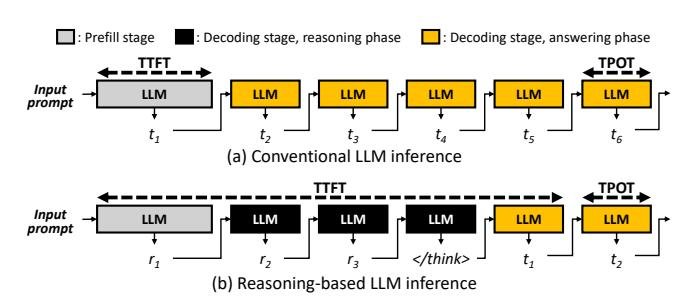

# I. INTRODUCTION

Large language models (LLMs) [5], [8], [15], [37] have emerged as powerful tools for various natural language processing tasks. As these models evolve, their deployment for real-time applications has become increasingly important, with a particular focus on inference efficiency and user experience. In LLM inference, user experience is significantly influenced by two key performance metrics. *Time-To-First-Token* (TTFT) measures the latency between the query submission time and the time the first response token is received. *Time-Per-Output-Token* (TPOT), on the other hand, measures the generation speed of each subsequent token. Prior work has established that these metrics correlate strongly with user satisfaction and engagement [2], [18], [22], [26], [31], [40], [54], making them critical design objectives when LLMs are deployed.

These user experience metrics are directly tied to the underlying computational stages of LLM inference. As shown in Figure 1(a), conventional LLM inference consists of two distinct stages: (1) the *prefill* stage processes the entire input prompt in a single forward pass and primarily determines TTFT, while (2) the *decoding* stage generates tokens autoregressively, directly influencing TPOT. This clear distinction between stages has enabled prior works to develop targeted optimization strategies that align the prefill stage and decoding stage with user satisfaction metrics. Moreover, recent serving

Fig. 1: Comparison of how TTFT and TPOT are defined in conventional LLMs versus reasoning-based LLMs. TTFT is the latency between the query submission time and the time the first "user-visible" response token (t1) is received by the user. (a) In conventional LLMs, this first user-visible token is generated at the end of the prefill stage, so TTFT equals the prefill-stage latency. (b) In contrast, for reasoningbased LLMs, TTFT is the sum of the prefill-stage latency, the latency of the reasoning phase, and the latency from the end of the reasoning phase to the generation of the first answering token.

systems leverage the distinct computational characteristics of the prefill and decoding stages to better meet *service-level objectives (SLOs)* for TTFT and TPOT through disaggregated execution of prefill and decoding stage. [34], [39], [43], [54].

Although these approaches have been effective for conventional LLMs, the research landscape has evolved significantly with the emergence of *reasoning*-based LLMs [16], [28], [38], [45]. Reasoning models incorporate Chain-of-Thought (CoT) techniques [12], [46], [47], [49], [50], [55], which have gained tremendous popularity for their ability to solve complex problems by explicitly generating *intermediate* reasoning steps "before" producing final answers. We observe that this fundamental shift in how models generate outputs introduces new challenges for inference optimization, as detailed below.

Unlike conventional LLMs, reasoning-based LLMs produce intermediate *reasoning tokens* that represent step-by-step problem-solving, followed by *answering tokens* that convey the final outcome (Figure 1(b)). This distinction disrupts the conventional relationship between performance metrics (i.e., TTFT and TPOT) and the serving pipeline stages (i.e., prefill and decoding stages). Specifically, in reasoning-based LLMs, the decoding stage itself is divided into two functionally distinct phases: a *reasoning phase*, where reasoning tokens are generated, and an *answering phase* that produces the final answering tokens. The key insight here is that the performance and SLO requirements differ between these two phases. Because the user does not require direct insight into

∗Work done while at KAIST.

the model's internal reasoning tokens, the top priority is to expedite the reasoning phase as fast as possible, reducing the time it takes to generate the model's reasoning tokens before the final answering tokens start streaming in. By minimizing the reasoning phase latency, the serving system can begin transmitting the user-visible tokens (i.e., the answering tokens) earlier, improving the user-perceived responsiveness by minimizing the latency to generate the first meaningful answering token. In contrast, the answering phase just has to be "*fast enough*" to ensure a smooth and prompt user experience, as it can tolerate somewhat looser throughput targets compared to the user-hidden reasoning phase. In other words, once the user begins seeing the answering tokens, maintaining a modestly high streaming rate is often sufficient for good user experience. Overall, TTFT in a reasoning model effectively encompasses not only the prefill stage but also the decoding stage of potentially numerous intermediate reasoning tokens (which are not necessary for the user to comprehend the final answer) and the latency from the end of the reasoning phase to the generation of the first answering token (Figure 1(b)).

To this end, we present PASCAL, a phase-aware scheduling algorithm that optimizes the distinct requirements of the reasoning and answering phases to enhance user experience while maintaining serving throughput. Our characterization of reasoning-based LLMs reveals the following key observations where (1) the absolute latency of the decoding stage, which directly impacts the reasoning model's TTFT, is highly sensitive to interruptions in the execution pipeline, while (2) its TPOT requirements can be maintained much more robustly with greater scheduling flexibility. Building on this insight, PASCAL introduces a phase-aware, hierarchical scheduling architecture. Our proposal explicitly partitions the decoding stage into reasoning and answering phases, applies distinct scheduling priorities to each, and enables instance-level load balancing to address the unique challenges of serving reasoning models. Through extensive evaluation on state-of-the-art reasoningbased LLMs, we show that PASCAL not only reduces the time to first answering token but also preserves or improves SLO satisfaction during the answering phase.

