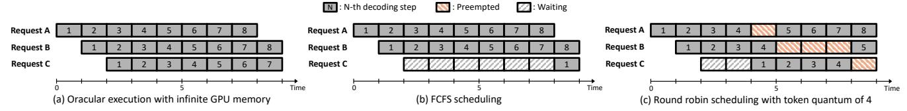
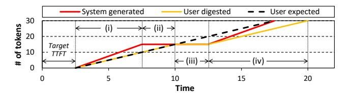
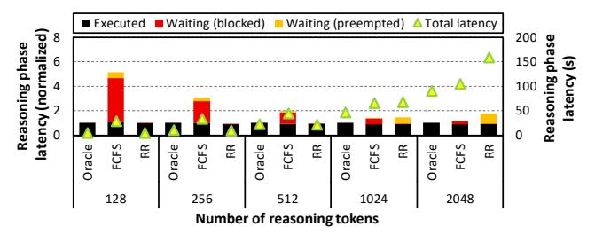
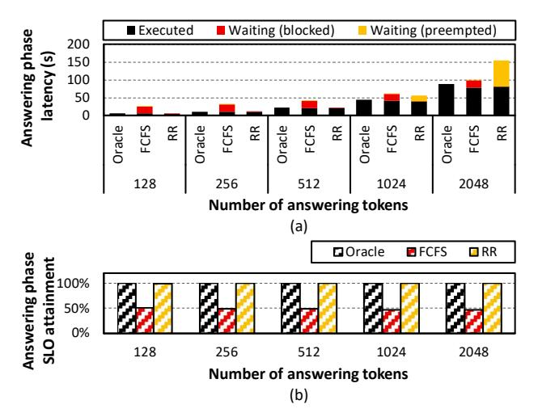
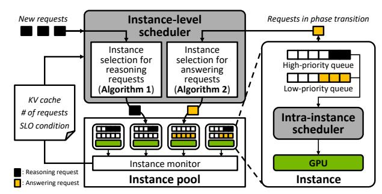
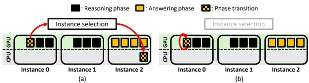

# II. BACKGROUND

## *A. LLM Serving Metrics and Execution Phases*

LLM serving systems are commonly evaluated using two critical performance metrics: *Time-To-First-Token* (TTFT), which measures how quickly a user receives the first generated token, and *Time-Per-Output-Token* (TPOT), which quantifies the generation speed once decoding begins. These metrics correspond to distinct points in the response timeline, aligning with the two computational stages of LLM inference: the prefill and decoding stages (Figure 1(a)).

During the prefill stage, the model processes the entire input prompt in a single pass, generating key-value (KV) representations (referred to as KV caches) for all tokens, and generating one output token (e.g., t<sup>1</sup> in Figure 1(a)). This stage is compute-intensive, exhibits high parallelism, and directly determines TTFT in conventional LLMs. The subsequent decoding stage auto-regressively generates output tokens by reusing the KV caches and incrementally updating them with each newly generated token. This stage is known to be memory-bandwidth-bound and determines TPOT. In practice, LLM serving systems define a *service-level objective (SLO)* to ensure a responsive user experience, typically targeting a TTFT of a few seconds or less and a TPOT of 5–10 tokens per second to align with human reading speeds [18], [31], [54].

## *B. Need for Blocking & Preempting Requests in LLM Serving*

Modern LLM serving systems employ *continuous batching* [51], where new inference requests are incrementally added to the currently running batch at each decoding step. During decoding, however, the KV cache grows as new tokens are generated. Given limited GPU memory, the number of concurrent requests that can be batched is therefore constrained by the cumulative KV cache footprint [4], [7], [42], [52], [53]. Consequently, when GPU memory becomes saturated, the serving system must either *block* newly arriving requests or *preempt* (evict) in-flight requests to free GPU memory. Concretely, blocking occurs when an incoming request cannot be scheduled due to insufficient memory; it waits in the queue until enough KV cache space is released by completing requests. Because execution cannot begin until admission, this queuing delay inflates the request's TTFT. Preemption, in contrast, temporarily evicts an executing request; its KV cache is offloaded to CPU memory and execution is suspended. The request later resumes once sufficient GPU memory becomes available, reloading its KV cache to the GPU. Since preemption halts token generation, it increases TPOT.

## *C. LLM Scheduling Policy*

An LLM serving system's scheduling policy determines which requests' KV caches can remain resident in GPU memory and which should be blocked or preempted (and thus offloaded) to preserve GPU memory space. Early systems such as vLLM [27] rely on a simple *First-Come-First-Served* (FCFS) scheduling policy that batches requests in arrival order. When GPU memory is exhausted under FCFS, the most recently arrived requests are preempted by offloading their KV caches to CPU memory. FCFS then blocks incoming requests until GPU memory becomes available, and preempted requests are resumed after their KV caches are reloaded from CPU to GPU memory. This mechanism significantly impacts TTFT, as new requests must wait for memory to free up, suffering from Head-of-Line (HoL) blocking where earlier long-running requests delay the servicing of later ones. Figure 2(a) illustrates an ideal scenario without GPU memory constraints, where Request C can be immediately batched with earlier requests. In contrast, Figure 2(b) shows a case where Request C must wait for Requests A and B to complete, resulting in an excessive TTFT of 7 time units. This is particularly problematic, as modern LLM serving systems define SLOs for both TTFT and TPOT to ensure responsiveness. FCFS inherently increases the



Fig. 2: Timeline illustrating how the serving system handles requests under three different scenarios. We assume that Request A, B, and C arrive at times 0, 1, and 2, respectively, and that the GPU memory capacity allows at most two requests to be batched simultaneously. (a) With oracular execution under infinite GPU memory, there is no limit on how many requests can be batched, so each request begins execution immediately upon arrival, and no preemption occurs. (b) Under FCFS scheduling, the first two requests (A and B) are batched, while C must wait. Request C joins the batch only after A finishes decoding, yielding a TTFT of 7 time units. (c) In round-robin (RR) scheduling, each request decodes a fixed quantum of four tokens before being preempted. Request C waits for 2 time units, joins the batch when Request A is preempted at time 4, and is itself preempted after producing four tokens at time 8.

risk of violating TTFT objectives due to HoL blocking under GPU memory pressure.

To address this limitation, recent work proposes various SLO-aware schedulers [14], [26], [31], [48]. One line of this research explores *time-sharing* within a single serving instance. In this context, a serving instance is the software abstraction in LLM serving frameworks that serves as the unit of execution and manages a replica of the model weights, coordinating access to shared GPU resources. Time-sharing schedulers [26], [31], [48] utilize preemption to allocate GPU time slices to concurrent requests, preventing any single longrunning request from monopolizing the GPU memory. In addition to mitigating HoL blocking and improving TTFT, these approaches also help maintain acceptable TPOT by enabling fair resource allocation during decoding. A canonical example of time-sharing scheduler is the classical round-robin (RR) algorithm. In this approach, the scheduler assigns each request a fixed token quantum. Once a request consumes all its assigned quantum, its scheduling priority is lowered. If the GPU memory becomes limited, the scheduler can preempt the lowest-priority requests by offloading their KV caches to CPU memory. This frees up memory, allowing newly arrived requests to be admitted into the batch and begin decoding, thereby reducing their TTFT. More advanced schedulers are based on the same key insight, with priorities determined by different heuristics, for example, the likelihood of SLO violation [31], the number of generated tokens per request [26], or estimated completion deadlines [48]. As shown in Figure 2(c), the earliest request, Request A, is preempted by the scheduler after generating a predefined token quantum (4 tokens in this example). This frees sufficient memory for Request C to join the batch and generate its first token within 3 time units.

An unfortunate side effect of time-sharing schedulers is that they can cause irregular token-generation rates. In Figure 2(c), for instance, Request B is preempted for 3 time units, increasing the latency between its fourth and fifth tokens and potentially degrading user experience. Prior work [31] addresses this issue using a *token pacer*. The token pacer temporarily buffers tokens when they are generated in bursts and tries to release them at a steady rate whenever the request is idle due to preemption, thereby smoothing the output rate perceived by the user. To quantitatively measure how well



Fig. 3: An example token serving scenario with QoE measurement, where token delivery begins at the target TTFT without additional delay. (i) The serving system initially generates tokens (red line) faster than the user's expected reading pace (black dotted line), causing tokens to be buffered by the token pacer. The user consumes tokens at their own pace, represented by the user digested line (yellow). (ii) When the serving system is temporarily paused, the user continues consuming the buffered tokens. (iii) Once all the tokens kept in the buffer are depleted, the user experiences starvation until token generation resumes. (iv) Once token generation resumes, the user continues consuming tokens at a steady pace, although the user's token digestion timeline remains behind the expected schedule due to the earlier delay experienced when the serving system paused. QoE is measured by computing the ratio between the area under the user digested token curve (yellow) and the area under the user expected curve (black dotted line).

the serving system's token generation rate aligns with the user's token consumption rate, [31] introduced the *Quality-of-Experience (QoE)* metric, which more accurately reflects SLO attainment than the conventional average TPOT measure. QoE combines two factors: (1) whether each request meets the target TTFT, and (2) how closely the effective token generation speed delivered to the user matches the target TPOT, accounting for the effects of token pacing. Figure 3 illustrates how QoE is measured, which reflects how closely the token generation rate aligns with the user's expected responsiveness. QoE is normalized to the interval [0,1] and a score of 1 indicates perfect alignment, while lower values suggest delays or starvation in token delivery (e.g., the example in Figure 3 exhibits a QoE value less than 1 due to the lagging of token digestion timeline vs. the user expected timeline).

#### D. Rethinking TTFT and TPOT in Reasoning-Based LLMs

Reasoning-based LLMs generate more accurate responses and solve complex problems by incorporating techniques like Chain-of-Thought (CoT) [46], [47], [50], [55], in which models explicitly work through intermediate reasoning steps before arriving at final answers. This approach mimics human

problem-solving by breaking down complex tasks into logical sequences. Over time, several reasoning algorithms have emerged, ranging from structured approaches such as tree-structured reasoning [50] to explicit prompting methods [47]. More recently, the field has converged toward methods in which the reasoning process is fully integrated into a single decoding pipeline, exemplified by models such as DeepSeek-R1 [16] and OpenAI o3 [38]. These integrated reasoning-based LLMs automatically perform internal deliberation steps (i.e., the reasoning phase) within the same neural network architecture and inference process. They employ advanced training methods that enable the internalization of reasoning capabilities directly within the model architecture [16], [38].

These fundamental differences from conventional LLMs affect how serving metrics should be interpreted. In conventional LLMs, TTFT and TPOT map cleanly to two distinct execution stages: TTFT captures the latency of the prefill stage, while TPOT measures how quickly output tokens are generated during the subsequent decoding stage. As illustrated in Figure 1(a), conventional LLMs generate the first uservisible token  $(t_1)$  immediately after the prefill stage, so TTFT spans only the grey-colored block. In contrast, reasoning-based LLMs internally divide the decoding stage into two sub-stages: (1) a reasoning phase, which generates latent reasoning tokens not visible to the user, and (2) an answering phase, producing the user-visible answering tokens. As shown in Figure 1(b), a reasoning-based LLM first generates reasoning tokens  $(r_1, r_2,$ and  $r_3$ ) before the answering phase begins at  $t_1$ . As a result, the latency to generate these reasoning tokens contributes to TTFT, even though they occur during decoding. That is, TTFT of reasoning-based LLMs consists of sum of the prefill-stage latency, the latency to execute the reasoning phase, and also the latency from the end of the reasoning phase to the generation of the first answering token (Figure 1(b)). Consequently, the decoding stage now contributes to both TTFT (during the reasoning phase) and TPOT (during the answering phase), breaking the conventional one-to-one mapping of TTFT to prefill and TPOT to decode. For the remainder of this paper, we define the reasoning phase as encompassing both the prefill stage and the generation of reasoning tokens within the decoding stage, as both contribute to the latency before the first answering token becomes visible to the user.

#### III. CHARACTERIZATION AND MOTIVATION

#### A. Methodology

This section characterizes how different scheduling policies impact reasoning-based LLM inference. We present key insights that inform efficient scheduling decisions for reasoning-based LLMs, with a particular focus on optimizing user experience. All experiments in this section were conducted on a server node hosted by Intel Xeon Platinum 8558 CPU (with 256 GB DDR5 DIMM) communicating with an NVIDIA H100 GPU (with 96 GB HBM) communicating over PCIe 5.0. For LLM serving, we employ vLLM v0.6.1 [27].

Workload. We conducted experiments using DeepSeek-R1-Distill-Qwen-32B [9], [16], an open-source LLM designed



Fig. 4: (Left axis) Breakdown of average reasoning phase latency across oracle, FCFS, and RR scheduling policies for varying numbers of reasoning tokens (x-axis), normalized to the oracle latency at each reasoning token count. Executed (black) denotes time the request actively ran on the GPU without being blocked (red) or preempted (yellow). (Right axis) Corresponding average absolute latency in seconds, indicated by green triangles.

for reasoning tasks. To clearly characterize and motivate how different scheduling decisions affect the SLO metrics of the reasoning-based LLMs, we construct synthetic workloads as follows. Two separate experiments are conducted independently, each focusing on either the reasoning phase (Figure 4) or the answering phase (Figure 5). In each experiment, our LLM serving system processes a total of 300 requests, with request arrivals following a Poisson distribution. The first experiment targets the reasoning phase (Figure 4) where all requests have a fixed input prompt length of 128 tokens, while the reasoning token length is randomly selected between 128 and 2048 tokens. This setup allows us to isolate how different scheduling policies impact the performance of the reasoning phase under varying reasoning token lengths. In the second experiment characterizing the answering phase (Figure 5), we assume that all requests have already completed the execution of both prefill and the reasoning phase (the combined length of prefill and reasoning tokens is fixed at 128 tokens), and that their corresponding KV caches are already generated during previous execution. Under this setting, each request generates answering tokens with lengths ranging from 128 to 2048, which is chosen randomly, allowing us to analyze how different scheduling policies affect SLO attainment during the answering phase.

Scheduling policy. To demonstrate how GPU memory constraints influence scheduling efficacy, we compare two scenarios: (1) an *oracle* configuration with sufficient memory to hold the KV caches of all 300 requests simultaneously, allowing the scheduler to never have to block or preempt requests due to GPU memory limits, and (2) a memory-constrained configuration. In our NVIDIA H100 (96 GB) GPU based system, the full-capacity setting can accommodate all KV caches concurrently, so we treat it as the oracle configuration with no performance degradation attributable to memory limits. To emulate a realistic serving environment with GPU memory constraints, we cap the GPU memory available for KV cache allocation to 50% of the oracle capacity and schedule requests based on FCFS or RR, which will block incoming requests or preempt ongoing ones once memory is exhausted (Figure 2).



Fig. 5: (a) Answering phase latency breakdown across varying numbers of answering tokens and (b) the corresponding SLO attainment rate. The SLO target for the answering phase is determined by two factors: (1) the latency between the end of the reasoning phase and the generation of the first answering token (henceforth referred to as *Time-To-First-Answering-Token* (TTFAT)), and (2) whether the answering token generation rate meets the TPOT target. As such, per our definition of QoE in Figure 3, the answering phase's QoE is determined by the target values of TTFAT and TPOT. Following prior work [54], we set the target TTFAT and TPOT values to 0.25 seconds and 100 milliseconds, respectively. A request violates the SLO if its QoE score falls below 0.95.

#### B. Characterization

Reasoning phase. Figure 4 illustrates how blocking and preemption aggravate reasoning phase latency relative to the oracle scenario (Figure 2(a)). Unlike conventional LLMs where TTFT is determined solely by the prefill stage, reasoning-based LLMs produce the first (user-visible) answering token only after all reasoning tokens are generated. Consequently, TTFT spans not only the prefill stage but also the entire decoding of reasoning tokens and can far exceed the sub-second TTFT SLO typical of conventional LLMs, making timely completion of the reasoning phase critical for user satisfaction. Figure 4 therefore focuses on how scheduling policies shape reasoning phase latency under memory sufficiency (oracle) vs. memory pressure (FCFS, RR). As shown, both blocking (FCFS) and preemption (RR) add directly to reasoning phase latency, especially when limited GPU memory prevents uninterrupted execution. Under FCFS, blocking inflates latency because a request must wait behind long-running ones whose KV caches remain resident until completion. This effect is most pronounced for short reasoning requests (e.g., 128 reasoning tokens), where wait time dominates and latency increases by up to  $5.14\times$  over the oracle. In contrast, RR avoids outright blocking by interleaving requests, but frequent preemptions fragment execution. For long reasoning requests (e.g., 2048 reasoning tokens), RR increases latency by up to 1.75× vs. uninterrupted oracle execution. Because RR enforces a fixed token quantum, long requests cannot retain continuous residency of their KV caches in GPU memory, accumulating repeated interruption and waiting intervals. Similar

degradation is expected for other time-sharing policies that necessarily preempt long requests to preserve fairness.

In summary, both blocking (FCFS) and preemption (RR and other time-sharing schedulers) during the reasoning phase substantially delay generation of the first answering token under GPU memory constraints, severely degrading TTFT and motivating memory- and phase-aware scheduling strategies.

**Answering phase.** Figure 5 shows how scheduling policies affect user experience during the answering phase. Figure 5(a) shows a breakdown of the latency of answering phase across varying numbers of answering tokens and Figure 5(b) shows the corresponding SLO attainment rate. In reasoning-based LLMs, TTFT is measured as the latency until the "first" answering token is generated. Unlike the reasoning phase, where any additional delay directly increases TTFT, the answering phase can still meet its SLO if (1) the latency from the end of reasoning to the first answering token does not exceed the Time-To-First-Answering-Token (TTFAT) target, which is set to be near-instantaneous to ensure an immediate transition from the reasoning phase to the answering phase, and (2) the steady-state answering token generation rate meets the TPOT target (Figure 3)1. Because SLO satisfaction is thresholdbased rather than minimizing absolute latency (i.e., latencies only need to be fast enough), appropriate scheduling can preserve user experience even when execution is fragmented by blocking or preemption.

Under FCFS, blocking forces requests to wait behind longrunning ones (Figure 5(b)), substantially increasing TTFAT and lowering SLO attainment across all answering token lengths (Figure 5(b)). In contrast, RR eliminates head-ofline blocking by interleaving execution, allowing all requests to start promptly to keep TTFAT low, while also sustaining adequate token generation rate. Consequently, SLO attainment remains high for most configurations with RR. Notably, at 2048 answering tokens, RR incurs higher total answering phase latency than FCFS due to preemptions (Figure 5(a)), yet achieves the same SLO attainment as the oracle because both its TTFAT and per-token generation rate remain within thresholds. This shows that during the answering phase, timesharing policies like RR can tolerate preemption overhead while still preserving user experience, unlike their detrimental impact during the reasoning phase, as highlighted in Figure 4.

In summary, answering phase SLOs are robust to moderate RR-induced preemption overhead as long as threshold metrics are met, making time-sharing schedulers like RR preferable to blocking policies like FCFS for this phase.

¹Our target TPOT was selected from a user-centric perspective rather than being tied to GPU performance or model specifications. This decision is grounded in the principle that user satisfaction is largely determined by whether the LLM produces output tokens at a rate comparable to typical human reading speeds. In other words, even if future GPUs provide 10× greater compute capability, we do not expect TPOT to decrease proportionally, as there is little benefit in "over-optimizing" it beyond the threshold of human perception. Likewise, even with future LLMs that demand 10× more computation, we expect TPOT to remain within the 100 ms range. Prior studies [18], [22], [31], [32] have similarly argued that a TPOT of around 100 ms (which is already faster than human reading speeds) is sufficient to provide a natural, conversational experience.

#### C. Motivation

Our analysis reveals that reasoning and answering respond very differently to blocking and preemption. In the reasoning phase, blocking or preemption directly stretches reasoning latency, delaying the generation of the first answering token and degrading TTFT-driven user experience. In contrast, limited preemption does not necessarily harm user experience in the answering phase. As long as the first answering token appears promptly after reasoning phase's completion and the steady-state answering token generation rate meets the required throughput threshold, SLOs remain satisfied even if execution is fragmented. Time-sharing policies (e.g., RR) therefore mitigate head-of-line blocking and preserve answering-phase QoE, despite incurring preemption overhead.

In summary, two key insights emerge. (1) The reasoning and answering phases exhibit fundamentally different sensitivities: reasoning latency is highly interruption-sensitive, while answering QoE is threshold- (not absolute latency-) sensitive, and (2) time-sharing is especially effective in the answering phase because it avoids blocking without violating SLO thresholds.

Existing scheduling policies targeting conventional (single-phase) LLM inference ignore the distinct latency vs. threshold sensitivities of reasoning-based workloads. This gap motivates phase-aware scheduling that adapts its strategy, minimizing interruptions during reasoning while employing fair time-sharing during answering to jointly optimize reasoning latency and answering phase user experience.

## IV. PASCAL: A PHASE-AWARE SCHEDULING ALGORITHM FOR SERVING REASONING-BASED LLMS

PASCAL is a scheduling system that improves the user experience for reasoning-based LLMs on multi-instance LLM serving systems. An instance is the software abstraction in LLM serving frameworks that serves as the unit of execution, managing a replica of the model weights and coordinating access to shared GPU resources. PASCAL schedules inference requests differently in the reasoning and answering phases by exploiting their asymmetric sensitivity to preemption. Specifically, it minimizes interruptions during the reasoning phase to reduce TTFT and permits controlled preemption during the answering phase without compromising SLO goals for TPOT.

#### A. High-level Overview

We take a top-down approach to explain PASCAL's twolevel scheduling architecture (Figure 6). The *instance-level scheduler* selects which GPU instance should service each incoming request. The *intra-instance scheduler* then orchestrates request batching and kernel execution within the instance.

The instance-level scheduler employs two placement algorithms, one for each phase of a request: reasoning and answering. When a request first arrives, it enters the reasoning phase<sup>2</sup>. During this phase, the request generates intermediate reasoning tokens from the input prompt until reasoning completes. For requests in this phase, the scheduler selects the

<sup>2</sup>For clarity, we collectively refer to the prefill stage and the subsequent reasoning phase of decoding as the reasoning phase.



Fig. 6: Overview of PASCAL. The system comprises an instance-level scheduler and a pool of serving instances. All incoming requests first enter the reasoning phase and are routed to the appropriate instances using Algorithm 1. After a request transitions to the answering phase, the instance-level scheduler selects a (possibly different) instance using Algorithm 2. Within each serving instance, an intra-instance scheduler manages routed requests through high- and low-priority queues and orchestrates their execution. An instance monitor continuously collects runtime metrics to guide these placement decisions.

instance that minimizes reasoning latency while preserving the performance of other requests already executing on each GPU instance. After the system's instance monitor detects that the most recent token generated by an existing request is the special token signaling the end of the reasoning phase (e.g., the <\think> token in DeepSeek-R1), the scheduler re-examines whether migrating that request to a different instance would be beneficial. Such migration aims to minimize any delay after reasoning completes, satisfy answering-phase SLOs, and reduce interference with co-located requests.

Based on the instance-level scheduler's decisions, a single GPU instance may host requests from both the reasoning and answering phases. To manage these mixed phase requests effectively, PASCAL deploys a local intra-instance scheduler that coordinates execution across phases. It prioritizes the scheduling of reasoning requests by placing them in a high-priority scheduling queue, since their latency directly affects TTFT and is highly sensitive to blocking and preemption. Answering requests are inserted to a low-priority queue, and the scheduler time-shares the remaining GPU resources among them and seeks to preserve a consistent user experience. Requests within the same (high-/low-priority) queue are scheduled based on a round-robin policy.

#### B. Instance-level Scheduler

The instance-level scheduler selects the GPU instance for each request based on its current phase and SLO requirements. Consequently, the scheduler uses two distinct instance-selection algorithms, one per phase, each conditioned on the current status of an instance's request queues. As noted earlier, reasoning requests are routed to the high-priority queue within a GPU instance, whereas answering requests are routed to the low-priority queue. Accordingly, PASCAL employs two algorithms: one for assigning new reasoning requests (Algorithm 1) and another for determining whether requests that have entered the answering phase should be migrated to a different instance (Algorithm 2). These algorithms consider each instance's queue occupancy and the characteristics of

#### Algorithm 1 Instance Selection for Reasoning Requests

```
1: Input: Set of instances I, where for each instance i ∈ I, we have:
     ti: whether all answering requests meet their SLOs (TRUE/FALSE)
     mi: total memory occupied by KV cache (GPU + CPU)
2: Output: Selected instance to schedule the reasoning phase request
3: E ← { i ∈ I | ti = TRUE }
4: if E = ∅ then
5: E ← I
6: end if
7: selected ← argmini∈E(mi)
8: return selected
```

individual requests, aiming to balance memory usage while respecting the phases' differing latency sensitivities.

Instance selection for reasoning requests. As described in Algorithm 1, the instance-level scheduler first inspects each GPU instance's token pacer to determine whether answering requests are being served at the expected user-perceived rate. If the token pacer reports insufficient remaining tokens (indicating token generation is slower than the user's expected pace), the instance is deemed to be violating its answering-phase SLO and is excluded from the candidate set (i.e., t<sup>i</sup> = FALSE in line 3). Recall that answering requests are assigned a lower priority than the reasoning requests and thus must rely on whatever GPU memory remains once the high-priority queue has allocated KV cache space for reasoning requests. Therefore, an instance already missing its answering-phase SLO implies that available GPU memory is insufficient to support the current answering requests. Consequently, scheduling additional high-priority reasoning requests to such instance would only intensify memory pressure and further delay answering requests. Among the remaining SLO-compliant candidate instances, the scheduler selects the instance with the smallest KV cache footprint m<sup>i</sup> (line 7). A smaller KV cache footprint generally indicates fewer active requests, making the instance more amenable to accommodating additional new requests without interfering with requests already under execution. Moreover, smaller KV cache correlates with shorter attentionlayer execution time, increasing the likelihood of meeting TTFT for new reasoning requests, further justifying this design decision. When no instance meets the SLO condition (i.e., E = ∅ in Algorithm 1), the scheduler still chooses the instance with the minimum m<sup>i</sup> to minimize additional performance degradation for in-flight requests (lines 4–5).

Instance selection for answering requests. During the execution of a reasoning request, the instance monitor in Figure 6 continuously checks for the special token (e.g., <\think>) that marks the transition to the answering phase. When this token appears (signaling that the model is ready to emit answer tokens), the instance-level scheduler migrates the request to a new GPU instance according to Algorithm 2, unless our adaptive migration policy (discussed further at the later part of this subsection) overrides such migration decision. As with Algorithm 1, any instance that is currently failing to meet answering-phase SLOs (i.e., t<sup>i</sup> = FALSE) is removed from the candidate set (line 3). From the remaining candidates, the scheduler selects the instance with the fewest active reasoning-

#### Algorithm 2 Instance Selection for Answering Requests

```
1: Input: Set of instances I, where for each instance i ∈ I, we have:
      ti: whether all answering requests meet their SLOs (TRUE/FALSE)
      ri: number of reasoning requests in high-priority queue
      ai: number of answering requests that has not exhausted the first time
   quantum
2: Output: Selected instance to schedule the answering phase request
3: E ← { i ∈ I | ti = TRUE }
4: if E = ∅ then
5: E ← I
6: for all i ∈ E do
7: ri ← ri + ai
8: end for
9: end if
10: selected ← argmini∈E(ri)
11: return selected
```



Fig. 7: Adaptive migration example. (a) Algorithm 2 initially recommends migrating the phase transitioning request to Instance 2. Because GPU memory in Instance 2 is fully utilized (indicated by four yellow blocks) while Instance 0 still has free memory (two empty slots), (b) the system overrides Algorithm 2's migration decision and continues executing the phase transitioning request in Instance 0.

phase requests (ri) to minimize the chance that the answer request is delayed by higher-priority reasoning requests (line 10). Because reasoning requests reside in the high-priority queue and allocate GPU memory first, an instance hosting many such requests often leaves too little GPU memory for a new answering request. Insufficient GPU memory forces answering requests either to spill their KV cache to CPU memory or to wait until resources are freed—both of which compromise answering-phase SLOs. This motivates selecting the instance with the smallest r<sup>i</sup> for answering requests.

If no instance satisfies the SLO condition, the scheduler selects the one with the smallest r<sup>i</sup> + a<sup>i</sup> (lines 4–9), where a<sup>i</sup> denotes the number of answering requests in the low-priority queue that have not yet exhausted the first time quantum (i.e., they are more likely to be scheduled next under the RR policy). As described in Section II, RR scheduling is fairnessoriented; the more "fresh" answering requests (ai) an instance holds, the more the newly arriving answering request must compete for scheduling opportunities, an undesirable outcome when selecting the instance for new answering requests. Our empirical evaluation confirms that PASCAL's such heuristic based instance-selection algorithm, which considers both r<sup>i</sup> and a<sup>i</sup> , achieves better load balancing and SLO attainment than using r<sup>i</sup> alone under these scenarios.

Adaptive migration. Although requests are generally migrated to a new instance when they transition to the answering phase, strictly following Algorithm 2's decision can lead to suboptimal resource utilization in certain scenarios. Therefore, PASCAL introduces an *adaptive* migration mechanism that determines whether to migrate a request during phase transitions based on the current memory availability. This strategy becomes particularly important in scenarios where reasoning and answering requests are distributed asymmetrically across instances. Figure 7(a) shows one such case when reasoning requests are distributed across many instances, while answering requests are concentrated on a certain instance. Since answering requests are directed to instances with the fewest active reasoning requests (Algorithm 2), they tend to accumulate on the same instance (Instance 2). In this case, when a reasoning request in Instance 0 transitions to the answering phase, Algorithm 2 likely selects Instance 2 based on the number of reasoning requests, which lacks available GPU memory. Despite Instance 0 having sufficient memory to handle the answering phase, migrating the request to Instance 2 can cause the unnecessary execution stall for answering requests in Instance 2. To handle this case, at phase transition, if the current instance has sufficient GPU memory while the one selected for answering phase does not, PASCAL preserves the request on the current instance rather than migrating it to the selected one (Figure 7(b)). This avoids unnecessary CPU offloading and KV cache transfer overhead, and it better utilizes available GPU memory.

KV cache transfer overhead. Migrating a request at phase transition requires transferring its entire KV cache from the source to the destination instance. Unlike prior work [39], [44], [54], which can overlap KV cache transfers with computation, reasoning-based LLMs cannot predict phase transitions in advance, as transitions only become apparent when the model emits specific tokens (e.g., <\think>) that indicate the end of the reasoning phase. In reasoning-based LLMs, this transfer latency can impact TTFT because the server must wait for both the completion of the reasoning phase and the subsequent KV cache migration *before* generating the first answering token. Nonetheless, we find that the overhead of KV cache transfers is negligible in reasoning models, as TTFT is primarily dominated by reasoning phase latency. For example, Patel et al. [39] analyzed KV cache transfer latency in a disaggregated LLM serving system and reported a one-time transfer delay of approximately 40ms for 2,048 tokens. To put this in context, consider a per-token latency of 30ms [39], which reflects an aggressive decoding speed. Because reasoning phases can involve hundreds or even thousands of tokens—equating to several tens of seconds of reasoning latency—the one-time KV cache transfer constitutes only a small fraction of the total TTFT and is therefore negligible.

