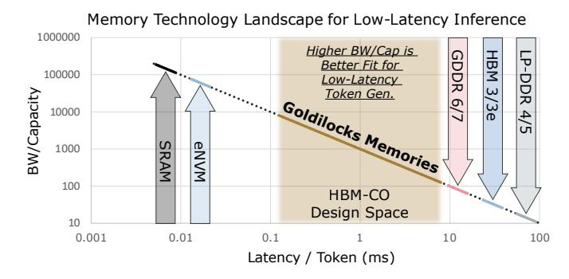
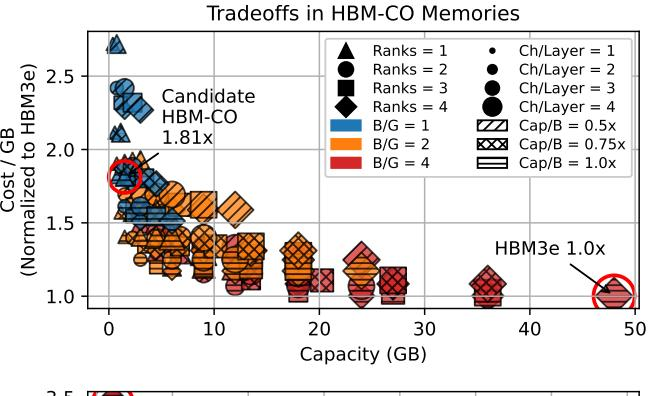
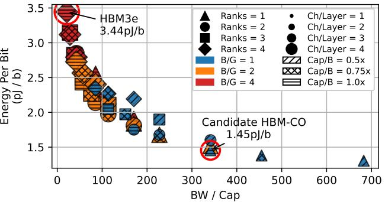
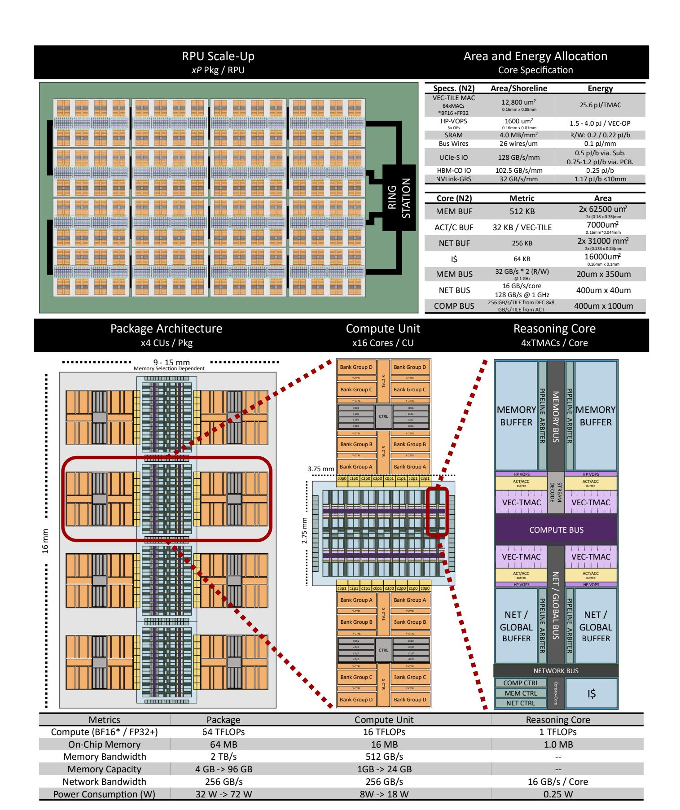
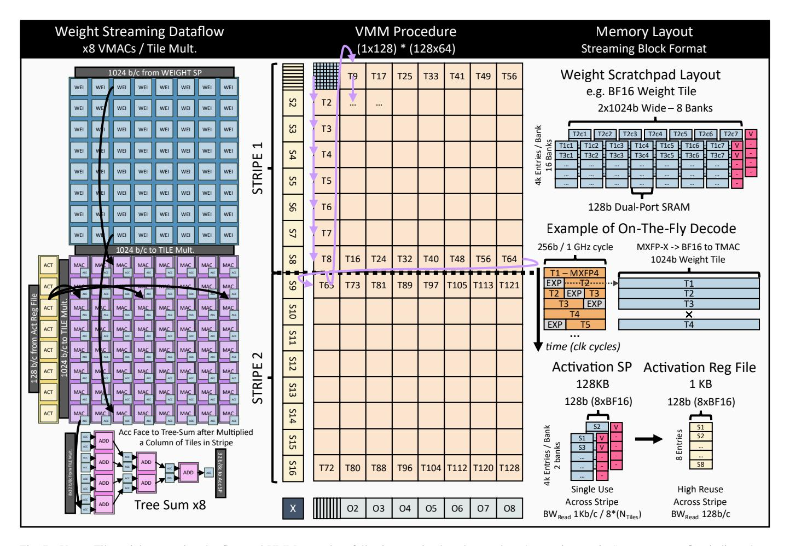

# III. CAPACITY OPTIMIZED HIGH BANDWIDTH MEMORY

Low-batch token generation latency is fundamentally limited by memory bandwidth. For dense models like Llama3, consider the case where the model's memory footprint (weights and KV\$) fits perfectly within the systems memory capacity (100% capacity utilization). In this configuration, all memory capacity is actively used, and token generation latency is determined solely by how quickly that memory can be read. This scenario exposes a fundamental constraint: when memory is fully utilized, the minimum achievable latency is set by the ratio of bandwidth to capacity (BW/Cap). As a result, BW/Cap emerges as a key metric for evaluating and designing memory systems for bandwidth-bound inference. Higher BW/Cap enables faster access to the entire model, reducing latency and improving memory efficiency.

Fig. 4. Memory technology landscape comparing bandwidth per capacity versus latency per token with 100% capacity utilization for dense LLMs. A technology gap exists in the *Goldilocks* range for low-latency inference.

Modern memory systems fall short of the bandwidth-tocapacity ratios desirable for efficient low-latency inference. For example, achieving a 1ms token latency while fully utilizing memory would require a BW/Cap of approximately 1000, which is equivalent to 1TB/s per GB. In contrast, high-end memory technologies like HBM3e offer much lower BW/Cap ratios. For instance, a single HBM3e stack provides 1280GB/s of bandwidth and 48GB of capacity, yielding a BW/Cap of 27 [35]. To meet bandwidth targets, system designers must aggregate multiple stacks, which increases total memory capacity far beyond what the model requires and results in severe capacity underutilization. The fraction of memory actually used is proportional to the ratio between available and required BW/Cap. In this example, with a target of 1000 and available BW/Cap of 27, only 2.7% of capacity is effectively utilized.

This mismatch between the desired bandwidth and practical memory capacity defines the memory overprovisioning paradox: High-capacity DRAM-based memories like HBM, GDDR, and LP-DDR *buy bandwidth via capacity* – scaling and distributing weights across multiple memory modules to increase memory bandwidth, resulting in under-utilized capacity. Conversely, SRAM-based architectures *buy capacity via bandwidth* – offering extreme bandwidth, but struggling to fully utilize it due to excessive sharding across devices caused by limited storage density.

Figure 4 illustrates this design gap: no commercial memory technology occupies the high BW/Cap regime desirable for low-latency LLM inference.

Overprovisioned capacity also introduces energy and cost inefficiencies. Prior work [45] shows that 74% of HBM energy in streaming workloads is spent on internal data movement, with only 14% and 12% attributed to I/O and row activation. As capacity increases, internal wire lengths grow, raising energy per bit and reducing efficiency. In addition, memory cost scales with capacity due to more silicon area.

To address these challenges, memory capacity per device should become a tunable architectural parameter. LLMs differ widely in model size, sparsity, deployment context, and system constraints. Each use case has a different optimal BW/Cap profile, often beyond what current technologies can deliver.

Fig. 5. Tradeoffs in HBM-CO memories, illustrating that high-BW/Cap memories are up to ∼2.5x more energy efficient than an HBM3e device, but ∼1.8x the higher cost per GB.

Decoupling capacity from bandwidth would allow system designers to provision memory precisely for application needs, improving performance, efficiency, and cost-effectiveness.

*The Design Space of HBM-CO Memories:* To fill the memory technology gap for low-latency inference, we propose a new class of memory devices: *Capacity-Optimized High-Bandwidth Memories* (HBM-CO). We analyzed the HBM architecture and identified parameters that impact a stacked memory's bandwidth-to-capacity ratio [11], [29], [30].

*HBM Ranks and Layers:* Each rank consists of four stacked DRAM layers (dies). All layers in a rank contribute to higher memory bandwidth, each with separate channels. However, increasing the number of ranks adds memory capacity but does not increase bandwidth, since the interface is shared.

*HBM Channels and Pseudo-Channels:* A DRAM layer is partitioned into four channels, each of which is further split into two pseudo-channels (pCHs) for a total of eight pCHs per layer. The 8 pCH across 4 layers per rank fully saturate the memory bandwidth broken into a 32-pCh x 32b IO interface.

*HBM Bank Groups, Banks, and Sub-Arrays:* A pseudochannel contains four bank groups, each with four banks. To sustain the full 32 GB/s bandwidth per pCH, only one active bank per bank group is needed using innovations such as sub-array level parallelism [31]. Four active bank groups per pCH are pipelined to delivers 256 bits per 1 GHz. Banks are composed of subarrays, which contribute to total capacity but do not impact bandwidth.

*Key Insight to Change the BW/Cap of HBM:* HBMs achieve

peak bandwidth per shoreline with just one active bank per bank group per pseudo-channel. This means capacity structures such as sub-arrays per bank, banks per bank group, and ranks can be parameterized without changing bandwidth.

Modeling Energy and Cost for HBM-CO: We developed an analytical HBM-CO model to capture tradeoffs in bandwidth, capacity, energy, and cost. Energy per bit was broken into four components: (1) Row Activation: 0.18pJ/bit for streaming workloads [11], [45]. We conservatively model HBM-CO with HBM3 timing and activation energy, leaving potential bandwidth and energy gains from its smaller core-die and sub-arrays for a future physical design study. (2) Data Movement: 0.2pJ/bit/mm, estimated from intra-die routing distances derived from HBM core-die floorplans [35], [47], [54]. (3) TSV Traversal: 0.148pJ/bit/layer, based on 0.8pF TSV capacitance and switching energy [28]. (4) I/O Interface: 0.25pJ/bit, drawn from UCIe specs and HBM3e datasheets [16], [43]. Cost is normalized against an HBM3e baseline [49], [68], scaling against silicon area and accounting for non-amortized costs such as base-die logic and TSV footprint. At lower capacities, these fixed costs dominate, impacting cost per GB more significantly. We validate our HBM-CO model against HBM3e [43] reported 3.44pJ/bit.

**Design Space Takeaways:** Figure 5 visualizes the trade-offs in energy, cost, and BW/Cap for HBM-CO memories. A candidate Pareto-optimal HBM-CO memory has 768MB capacity, 256GB/s bandwidth (BW/Cap = 341), and 1.45pJ/bit energy. This device offers 2.4× lower energy per bit than HBM3e while maintaining the same bandwidth per shoreline (GB/s/mm). This candidate memory BW/Cap leads to an ideal token latency of 2.9ms per token, falling in the middle of the *Goldilocks* memory range of Figure 4. An HBM3e system with the same performance would only utilize 7.9% of its capacity for inference with a dense LLM.

This efficiency comes at a cost. The candidate is 1.81× more expensive per GB, seemingly violating the foundational DRAM principle of minimizing cost per bit. However, for low-latency inference, bandwidth per dollar is the important design metric. By trading 192× capacity and 1.81× higher price per GB, the resulting module is 35× lower cost overall, achieving 5× higher bandwidth per dollar than HBM3e.

## IV. COMPUTE FABRIC FOR LOW-LATENCY INFERENCE

Distributed Vector-Matrix Multiplication (VMM) is the core operation in LLM token generation. Given an input vector  $V \in \mathbb{R}^{1 \times K}$  and a weight matrix  $W \in \mathbb{R}^{K \times N} \colon O = V * W, \quad O \in \mathbb{R}^{1 \times N}$ . For low-latency inference, this computation must be parallelized efficiently across devices to maintain fast, pertoken response times. Prior work [65] has exploited the layered structure of AI models, where each layer's output serves as part of the input to the next. Consider a system comprising C number of cores. Sharding W along its columns ensures that each core computes a disjoint portion of the output vector. The weight matrix is partitioned such that each core stores  $W_i \in \mathbb{R}^{K \times \frac{N}{C}}$  and computes its corresponding output fragment  $O_i = V * W_i, \quad O_i \in \mathbb{R}^{1 \times \frac{N}{C}}$ 

Since each core holds a portion of the output vector O, which serves as the input to the next layer ( $O_i$  becomes  $V_i$ ), it can immediately begin computing on its local fragment for the next layer while simultaneously broadcasting its portion of V to other cores. This allows each core to progress with available data while receiving the remaining parts of V. This strategy mirrors Cannon's algorithm for distributed matrix multiplication, where data movement and computation are interleaved to maximize efficiency.

To further increase parallelism, rows of W (K-dimension) can be distributed across G cores in a processing groups. Using this approach, each core stores weight shard  $W_{j,i} \in \mathbb{R}^{\frac{K}{G} \times \frac{N}{C/G}}$  to compute a partial output  $O_{j,i}$ , requiring a reduction step to sum the intermediate results  $O_i = \sum_{j=1}^G O_{j,i}$ . This reduction will always appear on the compute-network critical path, unlike the prior network-broadcast.

Figure 6 illustrates the proposed RPU chiplet-based architecture, designed to accelerate distributed VMM for low-latency inference. The RPU tightly integrates compute and memory across multiple hierarchy levels – cores, compute units, packages, and ring stations – to form a scalable and efficient system architecture.

Compute Unit and Reasoning Core: The Compute Unit (CU) is the fundamental building block of the RPU, providing tightly coupled compute and memory resources. Each CU is constructed with one compute chiplet and two HBM-CO chiplets, connected through advanced packaging such as EMIB [40] or CoWoS-L [25]. The module provides dual 256 GB/s memory shorelines, delivering consistent bandwidth per interface while offering customizable HBM-CO capacity.

The particular HBM-CO chiplet visualized in Figure 6 is derived from the HBM core-die shown in Figure 2 of [47], compacted by reducing banks per group from four to one, ranks from four to one, channels per layer from four to one, but keeping four layers per rank. Physically, the design reduces the DRAM array region and channel shoreline proportionally, while the TSV, command, and peripheral logic regions are unscaled, occupying roughly one-third of the total die area.

The compute-to-bandwidth ratio for a CU was determined empirically for low-latency inference using MXFP4 formats. We found that 32 OPs/Byte maximized utilization (Figure 1); higher ratios offered little benefit and only increased design complexity, silicon area, and energy cost. Thus, each 256 GB/s shoreline requires 8 TOPs of compute throughput.

The 256 GB/s shoreline can easily accommodate 512 MAC units along the same horizontal span while leaving adequate space for routing – defining the *compute shoreline*. To reach the target 8 TOPs, we stack 16 rows of MACs, organized into 8 reasoning cores. Each reasoning core comprises four 8x8 tile-multipliers (TMACs) and connects to its own HBM-CO memory pseudo-channel delivering 32 GB/s of memory bandwidth. This vertical stacking keeps routing paths short and avoids congestion along the bandwidth edge. Using both the top and bottom chip edges doubles the number of cores per CU while preserving a balanced area-to-perimeter ratio.

Fig. 6. Proposed RPU system architecture for low-latency LLM inference, featuring a chiplet-based design that rebalances compute, memory, and network resources. Each level of the hierarchy, from core micro-architecture to compute units, packages, and ring-station scale-up, is co-optimized for energy-efficient, cost-effective, and scalable memory bandwidth.

Fig. 7. Vector-Tile weight streaming dataflow and VMM procedure following a stripe-based execution. Arrows in *Weight Streaming Dataflow* indicate how activations and weights are moved into TMAC unit – activations are broadcast across columns while weights are element-wise moved. The arrows in the *VMM Procedure* indicates the order tiles are processed – column-wise first until eight rows of tiles are processed, then the next column starts, proceeding until all the columns in a stripe are completed.

**Package Architecture:** Four CUs are integrated onto a single package substrate, each equipped with its pair of dedicated HBM-CO memories offering 2 TB/s of memory bandwidth. At the package level, compute chiplets form a segment of the outer ring hierarchy. Vector fragments within a CU are forwarded to neighboring CUs in the same package through energy-efficient, short-reach UCIe interconnects [16]. To minimize communication latency, each core includes a custom DMA engine optimized for fast inter-chiplet transfers, achieving latencies of ≤10 ns per CU-to-CU hop, which is similar to prior works [9], [23], [58], [71]. Each compute chiplet uses a unified UCIe-S physical interface with segmented drivers: in-package links run at low voltage and high frequency (0.5 pJ/bit), while off-package links operate up to 16 GT/s with 0.75-1.2 pJ/bit energy [16], [51], defining the system's outer-ring bandwidth at 128 GB/s/mm.

**RPU** Scale-Up: Multiple packages are soldered onto a PCB to form the outer ring topology, connected via a Ring Station. Communication between packages leverages PCB-routed interconnects, designed specifically for short-reach (<10 mm) data transfers. A secondary purpose of the Ring-Station is to

network outside the system (e.g., 100Gb Ethernet).

An RPU is defined as a scalable compute system, composed of multiple co-packaged CUs, assembled on a board. Similar to how GPUs scale across datacenter and edge deployments by varying the number of CUDA cores, RPUs scale by composing different numbers of CUs. Our modular architecture enables flexible configurations to meet diverse performance, capacity, energy, and cost targets.

## V. MICRO-ARCHITECTURE

## NUMA Domains and Data Dependent Synchronization:

A central design principle of our microarchitecture is a fully NUMA-based system. Each compute core within a CU forms an independent NUMA domain, without shared memory between cores. All data movement across domains is explicitly managed via software-programmable DMA engines and data-dependenct synchronization. This eliminates coherence overhead, enables deterministic execution, and ensures scalable performance for dataflow-dominated workloads like LLM inference. Thus, the RPU favors bespoke datapaths over generalized programming models.

*NUMA at All Scales:* Each core includes three programmable data pipelines, each operating within its local NUMA boundary. The Memory DMA transfers data between the core's dedicated HBM-CO memory channel and its memory buffer. The Compute DMA reads from memory or network buffers and feeds data into the compute pipeline. The Network DMAs manage all inter-core and inter-chiplet communication, linking each core to neighboring cores within a CU and the positionally aligned core in adjacent CUs. Incoming data is written to the network buffer and may be consumed locally and/or forwarded using custom forwarding instructions. This supports efficient collectives and data reuse across chiplets.

*Pipeline Arbiters:* We developed Pipeline Arbiters to synchronize decoupled memory, compute, and network pipelines. These lightweight, software-managed mechanisms are embedded within each core's SRAM buffer. Each SRAM buffer entry includes a 2-bit valid counter that tracks the expected number of asynchronous consumers. DMA operations are programmed with a *valid count* when writing and may optionally enable a *check valid* flag to stall if the target address is occupied. On the read side, consumers can use *check valid* to stall until data is ready and optionally decrement the valid counter after access. For example, a Network DMA may set *valid count=2* since activations will be consumed by (1) the compute pipeline and (2) asynchronously forwarded to neighboring cores.

To guarantee mutual exclusion, each buffer entry is accessed through a hardware-enforced arbitration mechanism that serializes requests from multiple consumers. Accesses are prioritized using a software-configurable policy, ensuring that only one DMA engine can read, write, or update the valid counter at a time. This enforces atomicity at the bufferentry level and prevents race conditions across the memory, compute, and network pipelines. By managing synchronization through software-defined counters and flags, Pipeline Arbiters enable fine-grained, data-driven execution between NUMA domains with blocking and non-blocking semantics.

*TMAC and HP-VOPs:* The vector-tile MAC (TMAC) is the core computational unit for accelerating the VMM kernel, as shown in Figure 7. Each TMAC consists of 64 MAC units arranged in an 8×8 array, performing BF16 multiplies with FP32 accumulations. This structure allows one activation vector to be broadcast across 8 columns of the weight matrix, computing 64 MACs per cycle using a weight-streaming, output-stationary dataflow.

To maximize on-chip reuse of activation data and minimize accumulation write-back pressure, the VMM algorithm is organized into stripes. A stripe is a groups of 8 vertically stacked tiles spanning all columns of the weight shard. Activation shards per stripe contains 64 BF16 values, stored in a dedicated register file close to the tile multipliers. These values are initially fetched from the network buffer, then reused across all tile columns before being retired.

The tile multipliers first iterate over the tile-rows within a stripe. After processing a column of tiles, the accumulated face is reduced via a column-wise (3-stage) tree sum. These results are written back to a local register file to be read back for the next stripe, leveraging the fact that each core typically operates on small output shards (<256 elements) in highly distributed VMMs. Once all the weight matrix columns of a stripe are computed, the next activation stripe shard is loaded from the network buffer, and the process repeats.

This striping approach is essential for three reasons: (1) Traversing columns first (inner-product style) would require the full activation vector to be stored on-chip, stalling compute during the vector broadcast across all CUs. (2) Traversing rows first (outer-product style) would result in high writeback bandwidth due to frequent partial sum updates. (3) By processing one stripe at a time, we minimize on-chip bandwidth requirements and enable fine-grained overlap of computation and communication; the next activation shard is collected in the network buffer while compute works on the current shard.

In addition to the tile multipliers, each core includes a general-purpose, high-precision (FP32) vector operations (HP-VOPs) accelerator, enabling support for key functions in LLM workloads (e.g., SiLU, GeLU, normalization, and rotary embeddings). Because overall performance is dominated by memory bandwidth, we can afford to allocate area to highprecision computation without significant impact on energy or latency. This enables numerical accuracy, particularly important for operations sensitive to precision loss such as attention.

*Stream Decoder:* To reduce latency and storage overhead, weight tiles are stored in compressed block formats in memory and transferred on-chip to the memory buffer by the memory DMA engine. Next, the compute DMA streams compressed weights into the *Stream Decoder*, which performs on-the-fly dequantization, converting block-quantized values into standard BF16. This continues until a full batch of 64 BF16 values is reconstructed, corresponding to a single weight tile. Once dequantized, the tile is broadcast across all active tile multipliers within the core via a 1024-bit wide compute bus.

Our stream decoder supports on-the-fly dequantization of multiple formats, including BFP [53], MxFP [15], and NxFP [39], with configurable bitwidths ranging from 4 to 8 bits. This flexibility allows us to efficiently compress weights off-chip while preserving the ability to compute at full precision on-chip, minimizing off-chip capacity and energy without compromising accuracy.

