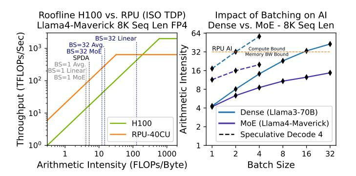
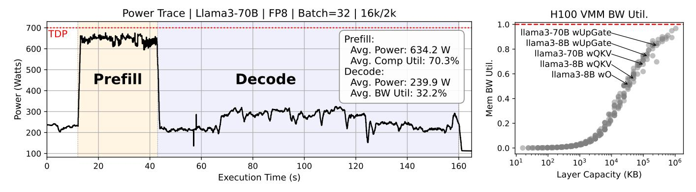
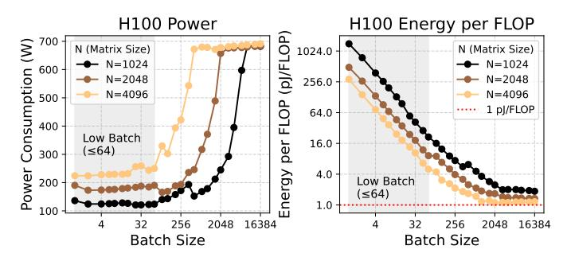

# RPU – A Reasoning Processing Unit

Matthew Joseph Adiletta, Gu-Yeon Wei and David Brooks Harvard University

Abstract—Large language model (LLM) inference performance is increasingly bottlenecked by the memory wall. While GPUs continue to scale raw compute throughput, they struggle to deliver scalable performance for memory bandwidth bound workloads. This challenge is amplified by emerging reasoning LLM applications, where long output sequences, low arithmetic intensity, and tight latency constraints demand significantly higher memory bandwidth. As a result, system utilization drops and energy per inference rises, highlighting the need for an optimized system architecture for scalable memory bandwidth.

To address these challenges we present the Reasoning Processing Unit (RPU), a chiplet-based architecture designed to address the challenges of the modern memory wall. RPU introduces: (1) A Capacity-Optimized High-Bandwidth Memory (HBM-CO) that trades capacity for lower energy and cost; (2) a scalable chiplet architecture featuring a bandwidth-first power and area provisioning design; and (3) a decoupled microarchitecture that separates memory, compute, and communication pipelines to sustain high bandwidth utilization. Simulation results show that RPU performs up to 45.3× lower latency and 18.6× higher throughput over an H100 system at ISO-TDP on Llama3-405B.

#### I. Introduction

Low-latency inference is critical for reasoning LLMs, which may generate thousands of tokens before reaching a final answer [8], [12], [66], [67]. Without fast token generation, reasoning tasks become slow, limiting the adoption of this powerful inference approach. Therefore, we introduce the Reasoning Processing Unit (RPU), a new chiplet-based system architecture that delivers orders of magnitude higher memory bandwidth than today's compute-centric designs, addressing the core latency bottleneck in reasoning LLMs.

The first step toward low-latency LLM inference is to separate prefill and decode onto different systems, as in Dynamo [17] and the Splitwise execution model [50]. Prefill is compute-bound and highly parallel, making it efficient to run on today's GPU architectures. Decode, in contrast, is inherently sequential and latency-sensitive. When prioritizing latency, decode systems must operate at low batch sizes, often as low as one. This low-batch regime is not a choice but a necessity, for two key reasons.

First, each query must compute attention sequentially during decode, so larger batch sizes lead to higher latencies. Long sequences are common in reasoning models, which makes this effect even more pronounced. Second, latency-optimized techniques like speculative decoding [37] are only effective at low batch sizes [20]. As a result, small batch sizes are essential for low latency. However, low-batch inference exacerbates the memory wall problem. For example, Figure 1 shows low-batch decode operates far below the H100's compute roofline.

Fig. 1. RPU provides higher memory bandwidth than H100, which is required for low-latency decoding. Even up to BS=32, arithmetic intensity remains low, but requires the RPU to execute kernels which straddle the roofline.

System architects have responded to the decode bottleneck by cramming more HBM stacks into each package as the simplest way to chase bandwidth [14], [27], [61], [63]. However, HBM was not designed for inference. Its popularity was driven primarily by GPU training, pushing a roadmap focused on high bandwidth coupled with high capacity to store massive training datasets and large model checkpoints to feed dense compute architectures. Now, as applications shift toward inference, HBM's high capacity per module drives up energy and cost, undermining scalability for low-latency inference.

Challenge 1 – Energy and Cost of Memory. In streaming workloads, over 74% of memory device energy is spent moving data across long internal wires and TSVs within the DRAM stack [43], [45]. Higher capacity HBMs increase internal paths, driving up energy per bit. This creates a fundamental mismatch for low-reuse streaming workloads, where minimizing energy per bit is critical for efficiency. Similarly, the cost of next-generation AI accelerators is increasingly dominated by HBM memory [48], [49]. Cost scales with capacity, as larger stacks require more silicon area and complex packaging.

The capacity required per socket depends on how a model is deployed (e.g., a single node, across a rack [6], or at datacenter scale [26]). If a model fits in one GPU, doubling the number of sockets doubles bandwidth, but it also halves the capacity needed per socket. We call this the *memory overprovisioning paradox*: a system-level design inefficiency where scaling out for bandwidth to achieve lower latency overprovisions capacity and drives up system cost and energy. The correct architectural approach is to provision memory based on the scale of the intended deployment. But with HBM as the only high-bandwidth memory available [29], architects are locked into a costly compromise – *buying bandwidth with capacity*.

*Contribution 1 – HBM-CO: An HBM-style memory design which can be optimized to the bandwidth-capacity needs of low-batch LLMs, addressing energy and cost challenges of the memory wall (Section III).* HBM-CO retains HBM's internal bandwidth architecture and shoreline bandwidth, but selectively reduces capacity-driving structures such as ranks, banks and subarrays to optimize for the capacity needs of lowlatency inference. These changes require minimal modification to the HBM stack, making HBM-CO a practical and manufacturable design point. This yields higher bandwidth per dollar and up to 2.4× energy efficiency than conventional HBM, despite a higher cost per GB. We quantify these tradeoffs using an analytical modeling approach based on [45], which estimates energy per bit and cost per module from wire-length scaling trends from HBM core-die floorplans [35], [47], [54].

Modularizing memory with HBM-CO unlocks a new design regime. Instead of provisioning large, monolithic capacity per socket, systems can scale bandwidth and capacity across many smaller stacks. But this flexibility introduces a new architectural challenge: how do we build a compute fabric that can glue together these HBM-CO modules, deliver the desired bandwidth, and stay within tight power and packaging limits? The answer requires rethinking how power and area are provisioned in modern accelerators.

*Challenge 2 – Power and Area Provisioning for A Scalable Compute Fabric:* Today's HBM-based accelerators (e.g., H100 [14], MI300x [61]) allocate only 30-40% of system thermal design power (TDP) to memory interfaces, meaning that memory-bound workloads leave a large fraction of available power underutilized. These systems are also reticle-limited, which favor dense compute, but this leads to overprovisioned arithmetic and cache resources during bandwidth bound workloads. Additionally, memory bandwidth scales with die perimeter, not area, because each HBM stack requires a dense ring of high-speed IOs along the chip edge (shoreline) [10]. Reticle-limited designs minimize this perimeter-to-area ratio, which directly conflicts with the need for scalable bandwidth.

Alternatively, accelerators like Cerebras [64] and Groq [2] avoid shoreline constraints by using SRAM as main memory. However, SRAM's low density drives up power, cost, and infrastructure overheads. For example, Cerebras requires four WSEs to host a 70B model, and Groq needs hundreds of processors. In contrast, DRAM provides the density to support large models at far lower system footprint.

*Contribution 2 – RPU: A modular chiplet-based architecture that dedicates more power to memory interfaces and optimizes the compute-to-bandwidth ratio for low-latency token generation (Section IV).* The RPU embraces emerging trends in package-level integration to achieve scalable memory bandwidth. Rather than concentrating compute in a monolithic die, the RPU distributes compute across many smaller chiplets. As a result, for the same compute die area, the RPU exposes nearly 10× more memory IO shoreline than the H100 (600mm vs. 60mm), enabling tighter coupling between memory and logic. Four compute chiplets are co-packaged with eight HBM-CO stacks, following package-level integration strategies pioneered by modern GPU architectures [14], [22], [26], [52], [61]. Packages are composed at the board level, increasing bandwidth until blade-level power envelopes.

In parallel, the RPU reprovisions power and area. The RPU dedicates 70-80% of power to memory interfaces. This keeps the memory bandwidth bound power near the peak power and enables over 2× bandwidth at ISO TDP versus compute-centric GPUs. The RPU also aligns the compute-to-bandwidth ratio. By removing underutilized compute and cache resources, it improves area efficiency and reduces die cost. As shown in Figure 1, these RPU design choices shift the roofline down and to the left, which is a better fit for low-latency inference.

The RPU system-architecture make more bandwidth available; however, roofline availability is not the same as utilization. Realizing the full potential of the RPU system requires rethinking how we sustain bandwidth at scale.

*Challenge 3 – Utilizing the Newly Available Bandwidth:* Today's systems struggle to use memory bandwidth effectively, particularly in low-batch LLM token generation [33], [68]. This is because small, distributed weight matrices limit streaming bandwidth [38], [52]. For example, the fused *gate/up* projection MLP layer in Llama4-Maverick contains just 168 million parameters (5k×32k). When *column-sharded* [65] across devices with TB/s of bandwidth, the roofline model predicts runtimes in the tens of microseconds. In practice, kernel launch and tensor-parallel communication latencies are often of similar magnitude, which limit bandwidth utilization [38].

*Contribution 3 – Reasoning Core: A decoupled pipeline microarchitecture and custom ISA that fully saturates available memory bandwidth (Section V).* Achieving high bandwidth utilization requires careful orchestration of data movement. The RPU Reasoning Core microarchitecture addresses this by separating dataflow for memory, compute, and network into independent pipelines, connected by on-chip buffers and coordinated through programmable pipeline arbiters. This decoupling allows each pipeline to make forward progress based on data readiness, without stalling on global barriers. At batch size 1 (BS=1), the RPU saturates memory bandwidth and achieves roofline performance. On the other hand, batch size 32 (BS=32), contains kernels that straddle the roofline, as shown in Figure 1, alternating between memory-bound SDPA and MoE layers and compute-bound Linear layers. Decoupled pipelines enable the RPU to absorb this phase imbalance into the buffer hierarchy and sustain throughput at the workloads average arithmetic intensity (AI).

*Contribution 4: An end-to-end simulation framework for LLM inference on RPU (Sections VI- VIII).* We developed a simulation framework, combining RTL-modeled compute kernels, an analytical energy model of HBM-CO memory, and an event-driven simulator [7], [55] that executes compiled LLM workloads via a custom RPU ISA. This framework captures transient dataflows, pipeline utilization, and synchronization stalls, which enables detailed architectural comparisons against modern GPUs. Compared to an H100 at ISO-TDP, RPU achieves up to 45.3× lower latency and 18.6× higher throughput on Llama3-405B at similar system cost.

Fig. 2. Power and utilization characterization of H100 using NVML. Left: Power trace during distributed inference (4xH100) of Llama3-70B (Batch=32). Right: Isolated kernel profiling for memory bandwidth utilization across batch sizes and matrix dimensions (BF16).

Fig. 3. Isolated kernel profiling for power consumption and energy efficiency across batch sizes and matrix dimensions (BF16).

## II. MOTIVATION FOR A DECODE-OPTIMIZED SYSTEM

To illustrate the challenges of the modern memory wall on today's GPUs, we profile the H100 using: (1) low batch LLM inference for end-to-end behavior, and (2) standalone denselinear kernels to isolate bottlenecks.

Experimental Setup: We use NVIDIA's NVML [3] to measure power on an H100 GPU running CUDA software stacks optimized for HBM3e. For full-model profiling, we profile Llama-70B with FP8 weights [5] on 4×H100s using vLLM [34] and NVIDIA Dynamo [17], running batch-32 inference with 16k prefill and 2k decode tokens (Figure 2, left). To isolate bottlenecks, we also benchmark representative dense-linear kernels compiled with PyTorch 2.2 [1].

Low Power Efficiency at Low Batch Sizes: Figure 2 (left) shows that during LLM prefill, the H100 uses 90% of its TDP and achieves high compute utilization. In contrast, the decode-phase only uses 34% of its TDP. This observation is reinforced by isolated dense-linear profiling in Figure 3 (left); batch sizes ≤64 consistently yield <30% TDP. The inability to fully utilize power suggests a critical mismatch between the H100 design and low-latency inference.

Low Energy Efficiency at Low Batch Sizes: Figure 3 (right) shows that while high AI, compute-bound kernels are energy efficient (~1.0 pJ/BF16 FLOP), this degrades by 10-1000× for low-batch inference due to non-amortized data movement costs. HBM3e accesses alone account for 30-50%

of total energy [43], with additional losses from on-chip data movement across the H100's large monolithic die [14]. The UMA memory system and randomized address mapping further inflate energy costs by physically increasing the distance data travels from memory to compute.

Inference Does Not Achieve Peak Memory-BW Utilization: Our profiling shows that the H100 only utilizes 32% of its peak memory bandwidth during distributed LLM decode. This observation is consistent with prior work on low-batch inference [33], [52], [68] as well as NVIDIA self-reported benchmarks (20k/2k at 911 OTPS) [3]. Isolated experiments in Figure 2 (right) show that full bandwidth is only achieved when the working set exceeds ~1GB, which is far larger than typical LLM matrices. Model sharding and reduced precision (e.g., 16-bit to 4-bit) further reduces each matrix's footprint per GPU, leading to even lower bandwidth utilization.

Multiple factors contribute to low memory bandwidth utilization: kernel launch overheads become non-negligible for small kernel sizes [38]; long memory access latencies cannot be hidden behind compute; and inefficient vector broadcasts between SMs using shared memory limit throughput between layers. Together, these limitations show that the H100 memory system is not optimized for the decode phase of LLMs, underscoring the need for a decode optimized architecture.

