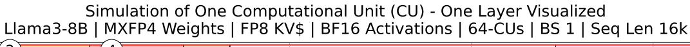
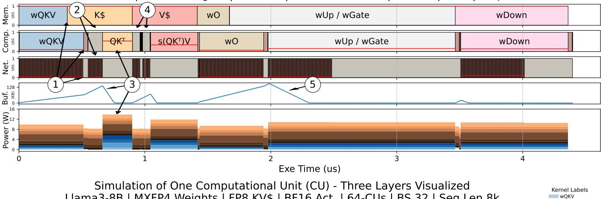
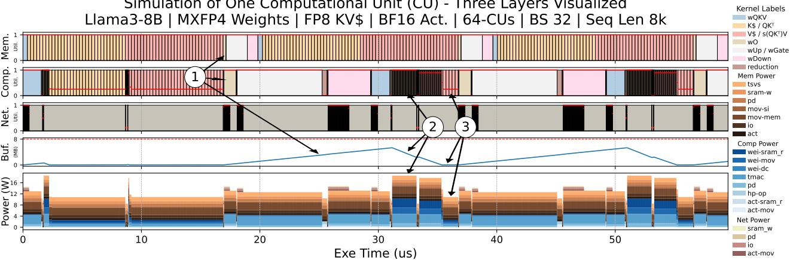

# VI. RPU SOFTWARE STACK AND SIMULATION

*RPU ISA and Compiler:* The RPU software stack provides a deterministic compilation flow from PyTorch graphs to hardware execution. The RPU ISA hardens optimized vectormatrix and elementwise dataflows directly into hardware, exposing each as a single CISC-style instruction. Each instruction specifies operand addresses, tensor dimensions, and data types, while the hardware executes a fixed streaming schedule with near-roofline utilization. Computation follows a *push-based* dataflow: DMA engines deterministically inject data into buffers, and pipelines advance when inputs are ready. Hardware-managed pipeline arbiter flags are embedded within each instruction to synchronize compute, memory, and

Fig. 8. Simulation of one CU in a 64-CU system running Llama3-8B. Top: Batch size 1, seq len 16k. Bottom: Batch size 32, seq len 8k. Each timeline shows memory, compute, and network utilization, buffer usage, and power. Memory power dominates total system power, highlighting the RPU's unique power provisioning. The plot also shows that batch size 32 generates tokens ~13× slower than batch size 1, primarily due to sequential KV\$ computations.

network pipelines, eliminating the need for software polling and ensuring deadlock-free progress.

A lightweight Python compiler traces PyTorch operations and lowers them to RPU primitives. For example, a torch.nn.Linear layer compiles into a three-stage microkernel – Loading, Looping, and Launching – that programs DMAs, drives the VMM pipeline, and forwards activations, respectively. The compiler statically orders all DMA and compute instructions, pre-shards and quantizes weights, and generates synchronized instruction streams for the memory, compute, and network pipelines. Together, the ISA and compiler form a compact, deterministic toolchain that provides predictable, near-roofline performance for token generation.

**Deployment:** Each RPU core includes a lightweight instruction-fetch pipeline that executes a small set of long-running instructions for a full LLM. This enables fully autonomous execution, eliminating the host-driven offload model used by GPUs. The host processor performs only coordination tasks such as transferring KV\$ from the prefill engine into RPU memory. After each transformer layer, the RPU triggers an interrupt to the host and reports generated tokens or completed queries and returns the corresponding KV caches.

RTL Simulations: We implement a proof-of-concept RPU in SystemC using Catapult HLS [62], [69], targeting TSMC N16 and projecting to N2 using published scaling factors [19], [59], [60]. RTL simulation includes a single-core CU, multi-CU packaging, and board-level integration. Key microkernels (e.g., VMM, DMA) are synthesized using VCS, Design Compiler, and PowerPro to extract calibrated energy and area. SRAM and interconnect energy are modeled analytically, and memory energy is provided by our HBM-CO analytical model, which captures the energy and bandwidth tradeoffs of capacity-optimized memory devices.

Compiled PyTorch transformer layers were executed on the RTL model to verify functional correctness and dataflow behavior. However, full-system cycle-accurate simulation remains computationally intensive: simulating a 2k × 2k VMM on a 4-core RPU requires approximately 6.5 minutes, making end-to-end design space exploration (DSE) for LLM inference impractical at the RTL level.

**Event Driven Simulation:** To address RTL simulation latency, we developed a higher-level event-driven simulator that reproduces the behavior of the RTL model using symbolic transactions that capture address, size, and type instead of real

tensor data. The simulator models all key microarchitectural events – data transfers, stalls, and arbitration – using parameters calibrated to RTL throughput, bandwidth, and latency.

The event-driven simulator runs orders of magnitude faster than RTL while matching its latency and power estimates. It supports full-model DSE across models, batch sizes, sequence lengths, memory devices, and scales of deployments, while exposing transient behaviors such as buffer occupancy, pipeline stalls, and synchronization delays (Figure 8). The simulator also serves as a debugging and validation tool: violations of data dependencies appear as execution stalls, allowing developers to visually trace and correct synchronization issues in the simulation framework prior to deployment.

*Simulation Results:* Figure 8 shows a simulation of the first transformer layers in Llama3-8B on a 64-CU RPU using the candidate HBM-CO from Section III. We compare batch sizes 1 and 32, breaking down execution across memory, compute, and network pipelines, along with buffer and power traces. Each row represents a single CU, with red lines indicating average utilization per kernel. We highlight instances where the RPU's decoupled pipelines enable out-of-order execution between memory, compute, and communication to unlock behaviors that conventional architectures cannot exploit.

*Batch Size 1:* 1 During the first VMM (*wQKV*) execution is bounded by network-latency to broadcast activations across all CUs. This is reflected in the timeline by low network bandwidth utilization, and early memory-pipeline completion. Traditional architectures would stall the memory; however, the decoupled memory pipeline enables the RPU to simply continue fetching weights from memory to the on-chip buffer, while the compute pipeline lags the memory stream by ∼80kB waiting for activations to arrive from the network. During this period, power consumption is dominated by reading weights from memory: ∼6.7W at full BW / CU (*512 GB/sec*) and ∼1.7pJ/b datapath to write to the memory-buffer.

2 Prior to the *QK*⊤ computation, compute stalls as each CU gathers its shard of the *Q*, *K*, and *V* vectors – 32 *Q* heads and 8 *KV* heads distributed across 64 CUs means each *Q*-vector spans two CUs while *KV*-vectors span eight CUs. Similarly, during 4 , the compute stalls waiting first for a distributed *max* collective to calculate *softmax*, then an *expsum* reduction across the CUs sharing the 8 GQA-heads. These examples of cross-CU synchronization and network delays stall the compute pipeline, while the memory pipeline continues to prefetch and move weights and *KV\$* to the onchip buffer. These types of network latency-bound periods are common in tensor-parallel distributed systems, where latencybound network collectives are often on the orders of µseconds, leading to periods of fully stalled execution. The RPU allows the memory pipeline to continue prefetching ahead of the compute stream, effectively eliminating any incurred network collective overheads.

3 During the *QK*⊤ computation, each *Q*-vector (4 per GQA head) is assigned to a TMAC, while prefetched *K\$* entries are broadcast from the memory buffer. Similarly, in 5 the *wUp/wGate* phase drives compute to full utilization while processing the accumulated weights. This is a unique opportunistic moment for the RPU, as decoupled pipelines enabled the memory-bandwidth to stay fully saturated throughout network delays and compute stalls. Later, this enables the compute to play "catch-up" until all the available data is consumed from the on-chip buffer, returning to the memorybandwidth bound performance. Power during this period rises due to higher compute utilization, from ∼1.5W to ∼5W per CU, reflecting full datapath activity. Once the buffer is drained, compute utilization returns to the memory-bound performance.

*Batch Size 32:* 1 With a larger batch size, weight matrix operations become compute-bound. Specifically, during *wUp/wGate*, weight are read from memory in ∼2µs, while compute is ∼4x longer. While the RPU is compute-bound operating on the *wUp/wGate* computation, the memory pipeline prefetches ahead, streaming in *KV\$* and filling each CU's buffer with ∼6MB of weights totaling ∼384MB system-wide. This lookahead window is beyond the capabilities of GPU architectures like H100, which lack both the on-chip capacity and pipeline decoupling to absorb such deep prefetching.

2 After a sequence of compute-bound weight matrix multiplications, the attention computation begins, entering a *KV\$*-intensive phase. Unlike weights, *KV\$* entries are queryunique, offering reuse only among GQA heads. Thus, this phase is inherently memory-bandwidth-bound. However, *KV\$* has already been prefetched on-chip which allows the system to stream *KV\$* directly from the on-chip buffer and operate at a compute-bound performance. As a result, the buffer drains rapidly, as the compute "catches-up" to the memory stream.

A batched LLM decode system naturally alternates between compute-bound weight layers and memory-bound *KV\$* layers, leading to pipeline underutilization on traditional architectures. Our design breaks this limitation by *smoothing out the bimodal workload* (compute-bound weights vs memorybound *KV\$*) and *absorbing phase-imbalance into the memory buffer*, letting decoupled pipelines handle them independently. By smoothing performance across layers, we enable sustained utilization of both memory and compute. Without this buffering strategy, overall latency would increase by up to 1.6×.

3 Once the buffer is drained, compute returns to the memory-bound performance and power drop accordingly, marking the end of the amortization window. Larger batch sizes allow deeper prefetching, leading to a tradeoff in sequence length versus batch size to fully saturate bandwidth.

