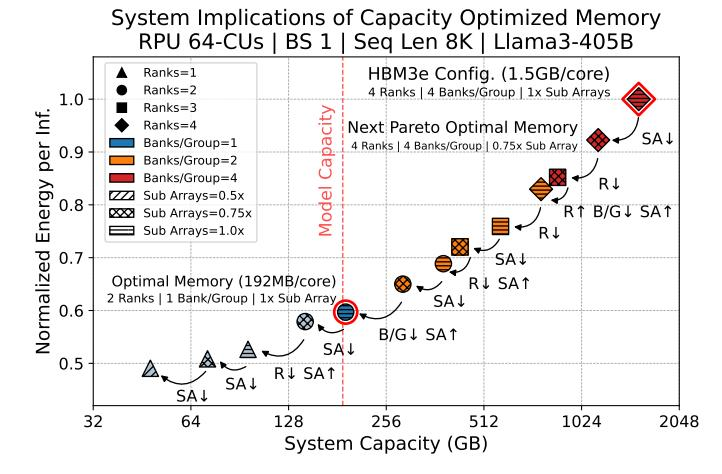
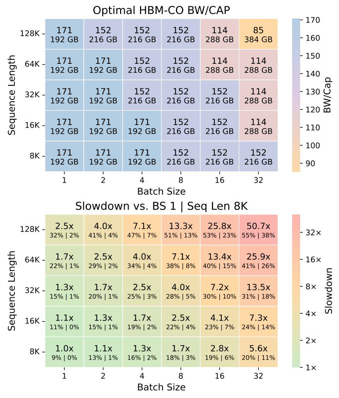
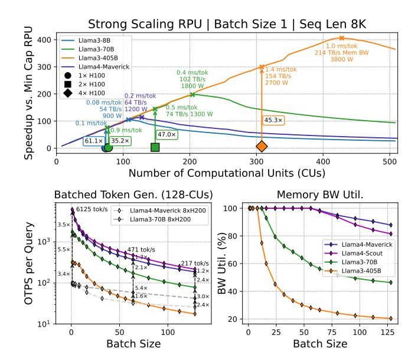
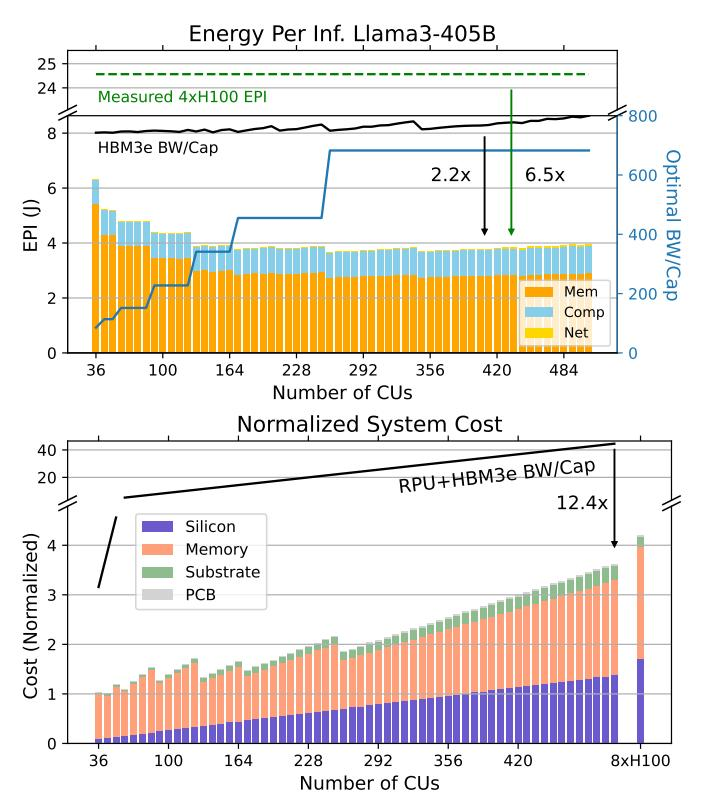
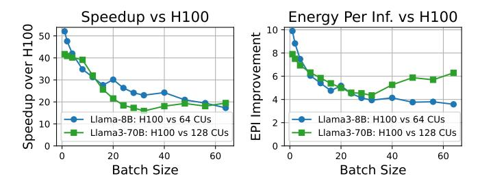

# VII. SYSTEM IMPLICATIONS OF HBM-CO

HBM-CO memories improve efficiency at the device level, but their true benefits emerge only through full-system evaluation. Figure 9 shows energy per inference (y-axis) versus system memory capacity for a 64-CU RPU. HBM-CO memory configurations form a Pareto frontier showing the energycapacity tradeoff; non-optimal points are omitted for clarity. Capacity reductions are progressively applied to an HBM3elike memory to traverse the Pareto frontier. The best capacity reduction strategy is annotated between configurations. The

Fig. 9. Pareto frontier of HBM-CO memories for Llama3-405B inference on 64-CU RPU, annotated by stepwise changes in optimal HBM-CO. These represent the set of HBM-CO chiplets useful for a memory-chiplet ecosystem.

optimal HBM-CO has the smallest device capacity that meets the system-level requirement to store the target model.

For a 64-CU RPU running Llama3-405B with a single query and an 8k sequence length, the optimal HBM-CO configuration has a memory capacity of 192 MB per core. Compared to HBM3e, HBM-CO reduces the energy per bit by 2× from the memory cell to the IO, while at the system-level the energy per inference improves by 1.7× due to memory dominating the energy consumption. A similar tradeoff exists for system cost. Despite a 1.6× higher cost per GB, reduced capacity HBM-CO yields a 5.2× decrease in per-device cost, translating to a 4.3× total system cost reduction when factoring in compute, interposer, and substrate.

As illustrated in Figure 9, several HBM-CO configurations offer even lower energy per inference but remain inaccessible at the current 64-CU scale due to their limited memory capacity. Unlocking these more energy-efficient memories requires increasing the number of CUs, thereby decreasing the required memory per CU.

A key goal in deploying the RPU is to maintain workload flexibility without proliferating hardware SKUs. In the emerging chiplet ecosystem, the HBM-CO designs along the Pareto frontier of Figure 9 are sufficient to cover the useful BW/Cap design space. These chiplets can be mixed and matched at the package level to enable design customizations without fabricating a new ASIC. Figure 10 extends this idea by showing how to select among these variants for a given workload.

Figure 10 (top) is an HBM-CO SKU selection map for a 64-CU RPU running Llama4-Maverick. Each memory chiplet has a fixed bandwidth interface, resulting in a total system bandwidth of 32 TB/s. Given this fixed bandwidth, system capacity is optimized by selecting the most efficient HBM-CO chiplet configuration from Figure 9, to minimize both energy per inference and overall cost while satisfying capacity for each batch size and sequence length combination.

High BW/Cap SKUs maximize efficiency but limit the range

Fig. 10. RPU with 64 CUs running Llama4-Maverick showing batch size versus sequence length, comparing optimal HBM-CO BW/Cap and slowdown relative to BS=1, Seq Len=8K. Slowdown sub-metrics indicate the fraction of capacity used for KV cache versus active parameters and total capacity.

of supported batch and sequence lengths, while lower BW/Cap SKUs trade some efficiency for broader capacity coverage. Importantly, Figure 10 (top) shows that high-BW/Cap memories (5-6x HBM3e) are better suited for long-context, low-batch inference, which underscores the capacity overprovisioning of using off-the-shelf HBM3e. Increasing the number of CUs raises the optimal BW/Cap, enhancing efficiency at scale.

Figure 10 (bottom) quantifies how batching and sequence length impact latency. As batch size or sequence length increase, the per-query token generation latency increases. This is illustrated by tools such as InferenceMax [56], highlighting that low-batch inference is key for low latency. Longer sequences also intensify bandwidth pressure during attention – more than 50% of the active parameters are KV\$ for BS=8 128k. Therefore, the relative efficiency gap between the RPU and conventional GPUs widens due to the RPU's bandwidth advantage, underscoring its use for long-context, low-latency inference.

#### VIII. STRONG SCALING ANALYSIS

Strong Scaling Analysis: We conduct a strong-scaling study by varying the number of CUs. Speedup is reported relative to the smallest configuration capable of fitting each model. Figure 11 shows results for Llama models, compared against an NVIDIA H100 at ISO TDP using the methodology

Fig. 11. Top: Strong scaling for Llama models under ISO TDP vs H100. Bottom: Output tokens per second per query (8xH200 from [4]) and bandwidth utilization versus batch size.

from Section II with 4-bit weights and 16-bit activations [18] and full tensor-parallelism.

**Batch Size 1 – Fastest Thinking Speed:** Batch size 1 represents the fastest possible "thinking speed" of a model. At ISO TDP, the RPU significantly outperforms H100 inference. Notably, the RPU latency is 47.0× faster than a 2xH100 at 1400W TDP for Llama3-70B and 45.3× faster than a 4×H100 at 2800W TDP for Llama3-405B. The 405B example is illustrated in Figure 11 (top) by the orange diamond (4xH100s) aligned to a 308 CU RPU system at ISO TDP.

Even more compelling is the peak performance of the RPU, achieved by scaling to the optimal number of CUs for each model: Llama3-70B at 204 CUs achieves 0.4 ms/token, and Llama3-405B at 428 CUs achieves 1.0 ms/token. Llama4-Maverick at 128 CUs achieves 0.2 ms/token. These are the fastest token generation latencies reported to date for these models. Notably, we are the first system capable of sustaining over 200 TB/s of tensor-parallel memory bandwidth during inference for a 405B parameter model.

Beyond these scales, performance plateaus as broadcasting the activation becomes the bottleneck. To overcome this limit, we propose two future directions: 1) Reduce on-chip forwarding latency. 2) Reduces hop count by adding another level of scale-out to Figure 6 which interconnects ring-stations.

An important insight from this study is that memory customization enables model- and deployment-specific system design. For instance, an RPU designed for the high-performance edge running Llama3-70B achieves 3.5ms/token using a memory configuration with BW/Cap=227 at 220W TDP. Separately, an edge-optimized system for Llama4-Maverick achieves 1.1ms/token at BW/Cap=38 (comparable to HBM3e) and 260W TDP. In contrast, for datacenter-scale deployments targeting 1kW TDP, we design an RPU for

Fig. 12. Energy and cost analysis for scales of CUs running Llama3-405B at batch size 1. Top: Energy per inference and optimal memory selection. Bottom: Normalized system cost.

Llama3-70B with more CUs that achieves 0.65ms/token with a BW/Cap of 682 (the highest in our design space) while a datacenter RPU for Llama4-Maverick reaches 0.24ms/token at BW/Cap=170.

Batched Inference on the RPU: Figure 11 (bottom left) compares output tokens/sec per query across Llama models using a 128 CU RPU and an 8×H200 baseline reported by [4]. Llama4-Scout achieves the highest throughput across all batch sizes, closely followed by Llama4-Maverick. Activating more unique experts in Maverick reduces per-expert parallelism, leading to a 1.2-1.3× decrease in performance compared to Scout's 16-expert configuration.

As batch size increases, per-query throughput decreases primarily due to serialized KV cache computations. Figure 11 (bottom right) demonstrates this behavior, indicating all models operate in a memory bandwidth-bound regime up to a batch size of 8. Beyond this point, the Llama3-405B model becomes compute-bound, as its attention mechanism features a high arithmetic intensity (16 queries per KV head), saturating available compute resources.

In contrast, the Llama4 models maintain high memory bandwidth utilization (above 80%) up to batch size 128. Their attention design, with only 5 queries per KV head, and MoE structure, are low per-token arithmetic intensity. Our layer smoothing technique balances arithmetic intensity across compute-bound layers (e.g., shared projections and MLP

layers) and memory-bound layers (e.g., attention and MoE layers). Between the two Llama4 variants, Scout becomes compute-bound earlier due to heavier per-expert loads (only 16 experts) versus Maverick's 128-expert setup distributes tokens across more experts, preserving memory-bandwidth demands.

Energy and Cost Analysis: Figure 12 (top) extends our strong scaling results by analyzing energy per inference for Llama3-405B at batch size 1. The majority of the energy is consumed by memory accesses, making memory selection a dominant factor in system efficiency. To minimize energy, we explore HBM-CO design points along the Pareto frontier (Section VII), selecting the BW/Cap ratio that best matches system scale and capacity requirements.

At smaller scales, lower BW/Cap memory modules are required to meet overall capacity needs, resulting in higher energy per inference. As the system scale increases, each CU stores a smaller fraction of the model, allowing for a higher BW/Cap memory with lower capacity and improved energy efficiency. Energy per inference improves steadily with scale until 268 CUs where the highest BW/Cap memory module in the design space is selected.

Compared to an HBM3e BW/Cap memory, the HBM-CO memory improves energy efficiency by up to 2.2×. Similarly, compared to a 4×H100 system running Llama3-405B, the HBM-CO optimized configuration achieves 6.5× lower energy per inference. Combined with the latency-optimized design point at 428 CUs, this translates to a 412× improvement in energy-delay product (EDP) relative to the 4×H100 baseline. This highlights the power of co-designing memory and compute around bandwidth per capacity to unlock both latency and efficiency at scale.

Figure 12 (bottom) shows the normalized total system cost broken down by silicon, memory, substrate, and PCB. Costs are normalized to the smallest valid configuration for Llama3-405B. As expected, compute cost grows linearly with CU count, while memory cost increases sublinearly due to adaptive HBM-CO selection. At each scale, the memory configuration is selected from the HBM-CO Pareto frontier using the highest BW/cap memory which satisfies the required capacity. Discrete jumps visible in the memory cost curve correspond to transitions between HBM-CO tiers. While high BW/Cap memories are more expensive per GB, they eliminate capacity over-provision. As a result, total system cost is reduced.

Compared to using a fixed HBM3e memory, the HBM-CO system reduces total cost by up to 12.4×. At scale, its memory-to-compute cost ratio matches that of an 8×H100 DGX [2], demonstrating that HBM-CO enable efficient bandwidth scaling while keeping costs reasonable.

Energy per Inference versus Batch Size: Figure 13 shows speedup and energy-per-inference of the RPU over an H100 across batch sizes for Llama3-8B and Llama3-70B. Larger batch sizes improve the GPU's compute efficiency. However, concurrent queries inflate the KV\$ cache latency, introducing phase imbalance that the GPU cannot hide. For the RPU, small 4k sequences limit the benefit of decoupled pipelines because weight computation dominates, leaving less room to overlap

Fig. 13. Speedup and energy-per-inference of an RPU versus and H100, sweeping batch size for Llama models with 8k prefill 2k decode.

KV\$ prefetching. As a result, performance gains plateau at  $\sim$ 15-20× over the H100, though the RPU still maintains higher throughput and better energy efficiency.

At small batch sizes, the RPU shines, delivering over 40-50× speedup and 8-10x energy-per-inference, driven by its higher memory bandwidth and ability to efficiently execute small kernels with minimal synchronization overhead. In contrast, H100 performance performs poorly in this regime, as it is significantly bandwidth-bound and suffers from kernel launch and scheduling overheads.

## IX. DECOMPOSED CONTRIBUTIONS

Contribution 1 - HBM-CO Memory: Compared to an RPU system using HBM3e, HBM-CO offers up to  $2.2 \times$  lower energy per inference and  $12.4 \times$  lower system cost, primarily by eliminating excess capacity and reducing internal wire lengths. These savings allow us to scale the number of compute units at ISO-TDP, leading to a  $2.1 \times$  latency improvement.

Contribution 2 - RPU Power and Area Provisioning: By rebalancing the compute-to-bandwidth ratio relative to an RPU provisioned like an H100 ( $\sim$ 200 Ops/Byte), the RPU saves  $3.3\times$  die cost and  $2.6\times$  TDP utilization, leading to a  $2.2\times$  latency improvement when scaling out at ISO-TDP.

Contribution 3 – Microarchitectural Decoupling: Fine-grained network sharding eliminates global synchronization, avoiding up to a 2.0× latency penalty from collective stalls. Memory-compute decoupling enables deep prefetching, preventing a 1.2× slowdown from serialized kernel execution. In batch size 32 workloads, decoupled execution allows the RPU to straddle the roofline across memory-bound (SDPA, MoE) and compute-bound (Linear) kernels, improving latency by up to 1.6×. These changes also improve energy efficiency: 1.4× over a monolithic NUMA-style baseline via shorter data paths, and 1.7× at the SRAM interface through on-the-fly stream dequantization. Together, these energy efficiency gains enable the system to scale to 2.4× more bandwidth at ISO-TDP.

Cumulative Performance: HBM-CO, aligned provisioning, and decoupled pipelines enable 20-40× higher effective memory bandwidth at ISO-TDP, consistent with simulation results.

RPU Application Domain: Human-computer interaction literature identifies an interaction-latency threshold on the order of ten seconds, beyond which working memory decays and users are likely to context-switch, incurring re-orientation overheads [21], [42], [44]. Accordingly, reasoning systems

must minimize end-to-end latency to preserve turn-taking and cognitive continuity, rather than maximizing throughput. This captures the motivation behind the RPU: we want advanced intelligence at our fingertips. The RPU targets these reasoningintensive, interactive workloads requiring end-to-end responses such as multi-step planning, problem solving, iterative coding, and writing assistance, which currently take tens of seconds to minutes on today's systems [56]. By exploiting the latency benefits of low-batch inference, it delivers state-of-the-art responsiveness and per-query performance.

