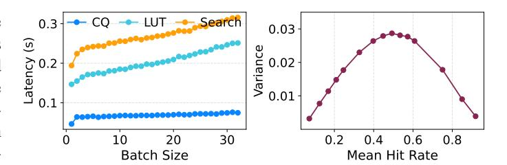
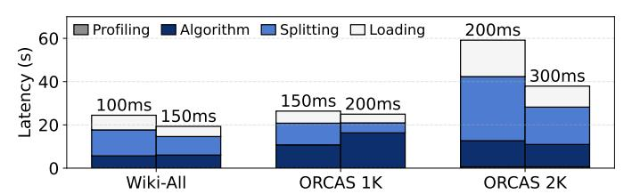
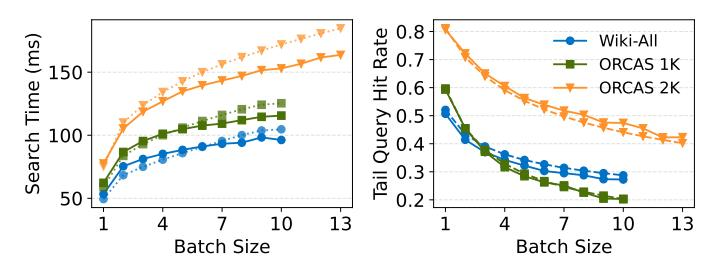
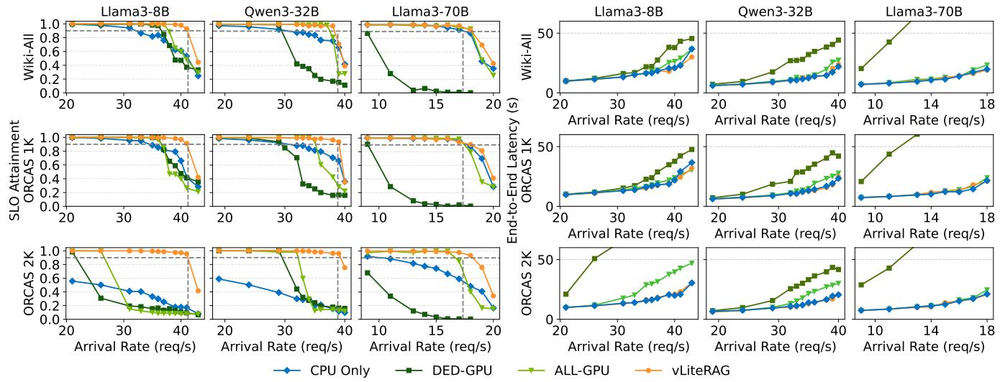
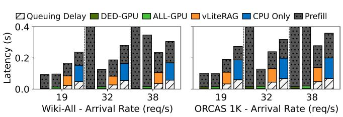

# *A. Hybrid Index Construction*

*1) Profiling-based Performance Modeling:* Since GPU resources are limited, accurately modeling performance is critical for determining the optimal index partitioning point. To construct these models, VECTORLITERAG profiles latency and access statistics using calibration queries from a training set. Specifically, it collects: (1) latency breakdown of CPUbased vector search and (2) cluster access frequency distributions. Additionally, throughput of the bare LLM is measured to guide partitioning decisions under joint CPU-GPU execution.

As described in Section II-B, IVF index search latency is dominated by two components: coarse quantization (CQ) and LUT operations. We profile both stages across varying batch sizes and construct independent models for each. However, in our design, only the LUT stage, which corresponds to the individual distance computation and scanning step, is considered for GPU offloading for two main reasons:

First, CQ is a similarity search over the quantizer (centroid) vectors, which is often implemented using memory-intensive graph-based structures such as HNSW. Offloading CQ to GPU would require additional memory for the graph and complicate memory management. Second, if CQ were distributed across GPU shards, the resulting search path would involve repeated device transitions:  $CPU \rightarrow GPU$  (quantization)  $\rightarrow CPU$  (merge and routing)  $\rightarrow GPU$  (search)  $\rightarrow CPU$  (final merge). This induces costly inter-device communication and synchronization overheads. Moreover, our objective is to ensure stable performance within the latency budgets rather than to minimize absolute latency. Thus, for our purpose, we retain CQ on the CPU and use GPUs for distance computations, as this offers performance benefits while simplifying the optimization space.

Empirically, as shown in Figure 8 (left), CPU search latency exhibits a piecewise linear relationship with batch size. Initial steps appear as the system transitions from single-threaded (single query) to multi-threaded execution (batched queries). Accordingly, we model  $T_{\rm CQ}^{\rm CPU}$  and  $T_{\rm LUT}^{\rm CPU}$  as piecewise linear functions of batch size.

When hot clusters are cached, the overall search time reduces accordingly. LUT operations offloaded to GPUs are fully hidden under CPU's execution, and the CPU processing time decreases in proportion to the number of hits. As a result, we model the latency of the hybrid partitioned index as:

$$\tau_s(b) = T_{\text{CQ}}^{\text{CPU}}(b) + (1 - \eta) \cdot T_{\text{LUT}}^{\text{CPU}}(b) \tag{1}$$

where  $\eta$  denotes the hit rate, in particular the minimum hit rate among all queries in the batch.

2) Tail Query Hit Rate Estimation: As discussed in Section III-C, caching hot clusters leads to varying hit rates across queries. Because, CPU side LUT workload is proportional to the miss rate  $(1-\eta)$ , this variance directly translates into differences in search latency. Moreover, since vector search is typically executed in batches to maximize throughput, the completion time of the entire batch is dictated by the slowest query, one with the fewest hits. Therefore, modeling the minimum hit rate within a batch is critical for accurate performance estimation.

We model the distribution of per-query hit rates using a Beta distribution f(x), which is widely used in Bayesian statistics for variables constrained to the [0,1] range. For a batch of size b, the expected minimum hit rate  $\eta_{\min}$ , i.e., the first-order statistic, is computed as:

$$\eta_{\min}(B) = \int_0^1 B \cdot x \cdot f(x) \cdot (1 - F(x))^{B-1} dx$$
 (2)

where F(x) is the cumulative distribution function of f(x).

The mean hit rate  $\bar{\eta}$  can be obtained directly from the query–cluster access profile, which reflects the cumulative fraction of accesses covered by the cached clusters. Estimating the variance is more challenging, as it would require rerunning queries through the quantizer and counting individual hits after masking hot clusters, a process that is both computationally expensive and incompatible with iterative partitioning algorithm.

Instead, we approximate the hit rate variance as a function of the mean. We observe that hit/miss variance peaks when



Fig. 8. **Left:** Search latency of ORCAS queries on a 64-core Intel Xeon 8426Y CPU. **Right:** Empirical variance of hit rates across queries in the Wiki-All dataset as a function of mean hit rate. The observed parabolic shape supports our variance approximation model.

 $\bar{\eta}=0.5$ , and becomes more uniform as  $\bar{\eta}\to 0$  or  $\bar{\eta}\to 1$ . This mirrors the variance behavior of the Beta distribution;  ${\rm Var}(X)\propto \bar{\eta}(1-\bar{\eta})$ . Thus, by empirically profiling the variance at  $\bar{\eta}=0.5$ , denoted  $\sigma_{\rm max}^2$ , we can approximate the variance at arbitrary  $\bar{\eta}$  as:

$$\sigma^2 \approx 4 \cdot \sigma_{\text{max}}^2 \cdot \bar{\eta} (1 - \bar{\eta})$$

Figure 8 (right) validates the approximation. This allows instantiating a Beta distribution f(x) with inferred mean and variance for any cache coverage configuration.

Finally, using Eq. 2, we compute the minimum hit rate within a batch for a given cache coverage. Inverting this relation numerically yields the function:

$$\rho = HitRate2Converge(B, \eta_{\min})$$

which is used in the main partitioning algorithm to identify the optimal cache coverage that satisfies latency constraints.

3) Latency-Bounded Partitioning Algorithm: In the hybrid RAG pipeline, LLM throughput decreases as more GPU memory is allocated to the vector index, due to contention between KV cache and index storage. To balance these competing demands, we introduce an iterative algorithm that determines an index partitioning point satisfying the latency constraint.

Algorithm 1 outlines the proposed latency-bounded partitioning algorithm. It takes the following inputs: the latency target, the baseline KV cache memory footprint when no vector index is loaded, and the peak bare LLM throughput. The goal is to find the largest feasible cache coverage for the GPU index (partitioning point  $\rho$ ) that satisfies SLO constraint.

We first compute the latency bound for the hybrid vector search stage. To account for queuing delay, the analysis considers a worst-case scenario in which a request arrives immediately after the previous batch begins processing. Under steady-state load with uniformly arriving requests, this tail query experiences full batch latency W(b) as queuing delay. To maintain the total response time within the latency budget, the search latency must satisfy  $\tau_s \leq \text{SLO}_{\text{search}} - W(b)$ .

To avoid circular dependency (as W(b) depends on  $\tau_s$ ), we approximate this term using a queuing factor  $\epsilon$ , leading to:

$$\tau_s = \frac{\text{SLO}_{\text{search}}}{1 + \epsilon} \tag{3}$$

In our setting, we set  $\epsilon = 1$ , as it represents the worst case where the queuing delay equals one batch latency. This choice

is empirically supported from the CPU-only baseline, where  $\epsilon$  ranged between 0.9 and 1.0.

Search iteration. The algorithm then performs a binary search over possible values of  $\rho$  using the modeled latency and hit rate behavior. For each candidate  $\rho$ , the reduced LLM throughput is estimated based on the corresponding decrease in KV cache capacity. Although this interpolation is coarse, it provides a conservative lower bound because the throughput–cache curve is generally convex. The INFERPARTITION function is subsequently invoked to compute the expected batch size, given by  $B=\mu\cdot\tau_s$ , where  $\mu$  is the current throughput bound. Since batch size B must be an integer, two rounding strategies are considered:

- **Rounding up.** This implies longer latency and thus requires more cache coverage to meet  $\tau_s$ . From the hybrid latency model (Eq. 1), we solve for  $\eta_1$  and convert it to coverage  $\rho_1$  via the HITRATE2COVERAGE function.
- **Rounding down.** This yields a smaller batch size (shorter latency), but may not meet the required throughput. To ensure throughput  $\mu$  is met, we solve for  $\eta_2$  using the adjusted latency bound  $B/\mu$  from the throughput constraint.

At the end of the iteration, the smaller of  $\rho_1$  and  $\rho_2$  is selected, as it requires less GPU memory. This value is used to update the binary search interval.

**Convergence.** If the newly computed partitioning point  $\rho$  increases, the resulting drop in throughput leads to a smaller batch size in the next iteration, which in turn drives  $\rho$  back down. Conversely, if  $\rho$  shrinks, the throughput bound increases, allowing for more cache coverage. This feedback loop ensures convergence of the algorithm within a limited number of iterations. In practice, convergence takes less than one minute as shown in Figure 9.

4) Index Splitter: Once the partitioning point  $\rho$  is determined, it is passed to the final stage of index construction, which is the index splitter. The splitter first identifies the hot clusters based on the access profile and the target cache coverage  $\rho$ . These hot clusters are then sorted by size and distributed to GPU shards in a round-robin fashion to balance memory usage across sub-indexes.

Alongside the construction of each sub-index, the splitter generates a set of mapping tables. These tables encode the correspondence between original cluster IDs and their assigned shard as well as the remapped local cluster IDs, enabling efficient routing during query execution.

#### B. Distributed VectorLiteRAG Pipeline

The right side of Figure 7 illustrates the runtime architecture of VECTORLITERAG. At initialization, memory is allocated sequentially for the index and then for the LLM to prevent memory interference between the vector search and LLM engines. The two components operate through different processes and thus use separate GPU streams for concurrency.

Similar to other IVF-based indexes, the pipeline begins with coarse quantization to identify candidate clusters. However, from this point on, VECTORLITERAG introduces a

### Algorithm 1 Latency Bounded Partitioning

```
Input: SLO<sub>search</sub>, MEM_{KVcache}, \mu_{LLM0}
Output: \rho
  1: \tau_s \leftarrow \frac{\text{SLO}_{\text{search}}}{1+\varepsilon}
  2: \rho_{\text{low}} \leftarrow 0, \rho_{\text{high}} \leftarrow 1
  3: while \rho_{\text{high}} - \rho_{\text{low}} > \delta do
               \rho_m \leftarrow \frac{\rho_{\text{low}} + \rho_{\text{high}}}{2}
                \mu_{\text{LLM}} \leftarrow \frac{\bar{MEM_{KVcache}} - MEM_{Index}(\rho)}{MEM_{KV}} \mu_{LLM0}
                                                     MEM_{KVcache}
                \rho \leftarrow \text{InferPartition}(t_s, \mu_{\text{LLM}})
                if \rho > \rho_m then
  7:
  8:
                        \rho_{\text{low}} \leftarrow \rho
  9:
                else
 10:
                         \rho_{\text{high}} \leftarrow \rho_m
 11:
                end if
12: end while
 13: return \rho
15: function InferPartition(\tau_s, \mu)
                 B \leftarrow [\tau_s \cdot \mu]
16:
                T_{\text{search}}^{\text{CPU}}(B), T_{\text{LUT}}^{\text{CPU}}(B) \leftarrow \text{PERFMODEL}(B)
 17:
                \begin{split} & \eta_1 \leftarrow \frac{T_{\text{search}}^{\text{CPU}}(B) - \tau_s}{T_{\text{LUT}}^{\text{CPU}}(B)} \\ & \rho_1 \leftarrow \text{HITRATE2COVERAGE}(\eta_1, B) \end{split}
18:
19:
                 B \leftarrow |\tau_s \cdot \mu|
20:
                T_{\text{search}}^{\text{CPU}}(B), T_{\text{LUT}}^{\text{CPU}}(B) \leftarrow \text{PerfModel}(B)
21:
                \eta_2 \leftarrow \frac{T_{\text{search}}^{\text{CPU}}(B) - B/\mu}{T_{\text{LUT}}^{\text{CPU}}(B)}
22:
                 \rho_2 \leftarrow \text{Hitrate2Coverage}(\eta_2, B)
23:
                return min(\rho_1, \rho_2)
24:
25: end function
```

customized retrieval pipeline tailored for hybrid CPU-GPU execution. We now describe each component in detail.

1) Router: To support efficient vector retrieval on a distributed multi-GPU system, VECTORLITERAG implements a custom routing mechanism rather than relying on Faiss's builtin IndexIVFShards. The default implementation in Faiss is suboptimal in constrained environments for two main reasons. (1) IndexIVFShards partitions the index uniformly by vector or cluster ID, ignoring access frequency. While, convenient for implementation, it retains centroid metadata even for clusters that are not locally resident, causing unnecessary memory overhead, especially problematic when the number of clusters is large. (2) During search, each sub-index is instructed to probe the same number of clusters, even if many of them are not resident on that shard. Although certain probes are ultimately skipped at runtime, the batched execution of cluster scanning kernels still launches GPU thread blocks for them. These launches consume scheduling bandwidth and shared memory resources, regardless of whether the actual computation is needed. Since shared memory usage increases with nprobe, this results in inefficient kernel launches and exacerbates resource contention, especially in large-scale vector databases.

To address these issues, VECTORLITERAG uses the mapping tables generated during index splitting to route each query to the appropriate GPU shards and prune irrelevant probes, thereby accounting for the device-level variance. This substantially reduces the effective nprobe per shard, lowering both memory pressure and kernel scheduling overhead. At runtime, only GPU workers holding relevant clusters receive and execute the search request, while the remaining portion of the search is handled by the CPU. This hybrid execution minimizes contention and enables more efficient use of GPU memory and compute resources.

2) Dynamic Dispatcher: Because hit rates vary across queries, the effective nprobe differs even within a batch. As batch size increases, the minimum hit rate tends to decrease, increasing the search latency for the entire batch. To mitigate this issue, VECTORLITERAG employs a dynamic dispatcher that accelerates early query completion.

When search is initiated, a separate dispatcher thread is launched. Each GPU worker sets a completion flag once its assigned clusters are scanned. After all GPU flags are set, the dispatcher begins polling for queries that have completed their full search. To facilitate timely query promotion, a callback mechanism connects the CPU search loop and the dispatcher, as CPU processes clusters one-by-one, grouped by related queries. At the end of each iteration, the current scan count is compared with the expected nprobe for each query. When all assigned clusters for a query are scanned, the callback is invoked, and the query and its results are inserted into a thread-safe queue.

The dispatcher polls this queue at short intervals. Once a completed query is available, it merges the CPU and GPU results, re-ranks them to obtain the final top-k vectors, and forwards the result to the downstream document retriever. This proactive execution reduces head-of-line blocking within batches and improves end-to-end latency, particularly for high-hit-rate queries. It also enhances batching continuity by enabling smoother transitions between retrieval and generation stages, which already employs continuous batching schemes.

3) Adaptive Runtime Index Update: Our model is built upon the distributional characteristics of queries aggregated across batches. While correlations among queries may temporarily shift access patterns, they primarily reduce the number of statistically independent samples rather than altering the overall distributional trend. Nevertheless, temporal bias can arise in practice, and to mitigate potential performance degradation caused by such drift, VECTORLITERAG employs an adaptive re-profiling and update process.

VECTORLITERAG can swiftly react to shifts in query distribution without interrupting service. During runtime, the router monitors (1) average hit rates and (2) per-cluster access frequencies. For every few minutes or after a few thousand requests, it periodically resets the counters to detect distributional drift. When the average SLO attainment falls below a threshold and observed hit rates diverge from their expected values, an update cycle is triggered: re-profiling query access patterns, rerunning the latency-bounded partitioning algorithm,



Fig. 9. Time consumed for re-building the GPU index shards using updated query access data. Numbers above the bars denote the search time SLO constraints applied for the system.

generating shards, and loading the updated indices onto GPUs.

All stages, from profiling to loading, complete in under a minute, allowing updates to run in the background. At the per-shard level, index generation and loading take less than ten seconds. The detailed timing breakdown for each stage is shown in Figure 9. While a GPU shard is being refreshed, the router temporarily redirects queries for those clusters to CPU paths, preserving the service continuity. Once the updated shard is loaded, routing automatically returns to the GPU.

Per-cluster updates are avoided because clusters are stored contiguously to enable high-bandwidth access. Since clusters vary in size, updating clusters individually would lead to memory fragmentation and inefficient data placement. Instead, VECTORLITERAG performs full-shard updates, as migration of each shard takes only a few seconds, providing robustness and simplicity.

According to our observations, profiling with only 0.5% of the queries from a separate training set successfully captured the distribution of 10M ORCAS queries. We therefore assume that a single index update can sustain stable service for roughly one hour under steady traffic, given the system throughput measured in our experiments.

#### V. METHODOLOGY

#### A. Experiment Setup

To evaluate VECTORLITERAG, we conduct experiments across various datasets, models, and hardware configurations. This section describes the datasets, models, evaluation metrics, and system setup.

Datasets and Models. We use two datasets: Wiki-All and OR-CAS. We construct the IVF index following the configuration guidelines provided by the Faiss library. The Wiki-All [37] vector database contains 88M 768-dimensional vectors derived from Wikitext [28] and Cohere Wikipedia embeddings, yielding a compressed IVF index with a footprint of 18GB. We also construct two additional indexes from chunked Wikipedia documents [40] using the Stella [42] embedding model of dimensions 1024 and 2048, and queries from the Microsoft ORCAS dataset [5]. ORCAS consists of real Bing queries and preserves duplicates to reflect realistic query distributions. The ORCAS 1K and ORCAS 2K indexes occupy 40GB and 80GB of memory, respectively.

Our retrieval pipeline builds on Faiss v1.9.0 [6], [17], with internal extensions for flexible nprobe settings and dispatcher callbacks. The overall system, including the profiler and latency-aware scheduler, is implemented in Python.

For generation, we evaluate three models—Llama3-8B, Qwen3-32B, and Llama3-70B [9], [41]—served using vLLM v0.9.1 [18]. The retriever and LLM run as separate subprocesses, with the main process coordinating request generation and document fetching to integrate the full RAG pipeline.

To evaluate system performance, we sample queries from a dedicated test set that is disjoint from the profiling set. The request arrival process follows a Poisson distribution, a commonly adopted modeling choice in prior work [18], [31], [45]. For each query, the top-25 documents are retrieved, and a 1024-token input is constructed and passed to the LLM, which then generates a 256-token output, following the setup in [35]. The initial nprobe is set to 2048, which is sufficient to achieve an average retrieval quality of 0.91 Normalized Discounted Cumulative Gain (NDCG) [39] at 50.

**SLO Settings.** The SLOs for retrieval and generation stages were defined separately and then combined. For retrieval, since no standard criteria exist, we set the SLOs heuristically, relaxing them for larger databases (see Table I). For generation, the SLO was defined as the latency measured at the model's throughput limit. These capacity values were also used in building our performance model.

TABLE I SLO TARGET VALUES USED IN THE MAIN EVALUATION

| Vector Index | $SLO_{search}$ | LLM        | $SLO_{LLM}$ |
|--------------|----------------|------------|-------------|
| Wiki-All     | 150ms          | Llama3-8B  | 217ms       |
| ORCAS 1K     | 200ms          | Qwen3-32B  | 191ms       |
| ORCAS 2K     | 300ms          | Llama3-70B | 311ms       |

**System Configuration.** We conduct our experiments on two types of nodes, each equipped with eight NVIDIA GPUs. The L40S node includes L40S GPUs with 48GB GDDR memory and dual Xeon 6426Y CPUs. The H100 node uses H100 GPUs with 80GB HBM and Xeon Platinum 8462Y CPUs. We use the L40S node for smaller models (Llama3-8B), while larger models requiring model parallelism (Qwen3-32B, Llama3-70B) are run on the H100 node for maximum throughput.

Baseline Configurations. We compare VECTORLITERAG against several key baselines. Since VECTORLITERAG builds on FAISS, we use vanilla FAISS-CPU IVF FastScan (CPU-Only), FAISS-GPU IVF on a dedicated GPU (DED-GPU), and a sharded FAISS-GPU IVF index distributed across all GPUs (ALL-GPU). To further demonstrate the strength of our approach, we also compare against HedraRAG [11] in section VI-D, which also uses a skew-aware caching strategy.

## VI. EVALUATIONS

## A. Performance Model and Hit Rate Estimator

Figure 10 evaluates the accuracy of VECTORLITERAG's performance model. The right panel compares the predicted and actual minimum hit rates within each batch. As expected from order statistics, the minimum hit rate declines rapidly as batch size increases, and the rate of decline gradually flattens in the large-batch regime. Close alignment of two curves confirms that our Beta-distribution-based approximation reliably captures caching effectiveness.



Fig. 10. Comparison of measured (solid line) vs estimated (dotted line) values from VECTORLITERAG's performance model. **Left:** Search latency across batch sizes. **Right:** Tail hit rates within a batch.

The left panel compares the predicted latency of the hybrid index search with the measured latency. While the predictions generally follow the same trend, a noticeable offset exists between the two. This deviation mainly results from the dispatcher's early-query handling, as discussed in Section VI-E1.

Precisely capturing the dispatcher's impact would require evaluating full order statistics to model per-request completion times, which greatly increases complexity while providing only marginal benefit. Despite these approximations, the resulting configurations perform robustly in practice, as shown in the following sections.

#### B. SLO Attainment

Figure 11 presents SLO attainment curves across all nine combinations of vector databases and LLMs. In each subplot, the horizontal dashed line marks the 90th percentile latency target, and the vertical dashed line indicates the standalone LLM throughput. All experiments use on-demand dynamic batching, where retrieval requests are served immediately after the previous search completes, allowing throughput to scale with arrival rate through adaptive batch sizing.

Across all configurations, VECTORLITERAG sustains the extended SLO budget ( $SLO_{\rm LLM} + SLO_{\rm Search}$ , defined in Table I) over the widest input rate ranges among evaluated baselines. CPU-based fast scan can support relatively high request per second (RPS) rates, its limited per-request performance leads to consistent SLO violations even under light traffic. As arrival rate increases, batch sizes grow (up to 9–10 under >40 RPS), incurring high latency and poor tail response.

Dedicated GPU retrieval performs poorly with large models due to rigid model parallelism constraints. For instance, Llama3-70B requires a tensor parallelism degree of 4 for efficient execution. While it fits within 2 H100 GPUs, the achievable LLM throughput drops from 8 RPS to less than 2 RPS. In such settings, dedicating GPU(s) to retrieval results in resource oversubscription, harming overall system throughput.

For small vector databases and under light loads, ALL-GPU configurations can satisfy SLOs over wide traffic ranges. However, as the arrival rate approaches its reduced throughput, latency increases sharply. Although VECTORLITERAG is subject to this limitation as well, its optimized partitioning algorithm extends the SLO-attainable region nearly up to the standalone LLM throughput limit.

To better illustrate the dynamics of RAG systems, we present a detailed TTFT breakdown in Figure 12 for the



Fig. 11. Left: TTFT SLO attainment and Right: end-to-end latency of RAG pipeline under increasing arrival rates across different LLMs (columns) and datasets (rows). Our work (vLiteRAG) achieves higher SLO attainment across all regimes compared to baselines.



Fig. 12. TTFT breakdown for Wiki-All and ORCAS 1K indexes with Qwen3-32B. Each group shows results from four configurations. Bars are stacked to show the contribution of queuing delay, vector search latency (colored segments), and LLM prefill latency (grey)

Qwen3-32B model with Wiki-All and ORCAS 1K indices under varying input rates. As search latency increases, especially with CPU-based retrieval, queuing delays compound, further inflating TTFT. While both dedicated and ALL-GPU shared baselines perform well under low traffic, they exhibit latency spikes at higher rates due to resource contention. In contrast, VECTORLITERAG sustains stable latency by balancing throughput and latency, enabling finer control over resource allocation across the RAG stages.

