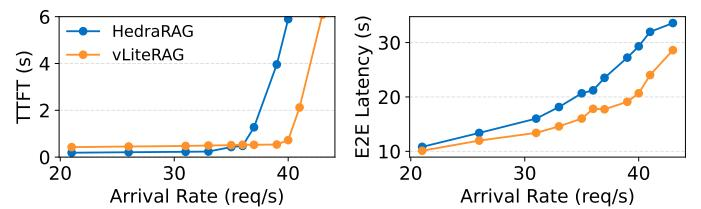
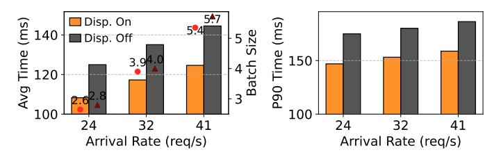

# C. End-to-End Latency

Since GPU resources are shared between retrieval and generation, interference with the decoding phase is inevitable. To assess the impact of such interference, we present the end-to-end latency results from the nine configurations discussed earlier, shown in Figure 11.

Retrieval contention is most severe for smaller models that can sustain higher loads, whereas large models saturate compute resources before retrieval pressure dominates. In the low-traffic regime, contention is minimal, except in DED-GPU, which reduces the number of GPUs available to the LLM. However, under high traffic and with large vector databases, contention becomes significant. This is evident in the more than 2× increase in end-to-end latency observed in ALL-GPU baselines for ORCAS 2K with Llama3-8B and Qwen3-32B. Although Llama3-70B involves more intensive computation,

Fig. 13. Comparison with HedraRAG. HedraRAG exhibits lower TTFT at low request rates, but latency increases sharply once the system exceeds its throughput limit. VECTORLITERAG is configured with  $SLO_{search}=400 \mathrm{ms}$ .

its low throughput ceiling causes TTFT to diverge before retrieval-induced interference becomes the dominant factor.

In contrast, VECTORLITERAG matches CPU-based retrieval in end-to-end latency. This demonstrates that its partitioning strategy and distributed execution pipeline effectively minimizes interference by carefully limiting GPU memory and usage of GPU threads for retrieval, thereby preserving LLM generation performance, while maintaining latency lower than SLO requirements.

## D. Comparison with HedraRAG

We compare VECTORLITERAG with HedraRAG [11], which also exploits skewed cluster access patterns in RAG pipelines. While both systems adopt tiered caching strategies for vector indices, their partitioning principles and target objectives differ fundamentally.

HedraRAG selects GPU-resident clusters by identifying the maximum KV cache size that can sustain the throughput of the slower stage, either the LLM or the retriever. Although this approach is simple and throughput-aware, it does not account for latency constraints that are critical for real-time serving. In configurations where the LLM stage exhibits lower peak throughput than retrieval, as in 11, HedraRAG allocates the entire GPU memory to LLMs and performs vector search on the CPU. As noted in their paper, HedraRAG is most effective when retrieval becomes extremely heavy.

Fig. 14. Left: Average search latency and batch sizes. Right: P90 tail latency on ORCAS 2K index with dispatcher enabled and disabled.

To enable a fair comparison, we replicate the HedraRAG setting by building an IVF index with  $\sqrt{N_{\rm vector}}$  clusters and measuring retrieval throughput using batch sizes below 64. At nprobe = 256, CPU-only retrieval achieves 35 RPS at 0.94 NDCG@50; we increase nprobe to 6144 in our system to match this accuracy. Since HedraRAG does not support distributed retrieval, we apply their GPU caching scheme using IndexIVFShard without our optimized pipeline.

Figure 13 summarizes the results. HedraRAG places 73% of index clusters in GPU memory, whereas VECTORLITERAG identifies a partitioning point of 31.5% under a 400,ms SLO. While HedraRAG achieves lower retrieval latency under low traffic, its operable range narrows as input rates increase. In contrast, VECTORLITERAG maintains latency near the target constraint across a wider traffic range and achieves lower overall end-to-end latency through its distributed pipeline.

The key distinction lies in how partitioning decisions are made. VECTORLITERAG allows operators to specify a target SLO and computes the largest GPU-resident index region that satisfies this constraint, whereas HedraRAG balances throughput between stages without explicit latency objectives, which can lead to suboptimal GPU allocation.

