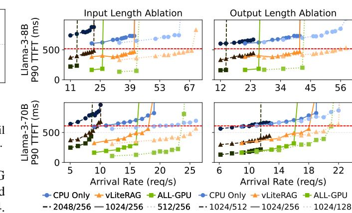
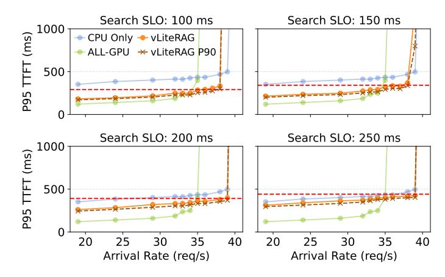
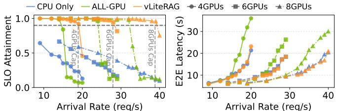

# E. Ablation Studies

1) Dynamic Dispatcher: Figure 14 illustrates the effectiveness of the dynamic dispatcher in the distributed VECTORLITERAG pipeline. By polling the scanning loop and dispatching queries immediately upon completion, the dispatcher reduces search latency by up to 16%, improving both average and tail latency. This gain is achieved by overlapping the merging and re-ranking of early-completed queries with the ongoing scanning of slower queries, avoiding bulk merging at the end.

Figure 14 also reports average batch sizes under varying arrival rates. With adaptive batching, requests are grouped dynamically based on current pipeline load. Since vector search has higher throughput capacity than the LLM, it absorbs higher arrival rates by increasing batch size while maintaining stable service time. In contrast, fixed or capped batch sizes lead to request backlogs and performance degradation.

2) Impact of LLM Input and Output Lengths: Figure 15 illustrates latency sensitivity to varying input and output lengths for Llama3-8B and Llama3-70B. The red dashed line denotes the combined SLO target of vector search and LLM stages, corresponding to the 1024/256 setting in Table I. For consistency,  $SLO_{LLM}$  is fixed across configurations.

Fig. 15. **Left**: P90 TTFT across different input and **Right**: output lengths. Darker curves represent longer input/output sequences, while brighter curves correspond to shorter ones. Experiments were conducted using the ORCAS-2K index.

Longer inputs increase prefill cost, raising TTFT and shifting SLO violations to lower arrival rates as compute resources saturate. Similarly, longer outputs reduce the SLO-compliant range due to extended generation time and higher KV cache usage. Across both dimensions, VECTORLITERAG maintains serviceability over a wider range than the baselines, highlighting the robustness of its partitioning scheme.

3) Sensitivity study on SLOsearch: To evaluate the robustness of our system under varying service constraints, we test VECTORLITERAG across multiple SLOsearch targets. All plots in Figure16 use P95 TTFT as the primary metric, with P90 results additionally shown as dashed lines for VECTORLITERAG. Changing the quantile slightly expands or shrinks the SLO-compliant range; in our evaluation, the difference between P90 and P95 was at most 1 RPS.

TABLE II SLO TARGETS AND CORRESPONDING INDEX SHARD SIZES.

| SLO (n | s) I | ndex (GB) | Param (GB) | KV Cache (GB) |
|--------|------|-----------|------------|---------------|
| 100    |      | 3.80      | 30.59      | 33.24         |
| 150    |      | 2.95      |            | 34.09         |
| 200    |      | 2.47      |            | 34.57         |
| 250    |      | 2.21      |            | 34.83         |

Table II summarizes the target SLOs and their associated memory allocations. Under relaxed SLO constraints, the latency-bounded partitioning algorithm assigns a smaller fraction of the index to GPU shards, yielding latency behavior closer to the CPU-only baseline. As the SLO becomes stricter, the latency curve moves toward the all-GPU configuration. While tighter SLOs reduce available KV-cache space and modestly shrink the operable region, VECTORLITERAG still delivers a wider SLO-compliant throughput range than the baselines, highlighting the adaptability of its partitioning strategy and the effectiveness of its execution pipeline.

4) Robustness to Hardware Capacity: Finally, we evaluate how VECTORLITERAG adapts to different hardware capacities of the system. Following the provisioning policy commonly adopted by cloud providers, which allocates additional CPU cores as more GPUs are added, we test three

Fig. 16. P95 tail latency (and P90 for VECTORLITERAG) under different search-stage SLO constraints. Results are obtained using the Qwen3-32B model and the ORCAS 1K index.

configurations: 4 GPUs + 32 cores, 6 GPUs + 48 cores, and 8 GPUs + 64 cores. For each configuration, we re-profile the CPU-only search latency and apply the same latency-bounded partitioning algorithm. Aside from the number of compute devices, all experiments use identical model and index setups.

The results in Figure 17 show that VECTORLITERAG sustains the target SLO across all configurations while extending the SLO-compliant throughput roughly in proportion to the number of GPUs. While the reduced memory capacity in the GPU baseline causes decoding latency to grow rapidly with scale, VECTORLITERAG effectively contains this growth, keeping decoding latency comparable to CPU-only search cases. This demonstrates that VECTORLITERAG can be readily deployed across clusters of different sizes with minimal setup effort while maintaining consistent latency behavior.

#### VII. RELATED WORKS

RAG applications with iterative retrieval or multi-stage generation often exhibit semantic similarity across successive queries. Motivated by this observation, several optimization techniques have been proposed, including prefetching [23], speculative retrieval [44], and pipelined execution [15]. In contrast, our work builds upon application-agnostic, generic retrieval—generation pipelines without relying on semantic priors or intermediate signals. RagCache [16] improves throughput by managing KV cache reuse between tenants, focusing on scheduling and reuse optimizations on the LLM side. Hermes [35], on the other hand, scales via disaggregation by adding CPU nodes to offload vector search.

Efforts such as [12], [14], [21], [26], [32] propose specialized hardware or memory-centric architectures to accelerate RAG pipelines. While these approaches offer significant performance gains, they often rely on custom infrastructure, which may limit deployability in general-purpose environments. Among prior works, HedraRAG [11] also co-locates retrieval and generation on GPUs. Our work builds on this direction with an analytical model for latency and hit rate, enabling principled GPU memory partitioning under explicit SLOs. To our knowledge, VECTORLITERAG is the first

Fig. 17. **Left:** SLO attainment (the vertical dashed line denotes bare LLM capacity) and **Right:** end-to-end latency measured on 4-, 6-, and 8-GPU systems. Evaluated using the Qwen3-32B model and the ORCAS 2K index.

solution to provide fine-grained resource control for co-located RAG pipelines.

Future work may extend our approach to prefill-decode disaggregation frameworks [31], [45], where bandwidth-bound retrieval may run alongside compute-intensive prefill. This would require jointly modeling vector search and the throughput of both stages, but our framework offers a natural basis for such integration.

