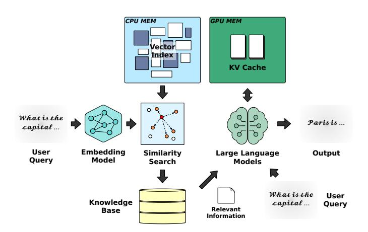
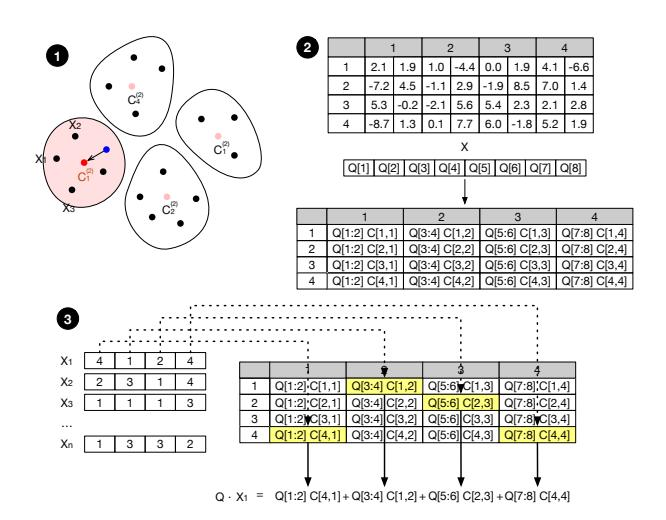
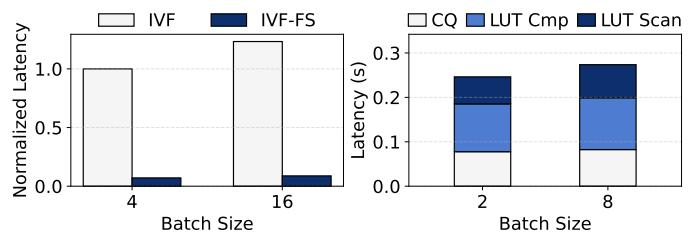
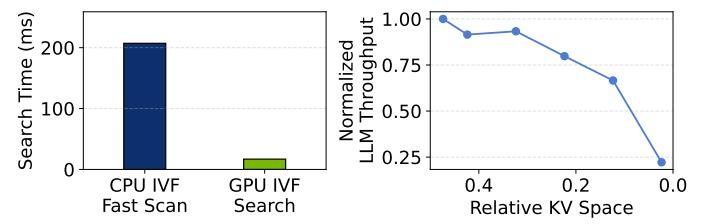

# I. INTRODUCTION

Retrieval-Augmented Generation (RAG) is a powerful system in natural language processing, particularly for domainspecific question answering and information retrieval tasks [7], [8], [10], [22], [33]. Its key strength lies in combining parametric memory, encoded in the weights of a large language model, with non-parametric memory retrieved from an external knowledge corpus. Although parametric memory provides strong generalization, it is expensive to train and difficult to update. To mitigate this, RAG pipelines first perform similarity search using approximate nearest neighbor search (ANNS) algorithms to retrieve relevant documents from a large database. The retrieved documents are then fed into the LLM's context to generate up-to-date and reliable responses.

RAG frameworks [20], [24], [38] typically adopt heterogeneous hardware configurations, where vector retrieval is executed on CPUs and LLM generation is served by GPUs. This is driven by the system characteristics: LLM inference requires

Fig. 1. End-to-end pipeline of a RAG system, where the input query is indexed into the vector database stored in memory, while the knowledge corpus resides in storage. The LLM prefill and decode execute on the GPU.

massive matrix multiplications and benefits significantly from GPU acceleration, whereas retrieval has traditionally been seen as a lighter task suited for CPUs. Offloading retrieval to CPUs allows GPUs to be dedicated to the more compute-intensive generation phase. CPU-based vector search may be sufficient for small vector databases, however, as the dimensionality of the embeddings and the size of the dataset grow, retrieval becomes increasingly compute- and memory- bound. CPUs, with limited parallelism, narrower vector units, and lower memory bandwidth, struggle to handle high-throughput similarity search at scale.

This latency imbalance creates a bottlenecked pipeline where the relatively slow CPU-based retrieval delays the GPUaccelerated generation phase, reducing the benefits of fast LLM inference and degrading overall system responsiveness. In our observations, CPU-based retrieval can take up to twice as long as the LLM prefill phase, increasing the total Time-to-First-Token (TTFT) from 197ms to 606ms when using a large database with 128M vectors, compared to a language model (Llama3-8B) operating without retrieval.

Although the retrieval operation is computationally lighter than the generation phase, it can still benefit significantly from GPU acceleration for two reasons: (1) GPUs feature wide and powerful vector units that enable highly parallelized distance computations, offering superior performance for similarity calculations on long embedding vectors. (2) The retrieval process involves scanning intermediate distance tensors to identify the closest data points in the vector space. These operations are typically implemented as memory lookups a task where GPUs outperform CPUs due to their vectorized memory access and higher I/O.

In addition to compute and bandwidth demands, vector retrieval introduces significant memory pressure. To reduce memory footprint and speed up the search process, vector databases are commonly compressed into vector indexes using quantization techniques such as product quantization (PQ) [13]. Nevertheless, even after compression, vector indexes still occupy significant memory space, often exceeding the memory capacity of a GPU. Furthermore, intermediate data structures such as distances between cluster centroids and queries consume additional memory.

These compute and memory pressures create a resource tension between the retrieval and generation stages, especially as the vector database grows and CPU-based search fails to meet strict latency requirements. GPU memory is already constrained, with most of it reserved for model weights and KV cache for the LLM. Naively sharding the vector index across all GPUs can lead to memory contention and reduced overall throughput. Alternatively, assigning a disaggregated GPU for retrieval can prevent direct interference between stages, but degrades overall system throughput by reducing the number of available LLM instances, in particular when models require multiple GPUs, enforcing rigid allocation schemes.

Motivated by these challenges, this work explores a holistic approach to optimizing distributed RAG pipelines through joint resource allocation between vector search and LLM generation. We present VECTORLITERAG, a system that partitions the vector index between GPU and CPU-based on query access patterns and LLM deployment configurations, aiming to maximize throughput while meeting latency targets by exploiting the compute power of GPUs across both stages of the RAG pipeline. By analytically modeling similarity search latency, we determine the smallest index portion that needs to be placed on the GPU to satisfy the latency requirement under a given system configuration. Accordingly, VECTORLITERAG offers a latency-aware, throughput-optimized solution that requires no additional hardware resources. This approach is grounded in two key insights:

Access-Skew-Aware Data Layout. VECTORLITERAG leverages a key characteristic of Inverted File (IVF) based retrieval systems [46], that query accesses exhibit skew across clusters. To take advantage of this, VECTORLITERAG incorporates an analytical model that determines the optimal partitioning point and corresponding layout for a multi-GPU system. While the coarse quantizer and cold clusters remain on the CPU, a small subset of hot clusters are cached and distributed across GPUs. The system allocates just enough hot clusters to the GPUs, avoiding both oversubscription of GPU resources during retrieval.

Inter/Intra-Query Variance-Aware Routing. When hot clusters are distributed across GPUs, hit rates vary both across queries (inter-query variance) and across device shards within a query (intra-query variance). Existing systems that enforce

Fig. 2. Three stages of vector search in IVF–based index: (1) coarse quantization to identify clusters most semantically similar to the query, (2) construction of a LUT containing partial distances between the query and codewords, and (3) scanning the LUT and re-ranking candidates from the selected clusters based on aggregated distances.

fixed retrieval configurations across devices fail to account for this variability and often over-allocate GPU threads. VEC-TORLITERAG introduces query- and shard- aware routing to avoid such inefficiencies. After determining the most relevant clusters, it dispatches work to CPU or GPU based on their actual expected contribution. It also monitors per-query progress, forwarding early-finishing queries to reduce straggler-induced delays and improve batching efficiency.

Our contributions are summarized as follows:

- Access-skew modeling and hit-rate estimation. We characterize access skew in IVF-based retrieval systems and develop a hit-rate estimation method based on observed cluster access patterns.
- Analytical latency model and SLO-aware partitioning. We construct a latency model that accounts for inter-query variance and use it to determine the optimal CPU-GPU index partitioning point that meets latency targets.
- Distributed retrieval pipeline. We design a distributed retrieval pipeline that adaptively allocates search tasks across CPUs and GPUs by exploiting inter-device hit rate variance, improving efficiency and avoiding unnecessary GPU resource usage.

#### II. RETRIEVAL AUGMENTED GENERATION

In a RAG system, user queries are first transformed into vector embeddings using embedding models [30], [34], [36], [42]. These embeddings capture the semantics of the input and enable similarity search by comparing query vectors to a vector database constructed from the knowledge corpus, typically encoded using the same embedding model. State-ofthe-art embedding models produce vectors of several thousand dimensions for higher quality, but this increased dimensionality raises the cost of distance computations.

Since exhaustive pairwise search is computationally infeasible at scale, large vector retrieval relies on approximate nearest

Fig. 3. **Left**: Search latency comparison between standard IVF and IVF with fast scan (IVF-FS). Except for the fast scan optimization, both indexes share identical configurations. IVF-FS achieves significantly faster search speed. **Right**: Latency breakdown of IVF-FS on a 128M vector index. Lookup table operations dominate the overall search time.

neighbor search to efficiently identify relevant documents. The retrieved vectors are mapped back to their corresponding documents, which are provided as additional context to the LLM alongside the original query.

#### A. Inverted List Index IVF

There are several approaches for structuring a vector database into a searchable index. Among them, HNSW and IVF are the most widely used.

HNSW [27] (Hierarchical Navigable Small World) is a graph-based structure where each vector forms a node connected to its nearest neighbors. It enables rapid search via hierarchical traversal and offers fast index construction. However, the additional edge information significantly increases memory usage as the dataset grows.

In contrast, the Inverted File (IVF) index [46] organizes the index as a hierarchical clustering structure. A subset of vectors is first clustered via K-Means to obtain centroids. Then, each database vector is assigned to the closest centroid, forming an inverted list. This structure narrows the search space using only centroid metadata, resulting in low memory overhead and high scalability. As such, IVF is widely adopted and studied in retrieval systems for large knowledge corpora [6], [11], [14], [21], [35], [43]. To further reduce memory usage, quantization techniques are applied on top of IVF. Scalar quantization (SQ) reduces each vector element to a smaller numerical type (e.g., float32 to int8), offering simplicity but limited compression. For higher compression ratios, product quantization (PQ) [13] is commonly used.

#### B. Search Operation in IVF Index

Figure 2 illustrates the search process in an IVF-PQ index, where an inverted list structure is combined with product quantization. When a query is received, the retriever first identifies the closest clusters, narrowing the search space. The number of clusters searched is controlled by the parameter nprobe, which trades off speed and accuracy.

Next, a distance lookup table is constructed. Since each vector is quantized into discrete sub-vector codes, each code maps to a representative value, trained and stored in the codebook. By pre-computing distances between the query vector and these representative values, the system avoids computing full distances to every vector. During the scan stage, these

Fig. 4. **Left**: While fast scanning accelerates IVF-based vector search on CPU(64 core Xeon 8462Y+), GPU(H100)-based IVF search offers superior performance. **Right**: Relationship between KV cache size and LLM throughput for the Qwen3-30B model on two H100 GPUs. Reducing KV cache space leads to a significant drop in throughput.

LUTs are used to accumulate approximate distances and retrieve the top-k nearest vectors.

A deeper analysis of IVF search, shown in Figure 3, reveals that the large portion of the search time is spent on constructing and scanning the distance lookup table. This highlights the LUT stage as a key bottleneck in retrieval latency. To mitigate this overhead, fast scanning techniques [4] have been proposed and implemented in libraries such as Faiss [6] and ScaNN [43]. These methods leverage SIMD instructions and CPU vector registers to accelerate distance lookup operations. By carefully organizing lookup tables and quantization codes into memory-aligned layouts, they significantly outperform conventional IVF scan routines, particularly in CPU-based environments.

Motivated by their superior latency-performance trade-off, we adopt fast scanning in our system to enable efficient and low-latency vector retrieval. However, despite the SIMD capabilities of modern CPUs, CPU-based search can still become a bottleneck, ultimately degrading the responsiveness of the end-to-end RAG system.

