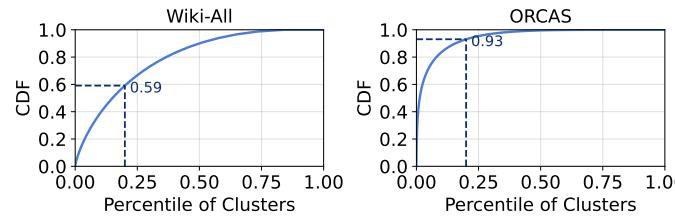
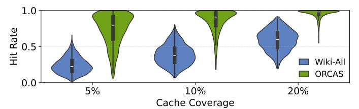
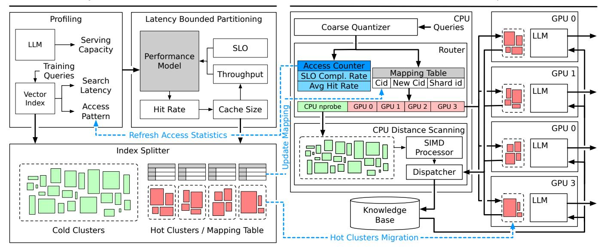

# III. CHALLENGES AND OPPORTUNITIES IN RAG SERVING A. GPU search vs. CPU search

While fast scan indexes significantly improve the latency of vector similarity search on CPUs, GPU-based retrieval can offer even greater speedups, due to their wider vector processing units and higher memory bandwidth. As shown in Figure 4 (left), GPU-accelerated IVF search can outperform fast scan methods by nearly an order of magnitude.

Thus, offloading retrieval to the GPU can offer higher speedups for large-scale vector databases where CPU-based search remains a bottleneck. However, this comes with a fundamental trade-off: GPU memory is already heavily utilized by LLMs, particularly for storing KV cache and model weights. Allocating additional memory for the vector index can reduce available cache space, ultimately degrading LLM throughput, as illustrated in Figure 4 (right).

Beyond memory capacity, GPU retrieval additionally incurs scheduling overheads due to increased contention for compute resources. Shared memory is used to stage partial distance lookup tables, and each query–cluster pair typically maps to a thread block. As the number of probed clusters increases, so does the occupancy and scheduling pressure on the GPU, further impacting performance.

Fig. 5. CDF of cluster access frequency for queries from the Wiki-All [37] and ORCAS [5] datasets. While the two distributions exhibit different levels of skewness, in both cases, the top 20% of clusters account for over 50% of the total distance computations.

Takeaway 1. GPU-based retrieval can substantially outperform even the fastest CPU-based methods, but due to contention with LLM inference workloads, careful memory and compute allocation is essential.

## B. Opportunity of Tiered Search Structure

The distribution of query access patterns in IVF indexes reveals the presence of hot clusters, a small subset that dominates retrieval traffic.

As shown on the left of Figure 5, the cumulative distribution of coarse quantization results exhibits a strong skew: the top 20% of clusters account for nearly 60% of accesses in Wiki-All [37] and over 93% in ORCAS [5]. This skew is especially pronounced in ORCAS, which reflects real-world query behavior through unfiltered click-through logs, capturing both popularity bias and the imbalance introduced by k-means quantization.

This imbalance results in inefficient memory usage, as significant resources are allocated to rarely accessed clusters with limited contribution to retrieval quality.

Takeaway 2. IVF index access patterns are highly skewed: a small number of clusters account for the vast majority of retrievals. This motivates a tiered index design, where frequently accessed clusters are prioritized for acceleration (e.g., GPU caching), and cold clusters are offloaded to lower-tier compute and storage.

Embedding access patterns in recommendation systems are also known to exhibit significant skew, where a small subset of items or users dominates embedding lookup frequency. This observation has motivated several tiered architecture designs that prioritize popular embeddings for faster access [1]–[3], [19], [25], [25], [29]. Inspired by this insight, our work offers tiered acceleration to vector similarity search. However, a key distinction lies in the granularity of memory accesses. In recommendation systems, embedding look-ups are performed via embedding IDs. In contrast, vector similarity search systems conduct fully content-based retrieval, where relevant vectors must be located by computing distances to hundreds or thousands of candidates per query. To identify the nearest vector, the search must access not only the target vector but also neighboring vectors within the cluster.

Moreover, even if each embedding is uniformly accessed, clusters can contain varying numbers of vectors, exacerbating the access skew. This imbalance causes certain clusters to dominate query traffic, creating hot regions in memory access.

Fig. 6. Violin plot of hit rate distribution at different cache-coverages. The width of the violin indicates the density of queries with similar hit rates, while the white dot and black bar denote the median and inter-quartile range, respectively. This highlights that increasing cache coverage improves overall hit rates but does not eliminate tail queries with poor hit rates.

As a result, skew in our setting emerges more prominently at the cluster level rather than the vector level.

Consequently, although both domains benefit from tiered designs, the unit of optimization and the manifestation of skew differ substantially. Our approach explicitly targets cluster-level skew in large-scale retrieval workloads, enabling effective tiered placement and latency-aware resource allocation that are not directly addressed by prior embedding-centric designs.

## C. Variance of Hit Rate across Queries

While tiered resource allocation strategies can accelerate vector search by caching frequently accessed clusters, their effectiveness in deployment is often hindered by query-level variance in hit rates. Long-tail queries with less cache hits can significantly limit the overall performance gains.

Figure 6 presents a violin plot of hit rate distributions across queries, measured by counting the number of clusters (among the total nprobe) that fall within the cached hot cluster set. As cache coverage increases from 5% to 20% of total clusters, the average hit rate improves accordingly. However, the variance remains substantial, especially in highly skewed datasets such as ORCAS, where a long tail of queries exhibits minimal cache benefit.

This variance introduces a deployment challenge. Since vector search throughput scales with batch size, retrievers are typically deployed with batching enabled. However, in the presence of low-hit queries within a batch, the entire batch's processing time is effectively bounded by the slowest query. As a result, even if the average per-query latency is reduced by GPU acceleration, end-to-end latency improvements are constrained. Therefore, to fully realize the benefits of tiered or cached retrieval in real-world deployments, it is essential to account for such hit rate variance and long-tail behavior during system design.

Takeaway 3. Variance in hit rate across queries poses a challenge in latency-critical deployments, due to long-tail queries as batching amplifies the impact of long-tail queries, limiting the effectiveness of caching.

In summary, while GPU-based retrieval can vastly outperform CPU methods, it introduces a resource contention problem when co-located with LLMs, due to limited GPU memory and compute capacity. Meanwhile, query access patterns exhibit strong skew: a small fraction of clusters account for most retrieval traffic, making selective caching and tiered

Fig. 7. System architecture of VECTORLITERAG. The system has two stages, Left: offline hybrid index construction and Right: runtime distributed pipeline. Profiling guides latency-bounded partitioning to determine cache size and split point, producing sharded indices and mapping tables. At runtime, queries are routed via coarse quantizer and mapping tables, hot clusters run on GPUs, cold clusters on CPUs. A dynamic dispatcher forwards early-finished queries to LLM workers in a timely manner. Blue trails and boxes indicate runtime index refresh and update procedures.

search strategies effective. However, significant variance in hit rates across queries, especially long-tail queries, poses a major challenge in latency-sensitive deployments, as batching magnifies the bottleneck introduced by slow queries. These insights motivate the design of VECTORLITERAG, which adaptively partitions the index across GPU and CPU tiers, accounting for workload skew, hit rate variance, and end-to-end latency constraints to optimize throughput and responsiveness.

