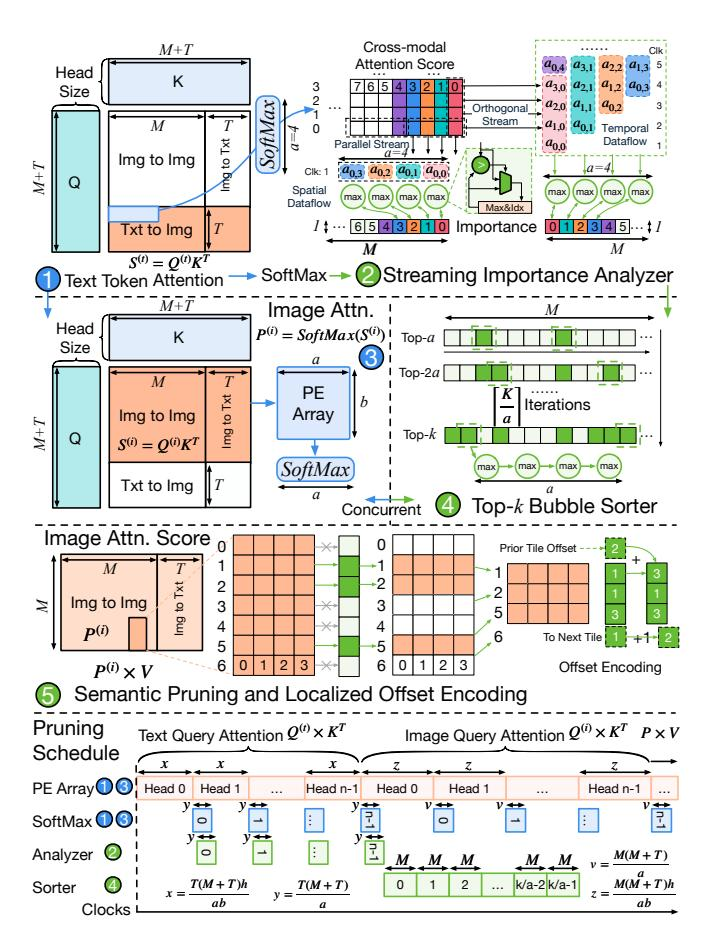

# A. Streaming Importance Analyzer

SEC integrates directly into the attention  $Softmax(QK^T)$ pipeline. computation As shown in Fig. 5(1), for each attention head, it compute a  $Softmax(QK^T)$  matrix containing four blocks: imageto-image  $(M \times M)$ , image-to-text, text-to-image  $(T \times M)$ , and text-to-text. We extract the *Text-to-Image* block  $(T \times M)$ as the cross-modal importance matrix I, where M and Trepresent the number of image and text tokens, respectively. To estimate the importance of each image token j over nheads, we compute the maximum attention score it receives from any text token and all heads:  $s_j = \max_{1 \le k \le n} I_{i,j}^{(k)}$ . This results in an importance vector of shape  $1 \times M$  across all heads. An on-chip buffer of 25 KB is used to store the importance vector.

As depicted in Fig. 5(2), the importance analyzer uses a parallel max units to process the output of the attention SoftMax (provided by the special function unit). To match throughput, a max units processes a attention scores concurrently. This streaming design supports two dataflows: **Parallel (spatial) stream**: Attention columns are streamed directly into max units. **Orthogonal (temporal) stream**: Attention rows are buffered locally, enabling column-wise reduction.

This fully streaming design ensures minimal area and latency overhead. Since no global operations are needed, the analyzer is decoupled from the main compute path and incurs negligible runtime cost.

#### B. Top-k Bubble Sorter

Once the  $1\times M$  importance vector is computed, the system must identify the top-k most relevant tokens. To avoid sorting all M tokens globally, SEC adopts a pipelined bubble sorter as shown in Fig. 5(4). By chaining the a max units used earlier, we construct an a-way streaming bubble sorter. This structure incrementally refines the top-a tokens, allowing us to compute top-k selection over the M candidates in  $\frac{M \cdot k}{a}$  cycles, substantially more efficient than full sorting.

Crucially, this process is fully overlapped with the computation of image attention  $(S^{(image)} = Q^{(image)}K^T)$ , which dominates the overall runtime. Let the image attention (within  $QK^T$  GEMM) require  $\frac{M\cdot (M+T)\cdot h\cdot n}{a\cdot b}$  cycles, where h is the head dimension, n is the number of heads, and  $a\times b$  is the PE array size. The ratio of attention to the sorting operation is:  $\frac{M\cdot (M+T)\cdot h\cdot n}{a\cdot b}\cdot \frac{a}{M\cdot k}=\frac{(M+T)\cdot h\cdot n}{k\cdot b}$ . In typical configurations,

Fig. 5. Overview of the Semantic Concentrator (SEC), including the streaming importance analyzer, top-k sorter, and offset encoder.

 $h \cdot n$  reaches into the thousands (e.g., 3584), while b is much smaller (e.g., 32) and k < (M+T). Therefore, the sorting operation completes well before the  $Q^{(i)}K^T$  finishes, ensuring that the SEC remains off the critical path and introduces no runtime bottleneck. A scheduling diagram is shown in Fig. 5 bottom to better understand the overlapping.

