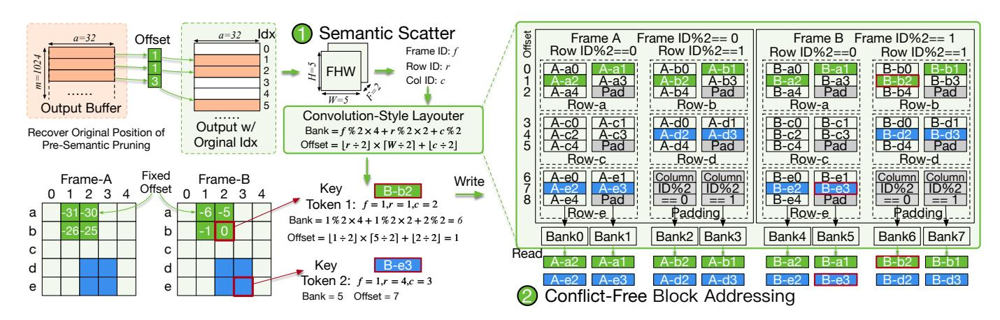
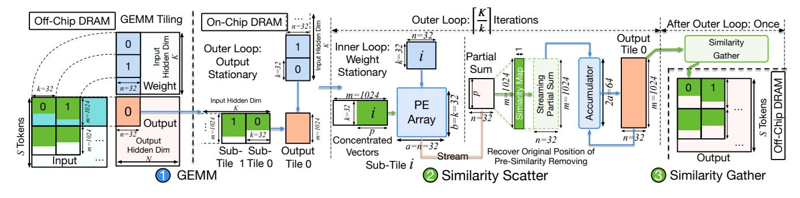
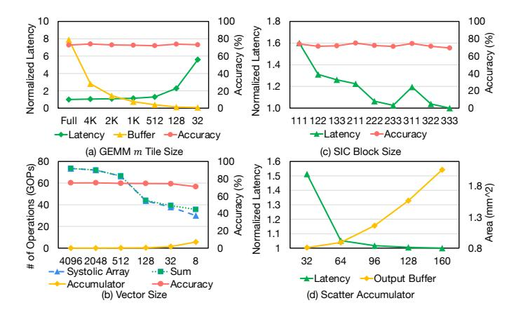
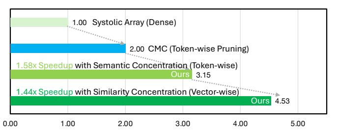

# C. Semantic Pruning and Offset Encoding

After identifying the top-k most important tokens, we apply **semantic pruning** for the input of the subsequent attention operation,  $P^{(i)} \times V$ . As shown in Fig. 5(5), only the retained tokens are loaded and processed in  $P^{(i)} \times V$ , eliminating the need for any memory access or computation on pruned tokens.

In pure pruning mode, no additional metadata is needed. However, to support later stages (e.g., similarity concentration), we must record the position of retained tokens for spatial-temporal information. For this, the SEC generates **localized offset encodings**. The offset encoder, shown in Fig. 5(5), operates in a sliding window over the retained tokens. For each token, it records a small integer representing its offset to the previous token. This compact encoding is sufficient to restore positional alignment for future operations (e.g., similarity matching). The encoder's computation is local

Fig. 6. Overview of the Similarity Gather module. (1) GEMM tiling. (2) Convolution-style layout reorders outputs into a block-wise structure. (3) Cosine similarity is computed within blocks to detect and eliminate duplicates. (4) Only unique vectors are stored, while a similarity map enables reconstruction.

and streaming, requiring only lightweight registers and no global memory access.

Overall, the entire Semantic Concentrator, including the analyzer, sorter, and encoder, is fully modular and incurs minimal overhead. SEC selectively retains the most informative visual tokens using cross-modal attention, top-k selection, and compact position encoding. It operates transparently within the attention, requires no additional global memory access, and introduces negligible runtime or area overhead.

#### VI. SIMILARITY CONCENTRATOR

After semantic-level token pruning, subsequent FC layers operate seamlessly on the reduced token set, as the pruning is token-aligned and preserves structural layout. However, semantic pruning alone does not address fine-grained redundancy at the vector level. In contrast, **Similarity Concentration** targets vector-wise redundancy by matching and merging similar output vectors within local regions across frames.

Different from semantic pruning, where unimportant tokens are discarded, similar vectors often carry essential information and thus require accurate removal and later reconstruction. To support this, the similarity process includes two core components: **Similarity Gather**: removes similar vectors and constructs a compact output. **Similarity Scatter**: restores the original full layout using a similarity map.

## A. Similarity Gather

In this section, we first detail the design of **Similarity Gather**, which efficiently operates in a fully streaming fashion.

**GEMM Tiling.** As shown in Fig. 6(1), Similarity Gather operates on the output of GEMM1. Assume the input has dimension  $M \times K$ , the weight matrix is  $K \times N$ , and the output is  $M \times N$ . Due to limited on-chip resources, we adopt a tiling strategy widely used in modern accelerators [8], [32]. Specifically, the input and weight tiles are of size  $m \times K$  and  $K \times n$ , and the output tile is  $m \times n$ , where we typically set m = 1024 and n = 32. The PE array performs one output tile at a time, producing a-length output vectors, where a = n = 32 in our implementation. These vectors are then

streamed to the Similarity Gather logic for processing when an output tile gets ready.

**Block-wise Addressing.** To exploit spatiotemporal redundancy, we adopt a **convolution-style layout** over two adjacent frames, as illustrated in Fig. 6(2). A  $2 \times 2 \times 2$  sliding window spans both spatial and temporal dimensions with a stride of 1, forming a block that contains 8 vectors, 4 from each frame. Each element in the block is an a-dimensional output vector produced by the GEMM operation, and the block serves as a localized comparison group for redundancy detection.

To efficiently support this structure, GEMM outputs are dynamically reorganized into the convolution-style layout using a dedicated reordering module, as detailed in Sec. VI-B. Within each block, the vector with the highest index (e.g., token ID 32) is selected as the key vector and compared against the other 7 vectors in the same block (e.g., token IDs 1 through 31) to identify potential redundancy.

**Vector-wise Similarity Matching.** As shown in Fig. 6(3), each key vector is streamed into the **Similarity Matcher**, which performs localized comparisons to determine whether the vector is redundant. We adopt cosine similarity to compare two vectors **p** and **q** of length 32:

s **p** and **q** of length 32:  

$$\frac{\mathbf{p} \cdot \mathbf{q}}{\|\mathbf{p}\| \cdot \|\mathbf{q}\|} = \frac{\sum_{i=1}^{32} p_i q_i}{\sqrt{\sum_{i=1}^{32} p_i^2} \cdot \sqrt{\sum_{i=1}^{32} q_i^2}}.$$

Thanks to the regularity of the convolution-style layout, each token can precompute its L2-norm ( $\|\mathbf{p}\|$ ) and store it in a buffer. This allows the matcher to perform similarity comparisons using only a single dot-product unit and a small number of low-overhead element-wise operations. Furthermore, the vector-level granularity reduces the normalization length to 32, greatly simplifying the hardware design compared to tokenwise similarity matching. In contrast, prior accelerators such as AdapTiV [70] and CMC [56] compute similarity at the token level, requiring expensive global memory access and full-sequence comparisons. By operating at the vector level within localized blocks, *Focus* achieves significantly lower matching overhead while maintaining semantic fidelity.

In practice, most of these operations are already supported by the Special Function Unit (SFU), which is commonly used for *RMSNorm* [72] and *SoftMax* computations. Com-

&lt;sup>1Similarity Gather on output of FFN, O projection, and PV GEMM

Fig. 7. The convolution-style layouter enables accurate token positioning and conflict-free memory access for block-level similarity. (1) Reconstructs token positions via semantic offsets and maps outputs to a FHW-layout. (2) Enables conflict-free addressing across memory banks without data duplication.

pared to these more complex operations, cosine similarity is lightweight and well-suited for hardware acceleration. Although the matcher could reuse existing SFU logic, for fairness, we implement it as a separate module and include its area and energy in our evaluation. The total overhead remains minimal, accounting for <1% of the systolic array design.

It is worth noting that similarity matching is *not* on the critical path of GEMM, as comparisons are performed only once per output tile. For a tile with m=1024 vectors, each requiring 7 pairwise comparisons and 1 L2-norm computation (based on the  $2\times 2\times 2$  block structure), the matcher needs at most  $8\times m$  cycles to process the tile. In contrast, GEMM requires  $\frac{K}{b}\times m$  cycles, where K is the hidden dimension and b is the number of PE rows. In our setup, with K=3584 and b=32, GEMM takes  $112\times m$  cycles per tile, far exceeding the cost of similarity matching. Only when K<256 does the matcher approach the critical path.

To address this corner case, we can scale the design by deploying multiple matcher units in parallel. Our convolution-style layout inherently supports conflict-free parallel access, allowing similarity matching to be fully overlapped with GEMM computation without introducing additional latency.

**Similarity Collection.** Once similarity matching completes, each vector has two outcomes: No match: The vector is unique and added to the concentrated output buffer. Match found: The vector matches a previously stored one (e.g., token 32 matches token 31), and we reuse the index of the matched token.

To support lossless reconstruction, we maintain a **Similarity Map** of size  $1 \times m$  per tile. This map records, for each of the original m output vectors, the index of its representative in the compact buffer. For instance, if token 32 matches token 31, we assign token 32 the index "9" from token 31. After processing all m=1024 vectors in a tile, only the deduplicated vectors and the similarity map are written back to DRAM. This significantly reduces memory bandwidth and storage.

All stages of this pipeline, including reordering, matching, and mapping, are performed on-chip, in a streaming fashion, without global synchronization or off-chip overhead. This

localized similarity removal aligns naturally with GEMM tiling and preserves high data locality throughout execution.

#### B. Convolution-style Layouter

We now describe the design of the *convolution-style lay-outer*, which addresses two key challenges in enabling efficient block-level similarity matching after semantic pruning: (1) recovering token positions and (2) avoiding memory access conflicts during parallel execution.

Challenge 1: Recovering Token Positions after Pruning. Semantic pruning disrupts the spatial structure of tokens by removing unimportant entries, making it nontrivial to identify the 2D position of retained tokens in the original frame. To enable meaningful  $2 \times 2 \times 2$  comparisons across adjacent frames, we must reconstruct each token's (Frame, Height, Width) coordinate after pruning.

As shown in Fig. 7(1), we achieve this using the *offset encoding* generated during the semantic pruning stage (see Sec. V-C). This offset, streamed alongside the GEMM output, allows us to recover the original spatial location of each token. Tokens are then reorganized into a structured 3D tensor layout following the FHW (Frame–Height–Width) order to support localized block grouping.

Challenge 2: Avoiding Memory Conflicts in Parallel Matching. To form a  $2 \times 2 \times 2$  spatiotemporal block, vectors are drawn from multiple rows, columns, and frames. A naive layout may introduce bank conflicts or require data duplication across SRAM banks, an approach used by traditional CNN accelerators [8] but with significant memory overhead (up to  $8 \times$  replication).

To eliminate these conflicts, we propose a **conflict-free convolution-style layout**, shown in Fig. 7(2), which deterministically maps each token to a unique bank and offset based on its FHW position. Given frame index f, row r, and column c, the memory bank and address are computed as:

$$Bank = f \mod 2 \times 4 + r \mod 2 \times 2 + c \mod 2,$$

$$\mathrm{Offset} = \left\lfloor \frac{r}{2} \right\rfloor \times \left\lceil \frac{W}{2} \right\rceil + \left\lfloor \frac{c}{2} \right\rfloor,$$

Fig. 8. GEMM tiling and Similarity Scatter design. (1) GEMM computes over concentrated vectors. (2) Similarity Scatter reconstructs and accumulates vector results using similarity maps. (3) Final output is passed to Similarity Gather once after all iterations in a tile.

where W is the width of the frame. This mapping guarantees that all 8 vectors in any  $2 \times 2 \times 2$  block reside in distinct memory banks and can be read simultaneously without contention.

**Key Insight:** Unlike traditional approaches that duplicate inputs to avoid access conflicts, our layout achieves fully parallel, conflict-free access *without any data replication*. This enables streaming similarity matchers to operate in parallel across tiles and spatial regions, scaling throughput without modifying the GEMM pipeline. The layouter thus plays a critical role in supporting parallel similarity execution and maintaining high utilization.

#### C. Similarity Scatter

GEMM Tiling for Concentrated Vectors. As shown in Fig. 8(1), Similarity Scatter operates on the concentrated vectors generated from earlier stages. Since only a subset of the original m=1024 tokens is retained in each tile (p<1024), the input to this GEMM stage is logically sparse but structurally dense. To maintain compatibility with standard systolic-array architectures, GEMM is performed using a conventional tiling scheme with dimensions m=1024 and n=32. The GEMM execution follows a two-level nested loop structure: The outer loop adopts an output-stationary dataflow, keeping the  $m \times n$  output tile resident on-chip to accumulate results across the K dimension. The inner loop follows a weight-stationary strategy, loading one  $k \times n$  weight sub-tile into the PE array while streaming in a  $p \times k$  sub-tile of concentrated input vectors.

Each inner loop iteration computes partial products and generates one a-dimensional partial sum vector per cycle. Our vector size 32 matches with the k tile size and array height b, ensuring full utilization of the PE array. These vectors are streamed out and accumulated over successive iterations to form the final tile result. The key advantage arises from the reduced number of active input vectors (p < 1024), which significantly lowers the computational workload. However, since different sub-tiles may have different subsets of concentrated vectors, each possibly representing multiple original tokens, direct accumulation would produce incorrect outputs due to semantic aliasing.

**Similarity Scatter and Gather.** To resolve this, we introduce the **Similarity Scatter** module, illustrated in Fig. 8(2).

After each GEMM step, the generated partial sums are streamed into a temporary buffer. Using the similarity map from previous layer's the gather phase (see Sec. VI-A), each partial sum is replicated and redistributed to its associated original token indices, reconstructing the full m=1024 output. This scattered output is then accumulated into an output-stationary buffer spanning all outer loop iterations. To maintain throughput parity, we employ a 2a-wide accumulator (e.g., 64 when a=32), enabling concurrent accumulation of reconstructed vectors and streaming outputs. The reconstruction process is performed in-place, incurs negligible overhead, and does not require additional memory allocation.

Upon completing all  $\lceil \frac{K}{k} \rceil$  outer loop iterations, the fully accumulated output tile is passed to the **Similarity Gather** unit (see Sec. VI-A), shown in Fig. 8(3). This final stage is invoked only once per tile after GEMM concludes and lies entirely off the critical compute path.

In summary, by executing GEMM on a compact set of concentrated vectors, *Focus* achieves substantial compute savings. Through the Similarity Scatter module, it efficiently reconstructs full output tiles with minimal accuracy loss, and the final gather stage removes vector-level redundancy. This hardware-oriented, vector-granular compression strategy ensures high compute efficiency while preserving model fidelity. Our evaluation shows that the additional logic is lightweight and does not impact GEMM throughput, making it a key enabler of *Focus*'s performance advantage.

## VII. EVALUATION

#### A. Methodology

**Evaluation Models and Datasets.** We evaluate *Focus* using three representative VLMs with video understanding and reasoning capabilities: Llava-OneVision-7B (Llava-OV) [35], Llava-Video-7B (Llava-Vid) [74], and MiniCPMV-2.6 (MiniCPM) [68]. These models are tested on three widely adopted video understanding benchmarks: VideoMME (VMME) [19], MVBench (MVB) [37], and MLVU [76]. These datasets include diverse video types and durations, enabling a holistic evaluation of model capabilities across comprehension, temporal reasoning, and multimodal alignment. We use opensource models obtained from HuggingFace Transformers [66]

and perform evaluation via the lmms-eval [73] multimodal benchmarking framework to ensure consistency and fairness.

Baselines. We compare *Focus* against two state-of-the-art architectures: AdapTiV [70], a vision transformer accelerator, and CMC [56], an accelerator optimized for video transformers. We extend their designs to make them compatible with VLMs. CMC performs inter-frame similarity checks, whereas AdapTiV focuses on intra-frame similarity detection; both exclude text tokens. We also compare with the vanilla systolic array [34] architecture for a base reference. In addition to hardware baselines, we also compare with FrameFusion [20], a state-of-the-art token pruning algorithm tailored for efficient VLMs with video inputs.

Algorithm Implementation of *Focus* and Baselines. We implement the algorithm of our proposed *Focus* method in PyTorch [48]. For the baselines, we faithfully reproduce the token pruning algorithm from AdapTiV and CMC, carefully tuning their hyperparameters for application to VLMs. For FrameFusion, we adopt the official open-source implementation without modification. All algorithms are executed on an NVIDIA A100 GPU [46] using FP16 precision for fair and consistent comparison.

Architecture Implementation of *Focus* and Baselines. Our *Focus* architecture setup is shown in Tbl. I. To evaluate architectural performance, we develop a cycle-accurate simulation framework based on SCALEsim-v2 [51]. The simulator accepts layer-wise sparse traces generated from specific models and datasets in our PyTorch implementation, enabling precise modeling of cycles and memory access. We implement the *Focus* architecture in SystemVerilog and generate the onchip SRAMs using the TSMC N28HPC+ Memory Compiler. The RTL is synthesized with a target clock period of 1.32 ns (≈757 MHz) under the worst-case slow–slow (SS) corner (0.81V, 125°C), achieving 0 ns worst negative slack (WNS) and providing a 34% timing margin for place-and-route at 500 MHz. The resulting area is reported from post-synthesis analysis, and the on-chip power is obtained from post-synthesis simulation using Synopsys Design Compiler. Off-chip DRAM energy is modeled with DRAMsim3 [38] for device-level power. For a fair comparison, we also implement the core logic of all baseline accelerators in SystemVerilog and evaluate their area and energy using the same toolchain as *Focus*.

TABLE I *Focus* ARCHITECTURE SETUP

| PE Array           | 32 × 32; FP16 Mul FP32 Acc; Weight Stationary                                                                                                                               |
|--------------------|-----------------------------------------------------------------------------------------------------------------------------------------------------------------------------|
| Focus Hyper-params | Block Size: 2×2×2; Vector Length: 32; Similarity Threshold: 0.9; M Tile Size: 1024 Semantic: Retain 40%/30%/20%/15%/10% of total image tokens at layer 3/6/9/18/26 |
| On-Chip Buffer     | Input: 128KB; Weight: 78KB; Output: 512KB; Layouter Buffer: 16KB for 256-vector window; 734KB in total.                                                               |
| Off-Chip Memory    | DDR4 4Gb × 16, 2133R, 4 Channels, 64GB/s                                                                                                                                    |

TABLE II ACCURACY AND COMPUTATION SPARSITY OF *Focus* AND BASELINES

| Models    | Dataset | Metric           | Ori.           | FF             | Ada.           | CMC Ours                      |
|-----------|---------|------------------|----------------|----------------|----------------|----------------------------------|
| Llava-Vid | VMME    | Acc. Sparsity | 64.15 00.00 | 62.00 70.00 | 62.44 52.15 | 62.52 62.74 58.62 82.82 |
|           | MLVU    | Acc. Sparsity | 67.74 00.00 | 65.38 70.00 | 65.94 32.52 | 65.17 65.99 42.46 78.26 |
|           | MVB     | Acc. Sparsity | 60.33 00.00 | 57.20 70.00 | 57.73 41.07 | 58.18 58.20 53.00 78.44 |
| Llava-OV  | VMME    | Acc. Sparsity | 58.41 00.00 | 57.70 70.00 | 58.33 36.80 | 58.11 58.70 81.49 47.95 |
|           | MLVU    | Acc. Sparsity | 63.32 00.00 | 62.54 70.00 | 62.22 39.55 | 62.50 62.52 35.48 78.34 |
|           | MVB     | Acc. Sparsity | 58.38 00.00 | 56.93 70.00 | 56.83 42.03 | 56.75 56.78 63.69 85.49 |
| MiniCPM   | VMME    | Acc. Sparsity | 58.81 00.00 | 58.81 70.00 | 58.07 49.27 | 55.89 58.30 57.20 82.87 |
|           | MLVU    | Acc. Sparsity | 55.89 00.00 | 54.80 70.00 | 54.84 41.88 | 43.80 53.59 78.01 35.23 |
|           | MVB     | Acc. Sparsity | 55.63 00.00 | 52.43 70.00 | 53.70 50.09 | 48.78 54.30 75.99 40.27 |

## *B. Algorithmic Accuracy and Theoretical Sparsity*

To evaluate the effectiveness of the multilevel concentration technique in *Focus*, we compare both model accuracy and the achieved computational sparsity against baseline methods. The computation sparsity is calculated through the ratio of the number of operations using the method to the number of operations required by the systolic array with original input. The results are presented in Tbl. II.

*Focus* consistently achieves the highest accuracy across most evaluated scenarios, outperforming both software-only methods and hardware-based approaches. Compared to the original, uncompressed models, the average accuracy degradation with *Focus* is only 1.20%, demonstrating its ability to preserve semantic fidelity.

In addition to maintaining high accuracy, *Focus* also achieves the highest computational sparsity across all models and datasets. Specifically, *Focus* achieve sparsity of 80.19% on average, delivering 37.37% and 31.98% higher sparsity than AdapTiV and CMC, respectively, and outperforms FrameFusion by over 10.19% in sparsity.

#### *C. Performance and Energy Evaluation*

We compare *Focus* against baseline methods, including the vanilla systolic array (SA), Adaptiv, and CMC, across multiple VLM models and datasets. The architectural setup for all baselines and *Focus* is detailed in Tbl. III. We maintain the same frequency, technology node, number of processing elements, operand bit width, and DRAM bandwidth across all designs. We further compare against the performance on an NVIDIA Jetson Orin Nano GPU [12], evaluated with and without the FrameFusion algorithm. The performance and energy results are presented in Fig. 9 (a) and (b).

Performance. *Focus* achieves significant performance improvements across all benchmarks. On average, it delivers a 4.47× speedup over the vanilla systolic array, which process

Fig. 9. Left: Speedup and Energy efficiency. Right: Area and power breakdown

dense input. This improvement stems from the ability of multilevel concentration to aggressively compress input tokens, getting 80.2% sparsity.

Compared to AdapTiV, *Focus* achieves a 2.60× average speedup. While AdapTiV effectively detects and prunes nearby redundant visual tokens, it operates at a coarser granularity. In contrast, *Focus* performs vector-wise similarity removal, enabling finer-grained redundancy elimination.

Against CMC, *Focus* achieves a 2.35× speedup. While CMC leverages external video codecs to perform wide-range redundancy search, this approach is often inefficient due to a high rate of mismatches. In contrast, *Focus* efficiently identifies sufficient redundancy within localized blocks using its on-chip similarity matcher.

Compared with the GPU, our design achieves a 7.90× speedup over the GPU and a 2.37× speedup over the GPU running with FrameFusion. This improvement stems from our architecture's ability to achieve higher computational utilization than the GPU. Moreover, *Focus* attains higher sparsity than FrameFusion due to its finer-grained redundancy removal, which is difficult to exploit on GPU Tensor Cores.

Energy Efficiency. As shown in Fig. 9(b), we report the total energy consumption of *Focus* and baseline designs, normalized to the vanilla systolic array (SA). The energy breakdown includes three components: on-chip core, on-chip buffer, and off-chip memory.

Compared to SA, GPU, AdapTiV, CMC, and GPU with FrameFusion, *Focus* achieves average energy efficiency improvements of 4.67×, 17.09× 2.98×, 3.29×, and 5.13×, respectively. These results highlight that *Focus* delivers significant savings across both computation and memory under constrained on-chip budget. This efficiency gain stems from our architecture's ability to sparsify output of GEMM onchip immediately after output tile generation, ensuring that all subsequent off-chip memory transactions operate on compressed data. A detailed analysis of memory access reduction is presented in Sec. VII-F.

TABLE III CONFIGURATION COMPARISON OF *Focus* AND BASELINE ARCHITECTURE

| Architecture     | SystolicArray   | Adaptiv         | CMC             | Ours            |
|------------------|-----------------|-----------------|-----------------|-----------------|
| Technology       | 28nm            | 28nm            | 28nm            | 28nm            |
| Frequency        | 500MHz          | 500MHz          | 500MHz          | 500MHz          |
| PE Array         | 32x32 16-bit | 16x64 16-bit | 32x32 16-bit | 32x32 16-bit |
| Buffer Size      | 734KB           | 768KB           | 907KB           | 734KB           |
| DRAM Bandwidth   | 64GB/s          | 64GB/s          | 64GB/s          | 64GB/s          |
| On-chip Area/mm2 | 3.12            | 3.38            | 3.58            | 3.21            |
| On-chip Power/mW | 720             | 1176            | 832             | 736             |
|                  |                 |                 |                 |                 |

Area and Power Analysis. The area and power consumption of *Focus* and the baselines are also summarized in Tbl. III. The power statistics is derived on Llava-Video-7B with VideoMME dataset. Our *Focus* design occupies 3.21 mm2 of on-chip area and consumes 736 mW of power, both of which are lower than those of Adaptiv and CMC.

*Focus* is smaller than CMC, as the external video codec used by CMC incurs substantial hardware overhead. Compared to Adaptiv, which adopts a lightweight similarity detection mechanism, *Focus* remains more efficient due to its streaming SEC that operates on localized input. Despite its enhanced functionality, *Focus* introduces only a 2.7% increase in area and a 0.9% increase in power consumption relative to the systolic array architecture. These results highlight the efficiency and low overhead of the *Focus* unit, which delivers significant performance benefits within a modest hardware budget.

To gain a deeper understanding of the overhead introduced by *Focus*, we present a detailed breakdown in Fig. 9(c). We observe that the proposed Semantic Concentrator and Similarity Concentrator are both highly lightweight, accounting for only 1.9% and 0.8% of the overall area, respectively. These two units also contribute negligibly to the overall power consumption. This demonstrates that SEC and SIC are well-

Fig. 10. Design Space Exploration

suited for resource-constrained scenarios.

Overall Insights. Beyond speedup and energy gains, *Focus* establishes a new paradigm for redundancy-aware VLM acceleration through tight algorithm–hardware co-design. At the token level, it performs on-the-fly *Top-*k *detection* via streaming processing, handling sparsity in real time with minimal cost. At the block level, a *block-wise sliding window* propagates local similarity using only on-chip resources, reducing memory and buffer demand. At the vector level, *Focus* applies *vector-wise similarity pruning* with a *gather–scatter* scheme to control fine-grained irregular access and fully exploit sparsity. Together, these techniques translate algorithmic sparsity into tangible performance gains with minor hardware complexity.

#### *D. Design Space Exploration*

To evaluate the impact of key architectural parameters in *Focus*, we conduct a comprehensive design space exploration. We focus on four primary factors, varying each individually while fixing the others to their default values to isolate their effects. Note that architectural parameters, other than the number of scatter accumulators, may also affect model accuracy. We evaluate accuracy under these variations and observe that the impact is generally negligible, allowing us to safely prioritize performance in our design exploration. All measurements are taken on the Llava-Video-7B model, using either the VideoMME or MLVU dataset.

GEMM m Tile Size. As shown in Fig. 10(a), we sweep the tile size from the full input height down to 32. As the tile size decreases, the end-to-end latency steadily increases. This trend arises because similarity gathering operates per tile. When a 2×2×2 block crosses tile boundaries, Focus only compares tokens within the same tile as the key token. For example, when the first token of a tile is the key, its neighbors outside the tile are unavailable for comparison. With smaller tile sizes (e.g., m = 32), such boundary-crossing cases become more frequent, causing potentially similar vectors to be treated as distinct due to the limited comparison scope.

While larger tiles offer better compression, they require more on-chip buffer to store intermediate results, increasing area and power consumption. We observe a trade-off between

Fig. 11. Ablation Study for *Focus*

latency and buffer usage. From the latency–buffer curve in Fig. 10(a), a tile size of 1024 emerges as an optimal design point. It incurs only 19% higher latency compared to the fullheight tile while substantially reducing buffer requirements to a practical level.

Vector Size. Vector size determines the granularity of similarity concentration and directly impacts the sparsity and operation counts. To assess this, we measure the number of operations of a layer in two main components of *Focus*: (1) MAC operations in the main systolic array, and (2) accumulation operations in the outer accumulator during Similarity Scatter.

As shown in Fig. 10(b), reducing the vector size leads to fewer operations in the systolic array. This is because smaller vectors enable finer-grained similarity comparisons, allowing more aggressive redundancy removal and reducing the input size to the PE array. However, smaller vector sizes also increase the number of K-dimension iterations, requiring more frequent accumulation, which in turn raises the operation count in the accumulator.

Beyond operation count, the systolic array dimension b must be equal to or less than the vector size to utilize the benefits of fine-grained input. Taking both operational efficiency and hardware compatibility into account, we identify a vector size of 32 as an optimal design point, achieving strong compression while maintaining high utilization of the systolic array.

Similarity Concentrator Block Size. The block size used in the SIC directly impacts the spatial and temporal context available for similarity detection. We vary the block size along both the temporal (frame) and spatial (height and width) dimensions to examine its impact on performance. As shown in Fig. 10(c), the three-digit labels on the xaxis denote block sizes across these dimensions (e.g., 122 indicates f=1,h=2,w=2). We observe that enlarging the block size in either temporal or spatial dimensions reduces latency, as larger blocks provide broader context for similarity detection. Notably, extending the block size along the temporal dimension yields a more pronounced latency reduction compared to spatial extensions, which we attribute to the strong inter-frame similarity inherent in video inputs. We find that a block size of 2×2×2 is sufficient to provide strong performance.

Scatter Accumulator. The number of accumulators in similarity scatter affects throughput and pipeline efficiency. Ideally, accumulation should finish before the next output tile arrives from the systolic array. As shown in Fig. 10(d), using

Fig. 12. Memory access analysis (a) overall DRAM access (b) activation size

64 accumulators achieves near-peak performance with only a 5% latency overhead compared to a larger 160-accumulator design, with diminishing returns beyond that point. This configuration also simplifies buffer design.

Semantic Pruning Configuration. In our Semantic Pruning scheme, the value of "k" in top-k pruning is determined by multiplying the original number of image tokens by a predefined retention ratio. We search multiple layer-wise retention configurations and select the one offering the best sparsity–accuracy trade-off, which is adopted in our design. The final setup is summarized in Tbl. I, where pruning is applied to five selected layers whose retention ratios differ from the preceding layer. Future work may further enhance this strategy by dynamically adapting to input contexts, e.g., using a post-softmax attention threshold or top-p pruning [39], though such adaptation can introduce runtime variations across inputs.

## *E. Ablation Study*

To assess the contribution of each component in *Focus*, we perform an ablation study on Llava-Video-7B and report speedup, as shown in Fig. 11. We incrementally enable the SEC and SIC, comparing results against a dense systolic baseline and CMC [56]. When only the SEC is enabled, *Focus* achieves a 3.15× speedup over the uncompressed systolic baseline and a 1.58× speedup over CMC. This demonstrates that semantic-aware pruning remove a large fraction of irrelevant visual tokens based on textual guidance, outperforming prior token-pruning strategies.

Enabling the vector-wise SIC further boosts speedup by an additional 1.44×. This highlights the ability of SIC to exploit residual redundancy among retained tokens at a finer vector granularity, beyond what semantic pruning alone can uncover. SEC and SIC together yield a 4.53× speedup over the dense baseline and 2.26× over CMC, confirming the effectiveness and efficiency of the *Focus* design.

## *F. Memory Access*

We analyze the off-chip memory traffic and average input matrix size of *Focus* compared to baseline designs. As shown in Fig. 12(a) and (b), *Focus* achieves the lowest DRAM access and input matrix size across all methods. Compared to the dense systolic array, we compress the input matrix by 5.6× and reduce memory traffic by 4.9×.

This reduction stems from the joint effect of the SEC and SIC, which sparsifies the input at both token and vector levels.

TABLE IV INFLUENCE OF INT8 QUANTIZATION ON ACCURACY AND SPARSITY

| Models    | Datasets | Dense |         | Ours  |         | Ours     |         |
|-----------|----------|-------|---------|-------|---------|----------|---------|
|           |          | Acc.  | Degrade | Acc.  | Degrade | Sparsity | Degrade |
|           | VMME     | 64.22 | -0.07   | 62.33 | 0.41    | 82.48    | 0.34    |
| Llava-Vid | MLVU     | 68.21 | -0.47   | 64.94 | 1.05    | 78.10    | 0.17    |
|           | MVB      | 59.75 | 0.58    | 57.95 | 0.25    | 78.04    | 0.40    |
|           | VMME     | 58.70 | -0.29   | 57.44 | 1.26    | 81.46    | 0.03    |
| Llava-OV  | MLVU     | 63.38 | -0.06   | 62.41 | 0.11    | 78.35    | -0.01   |
|           | MVB      | 58.55 | -0.17   | 56.18 | 0.60    | 85.35    | 0.14    |
|           | VMME     | 58.63 | 0.18    | 57.96 | 0.34    | 82.84    | 0.03    |
| MiniCPM   | MLVU     | 55.93 | -0.04   | 53.22 | 0.37    | 77.99    | 0.02    |
|           | MVB      | 55.13 | 0.50    | 54.03 | 0.27    | 75.97    | 0.02    |

Additionally, the output of each FC layer is immediately compressed on-chip before being written to memory, so only compressed activations are transferred to DRAM, minimizing total memory access.

Compared to both CMC and AdapTiV, *Focus* achieves significantly higher input compression and lower DRAM access: 3.0× and 2.2× higher compression ratios, and 3.7× and 2.2× DRAM traffic reduction, respectively.

CMC relies on codec-based similarity detection over wide temporal windows and full-token representations, requiring large uncompressed regions to be staged in DRAM before processing. This leads to redundant memory transfers, as data must be written and read again for similarity detection. Similarly, AdapTiV performs local token pruning but still processes on whole-token granularity. By avoiding these limitations through lightweight, streaming-compatible similarity matching, *Focus* achieves superior memory efficiency with minimal overhead.

#### *G. Synergy with Quantization*

*Focus* is fully compatible with standard quantization techniques. We integrate *Focus* with INT8 quantization using bitsandbytes [14], and the results in Tbl. IV show the impact on accuracy and sparsity compared to FP16. INT8 causes an average accuracy drop of 0.5% and a sparsity change of 0.13% relative to FP16. Although this loss is slightly higher than the 0.02% degradation in the dense model, it is reasonable since *Focus* and quantization jointly compress the model. Overall, the accuracy drop remains minor, and *Focus* effectively maintains its redundancy-removal capability under quantization, demonstrating strong synergy for efficient VLM inference.

