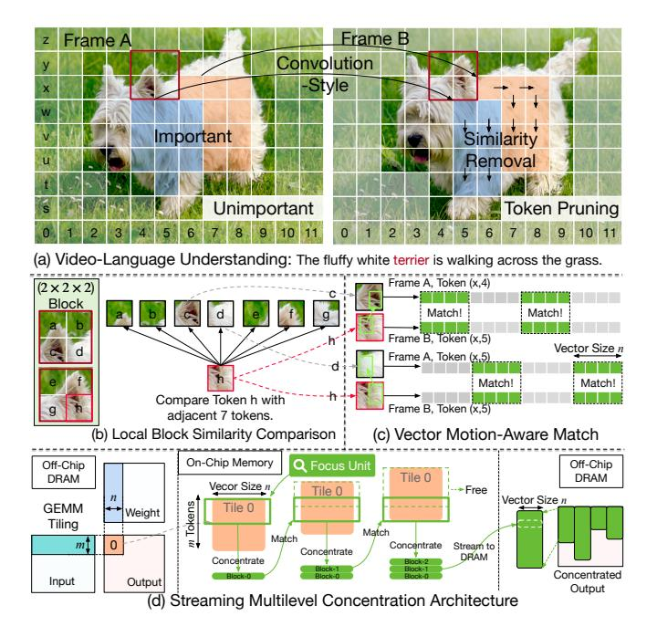
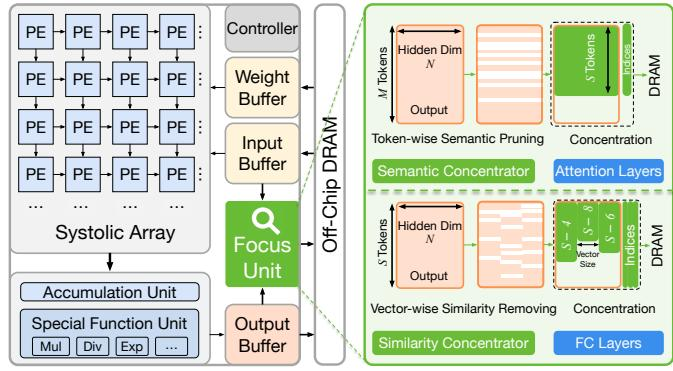

# I. INTRODUCTION

Vision-Language Models (VLMs) [35], [41] have emerged as a cornerstone of multimodal AI, enabling joint reasoning over visual and textual data. By integrating advances from computer vision and natural language processing, VLMs excel at tasks such as video captioning [67], [74], visual question answering [13], [55], and cross-modal retrieval [36]. Following a similar trajectory to Large Language Models (LLMs) [6], [15], modern VLMs have rapidly scaled in size and data, resulting in notable accuracy gains. However, this scaling significantly increases compute and memory demands, posing challenges for deployment, especially on edge devices [53].

Fortunately, video-based inputs offer a key opportunity: high visual redundancy [7], [28], [52], [62], [69]. As shown in Fig. 1(a), adjacent frames often share similar backgrounds and foreground objects. Since VLMs tokenize each frame independently [35], [74], many tokens across or within frames are redundant. This has motivated techniques such as token pruning [50], [62] and token merging [4] to reduce computation. However, most prior work focuses on algorithmic strategies without considering hardware alignment. For instance, Token Merging [4] introduces a ToMe module that increases runtime by up to 36.8% [70].

Recent designs such as AdapTiV [70] and CMC [56] address these inefficiencies at the hardware level. AdapTiV implements a simplified ToMe module in hardware, while CMC leverages video-codec-inspired compression (e.g., H.264 [65]) via an external codec block. However, both approaches largely translate existing algorithms without embracing full hardwarealgorithm co-design. First, both targeted for Vision Transformers (ViTs) [17], focus only on visual redundancy and overlook the cross-modal nature of VLMs. CMC's codec ignores language inputs, and AdapTiV only supports static images, missing video-language interactions. Second, both operate at global token-level granularity, which is inefficient for both algorithm and hardware due to high overhead and poor locality. To enable efficient VLM deployment, a more holistic co-design approach is needed, one that leverages cross-modal redundancy while aligning with hardware-friendly processing granularity.

In this study, we propose a novel architecture, *Focus*, to accelerate VLM inference by performing *streaming concentration*, a multilevel compression technique that removes visual and cross-modal redundancy in a streaming-friendly, on-chip processing fashion.

From the algorithmic perspective, *Focus* performs redundancy concentration at three levels of granularity. First, it leverages semantic understanding to retain only visual regions relevant to the textual prompt. Prior work [4], [49], [56], [70] relies on static metrics like token magnitude, which fail to capture prompt-conditioned semantics in VLMs. As shown in Fig. 1(a), attention may shift from a foreground object (e.g., a dog) to a background element (e.g., a flower), depending on the question (see details in Sec. III-A). To address this, *Focus* introduces a prompt-aware importance analyzer that dynamically prunes visual tokens based on crossmodal attention, improving both accuracy and efficiency.

Second, as illustrated in Fig. 1(b), *Focus* groups retained tokens into spatiotemporal blocks, using the last token (e.g., token h) as the key for localized similarity comparisons. The key token is compared with others in its block. This is applied across the video, treating each token in turn as a key. This technique resembles a 3D convolutional sweep that progressively concentrates similarity through localized matching. By operating within small spatial-temporal windows, *Focus* avoids

Fig. 1. Overview of the streaming multilevel concentration architecture.

global comparisons, making the process compute-efficient and highly streamable.

Third, *Focus* explores redundancy at the vector level. Due to video motion, a token may align with multiple shifted tokens in adjacent frames. As shown in Fig. 1(c), token h may share features with parts of tokens c and d. Relying on a single best-matched token may lose information. Instead, *Focus* performs vector-wise comparisons, allowing each vector to match multiple candidates and capture richer sub-token similarity. By integrating these three levels, *Focus* achieves up to 83% (80% on average) computational sparsity through multilevel concentration, significantly outperforming CMC and AdapTiV, which typically reach only 40–50%, under similar accuracy.

From the **architectural perspective**, *Focus* is designed to efficiently support multilevel concentration through tight alignment with General Matrix Multiplication (GEMM) tiling. As shown in Fig. 1(d), its vector- and block-level operations naturally align with the tiling strategies widely adopted in systolicarray–based accelerators such as TPUs [31] and GPUs [11]. GEMM tiling addresses on-chip memory constraints by dividing matrices into small, independently processed tiles. Each tile is handled by the PE array in isolation, enabling efficient, in-place **vector-level** similarity detection and compression. By eliminating redundancy locally within each tile, *Focus* minimizes data movement and reduces both compute cost and DRAM traffic. In contrast to global token-wise methods that rely on costly off-chip access, *Focus* achieves fine-grained, on-chip processing in a hardware-efficient manner.

At the **block level**, *Focus* draws inspiration from CNN accelerators [8], [18], using a sliding window to stream and process output tokens directly from the compute core (e.g., systolic array), maximizing locality and sustaining high

throughput. To handle the non-contiguous nature of VLM tokens within a block, we adopt a convolution-style layout that preserves streaming flow while ensuring alignment for blockwise matching. At the semantic-level, which corresponds to the **token level**, *Focus* integrates into the attention layer to identify and retain the most relevant tokens based on cross-modal attention scores. Through dedicated scheduling, it performs token selection in a streaming fashion, enabling compression prior to memory write-back without stalling GEMM execution.

Focus operates as a standalone module, similar to pooling or activation, without interfering with the core computation pipeline. Its modularity enables broad applicability and scalability while maintaining high compression efficiency. By co-optimizing the algorithm and architecture, Focus achieves up to 5.0× reduction in computation and 4.9× reduction in memory footprint for VLM inference. Occupying only 2.7% of the systolic array area, it is lightweight and well-suited for edge deployment. Our contributions are as follows:

- We propose multilevel concentration, a hardware-oriented redundancy removal paradigm that eliminates semantic-, block-, and vector-level redundancy in VLMs.
- We develop a co-designed streaming concentration architecture that aligns with tiling-based execution and memory access patterns with minimal hardware overhead.
- To the best of our knowledge, Focus is the first architecture tailored for VLMs, delivering 2.60×/2.35× performance and 2.98×/3.29× energy efficiency gains over AdapTiV and CMC, respectively.

#### II. BACKGROUND

#### A. Vision-Language Models

The success of Large Language Models (LLMs), such as GPT [47] and LLaMA [58], has driven remarkable progress across a broad range of applications. Building upon this foundation, Vision-Language Models (VLMs) extend the capabilities of LLMs to multimodal inputs, enabling joint reasoning over visual and textual information. This multimodal capability significantly broadens their utility in tasks such as video captioning [45], visual question answering (VQA) [13], [55], and interactive multimodal assistants [5], [41]. With superior adaptability and generalization in open-world visual scenarios, VLMs are emerging as a transformative technology with far-reaching impact in both academic [1], [21], [40] and industrial [2], [47], [57] domains.

Modern VLMs consist of a vision encoder and a Large Language Model (LLM) that jointly process visual and textual inputs. In video-based VLMs, videos are sampled into frames, divided into patches, and tokenized by the vision encoder into embeddings, which are projected into the LLM's word embedding space for multimodal fusion. These visual tokens are concatenated with text prompts and processed by the LLM to generate text outputs.

The LLM with Transformer [6], [59] model architecture dominates both model size and computation. For example, in LLaVA-OneVision-72B [35], it accounts for **99.35%** of

Fig. 2. Motivation for multilevel concentration. (a) Prompt-aware attention heatmaps. (b) Cosine similarity CDFs. (c) Sparsity Comparison.

parameters and 98.98% of operations. Moreover, visual tokens typically make up 98%–99% of total inputs; in LLaVA-OneVision on the VideoMME dataset [19], each sample averages 6,272 visual tokens versus only 109 text tokens. Therefore, optimizing LLM efficiency is crucial for accelerating VLMs.

## *B. Efficiency Optimizations for VLM*

Efficient Algorithms. Video-based VLMs generate a large number of tokens, placing heavy demands on compute and memory. To mitigate this, various token pruning techniques have been proposed [7], [28], [43], [62], [69]. For instance, Prumerge [52] uses sparse attention scores between the class token and visual tokens to discard less important ones, while FrameFusion [20] merges temporally redundant tokens across frames.

These methods show that only a small subset of tokens is needed to preserve performance. However, they often incur runtime overhead for importance estimation and produce irregular sparsity patterns that limit GPU utilization.

Hardware Accelerators. Dedicated VLM accelerators are still rare, though Vision Transformer (ViT) accelerators [16], [56], [70] offer transferable insights. AdapTiV [70] merges nearby tokens using lightweight similarity checks based on sign bits, while CMC [56] leverages video codec hardware to detect inter-frame redundancy. These designs offload token selection to specialized logic, reducing overhead and enabling efficient sparsity utilization, but are limited to coarse-grained, token-level pruning.

In contrast, *Focus* captures both coarse- and fine-grained redundancy through a multi-level concentration strategy. This broadens the scope of efficiency gains and enables hardwarefriendly sparsity, as detailed in the following sections.

## III. MOTIVATION

This section presents our motivation from both algorithmic and architectural perspectives across three levels:

- (1) *Token (semantic) level* prunes irrelevant tokens based on language context through semantic concentration;
- (2) *Block level (similarity scope)* detects local spatiotemporal redundancy within adjacent regions using block-wise comparison;
- (3) *Vector level (similarity granularity)* captures fine-grained sub-token redundancy via vector-wise similarity.

#### *A. Algorithm: Multilevel Concentration*

Semantic Attention Shifts with the Prompt. In Vision-Language Models (VLMs), token importance is inherently tied to the input prompt. Prior pruning methods often rely on static heuristics such as saliency or token magnitude, which fail to capture prompt-specific semantic intent.

To illustrate this, we extract cross-modal attention maps averaged from all layers of the Llava-Onevision-7B [35] model under two different prompts, as shown in Fig. 2(a). When asked *"What is the type of the dog?"*, attention concentrates on the dog; when asked *"What is the color of the flower?"*, attention shifts to the lower-left corner where the flowers reside. These examples highlight that semantically relevant tokens vary greatly with the question, and static importance metrics are inadequate.

Our semantic concentration module leverages cross-modal attention to prune uninformative tokens early, improving efficiency without degrading accuracy.

Fine-grained Granularity Enhances Redundancy Detection. Global token-level matching is often too coarse to capture redundancy arising from motion, deformation, or soft spatial shifts. As illustrated in Fig. 1(c), a token in one frame may partially overlap with several neighboring tokens in the next frame, rendering single-token matching ineffective.

To better capture such partial alignments, we divide token embeddings into vectors and perform similarity comparisons at the vector level. We extract all layers' input from Llava-OneVision [35] model with the MLVU [76] dataset. Fig. 2(b) shows the average cosine similarity distribution across all layers, along with the variation range among layers. On average, over 64% of 8-dimensional vectors exceed a cosine similarity threshold of 0.9, compared to only 18% for 3584 dimensional vectors, indicating that finer granularity reveals substantially more redundancy. This enables higher sparsity without degrading accuracy. As shown in Fig. 2(c), our vectorlevel method achieves 82.8% sparsity on Llava-Video [74] with the VideoMME [19] dataset, outperforming both CMC and AdapTiV, and exceeding our token-wise variant by 9.8%. This translates to a 1.6× reduction in computation, while slightly improving accuracy.

Block- and vector-level strategies are complementary: block granularity defines *where* comparisons are applied (e.g., within spatiotemporal windows), while vector granularity determines *how fine* those comparisons are conducted. Together, they yield

Fig. 3. (a) Global token-wise methods (e.g., CMC) perform compression offchip after writing all token outputs to DRAM. (b) *Focus* compresses locally and on-chip at the vector level, immediately after each tile is produced.

structured sparsity that aligns naturally with GEMM tiling, enabling efficient and accurate compression in hardware.

#### B. Architecture: Hardware-Oriented Design

While many efforts aim to improve VLM efficiency [4], [20], [44], most focus on algorithmic techniques while overlooking hardware constraints. In high-throughput systems, algorithm and architecture must be co-designed, otherwise, even efficient algorithms can suffer from memory bottlenecks or poor data locality. As shown in Fig. 3, our design bridges this gap through a **vector-wise compression strategy** that improves both accuracy and system efficiency.

Limitations of Global Token-Wise Methods. Prior designs like CMC [56] adopt global, token-wise compression by offloading redundancy removal to a codec unit after writing full token outputs to DRAM (Fig. 3a). This incurs high bandwidth usage and sacrifices data locality. AdapTiV [70] integrates token merging into hardware, but still relies on coarse token-pair operations and must transfer uncompressed tokens before processing. If prior designs were required to perform compression before writing back to DRAM, they would need an additional large buffer; for example, CMC uses up to 1.4MB. Token-wise methods also require full-token readiness before redundancy detection, limiting streaming.

Moreover, these approaches overlook sub-token redundancy and operate at the full GEMM level, which misaligns with the execution model of systolic arrays that process small, regular GEMM tiles. Their global execution prevents fine-grained scheduling and increases memory pressure. As shown in Sec. VII-F, CMC achieves 46% sparsity but still incurs 79% of dense DRAM traffic, whereas *Focus* reaches 81% sparsity with only 21% of the bandwidth, highlighting the advantage of hardware-aligned, vector-level concentration.

**GEMM-Tile Friendly Compression.** Focus performs compression entirely within each GEMM tile, aligning with the compute flow of systolic arrays. As shown in Fig. 3(b), vector-level similarity is computed immediately after generating each  $m \times n$  tile, using on-chip logic with no off-chip access. This tile-local design preserves output regularity, introduces structured sparsity, and minimizes control and data movement overhead, making it naturally hardware-efficient.

We further adopt a block-wise scheduling strategy using sliding windows. Each block is processed in-stream, enabling local reuse and eliminating the need for global buffering. Our conflict-free memory layout (Sec. VI-B) supports parallel

Fig. 4. Overview of the *Focus* architecture. The *Focus* Unit integrates a Semantic Concentrator (SEC) and a Similarity Concentrator (SIC), positioned between compute stages to eliminate redundancy before memory write-back. Both modules operate in a streaming manner and run entirely on-chip.

compression units without access contention, allowing *Focus* to scale with tile throughput at negligible latency.

In summary, *Focus* demonstrates effective hardware-algorithm co-optimization. Our vector-wise design improves redundancy detection and model fidelity, while streaming and tile-local execution ensure high hardware efficiency. This tightly integrated architecture makes *Focus* scalable, practical, and deployable for real-world VLM applications.

#### IV. Focus Architecture Overview

Focus introduces a modular Focus Unit to improve compute and memory efficiency in VLMs. As shown in Fig. 4, the Focus Unit is integrated near the memory interface of a standard systolic-array accelerator, intercepting data between compute stages without altering the core compute pipeline. The Focus Unit consists of two streaming submodules:

- Semantic Concentrator (SEC): Performs token-level pruning in attention layers based on cross-modal Attention scores.
- Similarity Concentrator (SIC): Performs vector-level redundancy elimination in fully connected (FC) layers, aligned with GEMM tiling.

**SEC** reduces the image token sequence length from M to S. It evaluates token importance using existing attention maps and prunes low-relevance tokens early in the pipeline. Pruned tokens remain excluded in downstream layers, yielding cumulative savings in computation and memory access.

**SIC** further eliminates fine-grained redundancy among vectors within each GEMM tile. It compares incoming vectors in a convolution-style window and replaces similar ones with index references to shared representatives. This reduces the number of vectors processed per tile while preserving correctness via index-based reconstruction.

Both SEC and SIC operate entirely on-chip, support streaming dataflow, and dynamically adapt to data sparsity. By targeting complementary forms of redundancy from semantic and structural, *Focus* delivers efficient and scalable acceleration for Vision-Language Models. We detail the hardware implementation of SEC and SIC in Sections V and VI, respectively.

#### V. SEMANTIC CONCENTRATOR

The **Semantic Concentrator** (**SEC**) enhances inference efficiency by selectively retaining semantically important visual tokens based on language context. It operates in the attention layers and consists of three tightly coordinated yet modular components, as shown in Fig. 5: The **importance analyzer** that estimates the importance of visual tokens based on crossmodal attention. A lightweight **top-***k* **sorter** that identifies the most important image tokens on the fly. An **offset encoder** that enables lossless index tracking for streaming token recovery.

