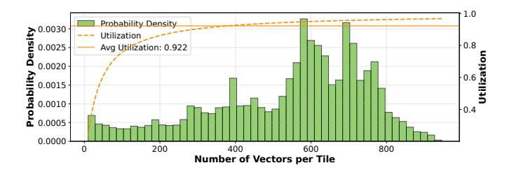

# VIII. DISCUSSION

## *A. Generalization Ability of Focus*

We further examine the generalization ability of *Focus*. Although *Focus* is originally designed for video-based VLMs, it can be directly extended to image-based VLMs by treating a single image as a one-frame video. While temporal similarity is no longer present in this setting, substantial semantic redundancy and spatial similarity remain. As shown in Tbl. V, evaluations on image-based VLMs [3], [35] across multiple datasets [22], [42], [75] demonstrate notable speedups

TABLE V
ACCURACY AND SPEEDUP ON IMAGE VLMS

| Models          | Dataset | Metric              | Dense           | AdapTiV              | Ours                 |
|-----------------|---------|---------------------|-----------------|----------------------|----------------------|
|                 | VQAv2   | Speedup Accuracy | 1.00 84.32   | <b>5.19</b> 82.48    | 4.44 <b>83.01</b> |
| Llava-OneVision | MME     | Speedup Score    | 1.00 1067.27 | 1.65 1036.27      | 4.26 1044.79      |
|                 | MMBench | Speedup Accuracy | 1.00 84.99   | 1.60 <b>84.49</b> | <b>4.25</b> 83.46 |
| Qwen2.5-VL      | VQAv2   | Speedup Accuracy | 1.00 84.48   | <b>1.96</b> 79.77 | 1.91 <b>81.73</b> |
|                 | MME     | Speedup Score    | 1.00 1337.66 | 1.89 1129.56      | 1.97 1238.88      |
|                 | MMBench | Speedup Accuracy | 1.00 85.69   | <b>1.93</b> 83.79 | 1.78 <b>84.46</b> |

over both the systolic-array baseline and AdapTiV, with only minor accuracy degradation. These results indicate that *Focus* effectively removes redundancy beyond the video domain.

Moreover, *Focus* can potentially be extended to Vision–Language–Action (VLA) [30], [33] models for embodied AI applications. VLA models share similar input modalities with VLMs, including image or video inputs paired with text. Therefore, we believe the SEC and SIC in *Focus* could effectively eliminate redundant information in VLA inputs, making this a promising direction for future exploration.

#### B. Worst- and Best-Case Analysis

Since sparsity varies with video content, we analyze two extreme scenarios to verify robustness. In the **worst case**, when no similarity exists across frames or patches, sparsity drops near zero. The design preserves the full tile length (m=1024), with buffers sized for maximum data without overflow. In the **best case**, abundant similarity yields highly compressed tiles and small m, slightly wasting buffer space and underutilizing the systolic array but remaining correct. We further aggregate the frequency of different tile lengths (i.e. number of vectors) and measure systolic-array utilization (Fig. 13). These extremes are rare, one increases latency, the other lowers utilization, but the system maintains an average utilization of 92.2%, confirming robust performance across diverse inputs.

## C. Related Works

Algorithm Optimizations. As a major paradigm for multimodal reasoning, VLMs have attracted significant attention, resulting in a rapidly growing body of work on improving inference efficiency. A large class of recent methods focuses on exploiting redundancy in visual tokens to accelerate VLM inference [7], [20], [29], [43], [44], [54], [62]. FrameFusion [20] compares and merges similar tokens across adjacent frames, while PruneVid [29] performs token clustering and merges tokens within the same cluster. By removing or compressing redundant tokens through diverse algorithmic strategies, these approaches effectively reduce token counts and achieve notable speedups on GPUs.

Fig. 13. Histogram and compute utilization of concentrated tile length.

Despite their effectiveness, these methods operate exclusively at the token level and are implemented as software-only optimizations. They are primarily designed for execution on general-purpose GPUs and do not consider how redundancy manifests at finer granularities or how it can be efficiently exploited from a bottom-up hardware perspective.

**Architecture Design.** From the hardware architecture perspective, to the best of our knowledge, there is no dedicated accelerator specifically designed for VLM inference. Existing architectural efforts instead target efficiency optimizations for LLMs and ViTs, which share the transformer backbone with VLMs. These works predominantly rely on sparsity [16], [23], [60], [61], [63], [64], [71] and quantization [9], [10], [24]– [27]. In terms of sparsity, SpAtten [60] introduces token- and head-level pruning for transformers, while LAD [61] optimizes key-value cache pruning during the decoding phase of LLMs. HeatViT [16] leverages attention maps in ViTs to prune visual tokens. In addition, several works propose hardwarefriendly quantization architectures: Olive [24] introduces an outlier-victim pair format integrated into processing element (PE) arrays, and BitMoD [9] enables fine-grained data-type adaptation through bit-serial processing.

While these techniques can be applied to VLMs, they are not explicitly designed for multimodal workloads and therefore may fail to fully capture the unique redundancy patterns introduced by cross-modal interactions. In contrast, *Focus* is the first architecture specifically tailored for VLM inference. By exploiting cross-modal semantic redundancy and detecting fine-grained vector-level similarity, *Focus* enables efficient streaming execution and achieves superior hardware efficiency beyond token-level or modality-agnostic optimizations.

#### IX. CONCLUSION

We present *Focus*, a streaming concentration architecture that jointly optimizes algorithm and hardware for efficient VLM inference. Our Multilevel Concentration strategy removes redundancy at the semantic, block, and vector levels, while our hardware design performs in-place compression aligned with GEMM tiling and streaming execution. *Focus* achieves up to 2.35× speedup and 3.29× energy efficiency improvement over state-of-the-art baselines, with only 2.7% area overhead in a systolic-array accelerator. By tightly codesigning compression logic with accelerator architecture, *Focus* enables scalable, high-performance deployment of VLMs on both edge and cloud platforms, and paves the way for future hardware-aware multimodal systems.

#### ACKNOWLEDGMENT

This work was supported in part by NSF-2112562, NSF-2328805, and ARO W911NF-23-2-0224. The authors sincerely thank the anonymous reviewers for their constructive feedback and valuable suggestions that greatly improved the quality of this work. The authors also express their gratitude to Bowen Duan, Jonathan Ku, Yiming Li, and Dr. Tingjun Chen for their technical support and insightful discussions.

## APPENDIX

## *A. Abstract*

This artifact provides a complete implementation of *Focus*, a streaming concentration architecture for efficient visionlanguage model (VLM) inference. The artifact includes three main components: (1) Algorithm implementation of Focus and baseline methods (CMC, Adaptiv, FrameFusion) for multiple VLMs, including LLaVA-Video, LLaVA-OneVision, MiniCPM-V, and Qwen2.5-VL; (2) Cycle-accurate hardware simulator with energy/power estimation and design space exploration capabilities; (3) RTL implementation in Verilog/SystemVerilog. The artifact enables the reproduction of all key results, including accuracy evaluations on the VideoMME, MLVU, MVBench, VQAv2, MME, and MMBench datasets, performance/energy simulations across various design configurations. Generated traces and simulation outputs can be used to reproduce all figures and tables in the evaluation section.

## *B. Artifact check-list (meta-information)*

- Algorithm: Focus multilevel concentration (semantic, block, vector levels), CMC, Adaptiv, FrameFusion baselines
- Program: Python 3.11+ with PyTorch 2.6.0+
- Compilation: Python package installation via pip, third-party code compilation with g++
- Model: LLaVA-Video-7B-Qwen2, MiniCPM-V-2.6, LLaVa-OneVision-qwen2-7b-ov, Qwen2.5-VL-7B-Instruct
- Dataset: VideoMME, MLVU, MVBench (video); VQAv2, MME, MMBench (image)
- Run-time environment: Ubuntu 22.04.2 LTS, CUDA 12.1, PyTorch 2.6.0, Conda environment, HuggingFace Hub access
- Hardware: NVIDIA datacenter GPU (A100), multi-core CPU x86\_64 processor
- Execution: Bash scripts for trace generation, Python scripts for simulation and evaluation, Jupyter notebooks for plotting
- Metrics: Model accuracy, sparsity ratio, latency (cycles), energy (mJ), power (W), area (mm²)
- Output: CSV files with accuracy/sparsity metrics, PyTorch trace files (.pth), simulation result CSVs, Jupyter notebooks for plotting
- Experiments: Trace generation, accuracy evaluation, hardware simulation, design space exploration
- How much disk space required (approximately)?: 128GB (models + datasets + traces + codes)
- How much time is needed to prepare workflow (approximately)?: 1 hour (installation + model download)
- How much time is needed to complete experiments (approximately)?: 6 hours without accuracy evaluation, 480 hours with accuracy evaluation.
- Publicly available?: https://github.com/dubcyfor3/Focus.git
- Code licenses (if publicly available)?: MIT License
- Data licenses (if publicly available)?: The datasets are publicly available through their original licensing terms.

- Workflow automation framework used?: Bash scripts, Python entry points, Jupyter notebooks
- Archived (provide DOI)?: https://doi.org/10.5281/zenodo.17851346

## *C. Description*

- *1) How to access:* The artifact is available as a Git repository at https://github.com/dubcyfor3/Focus.git. Clone the repository and initialize submodules
  - *2) Hardware dependencies:*
  - GPU: NVIDIA GPU with 80GB HBM (e.g. A100).
  - CPU: x86\_64 processor
  - Storage: 128GB+ available disk space
- *3) Software dependencies:* The experiments rely on the following software components.
  - Ubuntu 22.04+ (tested on Ubuntu 22.04 LTS)
  - Python 3.11+
  - PyTorch 2.6.0 with CUDA support
  - Transformers 4.48.2 (or 4.49.0 for Qwen2.5-VL)
  - Accelerate 0.29.1+
  - Flash-attention 2.7.4.post1
  - g++ compiler
  - HuggingFace CLI and account (for model/dataset access)
- *4) Data sets:* VideoMME, MLVU, MVBench, VQAv2, MME, MMBench
- *5) Models:* The artifact supports multiple pre-trained VLMs accessible via HuggingFace:

#### • LLaVA-Video-7B-Qwen2

(lmms-lab/LLaVA-Video-7B-Qwen2)

• MiniCPM-V-2.6

(openbmb/MiniCPM-V-2\_6)

• LLaVA-OneVision

(lmms-lab/llava-onevision-qwen2-7b-ov)

• Qwen2.5-VL

(Qwen/Qwen2.5-VL-7B-Instruct)

