# B. Limitations of Adapting Retrieval Algorithms

Adapting GPU-oriented retrieval algorithms (FlexGen [30], InfiniGen, ReKV [6]) to streaming video LLM prefill stages causes significant inefficiency due to KV prediction computation and CPU-GPU data transfer overhead. The computation overhead for KV prediction increases as the KV cache sequence increases. In addition, in streaming scenarios, the *Query* matrix consists of multiple tokens, each requiring

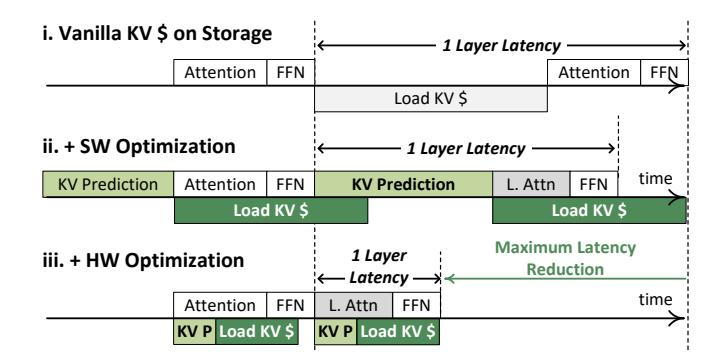

Fig. 5. V-Rex's Software-Hardware Co-design Optimization

different KV cache entries, necessitating larger token budgets than those for text generation. To empirically illustrate these issues, we measure the latency breakdown of streaming video LLM at 40K KV cache sequence length when InfiniGen is adopted for the prefill stage with token budget of 10K on an NVIDIA A100 GPU, as depicted in Figure 4 (c). The KV cache retrieval includes both KV prediction computation and memory transfer latencies. Results show that the KV cache retrieval computation only accounts for 23%. However, it accounts for 85% of the total latency, where 40% is attributed to the KV prediction computation and 39% to the KV cache fetch from CPU memory. We additionally confirmed this issue with other SOTA retrieval methods (i.e., FlexGen and ReKV), demonstrating a similar trend. Furthermore, this issue becomes more severe as the token sequence length increases, causing larger KV prediction computation and data retrieval. These results highlight that existing GPU-oriented algorithms cannot efficiently handle prefill-heavy streaming workloads. Addressing this bottleneck requires fundamentally new approaches.

#### C. Inflexibility of Fixed Top-K Selection

Many GPU-oriented algorithms, including InfiniGen and ReKV, favor top-k selection in KV cache management to take advantage of the predictable resource allocation and efficient parallel processing inherent to GPU architecture. However, this static approach imposes fundamental limitations for streaming video LLMs. Crucially, the score matrices that determine token importance vary widely across different transformer layers and attention heads, reflecting that diverse features are captured throughout them. Consequently, a different set of tokens is selected as important by each unique layer and head. Prior studies have shown that fixed top-k selection frequently results in redundant tokens or loss of relevant tokens, since the optimal K shifts by layer and head [7], [36], [41].

These inefficiencies are exacerbated in streaming edge environments, where memory budgets are limited and strict latency constraints apply. In such contexts, over-provisioning KV cache due to inflexible top-k policies leads to avoidable resource overhead and longer response times, undermining system scalability and energy efficiency. Additionally, the nature of streaming video LLMs requires the video data to be streamed, and the sequence length increases in real-time,

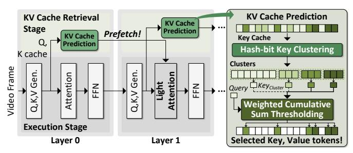

Fig. 6. Overview of ReSV Algorithm

necessitating the adaptive adjustment of the number of selected tokens to ensure efficiency and accuracy. To this end, V-Rex is explicitly designed to address these challenges, providing fine-grained, importance-driven dynamic selection that reduces KV cache size and retrieval cost for practical, real-time inference even on resource-constrained edge platforms.

#### IV. V-REX: UNIFIED SW-HW CO-DESIGN STRATEGY

To address the challenges of streaming video LLMs, we propose V-Rex, a software-hardware co-designed solution. Figure 5 illustrates how each component of our optimization stack reduces decoder layer latency. At the software level, V-Rex implements ReSV, an enhanced KV cache retrieval algorithm that efficiently selects and fetches only the most relevant entries from CPU memory or storage, where full caches are offloaded. It improves upon prior methods by using hash-bit key clustering and WiCSum thresholding. Leveraging the high temporal and spatial similarity in video frames, the algorithm achieves lightweight computation and efficient KV selection. At the hardware level, V-Rex integrates compact units to accelerate these operations and minimize retrieval overhead. It decouples these operations from the main LLM computation pipeline, enabling latency hiding and end-to-end optimization.

#### A. ReSV: Efficient and Accurate KV Cache Retrieval

ReSV is a training-free algorithm designed to optimize KV cache retrieval during the iterative prefill stage of streaming video LLMs. As shown in Figure 6, it consists of two main stages: KV retrieval and execution. In the retrieval stage, KV prediction is performed on-the-fly immediately after QKV generation to capture the dynamic nature of the cache. Selected KV tokens are prefetched for the next decoder layer, hiding fetch latency during execution. KV prediction involves two steps. First, hash-bit key clustering groups similar tokens using lightweight bitwise operations, generating representative keys (Keycluster) by averaging within each cluster. This reduces computation by limiting attention to representative keys. Second, WiCSum thresholding dynamically selects the most important Keycluster, adapting to varying data distributions across layers and attention heads, unlike fixed top-k methods. In the execution stage, the model performs light attention using only the selected clusters, significantly reducing memory and compute by fetching only essential KV entries.

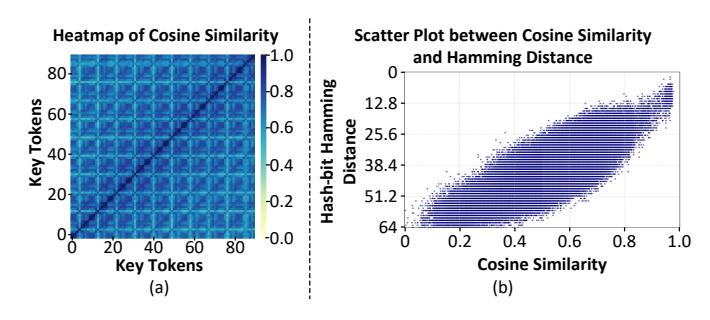

Fig. 7. (a) Heatmap of Cosine Similarity of Key Tokens Between Adjacent Frames (b) Scatter Plot Between Cosine Similarity and Hash-bit Hamming Distance. Measured on  $3^{rd}$  Layer's Key using COIN Dataset.

#### B. Hash-bit Key Clustering for Fast Similarity Grouping

The rationale for hash-bit key clustering lies in the high similarity among tokens in adjacent frames, as shown in Figure 7 (a). Leveraging this property, the method performs spatial-temporal clustering of key caches to efficiently reduce redundancy across frames. Unlike merging methods that replace multiple tokens with a single representation which requires higher precision, this approach preserves original token values for the execution stage. Thus, it avoids expensive operations like high-dimensional cosine similarity by using ultra-low-dimensional representations ( $\leq 0.5\%$  of the original dimension) and lightweight hash-bit hamming distance computations. Figure 7 (b) proves that our hash-bit hamming distance can effectively follow the trend of cosine similarity, having a 0.8 correlation value, which is enough to perform clustering.

The clustering process consists of two main steps: hashbit generation and hamming distance clustering, as shown in Figure 8. In the hash-bit generation step, computation is performed each time a new frame arrives. The key matrix, obtained after applying the rotary position embedding operation to the current frame, undergoes dimensionality reduction in two directions to significantly reduce the overhead of the following hamming distance clustering. A set of  $N_{hp}$  random hyperplanes is generated, and the key matrix is multiplied by these hyperplanes, producing a reduced-dimension matrix  $Key_{hp}$  with  $N_{hp}$  embedding dimensions. Each element of  $Key_{hp}$  is then binarized: values less than or equal to zero are set to 0, and values greater than zero are set to 1, converting each element into a single bit to form the Key hash-bit.

Next, hamming distance clustering is performed. It involves calculating hamming distance between the newly generated current  $Key\ hash-bit$  and the combined  $Key_{cluster}\ hash-bit$ , which includes previous and current  $Key\ hash-bits$ . The hamming distance is computed by performing a bit-wise XOR operation between tokens and counting the number of differing bits. Tokens with distances below a hyperparameter-defined threshold  $(Th_{hp})$  are clustered. The final clustering results are stored in a hash cluster (HC) table containing the cluster index, token index,  $Key_{cluster}$ ,  $Key_{cluster}$  hash-bit, and token count. This method enables clustering with very low computational

#### 1. Hash-bit Generation

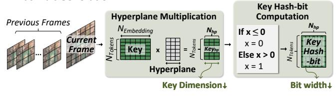

#### 2. Hamming Distance Clustering

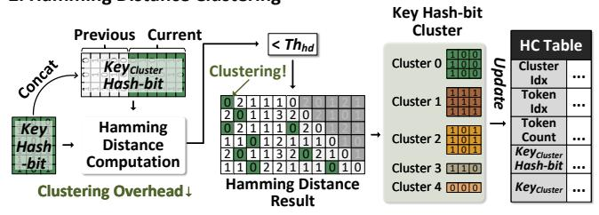

Fig. 8. Dataflow of Hash-bit Key Clustering

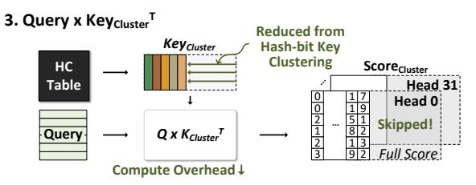

#### 4. Weighted Cumulative Sum (WiCSum) Thresholding

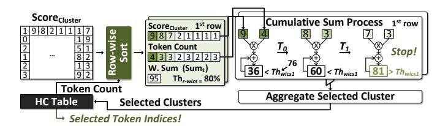

Fig. 9. Dataflow of Weighted Cumulative Sum Thresholding

overhead that typically grows with token count while maintaining high clustering accuracy, making it well-suited for efficient KV cache selection in streaming video LLMs.

#### C. Dynamic Token Selection via WiCSum Thresholding

WiCSum thresholding is a dynamic selection algorithm developed to address the diverse score distributions that occur across different layers and attention heads. Unlike static top-k methods that select a fixed number of tokens regardless of their importance, WiCSum thresholding dynamically determines the number of tokens to select for each layer and head. This dynamic approach enables more accurate and efficient KV cache retrieval, minimizing unnecessary memory and computational overhead, thereby supporting low latency and high efficiency.

Figure 9 shows the overall dataflow, composed of two main steps:  $Query \times Key_{cluster}^T$  computation and threshold checking. In the first step, the algorithm computes the matrix multiplication between the current query vectors and the representative  $Key_{cluster}$  generated by the previous hash-bit key clustering stage. Because this computation uses only the representative  $Key_{cluster}$  values rather than the entire key

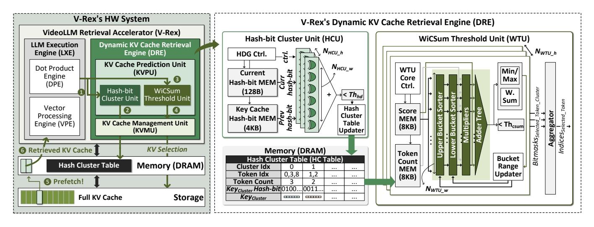

Fig. 10. Overall Architecture of V-Rex

cache, it significantly reduces the computational overhead. The result of this operation is the  $Score_{cluster}$  matrix, which reflects the relevance of each  $Key_{cluster}$  to the current query.

In the threshold checking step, important elements in the  $Score_{cluster}$  matrix are selected. For each row i in the matrix, it calculates a weighted sum  $(Sum_i)$  by multiplying each score by its corresponding token count and summing the results, as shown in Equation 1. This weighted sum is then used to compute a threshold  $(Th_{wics})$  by multiplying it by a predefined ratio hyperparameter  $(Th_{r-wics})$ , as shown in Equation 2. Then, each row of *Score*cluster is sorted in descending order, where  $\sigma$  is the sorting permutation. Starting from the highest Scorecluster value, the weighted sum with the token count is accumulated until the minimum t, when  $Acc_i(t)$  exceeds the threshold  $Th_{wics_i}$ , as shown in Equation 3. The indices of the clusters selected up to this point are aggregated across all rows, and these selected cluster indices are then mapped back to the original token indices using the HC table to produce the final set of selected tokens.

$$Sum_{i} = \sum_{j=0}^{cluster} Score_{cluster_{i,j}} \cdot TC_{j}$$
 (1)

$$Th_{wics_i} = Sum_i \cdot Th_{r-wics} \tag{2}$$

$$Acc_{i}(t) = \sum_{j=0}^{t} Score_{Cluster_{i,\sigma(j)}} \cdot TC_{\sigma(j)}, Acc_{i}(t) > Th_{wics_{i}}$$
(3)

#### V. V-REX'S HARDWARE ARCHITECTURE

The ReSV effectively reduces the number of required tokens. Nevertheless, the core operations introduced by ReSV present inefficiencies on GPUs. These inefficiencies arise from 1) conditional and data-dependent computation of ReSV's clustering and thresholding, which makes it difficult to fully exploit parallelism, and 2) irregular and sparse KV cache fetching from SSD and CPU memory, which causes underutilization of PCIe bandwidth, both resulting in increased latency. To address these challenges, we introduce V-Rex with a low-latency, compact KV cache retrieval engine specifically designed to support the unique computational patterns of ReSV and optimize the memory-intensive KV fetching by efficiently handling the irregular memory access patterns. Additionally, it can be easily integrated with existing hardware, including GPUs and NPUs, for high adaptability.

### A. Architecture Overview

Figure 10 illustrates V-Rex's hardware system, which consists of three primary components: the V-Rex accelerator, off-chip memory, and storage or CPU memory for the full KV cache. The V-Rex accelerator, which comprises the LLM execution engine (LXE) and DRE, is responsible for the primary computational tasks required by streaming video LLMs. The execution flow proceeds as follows: ① LXE generates hashbits for current frame keys, ② hash-bit cluster unit (HCU) performs hamming distance clustering and updates HC table, ③ LXE computes  $Q \times K_{cluster}^T$  then send  $Score_{cluster}$  to WiCSum threshold unit (WTU), ④ WTU executes WiCSum thresholding with early-exit sorting, determining which token entries to retrieve, ⑤ KVMU prefetches selected KV entries from storage, and ⑥ retrieved KV tokens are used in attention.

**LLM Execution Engine.** LXE processes the primary LLM operations and two computations from ReSV. The hash-bit generation and  $Query \times Key^T_{cluster}$  computation of ReSV are processed in LXE, as it involves mainly matrix multiplications and vector computations. The LXE is based on the core architecture of the LPU [23], which integrates a dot product engine (DPE) for high-throughput matrix multiplication and a vector processing engine (VPE) for efficient vector operations, both with BF16 precision. DPE is composed of  $N_{DPE-h}$  MAC trees, receiving  $N_{DPE-w}$  inputs. The VPE is composed of  $N_{VPE-h}$  vector units and accepting  $N_{VPE-w}$  inputs.

## B. Dynamic KV Cache Retrieval Engine (DRE)

The DRE consists of a KVPU and KVMU, which are responsible for the computations and memory management

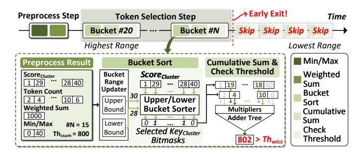

Fig. 11. Dataflow of Early Exit Sorting

required during dynamic KV cache retrieval. The KVPU integrates both HCU and WTU, which together accelerate the most latency-critical operations in KV cache retrieval. By offloading these tasks from the main compute pipeline, V-Rex significantly reduces computational and data fetching bottlenecks.

Hash-bit Cluster Unit. At the core of the KVPU, the HCU is responsible for executing the hash-bit key clustering process. The HCU is a compact computing module, consisting of three main components: a current hash-bit memory, a key cache hash-bit memory, and  $N_{HCU-h}$  parallel XOR accumulators, each capable of processing  $N_{HCU-w}$  inputs. The HCU receives the key hash-bit vectors from the LXE and stores them in the current hash-bit memory. Simultaneously, it retrieves key cache hash-bit clusters from the HC table and stores them in the key cache hash-bit memory. Both of these are structured as bit matrices to enable efficient parallel operations.

To perform clustering, the HCU initiates the computation of hamming distances between the current hash-bit vectors and the stored key cache hash-bit clusters. This process utilizes XOR accumulators to identify differences between corresponding bits across the matrices. The accumulators then sum the number of differing bits to calculate the hamming distance for each comparison. By comparing the computed hamming distances with the predefined threshold  $Th_{hd}$ , the HCU efficiently groups tokens with similar hash-bit patterns into clusters. Then, the clustering results are stored in the HC table. This hardware-accelerated approach enables rapid and energy-efficient clustering using bitwise operators, supporting the low-area requirements for edge deployment.

WiCSum Threshold Unit. The WTU accelerates the WiCSum threshold check, enabling low-latency selection computation. It consists of multiple parallel WTU cores, each equipped with score memory, token count memory, and a dedicated computing unit for thresholding. Each core includes upper and lower bucket sorters, multipliers, an adder tree, and a bucket range updater. The most computationally intensive operations, sorting and threshold checking, are efficiently handled by the WTU's dataflow, which utilizes early exit sorting. It combines two operations in a fine-grained pipeline and terminates sorting in the middle when it exceeds the threshold, as shown in Figure 11. This process is divided into two main steps: the preprocess step and the token selection

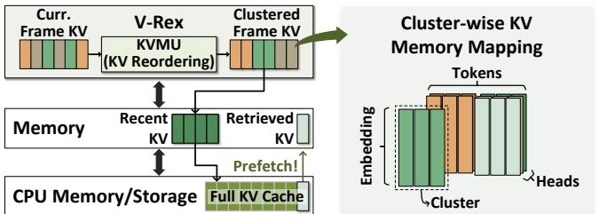

Fig. 12. Hierarchical Memory System and Cluster-wise Memory Mapping

step. In the preprocess step, the WTU cores precompute values needed for the token selection step, such as the weighted sum of scores and token counts for each row, the min/max score values, and the threshold  $Th_{wics}$ . During the token selection step, the process begins with the bucket containing the highest score range. The WTU performs bucket sort, cumulative sum, and threshold checking in the pipeline. The bucket sort, which is highly parallelizable, uses the preprocessed information to determine the upper and lower bounds for each bucket, and the sorters generate bitmasks indicating which scores fall within the current range. The selected values are then multiplied and summed to compute the weighted sum, which is compared to  $Th_{wics}$  to decide whether to exit or continue. This early exit mechanism is effective because a small number of large scores typically account for the majority of the weighted sum (average 16% per row), allowing the threshold to be reached quickly by starting with the highest buckets.

#### C. KV Cache Management Unit

The KVMU manages the KV cache's memory for streaming video LLMs. It is responsible for two main functions: hierarchical KV cache memory management and hash clusterbased memory mapping. First, KVMU oversees a hierarchical memory system, as illustrated in Figure 12, to efficiently manage data movement between V-Rex's memory, CPU memory, and storage. Recent KV cache entries are stored in V-Rex's memory for fast access. When the total size of the KV cache in V-Rex's memory exceeds a predefined maximum capacity, the oldest entries are offloaded to CPU memory or storage. These offloaded entries can be retrieved from CPU memory or storage and brought back into V-Rex's memory when needed for computation. This hierarchical memory system ensures that both the most recent and retrieved KV cache entries are available for computation, while older or less critical data is kept off-chip to significantly reduce memory overhead.

Second, KVMU implements an efficient memory mapping strategy based on hash clusters. To maximize PCIe bandwidth utilization, tokens that belong to the same hash cluster are grouped and stored at contiguous memory addresses. The clustering is carried out entirely within the recent KV cache, removing any need to access the CPU or storage for clustering with the offloaded cache. This arrangement enables more efficient use of memory bandwidth, as multiple tokens from the same cluster can be transferred together in a single operation. Each time new KV cache entries are generated for a frame,

KVMU reorders and stores them in memory according to the latest clustering results. Because KVMU handles this reordering internally, the KV cache is stored in a streaming fashion, and any latency associated with reorganization is effectively hidden. Although this memory mapping is technically feasible on conventional GPUs, it is highly impractical because it requires fine-grained, online data reorganization. This process incurs substantial latency overhead that ultimately nullifies the benefits of the optimized layout, as it involves frequent perlayer computations and irregular, memory-intensive scattering operations. To this end, KVMU ensures that streaming video LLMs can access critical cache data with low latency, maintain a reduced memory footprint, and utilize available bandwidth optimally through these two mechanisms.

#### VI. EVALUATION

#### A. Experimental Setup

**Performance.** To evaluate the performance of V-Rex's hardware system, we developed a custom cycle-level simulator. For DRAM performance, we integrated DRAMSim3 [18], a widely used DRAM simulator, and for SSD performance, we incorporated MQSim [35], an SSD simulator. To accurately model data movement between CPU memory and GPU memory, the actual data transfer bandwidth is modeled using an NVIDIA A100 GPU [3] and an AGX Orin GPU [2], both of which are incorporated into the simulator. We compared V-Rex against two representative GPUs—an edge device (Jetson AGX Orin) and a server GPU (NVIDIA A100)—using identical system and performance parameters, summarized in Table I. For the edge scenario, V-Rex was instantiated with eight cores, utilizing the 4 GB/s PCIe with M.2 NVMe SSD for offloading the KV cache and 204.8 GB/s LPDDR5 of 256-bit bus. For the server scenario, V-Rex utilized 48 cores, achieving a total of 319 TFLOPS, with 1935 GB/s HBM2e of 5120-bit bus and 32 GB/s PCIe with offloading the KV cache to DDR4-based CPU memory. For the streaming video LLM, all experiments employ Llama-3 8B as the backbone model and SigLIP-ViT-L-384 [44] as the vision encoder.

**Power/Area.** A single V-Rex core is configured as  $N_{DPE-h}$ =64,  $N_{DPE-w}$ =64,  $N_{VPE-h}$ =1,  $N_{VPE-w}$ =64,  $N_{HCU-h}$ =1,  $N_{HCU-w}$ =16,  $N_{WTU-h}$ =1, and  $N_{WTU-w}$ =16. It was implemented in RTL and synthesized using Synopsys

TABLE I
HARDWARE SPECIFICATIONS OF GPUS AND V-REX

|                                | Edge                      |                    | Server         |                     |  |
|--------------------------------|---------------------------|--------------------|----------------|---------------------|--|
|                                | NVIDIA Jetson AGX Orin | V-Rex 8 | NVIDIA A100 | V-Rex 48 |  |
| Number of V-Rex Cores          |                           | 8                  |                | 48                  |  |
| Peak Throughput T   | 54                        | 53.3               | 312            | 319.5               |  |
| Memory Bandwidth               | LPDDR5 - 1                | 204.8 GB/s         | HBM2e -        | 1935GB/s            |  |
| Memory Capacity                | 320                       | ЗВ                 | 80             | GB                  |  |
| PCIe Bandwidth                 | PCIe3.0 x                 | 4 4GB/s            | PCIe 4.0 x     | 16 32GB/s           |  |
| Power Consumption 2 | -40W                      | -35W               | -300W          | -203.68W            |  |

1: FP16 for AGX, BF16 for V-Rex and A100, @ 0.8V 800MHz, 2: V-Rex , DRAM, PCIe, and storage Included

Design Compiler on a 14nm process. It operates reliably at 0.8 V and 800 MHz without timing violations under nominal conditions, as confirmed by pre-layout static timing analysis. DRAM (HBM2e, DDR4) behavior was modeled using DRAMSim3, and LPDDR5 energy data were taken from vendor reports [11], [15]. PCIe power was estimated at 3 W per lane under full load, and SSD power was based on Kioxia BG6 specifications [1]. GPU power measurements were obtained via NVIDIA-SMI and tegrastats [25], [26]. All these parameters were integrated into our custom simulator for accurate system-level evaluation. This setup ensures a realistic and fair comparison against baseline edge and server GPUs.

#### B. Performance and Efficiency Evaluation

Latency. To evaluate V-Rex 's performance for streaming video LLMs, we compared its latency in frame processing and text generation against four top-k-based retrieval methods on both edge and server GPUs. FlexGen [30] serves as the baseline, offloading KV caches to CPU memory (A100) or storage (AGX Orin). InfiniGen [16] retrieves tokens only during generation, InfiniGenP extends this to prefill, and ReKV [6] performs frame-level selection. All baselines conduct KV prediction in the previous attention layer to prefetch KV caches, overlapping fetch latency with computation. We varied KV cache sizes (1K, 5K, 10K, 20K, 40K) using COIN [31], calibrating each method's selection ratio to match baseline accuracy. Latency was measured as per-frame latency during frame processing and time per output token (TPOT) during text generation.

Latency comparison on the edge GPU is shown in Figure 13 (a). As token length increases, per-frame latency and TPOT rise across all prior methods due to heavier attention computation, greater selection overhead, and larger KV transfers, driven by fixed top-k requiring high token selection ratios. Consequently, none of the edge GPU setups—AGX+FlexGen, InfiniGen, InfiniGenP, or ReKV—achieve real-time performance at longer sequences, with the gap widening as token length grows. In the frame processing stage, the abundance of Query tokens demands higher retrieval ratios than in text generation, since each query token requires retrieval. AGX+InfiniGen and AGX+InfiniGenP are even slower than the FlexGen baseline due to fine-grained, token-level selection introducing significant preprocessing overhead. AGX+ReKV's coarse, frame-level selection offers modest latency gains but still requires selecting many tokens to maintain accuracy, limiting its effectiveness.

In contrast, V-Rex8 enables real-time streaming inference (≥2 FPS) even with long sequences and large batches. With a batch size of 1, per-frame latencies are 121 ms, 123 ms, 198 ms, 200 ms, and 254 ms for cache sizes of 1K, 5K, 10K, 20K, and 40K, respectively. It maintains 3.9–8.3 FPS across all sizes for real-time edge deployment, achieving 2.2–7.3× speedups over AGX+FlexGen. When the batch size increases to 4, speedups rise to 2.1–13.8×. In text generation, TPOT latencies are lower, 89 to 97 ms, yielding 1.9–15.1× speedups. These gains stem from minimizing selected KV volume via

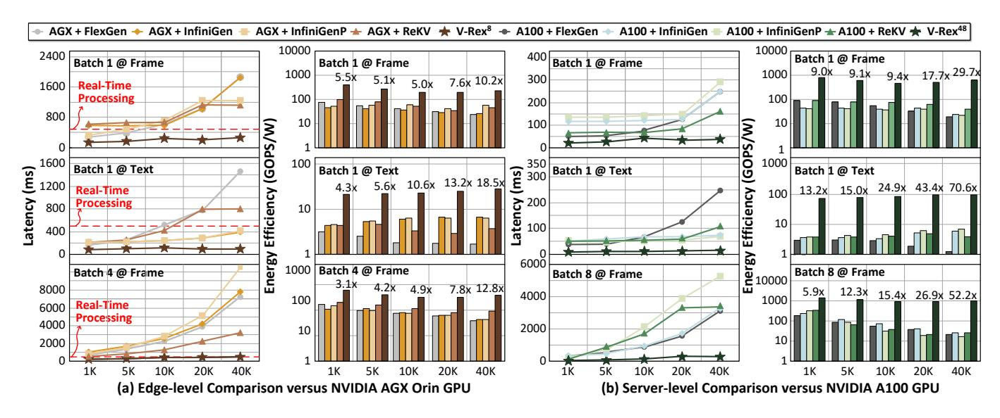

Fig. 13. Per-frame and TPOT latency and energy efficiency comparison versus (a) Edge GPU and (b) Server GPU. Baseline methods of FlexGen, InfiniGen, InfiniGenP, and ReKV are applied. We sweep the KV cache sequence length from 1K to 40K.

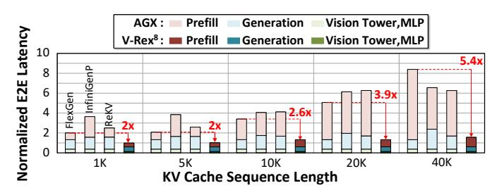

Fig. 14. Comparison of End-to-End Latency Breakdown

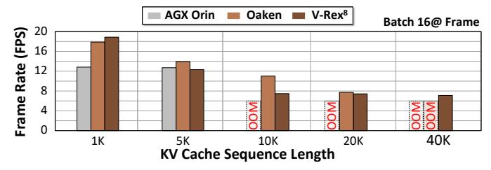

Fig. 15. Throughput Comparison versus SOTA LLM Accelerator

ReSV and leveraging DRE's high-speed compute and data movement. To evaluate scalability, we tested V-Rex48 and an A100 GPU for server-level comparison (Figure 13 (b)). V-Rex achieves 20–48 ms per-frame latency, with  $2.6-7.3\times$  speedups at batch size 1. At batch size 8, speedups increase to  $3.4-19.7\times$ , demonstrating strong parallel efficiency. TPOT latencies of 14–15 ms yield  $2.8-16.8\times$  speedups. These results show that V-Rex significantly reduces latency in both frame processing and text generation for streaming video LLMs over edge and server GPUs.

**E2E Latency Breakdown.** As shown in Figure 14, we evaluated the latency breakdown of AGX Orin and V-Rex8 in an end-to-end streaming video LLM scenario, using an average case from the COIN benchmark. The results demonstrate that AGX+FlexGen fails to mitigate this explosive growth, as well as software-only optimizations (i.e., InfiniGenP and ReKV), which even perform slower than FlexGen from 1K to 20K due to KV prediction overhead. On the other hand, the primary performance gain of our work stems from reducing the overhead of the iterative prefill stage, increasing the performance gap as the KV cache sequence increases. This results in a reduction of up to 5.4× in end-to-end latency. By effectively managing the KV cache during prefill, our method maintains a consistent

latency even as the cache grows.

**Energy Efficiency.** Figure 13 shows that V-Rex's energy efficiency gains grow with token length, thanks to reduced data transfer. With batch size 1 during frame processing, V-Rex achieves 5.5–10.2× greater energy efficiency over AGX+FlexGen for KV cache sizes from 1K to 40K; with batch size 4, the gain increases to  $3.1-12.8\times$ . In text generation, the improvement is even more pronounced, reaching  $4.3-18.5\times$ . This advantage is amplified on server GPUs, where power consumption is higher. Compared to A100+FlexGen, V-Rex achieves 9.0-29.7× higher energy efficiency during frame processing with batch size 1. At batch size 8, it delivers 1.1-1.4 TOPS/W, achieving 5.9-52.2× gains. In text generation, energy efficiency reaches 13.2–70.6×. These improvements stem from two key factors: ReSV 's ability to minimize retrieved data volume, and the KVMU module's support for high-bandwidth, efficient data fetching. As a result, energy consumption for PCIe-based data transfers is significantly reduced. Overall, V-Rex delivers substantially higher energy efficiency than state-of-the-art GPU-based retrieval methods, making it a compelling solution for streaming video LLM

**Comparison with SOTA Accelerator.** Figure 15 compares the throughput of V-Rex8 and Oaken [13], a state-of-the-

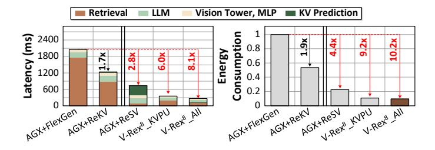

Fig. 16. Ablation Study and Latency Breakdown of V-Rex

art LLM accelerator using 4-bit KV cache quantization, on the NVIDIA AGX Orin GPU. In this setup, AGX Orin runs FlexGen without KV offloading, while Oaken applies online quantization. At a short sequence length (1K), V-Rex achieves up to 1.5× and 1.1× higher FPS than AGX Orin and Oaken, respectively, due to fully overlapped storage fetches and reduced attention computation. As sequence length increases, AGX Orin encounters out-of-memory (OOM) errors first, driven by the growing KV cache. Oaken, with its quantized cache, handles longer sequences and maintains higher throughput, but still fails beyond 20K tokens due to memory limits. In contrast, V-Rex's efficient retrieval allows it to operate reliably beyond 20K tokens, sustaining 7 FPS even at large sequence lengths.

Ablation Study & Latency Breakdown. This evaluation illustrates how each V-Rex optimization contributes to reducing latency and energy consumption during frame processing. It first presents cumulative gains as each optimization is applied, followed by a latency breakdown showing which execution components are affected by each scheme. We implemented AGX+ReSV by applying ReSV on the AGX Orin GPU and evaluated V-Rex8 by incrementally enabling optimizations under a 40K cache with batch size 1. V-Rex8\_KVPU includes the KVPU, while V-Rex8\_All incorporates all optimizations, including KVMU. The results clearly demonstrate the GPU's inefficiency and highlight the need for software-hardware codesign.

As shown in Figure 16, AGX+ReSV reduces overall latency by 2.8× by hiding most retrieval overhead under computation. However, due to complex KV prediction, such as conditional and data-dependent computation for clustering and thresholding, it still accounts for 48% of total latency, limiting the algorithm's full potential on GPU. With hardware-level optimization, V-Rex8 KVPU reduces KV prediction latency overhead down to 0.5% (from 23% of total computation), achieving a  $6.0\times$  speedup and  $9.2\times$  energy reduction by overlapping prediction operation with LLM computation using HCU's fast bit-wise operations and WTU's early-exit sorting. V-Rex8\_All further improves performance by increasing PCIe bandwidth utilization, reaching an  $8.1\times$  speedup and  $10.2\times$ energy savings. Although KVMU introduces some memory overhead due to the HC table, it occupies only 1.67% of the full KV cache with an average of 32 tokens per cluster. Each V-Rex optimization contributes incrementally to performance

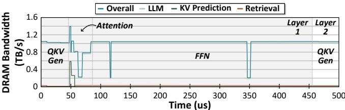

Fig. 17. Anaylsis on Memory Bandwidth Usage of V-Rex48

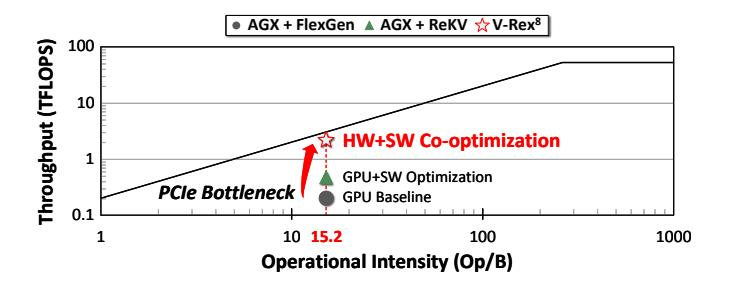

Fig. 18. Roofline Model Analysis on AGX Orin and V-Rex8

and energy efficiency. Notably, ReSV alone is insufficient; the combined effect of ReSV and DRE is essential to fully realize efficient KV cache retrieval for streaming video LLMs.

#### C. Bandwidth Analysis for Concurrent Computation

To show that KV prediction and retrieval can be fully overlapped with LLM computations, we analyzed the bandwidth usage of each computation over a layer of frame processing stage, as shown in Figure 17. It demonstrates that memory is effectively shared among concurrent operations. The KV prediction is executed concurrently with the attention operation. Although it briefly spikes bandwidth usage to 600GB/s, its short duration allows it to be hidden entirely. The KV retrieval, which transfers data from CPU memory to DRAM, runs for most of the execution time but only consumes about 1% of the bandwidth. Because KV cache fetch is bottlenecked by PCIe bandwidth, which is about 1% of DRAM bandwidth, it allows KV retrieval to be concurrently executed with attention and FFN computations with minimal overhead.

## D. Roofline Model Analysis

Figure 18 illustrates a roofline model analysis of the frame processing stage for three edge-level systems: AGX+FlexGen, AGX+ReKV, and our proposed V-Rex8. This analysis uses a workload with a KV cache length of 40K and a batch size of 4, yielding an average operational intensity of 15.2 Op/B. The result reveals a significant disparity in the achieved throughput across the systems. AGX+FlexGen exhibits the lowest performance, reaching only 6.6% of its theoretical maximum. This severe underutilization is attributed to the slow PCIe communication, which creates a bottleneck during KV cache fetching. Therefore, optimizing the LLM inference computation alone is ineffective without resolving the fundamental I/O bottleneck. AGX+ReKV employs a retrieval mechanism to achieve a higher throughput, reaching approximately

TABLE II
MODEL ACCURACY EVALUATION AND RETRIEVAL RATIO

|                 | COIN Benchmar     | k Top-1 | Accurac | <u>у                                    </u> |       |        |
|-----------------|-------------------|---------|---------|----------------------------------------------|-------|--------|
| Applied Method  | Retrieval @ Frame | Step    | Next    | Task                                         | Proc. | Proc.+ |
| VideoLLM-Online | X                 | 62.1    | 49.0    | 92.5                                         | 49.5  | 51.6   |
| Infinigen       | X                 | 62.1    | 48.3    | 92.2                                         | 49.5  | 51.0   |
| InfinigenP      | 0                 | 58.6    | 45.6    | 91.5                                         | 46.4  | 50.2   |
| ReKV            | 0                 | 59.9    | 46.3    | 91.3                                         | 47.6  | 50.0   |
| V-Rex's ReSV    | 0                 | 62.0    | 47.5    | 92.2                                         | 48.2  | 50.5   |

| Retrieval      | etrieval Ratio [Frame Processing Stage / Text Generation Stage] |             |             |             |             |             |
|----------------|-----------------------------------------------------------------|-------------|-------------|-------------|-------------|-------------|
| Applied Method | Avg.                                                            | Step        | Next        | Task        | Proc.       | Proc.+      |
| Infinigen      | 100 / 6.8                                                       | 100 / 6.2   | 100 / 6.7   | 100 / 4.0   | 100 / 8.5   | 100 / 8.6   |
| InfinigenP     | 50.8 / 6.8                                                      | 50.8 / 6.2  | 50.8 / 6.7  | 51.0 / 4.0  | 50.6 / 8.5  | 50.7 / 8.6  |
| ReKV           | 58.4 / 31.2                                                     | 59.7 / 33.4 | 56.7 / 34.5 | 51.4 / 13.6 | 61.7 / 36.7 | 62.5 / 37.9 |
| V-Rex's ReSV   | 32.7 / 2.5                                                      | 34.3 / 2.4  | 32.4 / 2.8  | 25.1 / 1.4  | 35.5 / 2.9  | 36.1 / 2.9  |

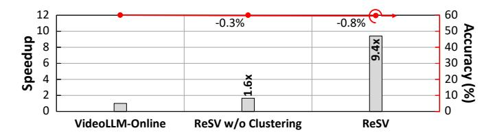

Fig. 19. Ablation Study of ReSV

15% of the peak. However, being a purely software-based optimization, it remains inefficient. Finally, our proposed V-Rex demonstrates a remarkable throughput at 71.5% of its theoretical maximum, marking a 10.8× improvement over AGX+FlexGen. It confirms that V-Rex effectively resolves the inefficiencies inherent in conventional GPU-based systems.

#### E. Comparative Accuracy Analysis

**Workload.** To demonstrate the flexibility and accuracy of ReSV, we evaluated and compared the performance of existing retrieval methods (i.e., InfiniGen, InfiniGenP, and ReKV) using five benchmarks from the COIN dataset. VideoLLM-Online [4] was used as the baseline without any retrieval optimization applied. For this experiment, existing methods were configured to select up to 50% of tokens with their fixed top-k mechanism, while ReSV used a threshold in its WiCSum operation that was empirically tuned to ensure the accuracy, configuring  $N_{hp}$ =32,  $Th_{wics}$  to 0.3 and  $Th_{hp}$ =7.

Accuracy. Table II summarizes the results. V-Rex's ReSV outperforms other retrieval methods, demonstrating the lowest retrieval ratio while achieving the highest overall accuracy. Compared to the baseline vanilla model (VideoLLM-Online), ReSV exhibits only a marginal average accuracy drop of 0.8%. Additionally, ReSV significantly reduces the retrieval ratio, as it can adopt diverse score distributions from various tasks. During the frame processing stage, the average retrieval ratio ranges from 25.1% to 36.1%, and during the text generation stage, it varies between 1.4% and 2.9%. This variability highlights that the thresholding mechanism in ReSV effectively adapts token selection according to each task's characteristics.

In contrast, InfiniGen maintains accuracy comparable to the vanilla model, but it does not perform retrieval during

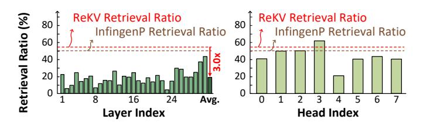

Fig. 20. Comparison of Retrieval Ratio per Layer and per Head

the frame processing stage, making it impractical for real-time inference. InfiniGenP retrieves approximately 50% of tokens during the frame processing stage, which leads to a substantial accuracy degradation of up to 3.4%. ReKV, which employs frame-wise selection, requires a large volume of retrieved KV cache for both frame processing and text generation stages to maintain the accuracy as InfiniGenP, thus degrading the efficiency. In summary, the hash-bit key clustering and WiCSum thresholding techniques of ReSV enable dynamic adaptation to data distribution, effectively selecting the minimal number of tokens while preserving accuracy. This makes ReSV particularly suitable for real-time and resource-constrained streaming video LLM inference.

**ReSV Efficiency.** We performed an ablation study by incrementally applying ReSV's optimizations. Figure 19 shows the average accuracy on COIN benchmarks and the frame processing latency at 40K cache size. First, ReSV without applying clustering improves latency by  $1.6\times$  over the baseline, causing a minor accuracy drop of 0.3%, originating from the light attention computation. Second, ReSV, which further incorporates hash-bit clustering, achieves a  $9.4\times$  speedup, accompanied by a 0.8% accuracy reduction. This significant speedup comes from reducing the fetching and computing of the entire key for WiCSum thresholding computation by clustering the key cache.

Figure 20 presents the ratio of retrieved data on a perlayer and per-head basis of a sample video from COIN. Unlike InfiniGenP and ReKV, which retrieve a fixed number of KV cache tokens uniformly across all layers and heads, ReSV exhibits a diverse distribution in the token retrieval ratio. Certain layers that require fewer tokens exhibit selection rates of 4.2%, while more critical layers with higher token importance demonstrate around 44.0%. This variability can also be observed among the attention heads. It enables ReSV to maintain higher accuracy while retrieving 3.0× fewer tokens on average compared to ReKV, resulting in superior efficiency compared to fixed top-k mechanisms.

