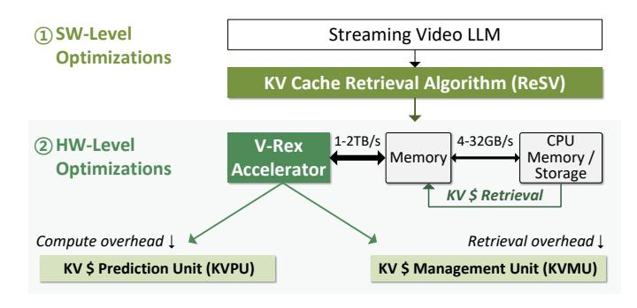
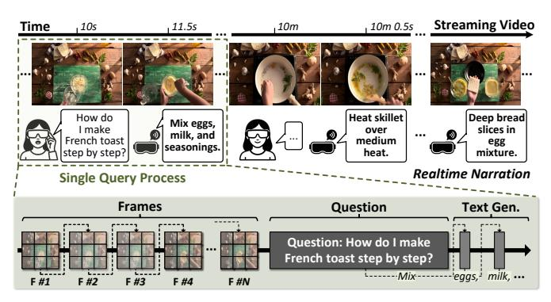
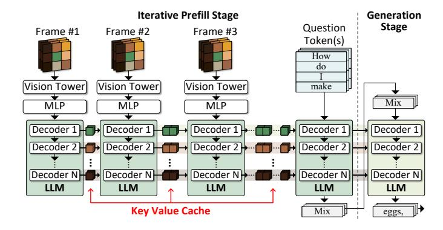
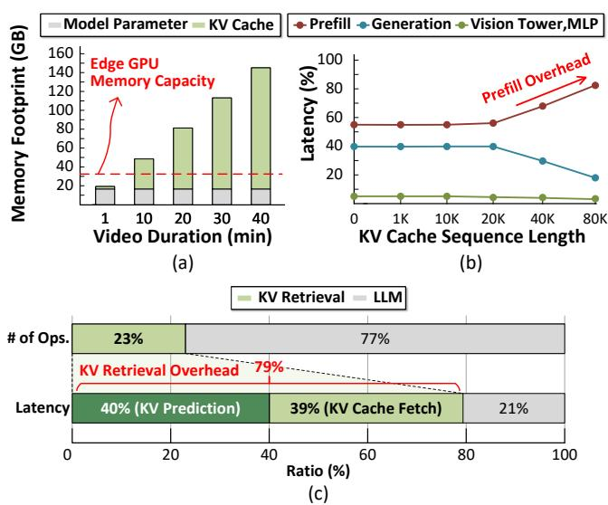

# I. INTRODUCTION

Recently, the demand for artificial intelligence that can understand and interpret various modalities (i.e., text, image, video, and speech) and respond to inquiries has been a driving force in machine learning research. As a result, large multimodal models (LMM) [42] have emerged as promising solutions in various AI industries. Notably, streaming video large language models (LLMs) have gained significant attention for their ability to jointly comprehend the video and text modalities in real-time. Streaming video LLMs demonstrate a wide range of tasks, including video captioning, question answering, conversational agents, and augmented reality. [4], [32], [38]. Unlike offline video LLMs [29], [33], [45], it processes real-time video streams and responds to users' inquiries, which primarily runs on edge devices. Due to continuous video input requiring an iterative process of video frames, computation and memory usage scale substantially. It causes the key-value (KV) caches to rapidly exceed the GPU memory capacity, and processing long video streams in realtime becomes impractical.

Existing KV cache optimizations are fundamentally mismatched for streaming and interactive workloads. Destructive methods, such as pruning [37], compression [12], [19], [36], and quantization [13], [17], [21], [34] risk permanently discarding information that, while irrelevant to the current query, may be essential for future ones, disrupting conversational continuity. A more promising approach, KV cache retrieval [6], [16], [24], avoids this issue by offloading the full cache to CPU memory or storage and fetching only relevant tokens, thereby reducing GPU memory usage while maintaining coherent responses for more extended input sequences. Although effective in reducing memory usage, they rely on bandwidth-limited links such as PCIe (4–32 GB/s), which are far slower than GPU memory bandwidth (1–2 TB/s). Thus, selective retrieval is necessary to avoid severe data transfer.

However, current retrieval algorithms, designed for the text generation stage, perform poorly under the iterative prefill stage of streaming video. Moreover, their reliance on fixed top-k selection, which is a computationally regular and GPUfriendly primitive, introduces algorithmic inefficiencies. This static strategy ignores the highly variable importance of tokens across transformer layers and attention heads [7], [36], [41]. Enforcing a fixed-k policy prioritizes hardware convenience over the algorithm's need, leading to systemic inefficiencies: either over-fetching redundant tokens, wasting PCIe bandwidth and energy, or under-fetching critical ones, degrading accuracy. Addressing this challenge requires more than an algorithmic tweak. It demands a new hardware optimization.

We present V-Rex, the first streaming video LLM accelerator designed to address the large memory and computational requirements of the KV cache. It embodies this softwarehardware co-design principle through the tightly integrated innovations, as shown in Figure 1. At the software level, we

Fig. 1. Overview of V-Rex Accelerator

propose ReSV a training-free KV cache retrieval algorithm that intelligently perceives and exploits the unique characteristics of video data. It significantly reduces the number of fetched tokens for the iterative prefill stage. ReSV's hash-bit key clustering provides a computationally lightweight mechanism to identify and group tokens with high spatial-temporal similarity, drastically reducing redundancy without expensive computation. Building on this, its weighted cumulative sum (WiCSum) thresholding acts as an adaptive mechanism, dynamically selecting the most critical tokens on a fine-grained, layer-wise, and head-wise basis, moving far beyond the rigid constraints of fixed top-k. At the hardware level, we introduce the dynamic KV cache retrieval engine (DRE), a compact accelerator that serves as the essential enabler for ReSV. The KV cache prediction unit (KVPU) of DRE is specifically designed to execute the fine-grained, data-dependent, and conditional operations of ReSV, such as bit-level clustering and thresholding with early-exit sorting, that would cause severe slowdown and underutilization on a GPU. Additionally, the KV cache management unit (KVMU) of DRE complements this by managing PCIe bandwidth efficiently and reducing overall data movement during retrieval. By offloading these irregular tasks to a specialized unit, V-Rex allows the main LLM engine to operate at peak efficiency.

The key contributions of this work are as follows:

- We propose V-Rex, the first software-hardware codesigned accelerator that fundamentally addresses the large memory and computational bottleneck of the KV cache resulting from the iterative prefill stage in streaming video LLMs.
- We introduce ReSV, a novel, training-free retrieval algorithm tailored for streaming video LLMs that leverages spatial-temporal similarity cache clustering and dynamic cache selection that reduces KV cache traffic with negligible accuracy loss.
- We developed the DRE, an efficient hardware unit that accelerates ReSV's irregular operations, making intelligent, fine-grained retrieval practical on resource-constrained platforms, consuming only 2.0% of total chip area. It can be integrated with any existing GPUs, NPUs, and LLM accelerators with its high adaptability.
- We demonstrate through comprehensive evaluation that

Fig. 2. Overview of Streaming Video LLM

V-Rex enables real-time inference (3.9–8.3 FPS) on edge devices, achieving up to  $19.7 \times$  speedup and  $18.5 \times$  energy savings over a state-of-the-art GPU baseline.

#### II. BACKGROUND AND MOTIVATIONS

#### A. Streaming Video LLM Architecture and Workflow

Figure 2 presents an overview of the streaming video LLM. Unlike offline models, it processes real-time streaming video input and generates narration in direct response to user queries. Users may issue a series of queries, including follow-ups that depend on both previous interactions and the evolving video context. Consequently, information from earlier video segments is vital for producing context-aware responses to future queries. This operational need underscores the importance of advanced KV cache management algorithms that preserve and utilize prior visual context, rather than relying on conventional optimization methods (i.e., pruning, merging, and quantization) [12], [13], [17], [19], [21], [34], [36], [37] that may discard information essential for subsequent interactions.

Figure 3 shows the model architecture of streaming video LLM. A streaming video LLM consists of three core modules: a vision tower, an MLP projector, and an LLM. The vision tower (e.g., CLIP [27], SigLIP [44]) transforms each video frame into numerical embeddings that capture spatial and temporal features. The MLP projector adapts the dimension of these embeddings, enabling seamless integration with the LLM input space. The LLM processes visual information and user queries, generating output tokens. For the LLM, models such as Llama-3 [8] and Qwen3 [40] are often used.

The streaming video LLM first performs **iterative prefill stage** that sequentially processes video inputs and question tokens, a distinctive mechanism unique to handling real-time video streams. Since sampled frames in a real-time video stream arrive sequentially and cannot be batched together, each frame is processed individually through a repeated prefill computation of LLM. Each prefill stage attends previous KV cache for the self-attention computation and generates KV cache entries that are incrementally accumulated. This KV cache grows linearly over time, following an  $O(N^2T)$  complexity, where  $N^2$  represents the spatial resolution and T denotes temporal duration. Notably, this cache facilitates

Fig. 3. Model Architecture of Streaming Video LLM

the processing of future frames and is crucial for generating accurate responses to user questions, as queries may reference visual information spanning multiple frames. When the user inputs a query, the user's question is tokenized and processed solely through the LLM. In the generation stage, it generates output based on both the accumulated frame KV caches and the question tokens, thereby maintaining contextual coherence.

#### B. Principles of KV Cache Retrieval

Figure 4 (a) shows the overhead of the KV cache of VideoLLM-Online [4] when using Llama-3 8B as the backbone model. The KV cache increases with video duration and exceeds GPU memory capacity within minutes, making edge deployment impractical. Prior research attempts to reduce KV cache size through pruning and merging, but it falls short for streaming video LLMs in multi-turn settings. Discarding segments of the cache results in inaccurate responses to sequential user queries. In contrast, KV cache retrieval preserves all prior information and enables selective computation, thereby reducing memory requirements while preserving model accuracy. This is achieved through a three-stage process during inference. (1) Offloading: the entire KV cache is first transferred to CPU memory or storage. (2) Selection: only relevant tokens are selected for the query. (3) Pre-fetching: these selected KV entries are retrieved to the GPU memory in advance for attention computation. This design ensures three essential outcomes: 1) It upholds contextual integrity across multi-turn queries, 2) minimizes the GPU memory requirements, and 3) reduces computation by limiting processing to the most relevant subset of the cache per query. Thus, KV cache retrieval offers both scalability and coherence for realtime streaming video LLMs.

## III. CHALLENGES OF KV CACHE RETRIEVALS

#### A. Why KV Retrievals Fall Short in Streaming Video LLMs

Applying existing KV cache retrieval techniques to streaming video LLMs poses fundamental limitations that have not been addressed in prior works. For instance, InfiniGen [16] is a representative algorithm that effectively hides retrieval latency during the LLM's generation stage. However, in real-world streaming video LLM scenarios, this advantage has minimal

Fig. 4. (a) Memory Footprint of Streaming Video LLM under a 10FPS setting at batch 4. (b) End-to-end Latency Breakdown of Streaming Video LLM. (c) KV Retrieval Latency Overhead of SOTA Retrieval Method [16] in Prefill Stage at 40K KV Cache Sequence Length.

impact because such systems are dominated by an iterative prefill stage, which utilizes KV caches, driven by continuous incoming frames and multi-turn queries. InfiniGen and other similar approaches operate exclusively during generation and thus do not address the predominant bottleneck during prefill, where the bulk of KV cache retrieval and generation occurs.

We analyzed the breakdown of end-to-end latency of streaming video LLM using InfiniGen on an NVIDIA A100 GPU by modeling the average working scenario on the COIN benchmark (i.e., 26 frames, 25 question tokens, and 39 answer tokens), assuming a specific length of the KV cache sequence has been pre-computed and is actively maintained, as shown in Figure 4 (b). The results reveal that as video duration increases, the number of accumulated KV cache tokens grows rapidly, making prefill the largest contributor. At 80K cache sequence length, 83% of the latency is taken by the prefill stage and 74% of this prefill latency is taken by the KV cache retrieval, confirming it is the true bottleneck. Since the prior retrieval method only optimizes the generation stage, it fundamentally fails to tackle the most critical memory and performance bottlenecks in streaming video LLMs. Without directly addressing KV cache management during frequent prefill, it is not possible to achieve practical gains in memory efficiency or system responsiveness under streaming workloads.

