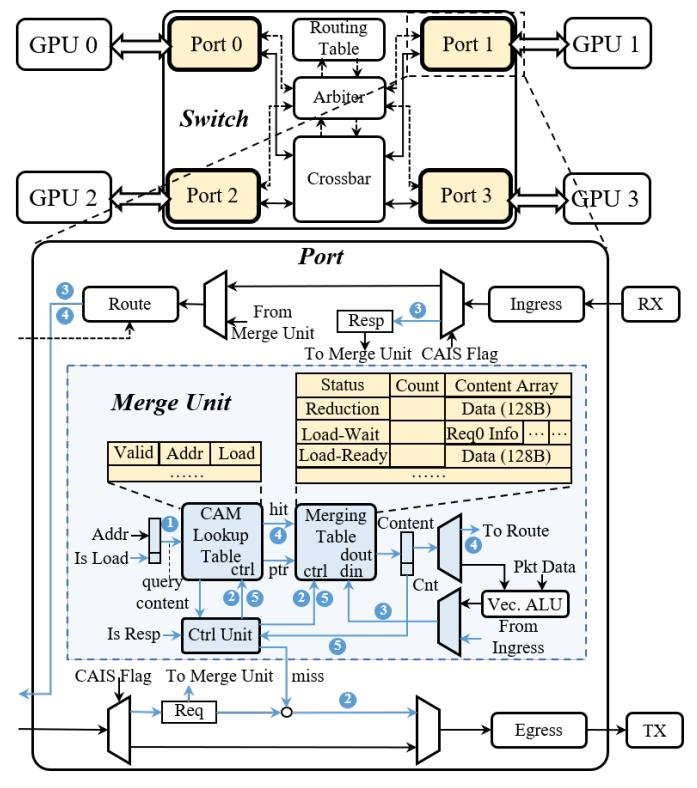

# *A. Compute-Aware ISA and Microarchitecture Extensions*

To support compute-aware in-switch computing, CAIS introduces a co-designed ISA extension and switch microarchitecture that enable dynamic request merging for both load and reduction operations across GPUs. This design transforms the switch from a passive relay into an active computeaware merging agent, significantly reducing redundant interchip traffic and improving execution efficiency for tensorparallel (TP) workloads.

- *1) ISA Extention for Mergeable Memory Access:* We extend NVIDIA's PTX instruction set with two new instructions: ld.cais and red.cais, as shown in Fig. 4. These instructions encode a 1-bit CAIS flag in memory access requests, signaling the switch that the request is eligible for in-switch merging. This lightweight annotation allows the system to selectively apply merging to communication-intensive operations such as AllGather loads or ReduceScatter reductions, without modifying existing computation semantics.
- *2) Switch Micro-architecture for Request Merging:* To support CAIS instructions, we enhance NVSwitch datapath with a dedicated merge unit (Fig. 5), mainly consisting of two tables: 1) CAM Lookup Table matches incoming requests based on memory address and type (load or reduction). On a match, request is merged into an existing session; otherwise, a new entry is created. 2) Merging Table maintains partial results for each session, including cached data for loads or accumulated sums

Fig. 5: Switch Micro-architecture for CAIS.

for reductions. Each entry tracks session state (Load-Wait, Load-Ready, or Reduction) and a counter of merged requests.

These tables operate in tandem to perform on-the-fly aggregation of identical accesses across GPUs. When the last contributing request arrives, the merged data is either forwarded to requesters (loads) or written to memory (reductions).

*3) In-Switch Micro-Functions for Load and Reduction:* With the ISA and switch microarchitecture extensions, CAIS perform request merging with two micro-functions that handle *load* and *reduction* requests inside the NVSwitch. These micro-functions extend the existing NVLS pipeline by performing dynamic request detection, caching, and response generation in-flight, thereby reducing redundant traffic and avoiding unnecessary synchronization. Fig. 6 illustrates the flow of the two micro-functions.

Micro-Function 1: Load Request Merging. Load request merging eliminates redundant load responses. When a ld.cais request arrives at the switch, the merge unit first performs an associative search within the CAM Lookup Table to 1 check for an existing merge entry targeting the same memory address and request type. 2 If no match is found, a new entry is allocated in both the CAM Lookup Table and the Merging Table. The request is forwarded to the destination GPU through the standard routing path, while the new entry in the Merging Table is initialized with "Status = Load-Wait, Count = 1", and the associated request metadata is stored in the Content Array. 3 When the response data from the target GPU returns, the status is

Fig. 6: In-switch Micro-Functions Workflow.

updated to Load-Ready, and the data is cached in the Content Array. The switch also generates responses for requests stored in Content Array before caching the arriving data. After that, the switch can serve subsequent requests to the same address directly from this cached data without reissuing memory transactions to the target GPU. 4 If a later request arrives and hits an active session, the merge unit either appends the request metadata in Content Array for deferred response, if the data is still pending, or otherwise immediately generates a response with the cached data in Content Array. 5 The completes and its table entries are released once the Count equals the number of participating GPUs minus one, excluding the GPU that holds the local copy.

Micro-Function 2: Reduction Request Merging. Reduction request merging eliminates redundant reduction requests. Similar to load request merging, for red.cais, multiple contributions to the same address are accumulated directly within the switch. Once all expected requests are received, the sum is written to the destination memory, avoiding duplicate transmissions. The white blocks in Figure 6 indicate datapaths reused from NVLS.

Through this combination of load and reduction microfunctions, the switch can dynamically merge multiple remote accesses, turning multiple data transmissions into a single consolidated operation.

*4) Eviction Mechanism:* If a new entry must be allocated but the tables are full, an LRU-based eviction policy is triggered. 1) If the selected entry is for reduction merging, it is directly evicted, and the partial result is sent to the home GPU of its address. 2) If the selected entry is for load merging, entries in the Load-Ready state can be safely evicted, whereas those in the Load-Wait state are deferred until the response data arrives. In this case, the arriving pending request bypasses the merge unit without triggering further eviction, avoiding thrashing or deadlock.

To handle the remaining requests for the evicted entry, a timeout-based forward-progress mechanism is employed, similar to that in existing NVLS [24]. Each merge entry is equipped with a timer to track the elapsed time since its last access. If this timer exceeds a predefined threshold, the entry is

Fig. 7: Merging-aware TB-Group Coordination.

automatically evicted, ensuring that no request remains stalled.

*5) Deterministic Routing for Merging Convergence:* To ensure all mergeable requests targeting the same address converge at the same switch, CAIS adopts a deterministic routing algorithm similar to that used in existing NVSwitch systems [24]. A lightweight hash function on the request address (or a subset of its bits) maps each request to a fixed path, guaranteeing that matching requests are processed by the same merge unit. Since LLM workloads exhibit regular and predictable access patterns, a simple deterministic routing scheme is sufficient to prevent deadlocks and ensure high link utilization without complex path selection.

