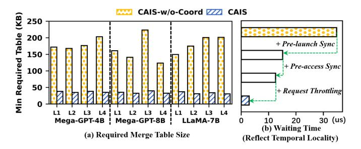
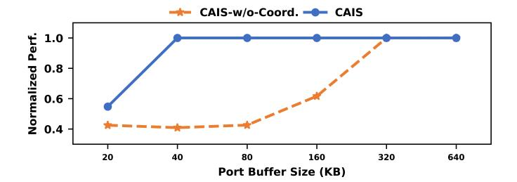
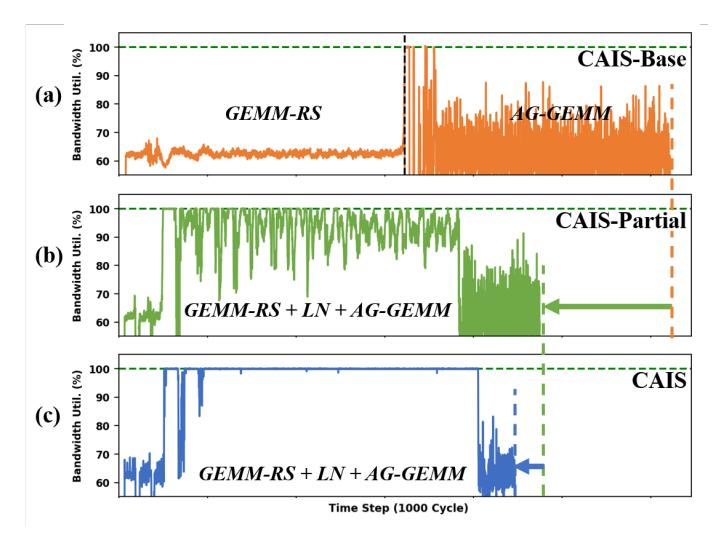

# *B. Detailed Performance Analysis*

This section investigates the effectiveness of key architectural techniques within CAIS, including merging-aware TB coordination and graph-level dataflow optimizer.

*1) Impact of Merging-Aware TB Coordination:* The merging-aware TB coordination mechanism significantly reduces the waiting time for request merging at the switch by improving the temporal alignment of memory requests

Fig. 13: (a) Required Merge Table Size with and without Merging-Aware TB Coordination. CAIS reduces the minimal table size needed to merge all eligible requests by 87%. (b) Ablation studies for TB coordination.

Fig. 14: Performance Sensitivity to Merge Table Size. CAIS maintains high performance with small table sizes, while the uncoordinated version degrades rapidly.

across GPUs. Figure 13 reports the minimal Merge Table size required to merge all mergeable requests for each sublayer. Without coordination (CAIS-w/o-Coord), the minimal required table size can reach up to 250 KB per port. With coordination enabled, the minimal required table size drops below 40 KB across all ports, which is an 87% reduction in minimal required table size. This result suggests that our coordination strategy can achieve a more effective use of limited switch resources. Figure 13(a) also demonstrates that the minimal required table sizes of CAIS are insensitive to the model sizes and configurations, and are consistently below 40 KB under different model sizes and configurations.

Figure 13(b) further evaluates the effectiveness of each optimization. We measure the improvement using the average waiting time, defined as the delay between the earliest and latest requests targeting the same address. This metric directly reflects the temporal locality optimized by TB coordination. The results show that each optimization step progressively enhances temporal locality, reducing the waiting time from 35 µs to less than 3 µs.

Figure 14 complements this analysis by showing how coordination affects performance under varying Merge Table sizes for the LLaMA-7B model. Merging-aware TB coordination maintains high performance even when the switch buffer is small, while the uncoordinated version degrades rapidly. These comparisons emphasize the importance of merging-aware TB coordination for compute-aware in-switch computing.

Fig. 15: Average Bandwidth Utilization per Sub-layer.

Fig. 16: Bandwidth Utilization over Time for (a) CAIS-Base, (b) CAIS-Partial, and (c) CAIS.

*2) Impact of Graph-Level Dataflow Optimizer:* Our proposed graph-level dataflow optimizer allows concurrent execution of dependent kernels with complementary asymmetric communication patterns. This optimization improves overall bandwidth utilization by balancing traffic across GPU-toswitch and switch-to-GPU links.

Figure 15 illustrates this effect by comparing the average bandwidth utilization, which is the average across all links and two directions for each link, for all sub-layers of three configurations: (a) CAIS-Base, (b) CAIS with graph-level dataflow optimizer but without traffic control (CAIS-Partial), and (c) full CAIS. Bandwidth utilization improves from 62.4% (CAIS-Base) to 84.7% (CAIS-Partial) and 90.2% (CAIS). The gain from CAIS-Base to CAIS-Partial comes from asymmetric kernel overlapping that tackles the imbalance data movement in both link directions, while the final jump to CAIS reflects the benefit of traffic control.

To further analyze the sustained behavior of these improvements, Figure 16 presents the bandwidth utilization over time for the L2 sub-layer of LLaMA-7B. CAIS maintains nearpeak utilization (∼100%) during steady-state operation, while the partial configuration (CAIS-Partial) suffers dips due to contention. The base configuration shows the lowest and most fluctuating utilization. This demonstrates the importance of dataflow optimization and traffic control.

Together, these analyses demonstrate that the graph-level dataflow optimizer is essential to unlocking the full potential of compute-aware in-switch computing.

