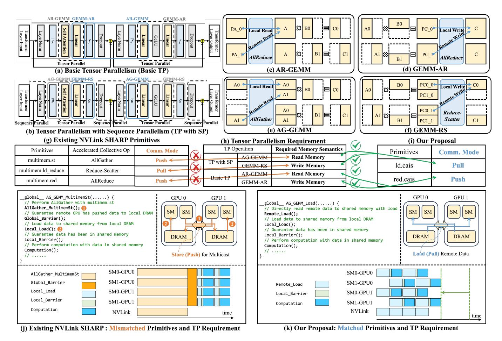

# *B. NVLink/NVSwitch-based Multi-GPU Systems*

Modern AI systems attempt to address communication bottlenecks by coupling dozens or hundreds of GPUs via high-radix NVLink/NVSwitch networks [41], [42]. NVLink has evolved from its first generation [9], delivering 160 GB/s GPU-to-GPU bandwidth on Pascal, to the fifth generation [41]

Fig. 1: Motivation for Compute-Aware In-Switch Computing in Tensor Parallelism. (a–b) Tensor Parallelism (TP) in LLM. (c–f) Collective Communication and Computation Kernel Relationship. (g–i) Comparison of Existing NVLS Primitives, Computeaware TP Requirements and Our Proposal. (j-k) Comparison of Computation Details between Existing NVLS and Our Proposal.

in Blackwell, which provides 1.8 TB/s GPU-to-GPU bandwidth and powers large-scale systems such as NVL72 (72 GPUs) [41], [42]. While these fabrics offer scalable collective operations, their performance remains bounded by link bandwidth. To quantify this limitation, we execute LLaMA-7B on our simulated NVIDIA H100 SuperPOD interconnected via a 900 GB/s NVLink/NVSwitch fabric, varying the number of participating GPUs (see Section IV). As shown in Fig. 2, communication time quickly overtakes computation time once the system scales beyond 4–8 GPUs; In particular, under an 8-GPU configuration, the average communication time is about 1.6× longer than computation across the model. This problem will worsen with future 1T+ parameter models, whose communication volume grows super-linearly due to deeper layers and larger token batches. These observations underscore the urgent need for architectural approaches that reduce or hide communication, rather than merely speeding up links.

In-switch computing has attracted much attention in the computer network community. Many works [5], [8], [10], [11], [13]–[15], [21], [26], [29], [31], [32], [48], [51], [53], [54] have been proposed to accelerate the AllReduce in the distributed system. In recent years, NVIDIA's NVLink SHARP [24], [37] (NVLS) brought in-switch computing into inter-chip network to address these efficiency and scalability bottlenecks of multi-GPU systems. NVLS offloads collective operations (e.g., AllReduce and Reduce-Scatter) to NVSwitch, performing reductions "in-flight" and reducing data movement [24], [37]. NVLS has been supported in modern GPU architecture. With NVIDIA's Hopper GPUs, in-switch operations such as multicast and reduction can be issued via PTXlevel multimem instructions, including multimem.st, multimem.ld\_reduce, and multimem.red, enabling collective operations to be performed inside NVSwitch fabrics. These instructions can, in principle, be embedded in computation kernels such as GEMM to trigger multi-GPU collectives directly, and have become a cornerstone capability in modern systems. The study [24] on NVLS has demonstrated 2×–8× speedups for collective operations compared to GPU-driven communication, thanks to its hardware-accelerated multicast and reduction integrated with NVSwitch.

Fig. 2: Computation-Communication Time When Scaling Up.

