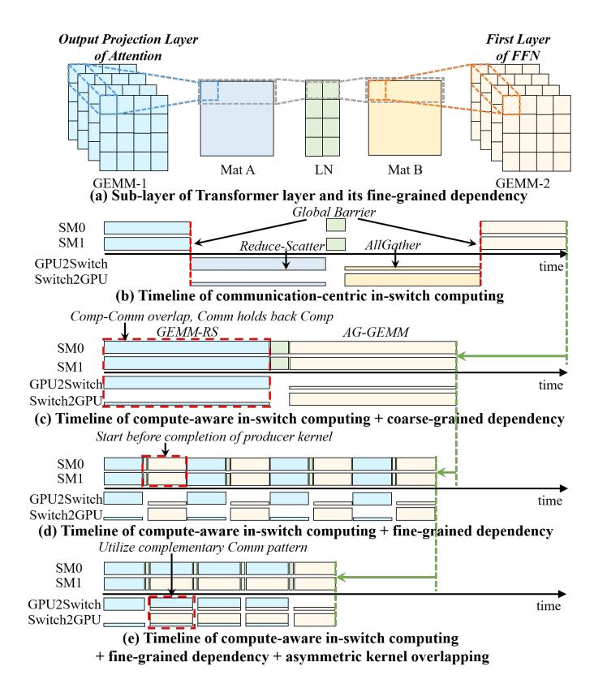
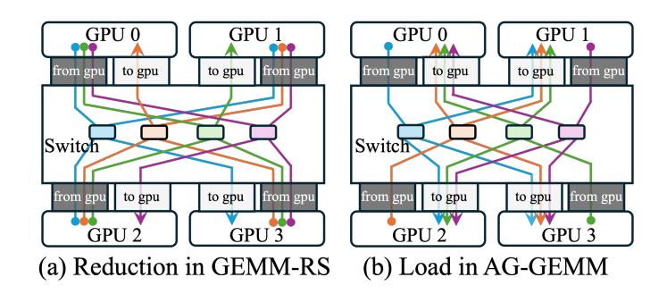

# *C. Graph-Level Dataflow Optimizer*

CAIS also integrates a graph-level dataflow optimizer to improve the system resource utilization. Graph-level dataflow optimizer supports fine-grained TB-level dependency to unlock tighter kernel fusion opportunities. Built upon the fine-

Fig. 9: Graph-Level Dataflow Optimization. Fine-grained TBlevel data dependency enables early launch of consumer TBs before producer kernels complete.

Fig. 10: Illustration of Asymmetric Traffic.

grained TB-level dependency, it introduces Asymmetric Kernel Overlapping to balance complementary traffic between two directions of the inter-chip link, which can significantly improve the overall performance.

*1) Fine-Grained TB Dependency and Deep Kernel Fusion:* In contrast to coarse-grained kernel-level dependency that require the full completion of a producer kernel before the consumer kernel can start, fine-grained TB-level dependency [1] allows a TB in the consumer kernel ready to be launched as soon as its input data available, without waiting for the entire producer kernel to finish. This capability enables fused execution of multiple dependent kernels.

Fig. 9(a) illustrates this concept with a portion of a trans-

former layer, where GEMM-1 computes matrix A, followed by a layer normalization (LN) stage producing matrix B, which is then consumed by GEMM-2. In CAIS, TBs in GEMM-1 collaboratively produce tiles of matrix A; each TB in LN operates on a row of A to generate matrix B; GEMM-2 TBs consume tiles of B to compute the final output matrix. Compared to the coarse-grained execution in Fig.9(c), since each TB's input dependencies are localized, execution of GEMM-2 can begin as soon as the corresponding TBs in GEMM-1 and LN complete, unlocking a larger schedule optimization space. As shown in Fig.9(d), this fine-grained chaining enables deep kernel fusion and earlier launch of downstream TBs.

*2) Asymmetric Kernel Overlapping:* While in-switch merging reduces overall communication volume, it introduces asymmetric bandwidth usage. Operations like GEMM-RS rely on switch-to-GPU reduction traffic, whereas AG-GEMM generates GPU-to-switch load traffic, as is illustrated in Fig. 10. For Fig. 10(a) the reduction operation, operands are read from three GPUs and the result is written back to the destination GPU. This causes the data traffic from GPUs to the switch to be three times higher than that from the switch to the GPUs, creating a bottleneck dominated by the GPU-to-switch path. We refer to this phenomenon as asymmetric traffic. For Fig. 10(b) the load operation, the situation is exactly the opposite: the switch-to-GPU traffic is three times higher than the GPU-to-switch traffic.

CAIS exploit the complementary nature of these two traffic patterns to further optimize kernel fusion and improve overall bandwidth utilization. Using TB-level dependency analysis, CAIS identifies opportunities to pipeline kernels with complementary traffic patterns. For example, when GEMM-RS and AG-GEMM are ready to execute, SMs are partitioned into two groups, each executing one kernel concurrently. This interleaved execution, illustrated in Fig. 9(e), balances bidirectional link usage: as GEMM-RS emits upstream traffic, AG-GEMM consumes downstream data.

Traffic Control. When kernels with asymmetric communication patterns execute concurrently, contention on the G2S link can still arise, particularly when both load and reduction requests compete for bandwidth. CAIS introduces separate virtual channels for load and reduction traffic and uses roundrobin arbitration to avoid head-of-line blocking.

Together, deep kernel fusion and asymmetric overlapping maximize the bandwidth utilization and compute resources, delivering significant end-to-end performance improvements.

