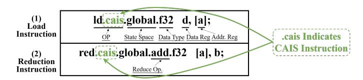

# *D. Design Philosophy and Challenges*

As previously analyzed, a fundamental mismatch exists between the communication modes supported by current inswitch computing systems and the memory access semantics required by LLM computational kernels, resulting in isolated computation and communication. This limitation motivates a shift toward *compute-aware in-switch computing*. Our philosophy is: *computation kernel should directly issue load/reduction instructions for communication following its memory semantic requirement, while the switch automatically performs request merging for these remote accesses.*

This approach enables semantic alignment between communication mode and computational intent, unlocking more native and tighter communication-computation overlap. As illustrated in Fig. 1(k), taking AG-GEMM as an example, following its memory semantic requirement, computation kernel directly reads remote data via load operations in pull mode. Because both the computation and its remote data access are performed by the same TB, only TB-level local barriers are needed to enforce dependencies between communication and computation, allowing computation and communication across different SMs to overlap naturally.

The system architecture of CAIS is illustrated in Fig. 3. When a GEMM kernel issues reduction or load instructions (for GEMM-RS and AG-GEMM operations, respectively) to access remote data, the switch dynamically merges these requests to reduce communication overhead: (1) Reduction requests: When multiple reduction requests target the same data, the switch aggregates them by computing the sum and transmitting only the final result to the destination GPU, thus reducing the downstream traffic from switch to GPU. (2) Load requests: When multiple load requests reference the same data, the switch fetches the data only once from the target GPU and replicates it to the requesting GPUs, reducing the upstream traffic from GPU to switch.

However, designing such a compute-aware in-switch computing has three architectural challenges:

- (1) Lack of ISA and Microarchitecture Support. Without GPU ISA and switch microarchitecture support, commercial GPU cannot perform compute-aware in-switch computing. To address this limitation, we propose PTX-level instruction extensions for compute-aware in-switch computing and provide microarchitectural support for request merging by integrating a hardware merge unit into the data path at the switch port. These two supports enable the functionality of the computeaware in-switch computing.
- (2) Lack of Temporal Coordination. Even with semantic alignment, temporal misalignment across GPUs [18] remains a critical bottleneck. Thread blocks (TBs) on different GPUs are scheduled independently, resulting in staggered memory requests to the same remote addresses. This misalignment prevents the switch from merging requests effectively, as early-arriving requests must wait for delayed ones, leading to buffer contention and eviction. Our simulation shows that the delay between the earliest and latest requests to the same address averages 35 µs. We address this by introducing a compiler-hardware co-design strategy. The compiler statically groups TBs with shared data dependencies, while the GPU runtime enforces lightweight TB-group synchronization, aligning access timing and improving merge success rates. Our experiments demonstrate that these optimizations reduce the delay to 3 µs, achieving about 10× improvement.
- (3) Limited Cross-Kernel Fusion. Prior in-switch computing approaches have struggled to achieve deep cross-kernel fusion due to the aforementioned misalignment, which forces collective kernels operate as isolated phases, making it difficult to exploit the producer-consumer relationships in the LLM dataflow graph (DFG). By resolving it, CAIS enables deeper DFG-level optimizations, allowing TB-level producerconsumer relationships to be established. As soon as one TB of an operator completes, dependent TBs of subsequent (and even further downstream) operators can launch immediately, which greatly improve the computation-communication efficiency. Moreover, we find that this approach also allows CAIS to fuse operators with complementary communication patterns, maximizing overall bandwidth utilization.

Fig. 4: Extension of the PTX Instructions.

