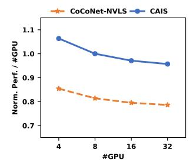
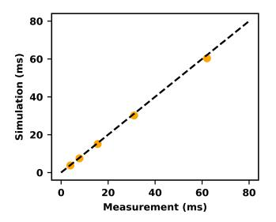

# *E. Methodology Validation*

This section validates our experimental methodology from two aspects: 1) fidelity of a scaled-down configuration for both

Fig. 17: Scalability with Increasing GPU Count

Fig. 18: Validation of Our Simulated NVLS.

| Setup | Hidden Size | FFN Hidden Size | Attention Heads | # SM | CAIS Speedup Over TP-NVLS |
|-------|----------------|--------------------|--------------------|------|------------------------------|
| Full  | 8192           | 22528              | 64                 | 132  | 1.43                         |
| Half  | 4096           | 11264              | 32                 | 66   | 1.40                         |

TABLE II: Experimental Validation of Scaling-down Setup.

LLM size and GPU resources, and 2) accuracy of our NVLSenabled simulator with support for multimem instructions.

For scaled-down setup, we compare two systems: a full-scale GPU executing a full-sized LLM that is feasible on Accel-Sim, and a half-scale system with 50% fewer SMs running the same model with matrix dimensions halved. As reported in Table II, the half-scale configuration faithfully reproduces full-scale speedup ordering and magnitudes, preserving system-level behavior and key insights derived.

To validate NVLS support in simulation, we measure All-Reduce performance using NCCL [40] on both real hardware and our simulator across message sizes from 1 GB to 16 GB (1, 2, 4, 8, 16 GB). As shown in Fig. 18, simulated results closely match the real-system measurements, yielding high fidelity with an average error of only 3.87%.

