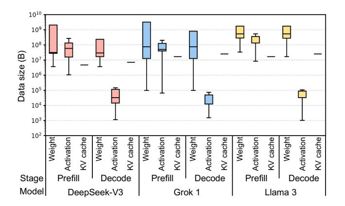

# I. INTRODUCTION

High bandwidth memory (HBM) has emerged as a key component of high-performance computing systems [\[28\]](#page-13-0), [\[46\]](#page-13-1)– [\[48\]](#page-13-2) driving the transformer-based artificial intelligence (AI) proliferation [\[70\]](#page-14-0). The high bandwidth of HBM is required to keep pace with the compute capabilities of GPUs [\[48\]](#page-13-2), [\[63\]](#page-14-1), TPUs [\[16\]](#page-13-3), [\[28\]](#page-13-0), and other AI accelerators [\[14\]](#page-13-4), [\[30\]](#page-13-5), and satisfy the bandwidth-bound nature of the generation stages of the transformers [\[19\]](#page-13-6), [\[55\]](#page-14-2), [\[77\]](#page-14-3). A single cube of HBM4 [\[27\]](#page-13-7) feeds 64 pseudo channels, each of which has 32 8 Gbps data pins, constituting a total of 2 TB/s bandwidth.

Saturating the immense HBM channel bandwidth requires efficient row-buffer utilization. A DRAM bank is composed of a 2-dimensional array of DRAM cells and indexed by row and column addresses. DRAM cell access latency is slow as it requires preceding precharge (PRE) and activation (ACT). This latency is too high to saturate such a huge channel bandwidth. To amortize those overheads, the bank prefetches an entire row into the row-buffer, which is orders of magnitude wider than the conventional DRAM access granularity. This strategy is highly effective in saturating the DRAM channel bandwidth when there exists a large spatial locality in the memory access pattern (*e.g.*, streaming access). For example, when a series of memory reads (RDs) target the same row-buffer, the processor-side memory controller (MC) can issue back-to-back RDs to saturate the channel bandwidth without the bubbles induced by ACT/PRE.

Instead of issuing multiple consecutive read commands, we ask: why can't DRAM access granularity simply increase to match the row-level granularity in this scenario? However, memory access patterns vary, and increasing the minimum DRAM access granularity can cause *overfetch problem* by reading unnecessary data, degrading effective bandwidth [\[59\]](#page-14-4). Thus, conventional DRAM access granularity is set to match the cache line size of a processor (*e.g.*, 32 B or 64 B).

Such a cache-line-sized access granularity complicates the memory controller (MC) architecture. To support column-level accesses (*i.e.*, RDs/WRs), an MC must maintain bank states and timing parameters. Moreover, it must operate many banks in parallel to hide the latency overhead of ACT and PRE commands [\[3\]](#page-12-0), [\[41\]](#page-13-8), [\[60\]](#page-14-5). Further complexity arises from the need to determine when to issue PRE after ACT based on access patterns (*i.e.*, the page policy [\[20\]](#page-13-9), [\[60\]](#page-14-5)).

The HBM hierarchy also becomes increasingly complex due to the fine-grained access granularity. While HBM bandwidth has improved steadily [\[8\]](#page-12-1), [\[27\]](#page-13-7), [\[33\]](#page-13-10), [\[56\]](#page-14-6), the bandwidth per bank has remained nearly unchanged. As each bank operates at the DRAM core frequency and transfers data at a fixed access granularity, memory bandwidth can fundamentally be increased in only two ways: 1) by enlarging the access granularity or 2) by increasing the DRAM core frequency. However, the former is constrained by cache line size, and physical limitations prevent significantly increasing the latter.

To overcome these limits, additional hierarchical structures, such as bank group and pseudo channel (PC), were introduced to boost bandwidth [\[23\]](#page-13-11), [\[24\]](#page-13-12). Bank groups combine multiple banks and deliver data to the I/O at a higher frequency, allowing transfers from different bank groups to overlap while maintaining cache line granularity. PCs increase the number of channels by reducing each channel's width, improving bandwidth without increasing both DRAM core frequency and access granularity. Unlike previous generations, HBM4 doubles total bandwidth primarily by doubling I/Os (and thus PCs) without modifying the per-channel width. While effective in raising bandwidth, these mechanisms add significant complexity to memory controller scheduling and timing.

We challenge the need for such a conventional DRAM interface paradigm in the era of transformer-based Large

∗ Both authors contributed equally to the paper.

Fig. 1. Distribution of weight, activation, and KV cache size of DeepSeek-V3 [\[12\]](#page-12-2), Grok 1 [\[73\]](#page-14-7), and Llama 3 [\[13\]](#page-12-3) in the prefill and decode stages.

Language Models (LLMs). While traditional systems and data centers will persist, warehouse-scale systems running homogeneous applications of LLM inference (*e.g.*, an AI factory [\[49\]](#page-13-13)) are becoming widespread. LLMs mostly consist of simple general matrix-matrix or matrix-vector multiplication (GEMM/GEMV) and element-wise operations [\[55\]](#page-14-2). This is true even with state-of-the-art architectures, such as multi-head latent attention (MLA), grouped query attention (GQA), or mixture-of-experts (MoE) [\[37\]](#page-13-14), [\[68\]](#page-14-8), [\[73\]](#page-14-7). These models typically access tens of megabytes of data at once, far exceeding the size of conventional cache lines (Figure [1\)](#page-1-0). Unlike the workloads with irregular or strided patterns, LLM operations exhibit highly sequential memory access patterns.

By exploiting the memory access patterns of LLMs, we propose RoMe, a Row-granularity-access Memory system designed to offer a simple and scalable memory system for LLM serving. First, RoMe replaces a column-level access interface with a row-level one. The sequence of DRAM commands required to access all data stored in a row is simplified into two commands: RD\_row and WR\_row. Second, we propose a new bank architecture, virtual bank (VBA), to further simplify the interface by removing the bank group and PC in the MC-DRAM interface. Given that memory accesses now operate at the row granularity, there is no longer a need to expose bank group and PC to the MC. Accordingly, we design a single VBA to achieve maximum bandwidth without requiring any modification to the internal DRAM structure ([§IV\)](#page-4-0).

Third, we introduce a command generator that decomposes each row-level command into a predefined sequence of conventional DRAM commands. This enables the integration of additional HBM channels, improving overall memory bandwidth. Finally, we demonstrate that the MC can be significantly simplified ([§V-A\)](#page-7-0). While conventional MCs rely on numerous data structures related to bank states and scheduling mechanisms to efficiently manage column-level commands, RoMe enables a significantly simpler and more scalable memory system design.

In a RoMe MC, five components are simplified: bank state, timing parameter, the number of bank finite-state machines (FSMs), request queue size, and scheduling algorithm. The RoMe MC maintains only three bank states and fewer timing parameters, as the DRAM row-access command sequence is internally handled by the command generator that manages conventional timing parameters. Two or fewer VBAs operate and up to three undergo refresh simultaneously; thus, just five bank FSMs need to be maintained. This simplification enables a smaller request queue, as fewer in-flight requests need to be tracked. Finally, as one VBA can provide maximum bandwidth, the scheduling algorithm is greatly simplified, focusing solely on interleaving across VBAs.

We evaluate RoMe using three representative LLMs: Grok 1 [\[73\]](#page-14-7), DeepSeek-V3 [\[12\]](#page-12-2), and Llama 3 [\[13\]](#page-12-3). When serving LLM workloads, RoMe delivers higher performance than conventional HBM-based memory systems with significantly lower hardware overhead, while also providing modest gains in energy efficiency. This demonstrates that, under the sequential and bulk access characteristics of LLM workloads, adopting row-level memory access does not degrade performance. While minor overheads may arise from overfetch and load imbalance, their impact is negligible.

The key contributions of this paper are as follows:

- We leverage the sequential and bulky memory access patterns of LLMs to propose a memory interface based on rowlevel access granularity.
- As the cache-line-sized access granularity is no longer mandatory, we introduce a new bank architecture called *virtual bank*, which eliminates the need for bank groups and pseudo channels.
- A simplified memory controller optimized for the RoMe interface is designed to minimize control overhead associated with complex bank state tracking and scheduling, thereby reducing the area of the scheduling logic.
- RoMe presents a method for expanding memory channels with minimal hardware overhead, thereby improving the performance of LLM workloads.

