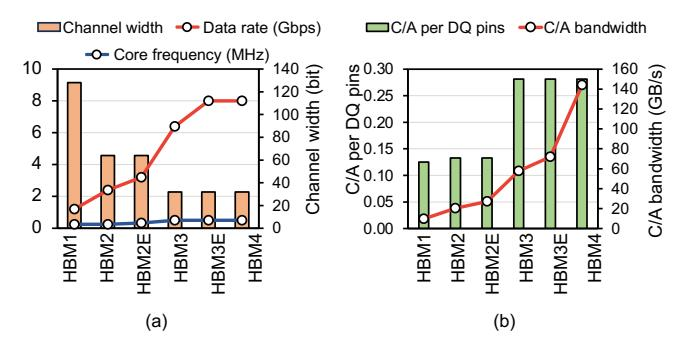
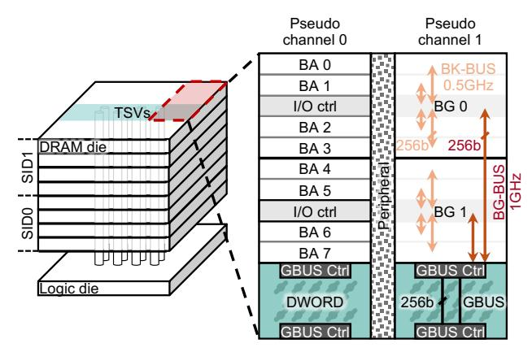
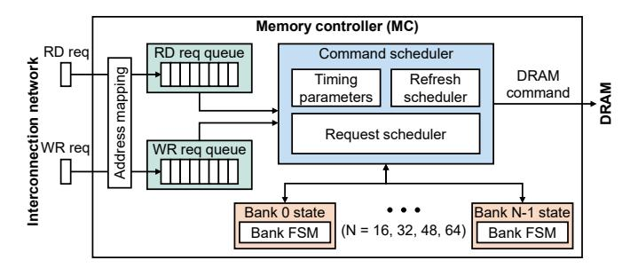
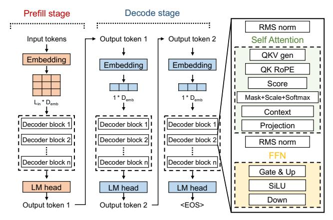
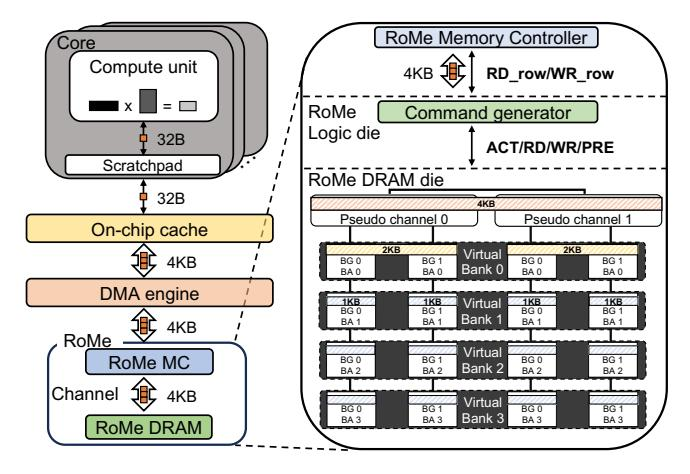

# II. CONVENTIONAL MEMORY SYSTEMS

### *A. Cache-Line-Sized DRAM Access Granularity*

Main-memory technologies such as DDR5 [\[26\]](#page-13-15) and HBM4, commonly integrated into modern CPUs and GPUs, are designed with access granularities that align with or are smaller than processor cache line sizes. Specifically, HBM4 is optimized for 32B accesses, aligning with the cache line size of GPUs, while DDR5 supports 64 B accesses, consistent with CPU cache line sizes. Although DRAM rows are several kilobytes in size, these architectures enable fine-grained access at the column level, significantly smaller than the row size.

The adoption of cache-line-sized access granularity in mainmemory systems serves two primary purposes. First, aligning the access granularity with the processor's cache line size minimizes data overfetch, thereby reducing unnecessary bandwidth usage and energy consumption by transferring only the data required by the program it executes. Second, it enables flexibility in handling diverse memory access patterns. This design effectively supports both sequential access patterns with

Fig. 2. (a) Trends in data rate, core frequency, and channel width, and (b) growth of C/A pin overhead across HBM generations.

high spatial locality, such as those LLMs, and random access patterns characterized by low spatial locality.

However, accessing memory at the cache line granularity introduces significant complexity in memory system design. To achieve high performance, memory controllers (MCs) should implement sophisticated scheduling algorithms that account for a wide range of timing parameters and dynamic bank states. Prior works have explored key components of this design space—including address mapping [82], page policies [20], [29], and scheduling policies [31], [32], [40], [41], [44], [60]—which further contribute to the complexity of MC architecture.

#### B. Bank Group & Pseudo Channel

Maintaining cache-line-sized access granularity adds complexity to the DRAM hierarchy, which in turn further increases the scheduling burden on the MC. While DRAM bandwidth has steadily improved, maintaining fine-grained cache line access necessitated additional internal structures, specifically bank groups and pseudo channels (PCs). As shown in Figure 2(a), although the external data rate of DRAM devices has consistently increased, the DRAM core frequency has shown modest growth. This limited scalability of core frequency is primarily due to the high energy and area overheads associated with its increase [51]. To meet the data rate demands under these constraints, a conventional approach has been to increase the amount of data fetched internally in a single access.

However, the increase in data rate leads to a mismatch between the access granularity and cache line size, prompting the introduction of the bank group structure [23]. Instead of doubling the amount of data fetched from a single bank  $(AG_{bank})$ , bank groups enable bandwidth scaling by alternating data fetches from banks in different bank groups at intervals of tCCDS (typically equal to tCCDL/2), while preserving the cache-line-sized access granularity  $(AG_{MC})$ . This access strategy is referred to as bank group interleaving. Each bank continues to operate at the DRAM core frequency (defined by tCCDL) and fetches data at the cache line granularity. Thus, this mechanism allows effective scaling of the DRAM data rate without increasing  $AG_{bank}$  or  $AG_{MC}$ . Terminologies are summarized in Table I.

Despite the introduction of the bank group structure, the demand for even higher external bandwidth has persisted,

#### TABLE I Symbols and terminologies

| Symbol      | Description                                |
|-------------|--------------------------------------------|
| $AG_{bank}$ | Access granularity of a bank.              |
| $AG_{MC}$   | Access granularity of a memory controller. |

which led to the evolution of HBM toward narrower and more channels. Figure 2(a) illustrates this trend, showing a decrease in channel width and a corresponding increase in the number of channels across successive HBM generations [22], [24], [25]. In particular, each new generation of HBM has halved the channel width while doubling the number of channels. As the data rate increases, the bandwidth per channel remains constant even with the narrower channel. Notably, HBM4 scales the bandwidth by doubling the number of channels—therefore doubling the external I/O—without altering the channel width [27]. This approach enables bandwidth scaling by populating more channels while maintaining per-channel bandwidth and preserving  $AG_{bank}$  and  $AG_{MC}$ .

However, these additional hierarchies exacerbate the scheduling complexity. To fully utilize DRAM bandwidth, an MC must issue memory requests to different bank groups (*i.e.*, bank group interleaving) and PCs. This requires the MC to continuously track the state of all banks to identify those that are ready to accept new DRAM commands. As a result, the MC must employ more sophisticated scheduling mechanisms to effectively leverage the complex DRAM hierarchy.

As the channel width narrows with each HBM generation, the overhead associated with command/address (C/A) pins increases. HBM defines separate pins for row and column commands; for example, in HBM4, each 64-bit data channel requires 10 row command pins and 8 column command pins. Moreover, populating more PCs proportionally increases independent C/A pins, raising the C/A-to-DQ pin ratio (see Figure 2(b)). From HBM1 and HBM2/2E to HBM3/3E and HBM4, this ratio has nearly doubled. Further, the bandwidth requirements of C/A pins have steadily increased across generations, contributing to the rising overhead of the C/A interface. Adopting these same techniques for future HBM generations with higher pin rates and bandwidths may be unsustainable.

#### C. HBM Architecture

HBM stacks multiple DRAM dies with a logic die at the bottom, which are connected by through silicon vias (TSVs), as shown in Figure 3. Each HBM device is composed of multiple channels—up to 32 channels in the case of HBM4 [27]—and forms a Stack ID (SID, equivalent to rank in conventional DRAM standards) for every four DRAM dies, supporting up to four SIDs per device. Each channel uses the SID to identify which group of DRAM dies it is accessing. Each channel consists of two PCs, a design unique to HBM. Two PCs in each channel share C/A pins but split the data pins evenly. The two PCs can operate independently, enabling concurrent data transfers and maximizing throughput.

Data transfer from individual banks within the DRAM dies to the logic die occurs as follows. Each bank fetches 256 bits

Fig. 3. Overview of HBM architecture and internal organization.

of data, corresponding to  $AG_{bank}$ , and delivers it to the I/O control (ctrl) buffer via the bank data bus (BK-BUS). Since all banks within a bank group share a single I/O control buffer, only one bank can occupy the BK-BUS at a time. The data stored in the I/O ctrl buffer is then transferred over the bank group data bus (BG-BUS) to the global data bus (GBUS) controller and ultimately delivered to the logic die via the TSVs. BK-BUS runs at the frequency of 1/tccdl (e.g., 0.5 GHz), whereas BG-BUS runs at a faster frequency of 1/tccdl (e.g., 1 GHz). Therefore, a single bank group can utilize only half of the available bandwidth. To fully exploit the maximum bandwidth, data must be transmitted in a time-multiplexed manner across different bank groups.

#### D. Conventional Memory Controller Architecture

While implementation details vary, the high-level architecture of a generic MC is depicted in Figure 4. MC generally includes four core components: address mapping, read/write request queue, per-bank state logic, and a command scheduler. The address mapping unit translates the physical address of each read/write request received from the host into a corresponding DRAM address [6], [21], [42], [58], [71], [72] (e.g., PC and bank group) and inserts the translated request into the request queue. Both the request queue and bank state logic are commonly implemented using content-addressable memory (CAM), allowing a one-cycle lookup to identify ready requests [5]. High bandwidth utilization requires a sufficiently large CAM to accommodate numerous in-flight requests. As banks operate independently, per-bank state logic tracks the status of each bank. The command scheduler is responsible for issuing memory and refresh commands by evaluating all bank states while adhering to DRAM timing constraints. Each bank can be in one of seven states: Idle, Activating, Active, Precharging, Reading, Writing, and Refreshing. The command scheduler must manage a wide range of timing parameters, which are summarized in Table II.

Although the command scheduler performs various tasks, its responsibilities can be broadly categorized into refresh and request scheduling. Refresh scheduler periodically issues refresh (REF) commands according to the tREFI interval,

Fig. 4. Conventional memory controller architecture.

TABLE II
SUMMARY OF HBM TIMING PARAMETERS

| Parameter  | Description                                         |  |
|------------|-----------------------------------------------------|--|
| tRCDRD     | ACT to RD delay in a same bank                      |  |
| tRCDWR     | ACT to WR delay in a same bank                      |  |
| tRAS       | ACT to PRE delay in a same bank                     |  |
| tRP        | PRE to ACT delay in a same bank                     |  |
| tCCDS(L/R) | RD/WR to RD/WR delay in diff BG (same BG/diff rank) |  |
| tFAW       | Time window for 4 ACTs                              |  |
| tRRDS(L)   | ACT to ACT delay in diff/same BG                    |  |
| tWTRS(L)   | WR to RD delay in diff/same BG                      |  |
| tRTW       | RD to WR delay in a same bank                       |  |
| tWR        | WR to PRE delay in a same bank                      |  |
| tRTP       | RD to PRE delay in a same bank                      |  |

while optionally postponing or pooling REFs based on each bank's state [27].

Request scheduler determines which request to schedule based on multiple criteria. First, it exploits interleaving across banks, bank groups, and PCs. Bank interleaving helps hide ACT and PRE latencies by overlapping operations across independent banks. Interleaving across bank groups and PCs further increases bandwidth utilization. Second, the scheduler aims to exploit row buffer locality by issuing as many RDs/WRs as possible to an open row while obeying fairness; it pursues confining the overhead associated with ACT and PRE. Third, it manages the page policy by determining the optimal time to precharge a row after activation, depending on memory access patterns. This policy balances latency with row buffer hit rate and is typically implemented using open, close, or adaptive page policies [29], [50]. Finally, to prevent starvation caused by the aggressive scheduling strategies, the scheduler incorporates Quality-of-Service (QoS [10]) mechanisms that prioritize long-waiting requests, ensuring fairness across all memory transactions [40], [41].

#### III. ACCESS PATTERN OF LARGE LANGUAGE MODELS

Widely adopted large language models (LLMs) are typically built upon the transformer decoder architecture (see Figure 5). Throughout this paper, the term LLM refers specifically to a transformer-based LLM. LLM inference can be broadly divided into two stages: prefill and decode. In the prefill stage, the model ingests all input tokens (e.g., words) in the request and generates the first output token. In the decode stage, it operates auto-regressively, taking the

Fig. 5. Transformer-based LLM architecture.

output token from the previous step as input to produce the next output token.

Each stage consists of a token embedding layer, multiple decoder blocks, and a language model (LM) head. When an LLM processes an inference request containing a sequence of tokens, the embedding layer maps the input tokens into hidden vectors, which are then passed through the decoder blocks. Each decoder block takes the hidden vectors from the preceding decoder block and produces updated hidden vectors. Finally, the hidden vectors from the last decoder block are transformed into tokens by the LM head. Here, we refer to the pre-trained model parameters (e.g., the weight of the fullyconnected layer) as weight and the intermediate results of the operations and layers as activation.

In addition to the weights and activations, LLMs have a third primary data type: the KV-cache. Each decoder block is mainly composed of a self-attention layer (attention) and a feed-forward network (FFN). The attention layer takes the hidden vector as input and produces the Query (Q), Key (K), and Value (V) matrices. Because K and V store sequence context, the model requires K and V matrices for the entire sequence to generate each new token. To avoid repeating the same computation at every generation step, the K and V matrices are stored in the KV-cache. Thus, the data used in LLM computation can be broadly categorized into weights, activations, and the KV-cache.

During LLM execution, tens of megabytes of data typically need to be accessed sequentially at a time. For all three LLMs in Figure [1,](#page-1-0) most weight and KV-cache accesses exceed several hundred kilobytes. In Grok-1, only one weight matrix is exceptionally small (24 KB), but all other weight matrices exceed 12 MB. The KV-cache also reaches several megabytes in the decode stage; it grows even larger than in the prefill stage because it must hold KV-cache for both the input and the already generated output tokens. For activations, the prefill stage processes all input tokens as a single batch, resulting in activation sizes reaching tens of megabytes. In the decode stage, however, only one token per sequence is processed, so the activation size is much smaller. Nevertheless, given that modern LLM services often run with batch sizes in

Fig. 6. An overview of a RoMe-based system.

the hundreds [\[19\]](#page-13-6), [\[55\]](#page-14-2), [\[57\]](#page-14-14), [\[76\]](#page-14-15), [\[77\]](#page-14-3), the activations can scale to a few megabytes, similar to the weights.

As GEMM and GEMV operations dominate LLM computations, these data are accessed with simple sequential memory access patterns. However, current HBM-based memory systems are still designed for extremely fine-grained 32 B accesses, introducing unnecessary complexity relative to access characteristics of LLMs. Therefore, we propose a highly simplified memory interface optimized for the sequential access pattern of LLMs and provide an in-depth analysis of its benefits. We then present a co-optimization of DRAM and MC based on this interface, demonstrating a memory system for next-generation AI accelerators that scales more effectively.

