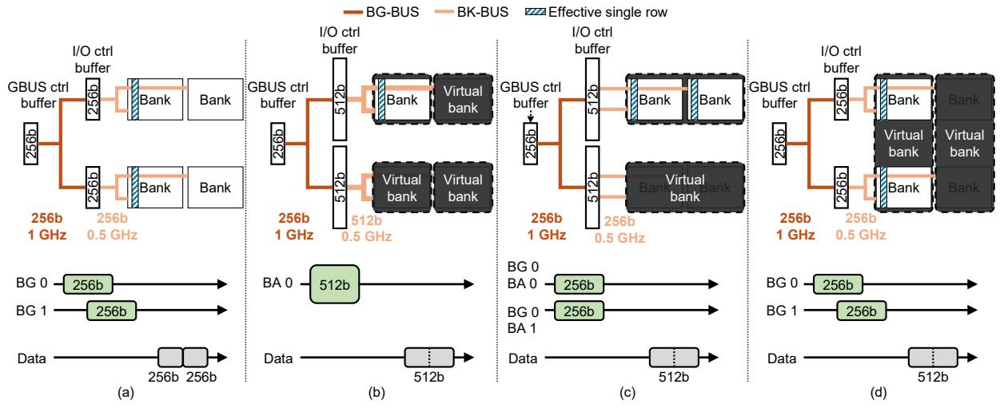
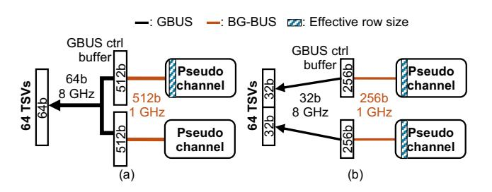
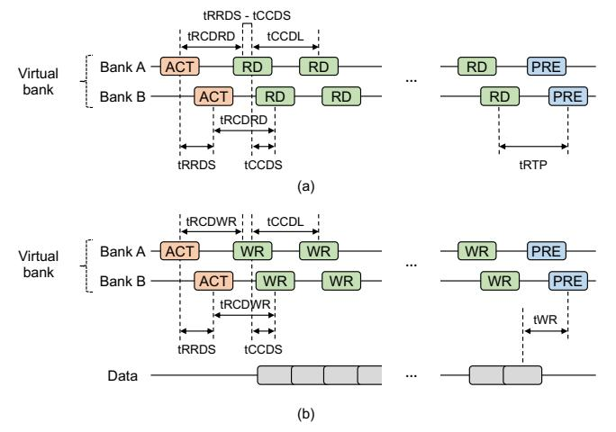
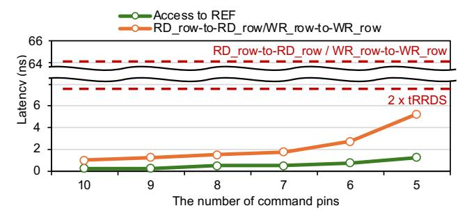

# IV. THE ROME INTERFACE

### *A. Memory Interface*

Exploiting the sequential and coarse-grained memory access patterns of LLM workloads, we propose a Row granularity access Memory system, RoMe (Figure [6\)](#page-4-2). For systems serving LLMs that sequentially access hundreds of megabytes of data at a time, the conventional cache-line-sized access granularity is excessively fine-grained. RoMe replaces the traditional cache-line-level (column-level) interface with a row-level interface comprising RD\_row and WR\_row. This increases AGMC from cache-line size to row size. Because AGMC now corresponds to the row size, it is no longer necessary to align AGbank with the cache-line size. Thus, we can further streamline the MC-DRAM interface by eliminating the bank group and PC from the interface that were originally introduced to scale bandwidth while retaining cache-line-sized AGbank. With this significantly simplified interface, the RoMe MC no longer requires complex scheduling logic, leading to a much simpler architecture.

Moreover, we integrate command generators on the logic die to translate row-level commands into conventional DRAM commands. This integration reduces the C/A pin count required per channel, allowing an HBM to add more channels with only a slightly increased pin budget, providing additional aggregate bandwidth. Through both the simplified MC and the command generator, RoMe improves memory bandwidth

Fig. 7. Three design approaches to eliminate the bank group from the MC-DRAM interface. (a) Conventional bank group architecture. (b) A single bank serves as a VBA by doubling  $AG_{bank}$ . (c) Two banks operate in tandem to form a VBA. (d) Two banks from different bank groups form a VBA and fetch data in an interleaved manner.

Fig. 8. Two design approaches to eliminate PC from the MC-DRAM interface. (a) A single PC operates as a full channel by fetching double the cache-line size. (b) Two PCs serve as a single channel and operate simultaneously, each maintaining data fetch size.

with low hardware overhead, demonstrating decent scalability. Their implications on area and energy are described in §VI-C.

RoMe is designed to interoperate smoothly with modern AI accelerators. LLM inference must continuously process massive weight and activation data, demanding not only high compute throughput, but also memory with both high bandwidth and high capacity. Consequently, HBM has emerged as the standard memory for AI accelerators, and RoMe is accordingly designed to utilize the latest generation, HBM4. Moreover, modern AI accelerators have adopted techniques that issue bulky memory accesses to efficiently fetch the enormous data required by AI workloads [28], [47]. In line with this trend, we assume a system where memory requests on the order of kilobytes are delivered to the MC.

#### B. Virtual Bank

Rome removes the concepts of bank group and PC, replacing them with a new hierarchy, a virtual bank (VBA). The key idea behind VBA is to deliver the full available bandwidth from a single VBA, eliminating the need for complex MC-side scheduling that accounts for bank group or PC interleaving. Because row granularity access no longer requires matching  $AG_{bank}$  and  $AG_{MC}$  to the cache-line size, traditional bank group and PC interfaces are no longer essential. Accordingly,

various design choices are possible for implementing VBA, and this work seeks to analyze the trade-offs associated with each.

There are three main design spaces for implementing a VBA that achieves maximum bandwidth from a single VBA. First, as illustrated in Figure 7(b), a single bank can serve as a VBA by increasing its  $AG_{bank}$ , thereby enabling it to deliver the maximum bandwidth. While it maintains the same number of banks and effective row size, it requires doubling the bank's internal data path, the BK-BUS width, and the I/O ctrl buffer size, resulting in significant area overhead [51]. Second, as shown in Figure 7(c), a VBA consists of two banks within the same bank group. By operating two banks in tandem, this approach fetches twice the amount of data, doubling the effective  $AG_{bank}$ . Although this does not change the internal data path, BK-BUS width, and I/O ctrl buffer, it effectively reduces the total number of banks by half and doubles the effective row size. Finally, as shown in Figure 7(d), a VBA consists of two banks from different bank groups, accessed in a time-multiplexed manner. This approach leverages the existing DRAM structure without modification while still enabling a single VBA to achieve maximum bandwidth. Similar to the second design, it reduces the number of banks by half and doubles the effective row size, but does so without requiring changes to the internal DRAM architecture.

There are two design approaches for eliminating the concept of PC. Figure 8(a) illustrates a method where the amount of data fetched from each PC is doubled to enable a single PC to achieve maximum bandwidth. However, this approach necessitates an increase in BG-BUS width and the buffer size of the I/O ctrl buffer. Moreover, multiplexers are required between two GBUS on each PC side. As a result, from the MC's perspective, the two PCs are controlled as a single channel, with the effective row size remaining 1KB while doubling the number of banks. Figure 8(b) shows that both PCs operate simultaneously, similar to the legacy channel mode in HBM1/2 [22], [24]. This configuration doubles the bandwidth

Fig. 9. Command sequence of (a) RD\_row and (b) WR\_row.

without requiring additional wiring and buffer, though the effective row size increases to 2 KB. In LLM workloads that involve fetching several megabytes of data, this increase in effective row size is not a significant issue. Therefore, we eliminate the PC from the MC-DRAM interface by enabling the concurrent operation of two PCs (Figure 8(b)).

We conducted a comprehensive exploration of all combinations within the VBA design space, with the methodology and workloads detailed in VI-A. Our experiments covered six total configurations, generated by combining the design points in Figure 7(b)/(c)/(d) with those in Figure 8(a)/(b). Across all six configurations, the performance deviation relative to the baseline system remained within 3.6%.

However, the designs exhibit significant differences from the perspective of area overhead. Using the configuration shown in Figure 8(a) requires doubling the width of the BG-BUS. Similarly, the I/O ctrl buffer for Figure 7(b)/(c) must also be doubled, which in turn necessitates doubling the BK-BUS width for Figure 7(b). When combined with the design in Figure 7(b)—where the BK-BUS and internal bank datalines are already doubled—the total dataline width becomes  $4\times$  that of traditional bank architecture, resulting in a substantial area overhead up to 77% [51]. Thus, we adopt the configuration in Figure 7(d) and Figure 8(b).

#### C. Command Generator

We add a command generator that accepts row-level commands and streams data from the VBA. When the MC issues a RD\_row or WR\_row command, the command generator translates it into a fixed sequence of DRAM commands: one ACT, a series of RD or WR commands, and a PRE. Unlike a conventional MC, our command generator does not issue commands dynamically based on bank states or timing constraints. Instead, it issues predetermined DRAM commands at fixed intervals upon receiving a row-level command, operating in a simplified and static manner. Figure 11 illustrates the detailed command sequences corresponding to RD\_row and WR\_row. In RoMe, as in the legacy channel mode of HBM1/2, commands are sent to both PCs and data are also received

from both simultaneously. Because two PCs share the same C/A pins, we depict the command sequences for a single PC.

The command generator is designed to issue DRAM commands to two banks in a perfectly interleaved manner, ensuring that each RD/WR complies with tCCDS (*e.g.*, 1 ns) between consecutive RD/WR to a different bank. However, due to the tRRDS constraint (*e.g.*, 2 ns), which must be satisfied between ACTs to different banks, maintaining this interleaving necessitates additional delay. If both banks issue ACT followed by RD after tRCDRD, the RDs to different banks would align simultaneously rather than being interleaved. To resolve this, an intentional delay of tRRDS - tCCDS is inserted before the ACT to the first bank (Figure 9). This allows the RDs/WRs to the two banks to be issued at tCCDS intervals.

The command generator can be placed in one of three locations: 1) MC, 2) logic die, or 3) DRAM die. Placing the command generator in the MC has the benefit of minimizing modifications to the existing memory system. However, this configuration limits the structural advantages that can be gained from a simplified memory interface, such as reducing C/A pins. Integrating the command generator within the HBM stack helps reduce the C/A pin count between the MC and HBM. When placed in the logic die, the command generator can reduce the C/A pin count between the MC and the logic die, though it does not reduce the number of TSVs between the logic and DRAM dies. Placing it in the DRAM die can reduce TSV usage between the logic and DRAM dies, but it requires one command generator per channel for each DRAM die, increasing redundancy.

Given these trade-offs, we adopt a middle-ground design by placing the command generator in the logic die. First, because the logic die of HBM4 is fabricated using a logic process (rather than a DRAM process) [66], [67], placing one command generator per channel incurs minimal area overhead (quantified in §VI-C) while enabling effective reduction in C/A pin count. Second, recent advances in die-stacking technologies, such as hybrid bonding [15], [45], help alleviate the cost associated with inter-die TSVs, making the logic-die placement a practical compromise.

## D. Command/Address Pins

Row granularity access enables a drastic reduction in the number of C/A pins between the MC and DRAM. First, because separate RD and WR column C/A pins are no longer required, eight column C/A pins can be removed. The mode register set (MRS), which is traditionally sent over a column command, is now transmitted via row C/A pins. Out of the ten row C/A pins, up to four pins are used for the opcode, leaving pins for the address. Rome retains all four opcode pins but reduces the number of address pins. Since Rome does not require PC bits and each VBA includes two banks, one of the bank address bits is also unnecessary. Excluding ACT and PRE, there are eight row commands. Adding MRS, RD\_row, and WR\_row increases the total command count to eleven. In a column-granularity interface, column C/A pins must support

Fig. 10. Latency between RD\_row/WR\_row and REF across various numbers of C/A pins.

issuing RD and WR commands to both PCs every tccds, and row C/A pins must support ACT commands every trrbs.

However, with the row-level interface, the minimum interval between commands is longer. The tightest timing occurs when a REF command is issued immediately after a RD\_row or WR\_row, requiring at least  $2 \times t_{RRDS}$ . This is because one tRRDS delay is needed between the ACT commands to the first and second banks, and another tRRDS delay is needed before issuing the REF command to the second bank. Figure 10 shows the command issue latency as a function of the number of C/A pins. Even with just five pins, commands can still be issued faster than  $2 \times t_{RRDS}$ . Therefore, by reducing the number of C/A pins to five, RoMe is able to eliminate 72% of the C/A pins.

#### E. Additional Channels

We utilize the freed C/A pin margin to introduce additional channels. RoMe reduces the number of C/A pins from 18 to 5, saving 13 pins per channel. A channel of HBM4 requires 120 pins [27], whereas RoMe requires only 107 pins due to the 13-pin reduction. Consequently, in a 32-channel configuration, 416 pins remain available, which allows the addition of four new channels with only 12 extra pins. Through these additional channels, we aim to increase the memory bandwidth.

RoMe proposes to increase memory bandwidth by adding one additional channel per DRAM die. As HBM generations have evolved, the number of channels per die has increased for channel expansion, necessitating a larger die area [8], [33], [34], [52], [56]. Following this trend, RoMe also adopts a design expanding the number of channels per DRAM die from eight to nine. As a result, RoMe-based HBM achieves approximately a 12.5% increase in memory bandwidth merely with a small number of additional pins at the processor interface. The area overhead is estimated in §VI-C.

#### V. MEMORY SYSTEM UNDER ROME INTERFACE

